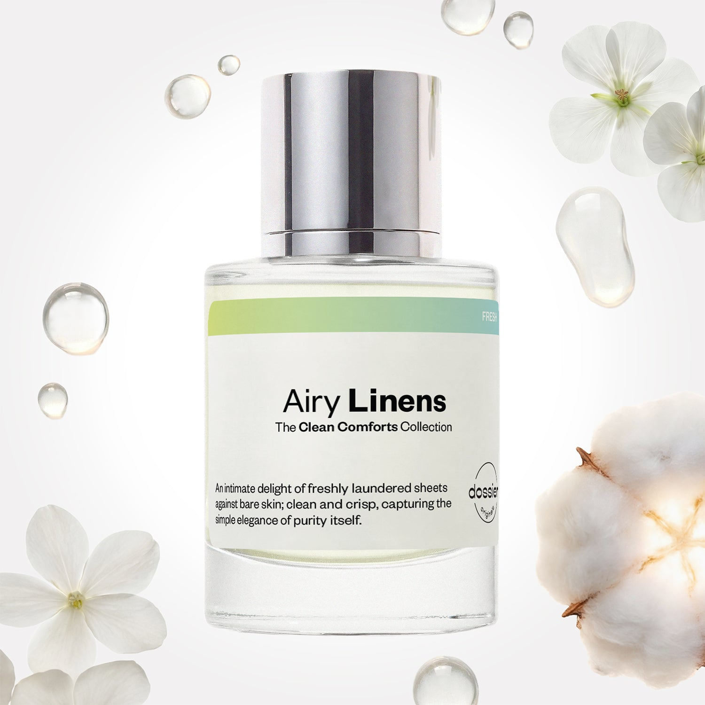

# Airy Linens

- **Dossier Dossier Originals**
- **URL:** https://dossier.co/products/airy-linens
- **SEO title:** Airy Linens

## Pricing (sizes)

| Size/SKU | Member price | List price | Currency |
|---|---|---|---|
| 50ml | 44.1 | 49 | USD |

## Content (scent notes, about, editorial)

Back Home / Perfumes / Dossier Originals / AIRY LINENS 

Unisex 

New 

Airy Linens

Eau de Parfum. Size: 50ml / 1.7oz 

members: $44.10

Guest:
$49

Dossier Originals: The Clean Comforts Collection 

An intimate delight of freshly laundered sheets against bare skin—clean and crisp, capturing the simple elegance of purity itself. 
Crafted in France 
Scent Family: fresh 

Add to Cart 

Scent Notes Main Notes:

Aldehydes

Transparent White Flowers

Musks

top: The first notes you smell 
Aldehydes, Bergamot, Pear, Muguet 
middle: The heart of the perfume 
Transparent White Flowers, Jasmine, Lavender, Rose 
base: The notes that linger all day 
Musks, Cashmeran, Oakmoss 
ingredients: Alcohol Denat., Fragrance/Parfum, Water/Aqua/Eau, Linalyl Acetate, Hexamethylindanopyran, Limonene, Hydroxycitronellal, Linalool, Citrus Aurantium Peel Oil, Alpha-Isomethyl Ionone, Citrus Limon (Lemon) Peel Oil, Pinene, Terpinolene, Citral, Jasmine Oil/Extract, Beta-Caryophyllene, Citronellol, Geranyl Acetate, Lavandula Oil/Extract, Geraniol, Terpineol, Alpha-Terpinene, Rose Flower Oil/Extract, Benzyl Benzoate, Sclareol, Carvone, Benzyl Alcohol, Eugenol. 

Vegan
Cruelty-free

Clean ingredients

About An intimate delight of freshly laundered sheets against bare skin—clean and crisp, capturing the simple elegance of purity itself.

Scent Intensity: Soft 

Concentration: 18%

Gender: Unisex 

Shipping
Free shipping with 2+ items. 

Standard Shipping (with 2+ items) Auto-selected with 2+ items 
FREE 

Standard Shipping Auto-selected under 2 items 
$3.95 

Express shipping: 2 business days Select in checkout 
$19.00 

Returns
Free exchanges for all. Free returns with 

Exchanges
Free exchange, 1 time per order for all.

Returns
D+ members get 1 FREE return per order.
Non-members incur a $3.99/bottle return fee, 1 time per order.
Returns must be postmarked within 30 days of the initial order. Learn More 

FAQs Are these fragrances long lasting? They are designed to be very long lasting, just like designer fragrances, in some cases even longer, depending on the composition. 
When does the new packaging come out? We'll begin rolling out our new packaging across the U.S. and international markets soon! If you want to shop IRL - our new packaging first hits stores on January 11, 2026 at Walmart. Please note that if you are shopping online, you may receive a combination of our current and new packaging while we transition our inventory. 
How will I know what scent I like? We get it, shopping for perfumes online is hard! That's why we created a scent quiz, which will find the perfect scent for you Take the quiz (opens in new tab) 
Unsure about something? Ask us! help@dossier.co 

Best Layered With Combine 2 of our perfumes to create a third scent with layering, curated by our nose. Learn more 

You Might Love 

3.6 

Rated 3.6 out of 5 stars 

Based on 58 reviews 

Reviews 58 (tab expanded) Questions 1 (tab collapsed) 

Filters 
Write a Review (Opens in a new window) 

58 reviews 
Sort Highest Rating Most Helpful Photos & Videos Most Recent Oldest Lowest Rating Least Helpful 

E 

Erin 

6/24/26 

Rated 5 out of 5 stars 

5 Stars
Smells clean and fresh. I like it!

Read More Read more about this review 

Was this helpful? Yes, this review from Erin was helpful. 0 people voted yes No, this review from Erin was not helpful. 0 people voted no 

C 

Candice 

6/21/26 

Rated 5 out of 5 stars 

5 Stars
So fresh and so clean🥰

Read More Read more about this review 

Was this helpful? Yes, this review from Candice was helpful. 0 people voted yes No, this review from Candice was not helpful. 0 people voted no 

W 

WhitlovesAngel 

6/20/26 

Rated 5 out of 5 stars 

5 Stars
Loveeeee itttt

Read More Read more about this review 

Was this helpful? Yes, this review from WhitlovesAngel was helpful. 0 people voted yes No, this review from WhitlovesAngel was not helpful. 0 people voted no 

J 

Jeanette 

6/17/26 

Rated 5 out of 5 stars 

5 Stars
Amazing by itself or to layer. Long lasting!

Read More Read more about this review 

Was this helpful? Yes, this review from Jeanette was helpful. 0 people voted yes No, this review from Jeanette was not helpful. 0 people voted no 

K 

Kim 

6/17/26 

Rated 5 out of 5 stars 

5 Stars
This is a beautiful fragrance. Great for work, relaxing around the home or even a bedtime scent. It's super fresh, lovely airy light.I love it

Read More Read more about this review 

Was this helpful? Yes, this review from Kim was helpful. 0 people voted yes No, this review from Kim was not helpful. 0 people voted no 

Loading... 

Loading... 

Show More 

Inspired by  Baccarat Rouge 540 
Inspired by  Black Opium 
Inspired by  Love, Don't Be Shy 
Inspired by  Good Girl 
Inspired by  Libre 
Inspired by  Flowerbomb 
Inspired by  Light Blue 
Inspired by  Not a Perfume 
Inspired by  Aventus 
Inspired by  Bleu de Chanel 
Inspired by  Mon Paris 
Inspired by  Coco Mademoiselle 
Inspired by  Tom Ford for Men 
Inspired by  For Her 
Inspired by  J'Adore Dior 
Inspired by  Alien 
Inspired by  Black Opium Perfume 
Inspired by  Lost Cherry Perfume 

GET UP TO 30% OFF 

Find us at these retailers. 

Be the first to know. 
Submit 

Shop the following countries. United States 

Discover.
AI Scent Finder 
Blog (opens in new tab) 
Scent Family 
Layering 
Scent Quiz 

Help.
Contact Us 
Returns 
FAQ 
Testimonials 
Accessibility 

More.
Store Locator 
Boutique 
Refer A Friend 
Index 

Download our app now.

Find us at these retailers. 

Be the first to know. 
Submit 

Shop the following countries. United States 

Discover.
AI Scent Finder 
Blog (opens in new tab) 
Scent Family 
Layering 
Scent Quiz 

Help.
Contact Us 
Returns 
FAQ 
Testimonials 
Accessibility 

More.

## Main Image

