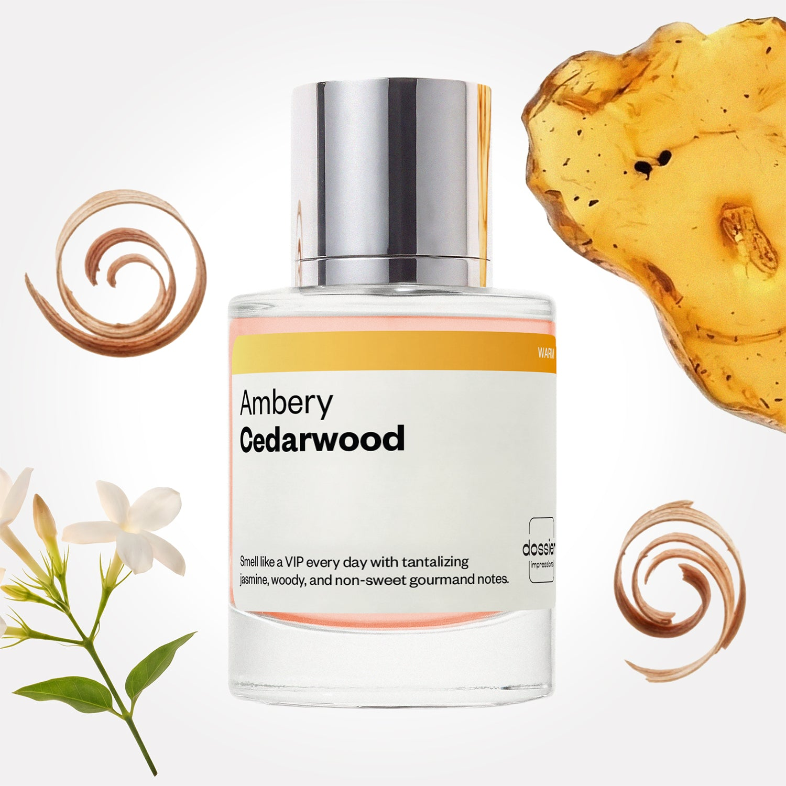

# Ambery Cedarwood

- **Dossier Inspired by Mugler's Alien**
- **URL:** https://dossier.co/products/ambery-cedarwood
- **SEO title:** Thierry Mugler Alien Dupe Perfume : Ambery Cedarwood - Dossier Perfumes

## Pricing (sizes)

| Size/SKU | Member price | List price | Currency |
|---|---|---|---|
| DI50AMCEUS | 28.8 | 32 | USD |

## Content (scent notes, about, editorial)

Back Home / Perfumes / Dossier Impressions / AMBERY CEDARWOOD 

Women 

Ambery Cedarwood

Eau de Parfum. Size: 50ml / 1.7oz 

members: $28.80

Guest:
$32

Inspired by Mugler's Alien Inspired by Mugler's Alien 
Inspired by Mugler's Alien 

Retail price 150 Crafted in France 
Scent Family: warm 

Add to Cart 

Scent Notes This perfume is: The it girl at every party 
Main Notes:

Jasmine Sambac

Cedarwood

Amber

top: The first notes you smell 
Mandarin, Cardamom, Orange Blossom 
middle: The heart of the perfume 
Jasmine Sambac, Cedarwood 
base: The notes that linger all day 
Heliotrope Flower, Amber, Vanilla 
ingredients: Alcohol Denat., Fragrance/Parfum, Water/Aqua/Eau, Benzyl Salicylate, Tetramethyl Acetyloctahydronaphthalenes, Vanillin, Coumarin, Geranyl Acetate, Geraniol, Alpha-Isomethyl Ionone, Citronellol, Pogostemon Cablin Oil, Benzyl Alcohol, Rose Ketones, Linalool, Anethole, Citrus Aurantium Flower Oil, Benzyl Benzoate, Linalyl Acetate, Limonene, Pinene, Citral Terpineol. 

Vegan
Cruelty-free

Clean ingredients

About Ambery Cedarwood (inspired by Mugler's Alien) presents us with a distinct scent that’s truly all its own. Combining radiant jasmine, with sharp woodsy notes, mysterious amber, and a non-sugary gourmand touch, this scent stimulates the senses from all angles in the most pleasurable manner. 

Contrasted, intriguing, and peerless, Ambery Cedarwood (our impression of Mugler's Alien) is addictively intoxicating, while remaining subtle enough to not be invasive.

Scent Intensity: Statement 

Concentration: 18%

Gender: Feminine 

Shipping
Free shipping with 2+ items. 

Standard Shipping (with 2+ items) Auto-selected with 2+ items 
FREE 

Standard Shipping Auto-selected under 2 items 
$3.95 

Express shipping: 2 business days Select in checkout 
$19.00 

Returns
Free exchanges for all. Free returns with 

Exchanges
Free exchange, 1 time per order for all.

Returns
D+ members get 1 FREE return per order.
Non-members incur a $3.99/bottle return fee, 1 time per order.
Returns must be postmarked within 30 days of the initial order. Learn More 

FAQs Are these fragrances long lasting? They are designed to be very long lasting, just like designer fragrances, in some cases even longer, depending on the composition. 
When does the new packaging come out? We'll begin rolling out our new packaging across the U.S. and international markets soon! If you want to shop IRL - our new packaging first hits stores on January 11, 2026 at Walmart. Please note that if you are shopping online, you may receive a combination of our current and new packaging while we transition our inventory. 
How will I know what scent I like? We get it, shopping for perfumes online is hard! That's why we created a scent quiz, which will find the perfect scent for you Take the quiz (opens in new tab) 
Unsure about something? Ask us! help@dossier.co 

Details We are not associated or affiliated with the brands mentioned here in any way.
Ambery Cedarwood

Shine celestially with radiant feminine force

An obscure scent of female power and sovereignty, Alien Mugler (the fragrance that Dossier’s Ambery Cedarwood is inspired by) is a beaming spotlight of universality and specter. Gripping aromas that send you to an incandescent ocean of stars, this Eau de Parfum lavishes any wearer in glimmering rays of sultry passion, along with strikingly beauteous regency. Released in 2005, the luxury fragrance that Ambery Cedarwood is inspired by is a divine treat for the senses, clad in sparkling simplicity.

For such a seemingly minimalist fragrance, the luxury scent that Ambery Cedarwood is inspired by is anything but reticent. The luminosity of the opening top tone – deep and wild jasmine, sets a scene of the ferocious female, quietly confident in her supremacy. Following this free-spirited start, the aromas are tamed by a deep blend of woodsy notes that cloak the fragrance in thrilling mystery and a cosmos of deep longing.

These aromas are ignited with a blazing base note of fiery amber to tear out of confinement and radiate through galaxies. Your heart will skip a beat at the beauty of feeling adored and no longer restrained. The luxury fragrance that Ambery Cedarwood is inspired by is a resplendent adventure of confidence and force. This fragrance makes you a goddess of the stars.

To indulge in the gorgeous reinvention of the luxury fragrance that Ambery Cedarwood is inspired by, find its exclusive daughter: Alien Mugler Goddess, which landed on shelves in 2021. Youthful by age and fresh in scent, this Eau de Parfum spray seamlessly combines the original fierceness of amber and jasmine with a blended fusion of lighter, citrusy notes. The top and middle notes now host a floral fresh heliotrope and tangy Italian bergamot to embellish the scent with an avant-garde prestige. Exuding a novel floral bouquet, this scent has been crafted for angels of the planet, complex and enigmatic, but deeply desired and kind hearted.

The Mugler Alien perfumes come in 3 standard refillable sizes (30 ml, 60 ml, 90 ml) and cost $87.00, $123.00 and $170.00 respectively. To receive a 100 ml refill, it would cost $135.00 – make your perfume last, while staying economical. You can also find different best sellers of this fragrance from online retailers – the gift set, which includes a 10 ml sample size, a 30 ml perfume, and a 50 ml body lotion for a cost of $95.00. The body cream also goes for $87.00 and a 100 ml deodorizing spray for the day sells for $30.00. 

To be enraptured in a heavenly spritz of enchanting beauty that redefines feminine passion at a cheaper price, shop for Ambery Cedarwood by Dossier. Creating a fusion of aromas, our Alien Mugler dupe is a futuristic design of allure and feminine spark. Combining top notes of warm amber with Indian jasmine, and deep cedarwood undertones, we have captured the scent of radiant womanhood and desire. Our Ambery Cedarwood is a cheery fragrance of intoxication and sharpness – and one that remains unintrusive on the senses. Wear this fragrance if you wish to conjure mental images of the Plitvice Lakes.

Best Layered With Combine 2 of our perfumes to create a third scent with layering, curated by our nose. Learn more 

You Might Love 

4.4 

Rated 4.4 out of 5 stars 

Based on 1,382 reviews 

Reviews 1,382 (tab expanded) Questions 1 (tab collapsed) 

Filters 
Write a Review (Opens in a new window) 

1,382 reviews 
Sort Highest Rating Most Helpful Photos & Videos Most Recent Oldest Lowest Rating Least Helpful 

KP 

Kaye P. 
Verified Buyer 

6/4/26 

Rated 5 out of 5 stars 

Beautiful 
Amber Cedarwood is a lovely scent! Can't wait to add it to my rotation!

Read More Read more about this review 

Was this helpful? Yes, this review from Kaye P. was helpful. 0 people voted yes No, this review from Kaye P. was not helpful. 0 people voted no 

DP 

Dossier Perfumes 
6/4/26 
So glad you love it, Kaye! We can’t wait to hear which scents you explore next 🙌

JL 

Janis L. B. 
Verified Buyer 

6/3/26 

Rated 5 out of 5 stars 

Ambery Cedarwood
Excellent product. I'm very pleased with my purchase.

Read More Read more about this review 

Was this helpful? Yes, this review from Janis L. B. was helpful. 0 people voted yes No, this review from Janis L. B. was not helpful. 0 people voted no 

DP 

Dossier Perfumes 
6/3/26 
Happy to hear that, Janis! Thanks for the love 😊

BS 

Britt S. 
Verified Buyer 

5/1/26 

Rated 5 out of 5 stars 

This scent is pure fire! 🔥🔥
Ambery Cedarwood has been in my go to arsenal ever since it was first launched! I wear it every day with customers & co-workers ALWAYS commenting on how great I smell. It lasts ALL day too.... please NEVER stop making this delicious fragrance!

Read More Read more about this review 

Was this helpful? Yes, this review from Britt S. was helpful. 0 people voted yes No, this review from Britt S. was not helpful. 0 people voted no 

DP 

Dossier Perfumes 
5/1/26 
Britt, thanks for the love! It’s awesome that you’re getting compliments all day and it’s sticking with you. We promise to keep this one on our shelf for you.

CJ 

Casey J. 
Verified Buyer 

4/21/26 

Rated 5 out of 5 stars 

Perfect 
Smells just like Mugler's Alien at a third of the cost. Now please add Sinner by Kat von D!

Read More Read more about this review 

Was this helpful? Yes, this review from Casey J. was helpful. 0 people voted yes No, this review from Casey J. was not helpful. 0 people voted no 

DP 

Dossier Perfumes 
4/21/26 
Hey Casey! We’re so happy you’re loving that luxe vibe for less. We don’t carry that exact scent, but feel free to explore our full lineup at dossier.co for more gems. Happy spritzing!

J 

Julie 

4/17/26 

Rated 5 out of 5 stars 

5 Stars
Amazing smell!

Read More Read more about this review 

Was this helpful? Yes, this review from Julie was helpful. 0 people voted yes No, this review from Julie was not helpful. 0 people voted no 

Loading... 

Loading... 

Show More 

Inspired by  Baccarat Rouge 540 
Inspired by  Black Opium 
Inspired by  Love, Don't Be Shy 
Inspired by  Good Girl 
Inspired by  Libre 
Inspired by  Flowerbomb 
Inspired by  Light Blue 
Inspired by  Not a Perfume 
Inspired by  Aventus 
Inspired by  Bleu de Chanel 
Inspired by  Mon Paris 
Inspired by  Coco Mademoiselle 
Inspired by  Tom Ford for Men 
Inspired by  For Her 
Inspired by  J'Adore Dior 
Inspired by  Alien 
Inspired by  Black Opium Perfume 
Inspired by  Lost Cherry Perfume 

GET UP TO 30% OFF 

Find us at these retailers. 

Be the first to know. 
Submit 

Shop the following countries. United States 

Discover.
AI Scent Finder 
Blog (opens in new tab) 
Scent Family 
Layering 
Scent Quiz 

Help.
Contact Us 
Returns 
FAQ 
Testimonials 
Accessibility 

More.
Store Locator 
Boutique 
Refer A Friend 
Index 

Download our app now.

Find us at these retailers. 

Be the first to know. 
Submit 

Shop the following countries. United States 

Discover.
AI Scent Finder 
Blog (opens in new tab) 
Scent Family 
Layering 
Scent Quiz 

Help.
Contact Us 
Returns 
FAQ 
Testimonials 
Accessibility 

More.

## Main Image

