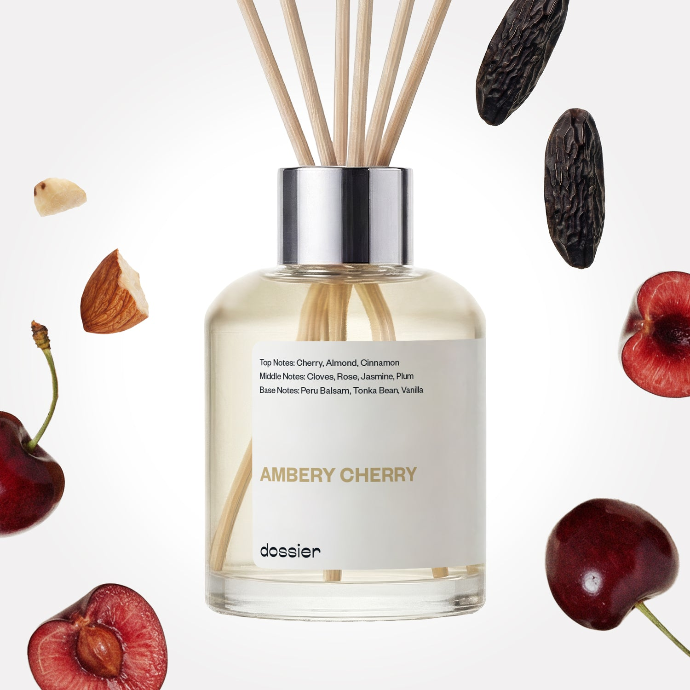

# Ambery Cherry Room Diffuser

- **Dossier Inspired by Tom Ford's Lost Cherry Perfume**
- **URL:** https://dossier.co/products/ambery-cherry-diffuser
- **SEO title:** tom ford home diffuser Dupe impression - Ambery Cherry Room Diffuser

## Pricing (sizes)

| Size/SKU | Member price | List price | Currency |
|---|---|---|---|
| 40397936689219 | 34.2 | 38 | USD |

## Content (scent notes, about, editorial)

Back Home / Home Scents / Diffusers / AMBERY CHERRY ROOM DIFFUSER 

Sold out 

Ambery Cherry Room Diffuser

Size: 100ml / 3.4oz 

members: $34.20

Guest:
$38

Inspired by Tom Ford's Lost Cherry Perfume Inspired by Tom Ford's Lost Cherry Perfume 
Inspired by Tom Ford's Lost Cherry Perfume 

Crafted in France 
Scent Family: gourmand 

Notify Me 

Scent Notes This perfume is: Vibrant, cheerful, colorful 
Main Notes:

Cherry

Almond

Peru Balsam

Tonka Bean

Vanilla

top: The first notes you smell 
Cherry, Almond, Cinnamon 
middle: The heart of the perfume 
Cloves, Rose, Jasmine, Plum 
base: The notes that linger all day 
Peru Balsam, Tonka Bean, Vanilla 
ingredients: Almond Abs, Hedione, Habanolide, Ethyl Vanilline, Timbersilk, Santalcore, Heliotropine Crystals, Coumarine,Benzaldehyde, Bicyclononalactone, Phenylethyl Alcohol, Ebanol, Styrallyl Acetate, Polysantol, Ethyl Maltol, Vertofix 

Vegan
Cruelty-free

Clean ingredients

About Delight in a unique, vibrant fusion of cherry and almond, warmed by vanilla and amber. Fill any room with this rich, lush scent and you’ll be hearing compliments from every houseguest, guaranteed.

Concentration: 22%

About this diffuser. 
The perfume diffuses in its environment by a natural and gradual evaporation through the wooden sticks.
The oil concentrate is diluted in alcohol, just like your favorite EDP or perfume is.
The formula of each diffuser has been reworked to both comply with the air care standards and to function optimally when used with wooden sticks.
Our diffusers are formulated for safe and stress free sniffing, no additives necessary.

LEARN MORE 

Tips How to Use.
Set up is easy: Place the reeds into the fragrance, sit back and relax as the smell of luxury fills the room.
Keep it fresh: Turn the reeds over from time to time. Doing this every 2-3 days will improve the diffusion of fragrance in the room.
24/7 luxury: For every 100ml diffuser, the fragrance will last at least one month when used continuously.
Hit pause: Reeds can be removed to "take a break" from the scent, and put back in the fragrance whenever you want. Save it for a special occasion or keep the good smells flowing 24/7, it’s up to you!

Shipping + Returns
Free exchanges for all. Free returns with 

Standard Shipping (with 2+ items) Auto-selected with 2+ items 
FREE 

Standard Shipping Auto-selected under 2 items 
$3.95 

Express shipping: 2 business days Select in checkout 
$19.00 

Returns for Diffusers
We cannot accept any returns for diffusers that had been used. In order to return a diffuser, proceed to our regular returns portal, and upload and image of your unused diffuser. If your diffuser has been used, your return request will be denied. 

FAQs Are these fragrances long lasting? They are designed to be very long lasting, just like designer fragrances, in some cases even longer, depending on the composition. 
When does the new packaging come out? We'll begin rolling out our new packaging across the U.S. and international markets soon! If you want to shop IRL - our new packaging first hits stores on January 11, 2026 at Walmart. Please note that if you are shopping online, you may receive a combination of our current and new packaging while we transition our inventory. 
How will I know what scent I like? We get it, shopping for perfumes online is hard! That's why we created a scent quiz, which will find the perfect scent for you Take the quiz (opens in new tab) 
Unsure about something? Ask us! help@dossier.co 

Details Delight in a unique, vibrant fusion of cherry and almond, warmed by vanilla and amber. Fill any room with this rich, lush scent and you’ll be hearing compliments from every houseguest, guaranteed. 

You Might Love 

4.4 

Rated 4.4 out of 5 stars 

Based on 61 reviews 

Reviews 61 (tab expanded) Questions (tab collapsed) 

Filters 
Write a Review (Opens in a new window) 

61 reviews 
Sort Highest Rating Most Helpful Photos & Videos Most Recent Oldest Lowest Rating Least Helpful 

SD 

Sofia D. 

Verified Buyer 

12/27/25 

Rated 5 out of 5 stars 

ROOM SCENT
brings out the woody scent of my floors :))) not artificially cherry, more maraschino!

Read More Read more about this review 

Was this helpful? Yes, this review from Sofia D. was helpful. 0 people voted yes No, this review from Sofia D. was not helpful. 0 people voted no 

DP 

Dossier Perfumes 
12/27/25 
Hey Sofia! We love that it highlights your floors’ natural warmth, not artificial cherry. Thanks for sharing this!

S 

Susan 

8/28/25 

Rated 5 out of 5 stars 

Update review Ambery Cherry
The Ambery Cherry Diffuser is delicious AFTER I turned over the diffuser sticks. I recall the directions saying to turnover/ invert the diffuser sticks weekly. Without the stick inversion, this smelled completely different. Once inverted, the diffuser smells exactly like it should: tobacco, Cherry and almond. I love it.

Read More Read more about this review 

Was this helpful? Yes, this review from Susan was helpful. 0 people voted yes No, this review from Susan was not helpful. 0 people voted no 

DP 

Dossier Perfumes 
9/1/25 
Susan, thank you for that crucial tip on inverting the sticks! 💥 So glad you're loving it!

HB 

Hailey B. 

7/27/25 

Rated 5 out of 5 stars 

the best!
I love the amberry cherry scent!

Read More Read more about this review 

Was this helpful? Yes, this review from Hailey B. was helpful. 0 people voted yes No, this review from Hailey B. was not helpful. 0 people voted no 

DP 

Dossier Perfumes 
8/18/25 
Ambery Cherry is such a special fragrance! So happy it's your new favorite, Hailey. 😍

AP 

Alison P. 

1/12/25 

Rated 5 out of 5 stars 

Lovely
Scent carries very well. I’m way impressed.

Read More Read more about this review 

Was this helpful? Yes, this review from Alison P. was helpful. 0 people voted yes No, this review from Alison P. was not helpful. 0 people voted no 

DP 

Dossier Perfumes 
1/13/25 
We love to impress Alison! Keep enjoying that vibe, and let us know if you ever need more good scents to keep it going.

A 

Annie 

12/30/24 

Rated 5 out of 5 stars 

Lasts longer than expected
Sometimes I walk in the room where I placed the diffuser and think, hey, what's that nice smell. . . oh yeah! This diffuser smells exactly like the perfume version. I've had it since October and it's now 12/31. I'm going to order a replacement at this point bc the bottle is getting low. Definitely worth the money bc it's a nice upgrade from other brands.

Read More Read more about this review 

Was this helpful? Yes, this review from Annie was helpful. 0 people voted yes No, this review from Annie was not helpful. 0 people voted no 

DP 

Dossier Perfumes 
1/2/25 
Love when a fragrance sticks around like that! Looks like it’s really making its mark. Time to restock, Annie!

Loading... 

Loading... 

Show More 

Inspired by  Baccarat Rouge 540 
Inspired by  Black Opium 
Inspired by  Love, Don't Be Shy 
Inspired by  Good Girl 
Inspired by  Libre 
Inspired by  Flowerbomb 
Inspired by  Light Blue 
Inspired by  Not a Perfume 
Inspired by  Aventus 
Inspired by  Bleu de Chanel 
Inspired by  Mon Paris 
Inspired by  Coco Mademoiselle 
Inspired by  Tom Ford for Men 
Inspired by  For Her 
Inspired by  J'Adore Dior 
Inspired by  Alien 
Inspired by  Black Opium Perfume 
Inspired by  Lost Cherry Perfume 

GET UP TO 30% OFF 

Find us at these retailers. 

Be the first to know. 
Submit 

Shop the following countries. United States 

Discover.
AI Scent Finder 
Blog (opens in new tab) 
Scent Family 
Layering 
Scent Quiz 

Help.
Contact Us 
Returns 
FAQ 
Testimonials 
Accessibility 

More.
Store Locator 
Boutique 
Refer A Friend 
Index 

Download our app now.

Find us at these retailers. 

Be the first to know. 
Submit 

Shop the following countries. United States 

Discover.
AI Scent Finder 
Blog (opens in new tab) 
Scent Family 
Layering 
Scent Quiz 

Help.
Contact Us 
Returns 
FAQ 
Testimonials 
Accessibility 

More.

## Main Image

