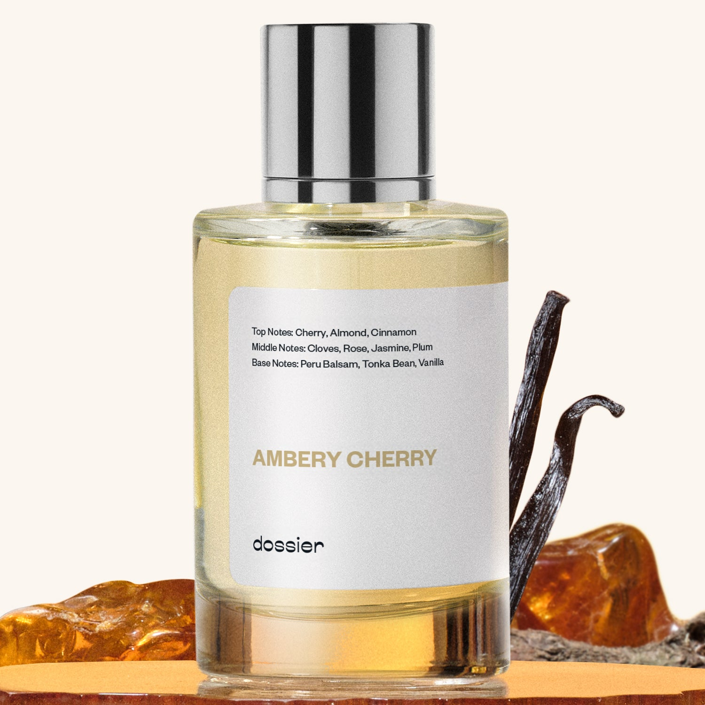

# Ambery Cherry

- **Dossier Inspired by Tom Ford's Lost Cherry**
- **URL:** https://dossier.co/products/ambery-cherry
- **SEO title:** Tom Ford Lost Cherry Dupe Perfume: Ambery Cherry - Dossier Perfumes

## Pricing (sizes)

| Size/SKU | Member price | List price | Currency |
|---|---|---|---|
| DI50AMCUS | 44.1 | 49 | USD |
| BF202538 | 142.2 | 158 | USD |
| BUNDLECHERRY50ML1 | 88.2 | 98 | USD |
| BUNDLECHERRY50ML2 | 132.3 | 147 | USD |
| 42335051317315 | 71.1 | 79 | USD |
| WA50AMC | 44.1 | 49 | USD |
| DOSWA50AMC2BD | 88.2 | 98 | USD |

## Content (scent notes, about, editorial)

Back Home / Perfumes / Dossier Impressions / AMBERY CHERRY 

Unisex 

Bestseller 

Ambery Cherry

Eau de Parfum. Size: 100ml / 3.4oz 

members: $71.10

Guest:
$79

Inspired by Tom Ford's Lost Cherry Inspired by Tom Ford's Lost Cherry 
Inspired by Tom Ford's Lost Cherry 

Retail price 615 Pack
50ml $49

Best Value
100ml $79

Crafted in France 
Scent Family: gourmand 

Add to Cart 

Scent Notes This perfume is: A shirley temple ... 
Main Notes:

Cherry

Almond

Peru Balsam

Tonka Bean

Vanilla

top: The first notes you smell 
Cherry, Almond, Cinnamon 
middle: The heart of the perfume 
Cloves, Rose, Jasmine, Plum 
base: The notes that linger all day 
Peru Balsam, Tonka Bean, Vanilla 
ingredients: Alcohol Denat., Fragrance/Parfum, Water/Aqua/Eau, Tetramethyl Acetyloctahydronaphthalenes, Vanillin, Coumarin, Trimethylcyclopentene Methylisopentenol, Benzaldehyde, Myroxylon Pereirae Oil/Extract, Benzyl Cinnamate, Benzyl Benzoate, Anise Alcohol, Rose Ketones, Rose Flower Oil/Extract, Hexadecanolactone, Isoeugenol, Eugenol, Acetyl Cedrene, Citral, Citronellol, Beta-Caryophyllene, Benzyl Alcohol, Geraniol. 

Vegan
Cruelty-free

Clean ingredients

About Ambery Cherry (inspired by Tom Ford's Lost Cherry) opens with an incredible burst of cherry and almond, which progressively vanishes to give room to warm spices, like cinnamon and clove, and fresh flowers, like rose and jasmine. Next, vanilla and Peru balm materialize, warming up the fragrance to give room for a rich and ambery structure. 

Daring, extravert, and gourmand, Ambery Cherry (our impression of Tom Ford's Lost Cherry) is a unique and tantalizing statement, drawing you in or leaving you looking for more. Either way, it’s a scent that can’t be ignored.

Scent Intensity: Statement 

Concentration: 18%

Gender: Unisex 

Shipping
Free shipping with 2+ items. 

Standard Shipping (with 2+ items) Auto-selected with 2+ items 
FREE 

Standard Shipping Auto-selected under 2 items 
$3.95 

Express shipping: 2 business days Select in checkout 
$19.00 

Returns
Free exchanges for all. Free returns with 

Exchanges
Free exchange, 1 time per order for all.

Returns
D+ members get 1 FREE return per order.
Non-members incur a $3.99/bottle return fee, 1 time per order.
Returns must be postmarked within 30 days of the initial order. Learn More 

FAQs Are these fragrances long lasting? They are designed to be very long lasting, just like designer fragrances, in some cases even longer, depending on the composition. 
When does the new packaging come out? We'll begin rolling out our new packaging across the U.S. and international markets soon! If you want to shop IRL - our new packaging first hits stores on January 11, 2026 at Walmart. Please note that if you are shopping online, you may receive a combination of our current and new packaging while we transition our inventory. 
How will I know what scent I like? We get it, shopping for perfumes online is hard! That's why we created a scent quiz, which will find the perfect scent for you Take the quiz (opens in new tab) 
Unsure about something? Ask us! help@dossier.co 

Details We are not associated or affiliated with the brands mentioned here in any way.
Ambery Cherry

Powerful and Insatiable

Tom Ford’s Lost Cherry (the scent that inspired Ambery Cherry) was released in 2018 as a new addition to the brand’s Private Blend collection. Just one sniff of the luxury fragrance that Ambery Cherry is inspired by, and you’ll get a candy-sweet scent of luscious black cherries mixed with the aroma of fresh tobacco. It’s one of the first food-inspired perfumes to come out of the brand’s luxury beauty line. And it’s a good one, too! It smells exactly like a sweet, delectable treat, coated with a shimmering layer of sweet, sticky syrup.

Tom Ford’s Lost Cherry is a mainly amber floral fragrance, with the dominant flavors being sour cherry, bitter almond, and liquor. It’s a combination that makes it feel very sophisticated, memorable, and utterly unique compared to other fragrances out there.

The fragrance opens with a sweet aroma: A haze of sugar, salt, and sweet musk atop a bowl of rich, dark cherries. It’s nothing less than a full-on sugar bomb. The top notes vie for the attention of the senses. But as quickly as they came, within minutes, the fragrance almost immediately settles into a darker, albeit still sweet experience. At its heart, you’ll discover a black cherry cordial of sorts. It’s fragrant and delicious, like the dark, sweet liquid that oozes out from biting into molten chocolate treats. Nearing its base, Tom Ford’s Lost Cherry transforms into a much smoother, warmer scent, letting its more floral and woody notes take over. An accord of sandalwood, cedar, vetiver, and vanilla musk draws the fragrance to a lovely and comforting close.

This is a very well-rounded, warm gourmand scent. This fragrance is very appropriate to wear during the fall and winter because of its vanilla and woody notes that last long enough through the long, cold days. The fragrance isn’t too overpowering either, making it a great evening scent to wear on a date or during dinner.

The luxury fragrance that Ambery Cherry is inspired by is available in 1 oz (30 ml), 1.7 oz (50 ml), 3.4 oz (100 ml) Eau de Parfum bottle sizes.

Tom Ford’s Lost Cherry is one of the most popular pieces in its fragrance line. Unfortunately, this exquisite concoction will set you back a cool $320. Dossier’s Ambery Cherry may be a cheaper alternative with no compromises on scent. Our dupe captures the essence of fresh cherry, jasmine, and vanilla to create a unique and tantalizing scent — drawing you in and leaving you wanting more. This is definitely not a fragrance you want to skip out on!

Best Layered With Combine 2 of our perfumes to create a third scent with layering, curated by our nose. Learn more 

You Might Love 

4.4 

Rated 4.4 out of 5 stars 

Based on 3,051 reviews 

Reviews 3,051 (tab expanded) Questions 1 (tab collapsed) 

Filters 
Write a Review (Opens in a new window) 

3,051 reviews 
Sort Highest Rating Most Helpful Photos & Videos Most Recent Oldest Lowest Rating Least Helpful 

MR 

Megan R. 
Verified Buyer 

6/26/26 

Rated 5 out of 5 stars 

Everything I dreamed of
I’d been trying to describe this for years and finally found exactly what I was looking for. Love it!

Read More Read more about this review 

Was this helpful? Yes, this review from Megan R. was helpful. 0 people voted yes No, this review from Megan R. was not helpful. 0 people voted no 

DP 

Dossier Perfumes 
6/26/26 
Megan, we’re so excited you finally found your match. Thanks for the kind words! Enjoy every spritz ✨

KB 

Kaylee B. 
Verified Buyer 

6/20/26 

Rated 5 out of 5 stars 

My favorite scent 
Closest I've gotten to a dupe of Lost Cherry but is also somehow incredibly close to Amarige Givenchy. Perfect blend of floral, fruit, and spice. 

Read More Read more about this review 

Was this helpful? Yes, this review from Kaylee B. was helpful. 0 people voted yes No, this review from Kaylee B. was not helpful. 0 people voted no 

DP 

Dossier Perfumes 
6/20/26 
Hey Kaylee! We’re thrilled this scent feels like that perfect floral fruit spice mix you’ve been after. Thanks for sharing how it’s become your go-to vibe!

L 

Lisa 
Verified Buyer 

6/16/26 

Rated 5 out of 5 stars 

Sour cherry
My second perfume from dossier. This one smells like sour cherry and tobacco. The sour cherry note hits you first and then dries to a nice warm tobacco like scent from the tonka bean and benzoin. I think it means more masculine but it could be worn by us women as well. I am a woman and I actually prefer men’s scents because they last longer, are stronger and have a fresh scent profile as opposed to flowers or vanilla that the companies think women should smell like. 
Smells great and not like every other perfume or cologne out there. I sprayed one spray on my shirt and it lasted about 4 hours. I bought my son the aromatic ginger cologne and that is going strong after several hours and smells so good. 

Read More Read more about this review 

Was this helpful? Yes, this review from Lisa was helpful. 0 people voted yes No, this review from Lisa was not helpful. 0 people voted no 

DP 

Dossier Perfumes 
6/16/26 
Lisa, love that your second pick really surprised you with its cherry punch and cozy warmth after. Men’s scents can last strong, and we’re thrilled it stands out. Keep exploring!

KM 

Kelsea M. 
Verified Buyer 

6/15/26 

Rated 5 out of 5 stars 

Love it
Love this comfy sweet smell. It makes me feel great all day. 

Read More Read more about this review 

Was this helpful? Yes, this review from Kelsea M. was helpful. 0 people voted yes No, this review from Kelsea M. was not helpful. 0 people voted no 

DP 

Dossier Perfumes 
6/15/26 
Thanks, Kelsea! We’re so glad this cozy sweetness brightens your day from morning till night 😊

NV 

Natalie V. 
Verified Buyer 

6/8/26 

Rated 5 out of 5 stars 

Smells Wonderful
This is my 2nd purchase from Dossier and it’s another hit. 

Read More Read more about this review 

Was this helpful? Yes, this review from Natalie V. was helpful. 0 people voted yes No, this review from Natalie V. was not helpful. 0 people voted no 

DP 

Dossier Perfumes 
6/8/26 
Natalie, thanks so much for coming back, we’re thrilled it’s another winner!

Loading... 

Loading... 

Show More 

Inspired by  Baccarat Rouge 540 
Inspired by  Black Opium 
Inspired by  Love, Don't Be Shy 
Inspired by  Good Girl 
Inspired by  Libre 
Inspired by  Flowerbomb 
Inspired by  Light Blue 
Inspired by  Not a Perfume 
Inspired by  Aventus 
Inspired by  Bleu de Chanel 
Inspired by  Mon Paris 
Inspired by  Coco Mademoiselle 
Inspired by  Tom Ford for Men 
Inspired by  For Her 
Inspired by  J'Adore Dior 
Inspired by  Alien 
Inspired by  Black Opium Perfume 
Inspired by  Lost Cherry Perfume 

GET UP TO 30% OFF 

Find us at these retailers. 

Be the first to know. 
Submit 

Shop the following countries. United States 

Discover.
AI Scent Finder 
Blog (opens in new tab) 
Scent Family 
Layering 
Scent Quiz 

Help.
Contact Us 
Returns 
FAQ 
Testimonials 
Accessibility 

More.
Store Locator 
Boutique 
Refer A Friend 
Index 

Download our app now.

Find us at these retailers. 

Be the first to know. 
Submit 

Shop the following countries. United States 

Discover.
AI Scent Finder 
Blog (opens in new tab) 
Scent Family 
Layering 
Scent Quiz 

Help.
Contact Us 
Returns 
FAQ 
Testimonials 
Accessibility 

More.

## Main Image

