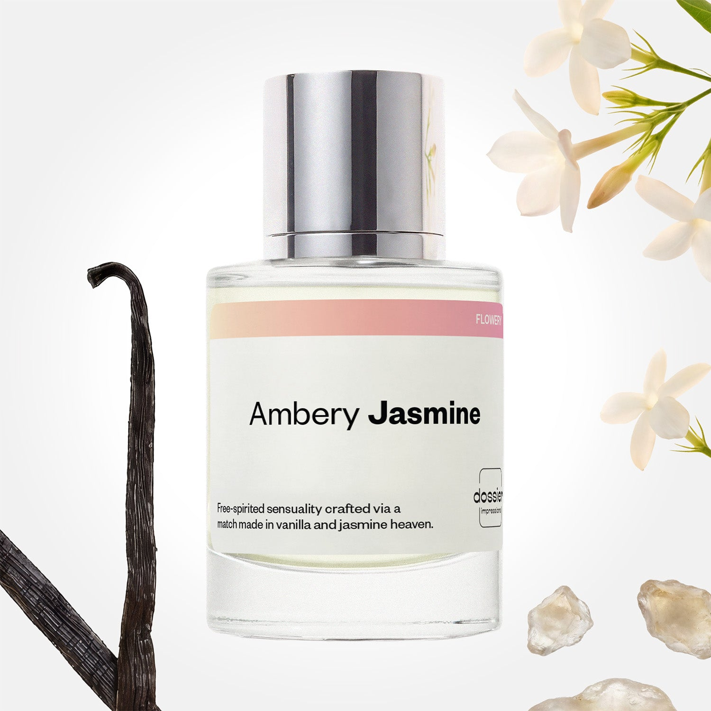

# Ambery Jasmine

- **Dossier Inspired by Valentino’s Donna Born In Roma**
- **URL:** https://dossier.co/products/ambery-jasmine
- **SEO title:** Ambery Jasmine

## Pricing (sizes)

| Size/SKU | Member price | List price | Currency |
|---|---|---|---|
| 50ml | 35.1 | 39 | USD |
| 100ml | 53.1 | 59 | USD |
| 200ml | 106.2 | 118 | USD |
| Top+5+for+Her+Bundle | 169.2 | 188 | USD |
| 2x50ml | 70.2 | 78 | USD |

## Content (scent notes, about, editorial)

Back Home / Perfumes / Dossier Impressions / AMBERY JASMINE 

Women 

Bestseller 

Ambery Jasmine

Eau de Parfum. Size: 100ml / 3.4oz 

members: $53.10

Guest:
$59

Inspired by Valentino's Donna Born In Roma Inspired by Valentino's Donna Born In Roma 
Inspired by Valentino's Donna Born In Roma 

Retail price 170 Size
50ml $39

Best Value
100ml $59

Crafted in France 
Scent Family: flowery 

Add to Cart 

Scent Notes Main Notes:

Jasmine

Vanilla

Cashmeran

top: The first notes you smell 
Blackcurrant, Pink Pepper, Bergamot 
middle: The heart of the perfume 
jasmine , White Flowers 
base: The notes that linger all day 
Vanilla, Amber, Cashmeran 
ingredients: Alcohol Denat., Fragrance/Parfum, Water/Aqua/Eau, Tetramethyl Acetyloctahydronaphthalenes Citrus Aurantium Bergamia (Bergamot) Peel Oil, Benzyl Salicylate, Vanillin, Linalyl Acetate, Hydroxycitronellal, Limonene, Pinene, Linalool, Geranyl Acetate, Alpha-Isomethyl Ionone, Terpineol, Benzyl Benzoate, Citronellol, Myroxylon Pereirae Oil/Extract, Coumarin, Rose Ketones, Citral, Benzyl Cinnamate, Beta-Caryophyllene, Terpinolene, Cinnamyl Alcohol, Jasmine Oil/Extract, Anethole, Geraniol, Hexadecanol Acetone, Benzyl Alcohol, Cananga Odorata Oil/Extract, Alpha-Terpinene, Rose Flower Oil/Extract, Acetyl Cedrene. 

Vegan
Cruelty-free

Clean ingredients

About Full-bodied, sexy without ever being lascivious, Ambery Jasmine is sensual, free-spirited femininity––embodied through fragrance. Jasmine and vanilla merge the fragrance’s heart to showcase the main notes and personality of Ambery Jasmine. This alluring duo rests between a kiss of cashmeran–a woody molecule that creates a vibrant base.

Scent Intensity: Statement 

Concentration: 20%

Gender: Feminine 

Shipping
Free shipping with 2+ items. 

Standard Shipping (with 2+ items) Auto-selected with 2+ items 
FREE 

Standard Shipping Auto-selected under 2 items 
$3.95 

Express shipping: 2 business days Select in checkout 
$19.00 

Returns
Free exchanges for all. Free returns with 

Exchanges
Free exchange, 1 time per order for all.

Returns
D+ members get 1 FREE return per order.
Non-members incur a $3.99/bottle return fee, 1 time per order.
Returns must be postmarked within 30 days of the initial order. Learn More 

FAQs Are these fragrances long lasting? They are designed to be very long lasting, just like designer fragrances, in some cases even longer, depending on the composition. 
When does the new packaging come out? We'll begin rolling out our new packaging across the U.S. and international markets soon! If you want to shop IRL - our new packaging first hits stores on January 11, 2026 at Walmart. Please note that if you are shopping online, you may receive a combination of our current and new packaging while we transition our inventory. 
How will I know what scent I like? We get it, shopping for perfumes online is hard! That's why we created a scent quiz, which will find the perfect scent for you Take the quiz (opens in new tab) 
Unsure about something? Ask us! help@dossier.co 

Best Layered With Combine 2 of our perfumes to create a third scent with layering, curated by our nose. Learn more 

You Might Love 

4.5 

Rated 4.5 out of 5 stars 

Based on 316 reviews 

Reviews 316 (tab expanded) Questions (tab collapsed) 

Filters 
Write a Review (Opens in a new window) 

316 reviews 
Sort Highest Rating Most Helpful Photos & Videos Most Recent Oldest Lowest Rating Least Helpful 

KW 

Kellie W. 
Verified Buyer 

6/29/26 

Rated 5 out of 5 stars 

It’s the real deal yall!!!
I have been in love with BIR for so long but never could bring myself to pay that amount of money for perfume, but Dossier literally captured the exact beautiful fragrance in their Ambery Jasmine! I am beyond ecstatic! I will continue to purchase this one for sure!!! Thank you, Dossier!

Read More Read more about this review 

Was this helpful? Yes, this review from Kellie W. was helpful. 0 people voted yes No, this review from Kellie W. was not helpful. 0 people voted no 

DP 

Dossier Perfumes 
6/29/26 
Kellie, that makes our day! So happy you’re loving Ambery Jasmine and getting that luxe feel without the splurge. Thanks for sharing—here’s to many more spritzes!

HH 

Heather H. 
Verified Buyer 

6/15/26 

Rated 5 out of 5 stars 

Pretty Hippie Vibes
I really enjoy this one 

Read More Read more about this review 

Was this helpful? Yes, this review from Heather H. was helpful. 0 people voted yes No, this review from Heather H. was not helpful. 0 people voted no 

DP 

Dossier Perfumes 
6/15/26 
Heather, awesome to hear you’re loving it! Thanks for sharing with us.

H◡̈ 

Harlie ◡̈ 

6/12/26 

Rated 5 out of 5 stars 

5 Stars
i ALWAYS get compliments om this

Read More Read more about this review 

Was this helpful? Yes, this review from Harlie ◡̈ was helpful. 0 people voted yes No, this review from Harlie ◡̈ was not helpful. 0 people voted no 

S 

Shannon 

6/8/26 

Rated 5 out of 5 stars 

5 Stars
Smells amazing!! Feminine and bold and yet it also has a comforting, cozy quality to it!!!! Definitely a buy again!!

Read More Read more about this review 

Was this helpful? Yes, this review from Shannon was helpful. 0 people voted yes No, this review from Shannon was not helpful. 0 people voted no 

LM 

Lena m. 

5/25/26 

Rated 5 out of 5 stars 

Smells good 
Smells good but I really miss the old bottles where it had the scent notes written at the top. I love how you can see exactly what the scent profile is, that way u get an idea of what profile scents you do and don’t like. I hope they go back to the old packaging. I’ve seen many say this and I hope they listen to their customers on this one. 

Read More Read more about this review 

Was this helpful? Yes, this review from Lena m. was helpful. 0 people voted yes No, this review from Lena m. was not helpful. 0 people voted no 

DP 

Dossier Perfumes 
5/25/26 
Lena, we hear you! It’s great those scent notes helped guide your picks, and your feedback means a lot, so our team’s listening. Thanks for sharing your thoughts with us.

Loading... 

Loading... 

Show More 

Inspired by  Baccarat Rouge 540 
Inspired by  Black Opium 
Inspired by  Love, Don't Be Shy 
Inspired by  Good Girl 
Inspired by  Libre 
Inspired by  Flowerbomb 
Inspired by  Light Blue 
Inspired by  Not a Perfume 
Inspired by  Aventus 
Inspired by  Bleu de Chanel 
Inspired by  Mon Paris 
Inspired by  Coco Mademoiselle 
Inspired by  Tom Ford for Men 
Inspired by  For Her 
Inspired by  J'Adore Dior 
Inspired by  Alien 
Inspired by  Black Opium Perfume 
Inspired by  Lost Cherry Perfume 

GET UP TO 30% OFF 

Find us at these retailers. 

Be the first to know. 
Submit 

Shop the following countries. United States 

Discover.
AI Scent Finder 
Blog (opens in new tab) 
Scent Family 
Layering 
Scent Quiz 

Help.
Contact Us 
Returns 
FAQ 
Testimonials 
Accessibility 

More.
Store Locator 
Boutique 
Refer A Friend 
Index 

Download our app now.

Find us at these retailers. 

Be the first to know. 
Submit 

Shop the following countries. United States 

Discover.
AI Scent Finder 
Blog (opens in new tab) 
Scent Family 
Layering 
Scent Quiz 

Help.
Contact Us 
Returns 
FAQ 
Testimonials 
Accessibility 

More.

## Main Image

