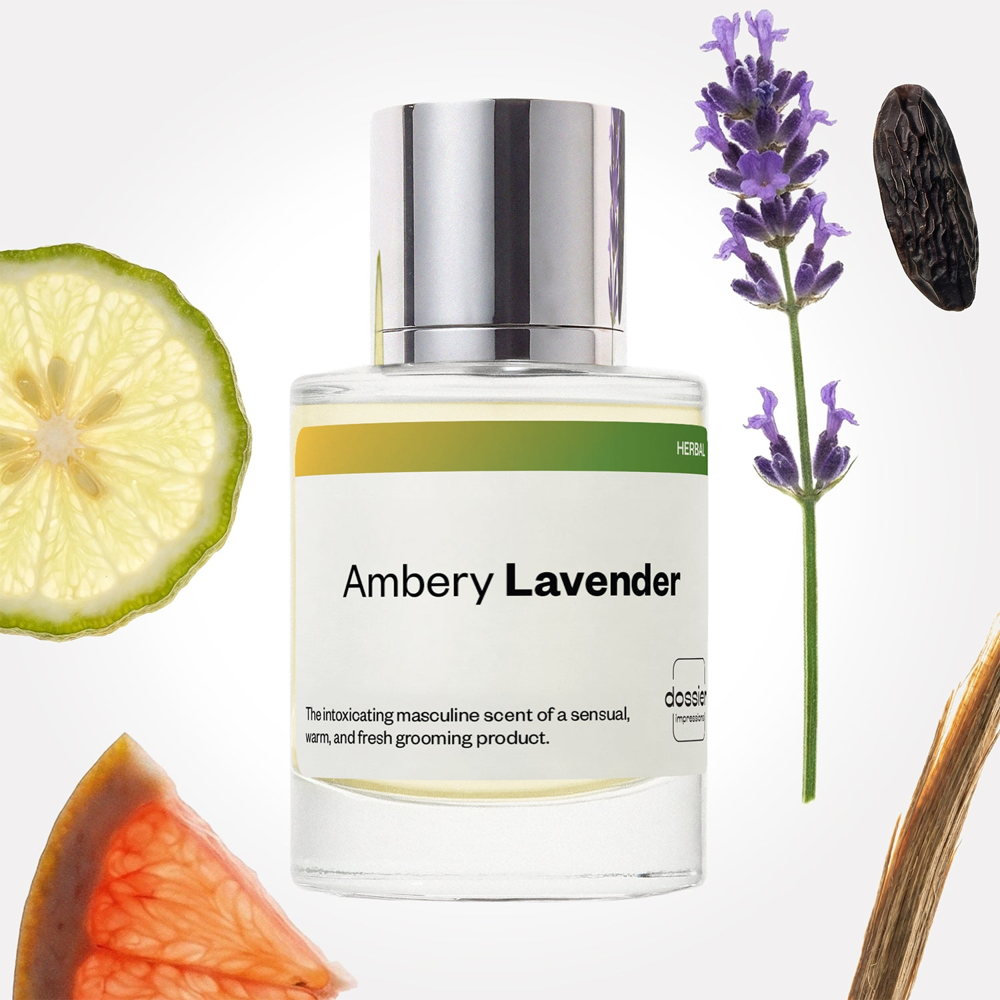

# Ambery Lavender

- **Dossier Inspired by Armani's Armani Code**
- **URL:** https://dossier.co/products/ambery-lavender
- **SEO title:** Giorgio Armani's Armani Code Dupe Perfume: Ambery Lavender - Dossier Perfumes

## Pricing (sizes)

| Size/SKU | Member price | List price | Currency |
|---|---|---|---|
| DI50AMLUS | 28.8 | 32 | USD |

## Content (scent notes, about, editorial)

Back Home / Perfumes / Dossier Impressions / AMBERY LAVENDER 

Men 

Ambery Lavender

Eau de Parfum. Size: 50ml / 1.7oz 

members: $28.80

Guest:
$32

Inspired by Giorgio Armani's Armani Code Inspired by Giorgio Armani's Armani Code 
Inspired by Giorgio Armani's Armani Code 

Retail price 145 Crafted in France 
Scent Family: herbal 

Add to Cart 

Scent Notes This perfume is: Prim, ready for any occasion 
Main Notes:

Lavender

Bergamot

Grapefruit

Guaiac Wood

Tonka Bean

top: The first notes you smell 
Lavender, Bergamot, Grapefruit 
middle: The heart of the perfume 
Tarragon, Guaïac Wood, Neroli 
base: The notes that linger all day 
Benzoin, Cedarwood, Tonka Bean 
ingredients:   Alcohol Denat., Fragrance/Parfum, Water/Aqua/Eau, Tetramethyl Acetyloctahydronaphthalenes, Hexamethylindanopyran, Linalyl Acetate, Limonene, Citrus Limon (Lemon) Peel Oil, Linalool, Coumarin, Hydroxycitronellal, Alpha-Isomethyl Ionone, Pinene, Hexyl Cinnamal, Juniperus Virginiana Oil, Vanillin, Amyl Salicylate, Citronellol, Beta-Caryophyllene, Geranyl Acetate, Geraniol, Anethole, Citral, Camphor, Rose Ketones, Terpinolene, Acetyl Cedrene, Terpineol, Alpha-Terpinene, Citrus Aurantium Peel Oil. 

Vegan
Cruelty-free

Clean ingredients

About Intertwining perfumery’s most dreamy pair, lavender and tonka bean come together effortlessly in Ambery Lavender (inspired by Giorgio Armani's Armani Code). With the sweetness of vanilla, the intensity of almond, and a hint of cacao, tonka bean nestles perfectly within lavender, because, as it evaporates, lavender produces warm vanillic inflexions, not so far from tonka bean. 

Warm and sweetly seductive, Ambery Lavender (our impression of Giorgio Armani's Armani Code) re-vamps this eternal coupling thanks to the vibrant and modern woodiness of Guaïac.

Scent Intensity: Statement 

Concentration: 15%

Gender: Masculine 

Shipping
Free shipping with 2+ items. 

Standard Shipping (with 2+ items) Auto-selected with 2+ items 
FREE 

Standard Shipping Auto-selected under 2 items 
$3.95 

Express shipping: 2 business days Select in checkout 
$19.00 

Returns
Free exchanges for all. Free returns with 

Exchanges
Free exchange, 1 time per order for all.

Returns
D+ members get 1 FREE return per order.
Non-members incur a $3.99/bottle return fee, 1 time per order.
Returns must be postmarked within 30 days of the initial order. Learn More 

FAQs Are these fragrances long lasting? They are designed to be very long lasting, just like designer fragrances, in some cases even longer, depending on the composition. 
When does the new packaging come out? We'll begin rolling out our new packaging across the U.S. and international markets soon! If you want to shop IRL - our new packaging first hits stores on January 11, 2026 at Walmart. Please note that if you are shopping online, you may receive a combination of our current and new packaging while we transition our inventory. 
How will I know what scent I like? We get it, shopping for perfumes online is hard! That's why we created a scent quiz, which will find the perfect scent for you Take the quiz (opens in new tab) 
Unsure about something? Ask us! help@dossier.co 

You Might Love 

4.4 

Rated 4.4 out of 5 stars 

Based on 394 reviews 

Reviews 394 (tab expanded) Questions 2 (tab collapsed) 

Filters 
Write a Review (Opens in a new window) 

394 reviews 
Sort Highest Rating Most Helpful Photos & Videos Most Recent Oldest Lowest Rating Least Helpful 

LH 

Luz H. 
Verified Buyer 

4/30/26 

Rated 5 out of 5 stars 

Happy Camper
Love this scent on my husband

Read More Read more about this review 

Was this helpful? Yes, this review from Luz H. was helpful. 0 people voted yes No, this review from Luz H. was not helpful. 0 people voted no 

DP 

Dossier Perfumes 
4/30/26 
Luz, that’s so sweet! We’re thrilled it’s getting you both compliments 😊

LM 

Luis M. 

Verified Buyer 

12/19/25 

Rated 5 out of 5 stars 

AMBERY LAVENDER
My decision of choosing Ambery Lavender was only inspirational. I did not have any reference of Original product (ARMANI) but I must say I am impressed with product DOSSIER provided for me. It is simply excellent. I am truly satisfied with my purchasing

Read More Read more about this review 

Was this helpful? Yes, this review from Luis M. was helpful. 0 people voted yes No, this review from Luis M. was not helpful. 0 people voted no 

DP 

Dossier Perfumes 
12/19/25 
Luis, thanks so much for taking a chance on Ambery Lavender and sharing this! We’re so happy it’s hit the mark. Ready to explore more? Just email help@dossier.co 😊

A 

Aaron 
Verified Buyer 

12/15/25 

Rated 5 out of 5 stars 

5 Stars
Probably my new favorite scent form dossier, right behind spicy vetiver, its a sweet lavender thats not overly potent or cloying. Perfect for dates nights and possibly warmer weather too. Cant go wrong with this one.

Read More Read more about this review 

Was this helpful? Yes, this review from Aaron was helpful. 0 people voted yes No, this review from Aaron was not helpful. 0 people voted no 

DP 

Dossier Perfumes 
12/15/25 
Hey Aaron, we’re thrilled this lavender made the cut for date nights and sunny days. It’s awesome to hear it’s just the right sweetness without overpowering. Thanks so much!

A 

Aaron 

12/15/25 

Rated 5 out of 5 stars 

5 Stars
Probably my new favorite scent form dossier, right behind spicy vetiver, its a sweet lavender thats not overly potent or cloying. Perfect for dates nights and possibly warmer weather too. Cant go wrong with this one.

Read More Read more about this review 

Was this helpful? Yes, this review from Aaron was helpful. 0 people voted yes No, this review from Aaron was not helpful. 0 people voted no 

K 

Karen 

12/14/25 

Rated 5 out of 5 stars 

5 Stars
Great scent and arrived on time

Read More Read more about this review 

Was this helpful? Yes, this review from Karen was helpful. 0 people voted yes No, this review from Karen was not helpful. 0 people voted no 

Loading... 

Loading... 

Show More 

Inspired by  Baccarat Rouge 540 
Inspired by  Black Opium 
Inspired by  Love, Don't Be Shy 
Inspired by  Good Girl 
Inspired by  Libre 
Inspired by  Flowerbomb 
Inspired by  Light Blue 
Inspired by  Not a Perfume 
Inspired by  Aventus 
Inspired by  Bleu de Chanel 
Inspired by  Mon Paris 
Inspired by  Coco Mademoiselle 
Inspired by  Tom Ford for Men 
Inspired by  For Her 
Inspired by  J'Adore Dior 
Inspired by  Alien 
Inspired by  Black Opium Perfume 
Inspired by  Lost Cherry Perfume 

GET UP TO 30% OFF 

Find us at these retailers. 

Be the first to know. 
Submit 

Shop the following countries. United States 

Discover.
AI Scent Finder 
Blog (opens in new tab) 
Scent Family 
Layering 
Scent Quiz 

Help.
Contact Us 
Returns 
FAQ 
Testimonials 
Accessibility 

More.
Store Locator 
Boutique 
Refer A Friend 
Index 

Download our app now.

Find us at these retailers. 

Be the first to know. 
Submit 

Shop the following countries. United States 

Discover.
AI Scent Finder 
Blog (opens in new tab) 
Scent Family 
Layering 
Scent Quiz 

Help.
Contact Us 
Returns 
FAQ 
Testimonials 
Accessibility 

More.

## Main Image

