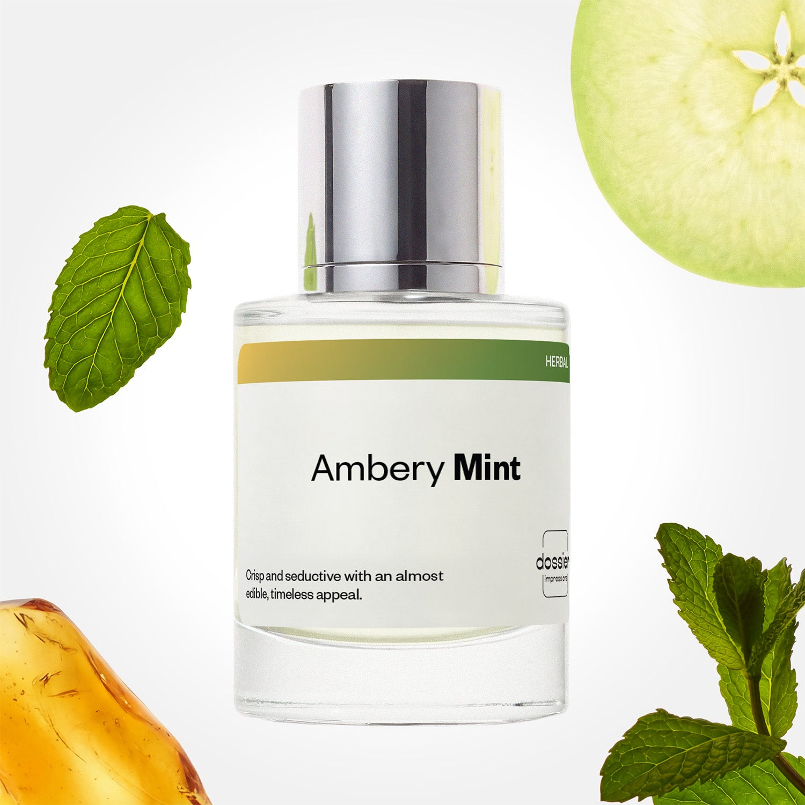

# Ambery Mint

- **Dossier Inspired by Versace's Eros**
- **URL:** https://dossier.co/products/ambery-mint
- **SEO title:** Versace's Eros Dupe Perfume: Ambery Mint - Dossier Perfumes

## Pricing (sizes)

| Size/SKU | Member price | List price | Currency |
|---|---|---|---|
| DI50AMIUS | 26.1 | 29 | USD |
| DOSWA50AMI | 26.1 | 29 | USD |

## Content (scent notes, about, editorial)

Back Home / Perfumes / Dossier Impressions / AMBERY MINT 

Men 

Bestseller 

Ambery Mint

Eau de Toilette. Size: 50ml / 1.7oz 

members: $26.10

Guest:
$29

Inspired by Versace's Eros Inspired by Versace's Eros 
Inspired by Versace's Eros 

Retail price 79 Crafted in France 
Scent Family: herbal 

Add to Cart 

Scent Notes This perfume is: Icy with sweetness at its core 
Main Notes:

Mint

Green Apple

Lemon

Amber

top: The first notes you smell 
Mint, Green Apple, Lemon 
middle: The heart of the perfume 
Geranium, Cedarwood, Vetiver 
base: The notes that linger all day 
Vanilla, Amber, Tonka bean 
ingredients: Alcohol Denat., Fragrance/Parfum, Water/Aqua/Eau, Citrus Aurantium Bergamia (Bergamot) Peel Oil, Tetramethyl Acetyloctahydronaphthalenes, Limonene, Linalyl Acetate, Hexamethylindanopyran, Linalool, Vanillin, Pinene, Coumarin, Alpha-Isomethyl Ionone, Juniperus Virginiana Oil, Citral, Citronellol, Citrus Aurantium Peel Oil, Geranyl Acetate, Carvone, Beta-Caryophyllene, Terpineol, Terpinolene, Menthol, Geraniol, Rose Ketones, Cedrus Atlantica Oil/Extract, Pelargonium Graveolens Flower Oil, Alpha-Terpinene, Camphor, Benzyl Benzoate, Eugenol. 

Vegan
Cruelty-free

Clean ingredients

About Ambery Mint (inspired by Versace's Eros) is all about contrast. We start with lively notes of icy mint, zesty lemon, and cool green apple, then gradually evolve towards warmer notes of vanilla, amber, and tonka bean. With the sweetness of vanilla, the intensity of almond, and a cocoa finish, if you’ve never enjoyed tonka bean, you’re in for a treat. 

Assertive, warm, and with a touch of freshness on top, Ambery Mint (our impression of Versace's Eros) offers a seductive awakening.

Scent Intensity: Statement 

Concentration: 15%

Gender: Masculine 

Shipping
Free shipping with 2+ items. 

Standard Shipping (with 2+ items) Auto-selected with 2+ items 
FREE 

Standard Shipping Auto-selected under 2 items 
$3.95 

Express shipping: 2 business days Select in checkout 
$19.00 

Returns
Free exchanges for all. Free returns with 

Exchanges
Free exchange, 1 time per order for all.

Returns
D+ members get 1 FREE return per order.
Non-members incur a $3.99/bottle return fee, 1 time per order.
Returns must be postmarked within 30 days of the initial order. Learn More 

FAQs Are these fragrances long lasting? They are designed to be very long lasting, just like designer fragrances, in some cases even longer, depending on the composition. 
When does the new packaging come out? We'll begin rolling out our new packaging across the U.S. and international markets soon! If you want to shop IRL - our new packaging first hits stores on January 11, 2026 at Walmart. Please note that if you are shopping online, you may receive a combination of our current and new packaging while we transition our inventory. 
How will I know what scent I like? We get it, shopping for perfumes online is hard! That's why we created a scent quiz, which will find the perfect scent for you Take the quiz (opens in new tab) 
Unsure about something? Ask us! help@dossier.co 

Details We are not associated or affiliated with the brands mentioned here in any way.
Ambery Mint

A Quality Alternative to Versace’s Iconic Fragrance For Men

Versace Eros for Men (the fragrance that Dossier’s Versace Eros is inspired by) draws inspiration from ancient Greek myths and shares the same dark, sensual theme central to many other classic masculine fragrances. Named after the Greek god of love, the luxury scent that Ambery Mint is inspired by embodies a powerful yet youthful character — one that truly befits the modern man.

Now, what does the luxury scent that Ambery Mint is inspired by smell like? The luxury scent that Ambery Mint is inspired by is big, sharp, and bold. And we mean that in the best possible way. It’s hard to find anything subtle about this fragrance, and perhaps that’s why we enjoy it so much. There’s just something so addictive about the fragrance’s provocative, intrepid scent that awakens the fearless spirit of boundless exploration within.

Mint, green apple, and lemon dominate the opening notes of the luxury scent that Ambery Mint is inspired by, making a loud and boisterous statement. There’s an initial sharpness to it, but soon you’ll notice more calming smells like a herbaceous taste of geranium layered with rich, musky ambroxan. Eventually, you’ll get to the deeper tones of vanilla and cedar, rounding off the scent for a sweet, dark, forest finish.

The luxury scent that Ambery Mint is inspired by certainly provides a strong opening, followed by punchy scents throughout. It makes a wonderful fragrance for men who are keen on an audacious scent that won’t overwhelm. In general, however, we find it lighter and sweeter than most and a bit more androgynous than its scent profile suggests. For this reason, we think it could also make an appealing choice for women looking to add a slightly more masculine aesthetic to their collection.

The luxury scent that Ambery Mint is inspired by possesses the perfect blend of mint and vanilla, ideal for daytime use. Despite its lightness, it still has a strong scent, so as with any fragrance, the golden rule is not to overapply.

For evening wear, the luxury scent that Ambery Mint is inspired by is an amazing choice. Strength proves to be its most valuable feature here, as the scent stays on your skin all night. Young and invigorating, this is an overall great choice for a night out in the city.

Dossier’s Ambery Mint takes heavy inspiration from Versace Eros. With Ambery Mint, our goal was to impart the same sensation of warmth, freshness, and assertiveness you’ll only find in fragrances far exceeding its price point. 

And true to its mythical roots, Dossier’s dupe offers an excellent alternative to Versace’s legendary Greek-inspired fragrance, with a similar stimulating and masculine blend of sparkling mint mixed with sweet, herbaceous, and woody undertones.

Best Layered With Combine 2 of our perfumes to create a third scent with layering, curated by our nose. Learn more 

You Might Love 

4.6 

Rated 4.6 out of 5 stars 

Based on 739 reviews 

Reviews 739 (tab expanded) Questions 3 (tab collapsed) 

Filters 
Write a Review (Opens in a new window) 

739 reviews 
Sort Highest Rating Most Helpful Photos & Videos Most Recent Oldest Lowest Rating Least Helpful 

BF 

BELINDA F. 
Verified Buyer 

6/5/26 

Rated 5 out of 5 stars 

Absolutely love!
The service was quick and responsive, the delivery was quick and the scent is amazing, easy to wear, long lasting, and easy to love. 

Read More Read more about this review 

Was this helpful? Yes, this review from BELINDA F. was helpful. 0 people voted yes No, this review from BELINDA F. was not helpful. 0 people voted no 

DP 

Dossier Perfumes 
6/5/26 
Belinda, we’re thrilled it all arrived in a flash and that Ambery Mint feels like second skin. Here’s to many more spritzes that stick around and feel effortless for you!

R 

Robert 

5/26/26 

Rated 5 out of 5 stars 

5 Stars
smell great

Read More Read more about this review 

Was this helpful? Yes, this review from Robert was helpful. 0 people voted yes No, this review from Robert was not helpful. 0 people voted no 

GP 

GEORGE P. 
Verified Buyer 

5/23/26 

Rated 5 out of 5 stars 

Good
Mixed with Ambery Safron. Unique.

Read More Read more about this review 

Was this helpful? Yes, this review from GEORGE P. was helpful. 0 people voted yes No, this review from GEORGE P. was not helpful. 0 people voted no 

DP 

Dossier Perfumes 
5/24/26 
George thanks for sharing! Love that you paired it with ambery saffron 😊 keep exploring combos.

CL 

Christy L. F. 
Verified Buyer 

4/25/26 

Rated 5 out of 5 stars 

Clean scent
My husband loves this one. Great price.

Read More Read more about this review 

Was this helpful? Yes, this review from Christy L. F. was helpful. 0 people voted yes No, this review from Christy L. F. was not helpful. 0 people voted no 

DP 

Dossier Perfumes 
4/25/26 
Christy, so glad your husband loves it and that price hit the spot ✨

FG 

Fritz G. T. 
Verified Buyer 

4/23/26 

Rated 5 out of 5 stars 

Mint is very sweet 
When you put it on, it makes the scent last for 24 hours. 

Read More Read more about this review 

Was this helpful? Yes, this review from Fritz G. T. was helpful. 0 people voted yes No, this review from Fritz G. T. was not helpful. 0 people voted no 

DP 

Dossier Perfumes 
4/23/26 
Fritz, we’re thrilled Ambery Mint lasts a full day. For even more lift, try layering or spritzing pulse points 😊

Loading... 

Loading... 

Show More 

Inspired by  Baccarat Rouge 540 
Inspired by  Black Opium 
Inspired by  Love, Don't Be Shy 
Inspired by  Good Girl 
Inspired by  Libre 
Inspired by  Flowerbomb 
Inspired by  Light Blue 
Inspired by  Not a Perfume 
Inspired by  Aventus 
Inspired by  Bleu de Chanel 
Inspired by  Mon Paris 
Inspired by  Coco Mademoiselle 
Inspired by  Tom Ford for Men 
Inspired by  For Her 
Inspired by  J'Adore Dior 
Inspired by  Alien 
Inspired by  Black Opium Perfume 
Inspired by  Lost Cherry Perfume 

GET UP TO 30% OFF 

Find us at these retailers. 

Be the first to know. 
Submit 

Shop the following countries. United States 

Discover.
AI Scent Finder 
Blog (opens in new tab) 
Scent Family 
Layering 
Scent Quiz 

Help.
Contact Us 
Returns 
FAQ 
Testimonials 
Accessibility 

More.
Store Locator 
Boutique 
Refer A Friend 
Index 

Download our app now.

Find us at these retailers. 

Be the first to know. 
Submit 

Shop the following countries. United States 

Discover.
AI Scent Finder 
Blog (opens in new tab) 
Scent Family 
Layering 
Scent Quiz 

Help.
Contact Us 
Returns 
FAQ 
Testimonials 
Accessibility 

More.

## Main Image

