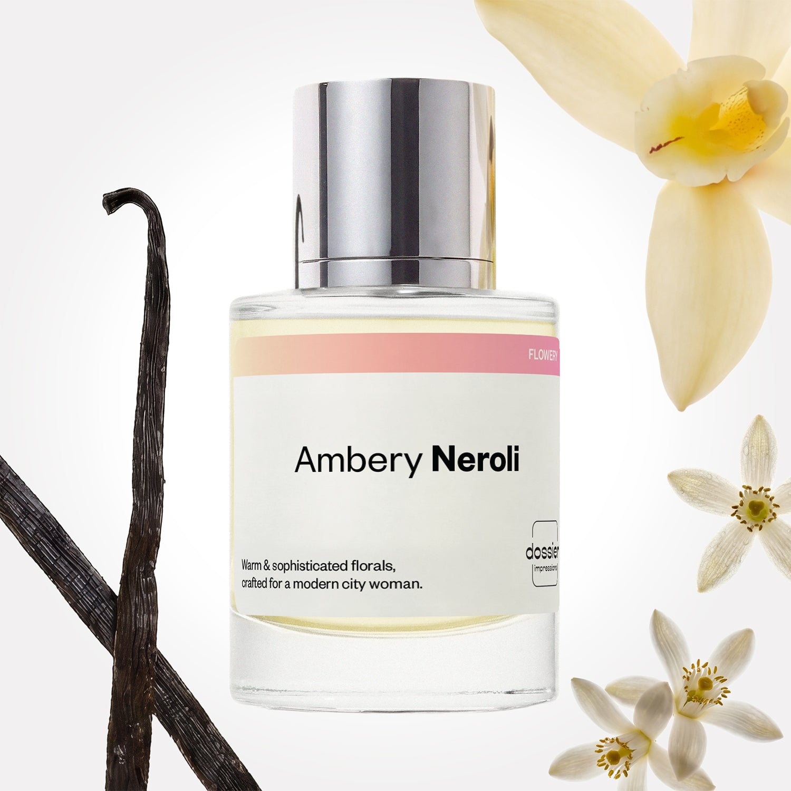

# Ambery Neroli

- **Dossier Inspired by Prada’s Paradoxe**
- **URL:** https://dossier.co/products/ambery-neroli
- **SEO title:** Ambery Neroli

## Pricing (sizes)

| Size/SKU | Member price | List price | Currency |
|---|---|---|---|
| DI50AMNUS | 28.8 | 32 | USD |

## Content (scent notes, about, editorial)

Back Home / Perfumes / Dossier Impressions / AMBERY NEROLI 

Women 

New 

Ambery Neroli

Eau de Parfum. Size: 50ml / 1.7oz 

members: $28.80

Guest:
$32

Inspired by Prada's Paradoxe Inspired by Prada's Paradoxe 
Inspired by Prada's Paradoxe 

Retail price 140 Crafted in France 
Scent Family: flowery 

Add to Cart 

Scent Notes Main Notes:

Neroli

Orange Flower

Plum

Jasmine

Vanilla

top: The first notes you smell 
neroli, Pear, Blackcurrant, Bergamot 
middle: The heart of the perfume 
orange flower, plum, jasmine 
base: The notes that linger all day 
vanilla, Musks, Amber, Honey 
ingredients: Alcohol Denat., Fragrance/Parfum, Water/Aqua/Eau, Tetramethyl Acetyloctahydronaphthalenes, Limonene, Citrus Aurantium Bergamia (Bergamot) Peel Oil, Benzyl Salicylate, Linalool, Linalyl Acetate, Citrus Aurantium Peel Oil, Vanillin, Dimethyl Phenethyl Acetate, Coumarin, Pinene, Hydroxycitronellal, Citronellol, Geraniol, Geranyl Acetate, Citrus Limon (Lemon) Peel Oil, Trimethylbenzenepropanol, Juniperus Virginiana Oil, Citral, Rose Ketones, Terpineol, Terpinolene, Beta-Caryophyllene, Benzyl Benzoate, Alpha-Terpinene, Benzyl Alcohol, Benzaldehyde, Acetyl Cedrene, Amyl Cinnamal. 

Vegan
Cruelty-free

Clean ingredients

About Fresh, elegant, and undeniably sexy––yet wearable for every day. Inspired by Prada’s Paradoxe, Ambery Neroli is a luxurious and profoundly sensual harmony of neroli, orange blossom, and white flowers with a warm base of vanilla and amber, interlaced with delightful fruity notes. The fragrance opens up with a burst of neroli accompanied by pear, blackcurrant, and bergamot notes for an invigorating fruity aroma at first sniff. Standout notes unfold at the heart of the fragrance with captivating notes of orange flower, plum, and jasmine before evolving into a decadent blend of vanilla, musks, amber, and honey base notes. A blend of velvety second skin notes meets rich, complex bliss in a floral fragrance.

Scent Intensity: Significant 

Concentration: 20%

Gender: Feminine 

Shipping
Free shipping with 2+ items. 

Standard Shipping (with 2+ items) Auto-selected with 2+ items 
FREE 

Standard Shipping Auto-selected under 2 items 
$3.95 

Express shipping: 2 business days Select in checkout 
$19.00 

Returns
Free exchanges for all. Free returns with 

Exchanges
Free exchange, 1 time per order for all.

Returns
D+ members get 1 FREE return per order.
Non-members incur a $3.99/bottle return fee, 1 time per order.
Returns must be postmarked within 30 days of the initial order. Learn More 

FAQs Are these fragrances long lasting? They are designed to be very long lasting, just like designer fragrances, in some cases even longer, depending on the composition. 
When does the new packaging come out? We'll begin rolling out our new packaging across the U.S. and international markets soon! If you want to shop IRL - our new packaging first hits stores on January 11, 2026 at Walmart. Please note that if you are shopping online, you may receive a combination of our current and new packaging while we transition our inventory. 
How will I know what scent I like? We get it, shopping for perfumes online is hard! That's why we created a scent quiz, which will find the perfect scent for you Take the quiz (opens in new tab) 
Unsure about something? Ask us! help@dossier.co 

Best Layered With Combine 2 of our perfumes to create a third scent with layering, curated by our nose. Learn more 

You Might Love 

4.5 

Rated 4.5 out of 5 stars 

Based on 141 reviews 

Reviews 141 (tab expanded) Questions (tab collapsed) 

Filters 
Write a Review (Opens in a new window) 

141 reviews 
Sort Highest Rating Most Helpful Photos & Videos Most Recent Oldest Lowest Rating Least Helpful 

EE 

Eugenia E. 
Verified Buyer 

6/30/26 

Rated 5 out of 5 stars 

Old Money
Is my new favorite fragrance . Elegant, clean, feminine 

Read More Read more about this review 

Was this helpful? Yes, this review from Eugenia E. was helpful. 0 people voted yes No, this review from Eugenia E. was not helpful. 0 people voted no 

DP 

Dossier Perfumes 
7/1/26 
Eugenia! We’re so happy this one feels elegant and feminine 😊

DS 

Denise S. 
Verified Buyer 

6/25/26 

Rated 5 out of 5 stars 

ummmmm!
Delicious I love it!

Read More Read more about this review 

Was this helpful? Yes, this review from Denise S. was helpful. 0 people voted yes No, this review from Denise S. was not helpful. 0 people voted no 

DP 

Dossier Perfumes 
6/25/26 
Hey Denise! We’re so happy you’re loving it! Thanks for sharing the love 😊

C 

Calvin 

6/25/26 

Rated 5 out of 5 stars 

5 Stars
Smelled great, not a 1:1 clone but I appreciate how it matures

Read More Read more about this review 

Was this helpful? Yes, this review from Calvin was helpful. 0 people voted yes No, this review from Calvin was not helpful. 0 people voted no 

AB 

Allesha B. 
Verified Buyer 

6/18/26 

Rated 5 out of 5 stars 

Similar to Noteworthy's n.271
It's similar to Noteworthy's n.271 but better in my opinion. Both have top notes of Blackcurrent, middle, floral, and bottom notes with vanilla. However, I feel dossier's version is blended SO much better. I actually don't really get the hype on n.271 because the blackcurrent note sits so heavy, that it's like grape kool-aid. Because of that I was very hesitant about purchasing this fragrance. I was pleasantly surprised! Not all fragrances are created equal. I can still pickup on the blackcurrent but the floral notes really help tame it down. The other wonderful advantage to Ambery Neroli is the price. The other company charges so much. 

Read More Read more about this review 

Was this helpful? Yes, this review from Allesha B. was helpful. 0 people voted yes No, this review from Allesha B. was not helpful. 0 people voted no 

DP 

Dossier Perfumes 
6/18/26 
Allesha! We’re thrilled our blend felt more balanced and that the floral notes softened the blackcurrant. It’s great you found a luxe scent without the luxe price 😊

UY 

Umber Y. 
Verified Buyer 

6/13/26 

Rated 5 out of 5 stars 

Ambery Neroli
Just loved it so much

Read More Read more about this review 

Was this helpful? Yes, this review from Umber Y. was helpful. 0 people voted yes No, this review from Umber Y. was not helpful. 0 people voted no 

DP 

Dossier Perfumes 
6/13/26 
Hey Umber! That’s awesome to hear, thanks for sharing your enthusiasm 😊

Loading... 

Loading... 

Show More 

Inspired by  Baccarat Rouge 540 
Inspired by  Black Opium 
Inspired by  Love, Don't Be Shy 
Inspired by  Good Girl 
Inspired by  Libre 
Inspired by  Flowerbomb 
Inspired by  Light Blue 
Inspired by  Not a Perfume 
Inspired by  Aventus 
Inspired by  Bleu de Chanel 
Inspired by  Mon Paris 
Inspired by  Coco Mademoiselle 
Inspired by  Tom Ford for Men 
Inspired by  For Her 
Inspired by  J'Adore Dior 
Inspired by  Alien 
Inspired by  Black Opium Perfume 
Inspired by  Lost Cherry Perfume 

GET UP TO 30% OFF 

Find us at these retailers. 

Be the first to know. 
Submit 

Shop the following countries. United States 

Discover.
AI Scent Finder 
Blog (opens in new tab) 
Scent Family 
Layering 
Scent Quiz 

Help.
Contact Us 
Returns 
FAQ 
Testimonials 
Accessibility 

More.
Store Locator 
Boutique 
Refer A Friend 
Index 

Download our app now.

Find us at these retailers. 

Be the first to know. 
Submit 

Shop the following countries. United States 

Discover.
AI Scent Finder 
Blog (opens in new tab) 
Scent Family 
Layering 
Scent Quiz 

Help.
Contact Us 
Returns 
FAQ 
Testimonials 
Accessibility 

More.

## Main Image

