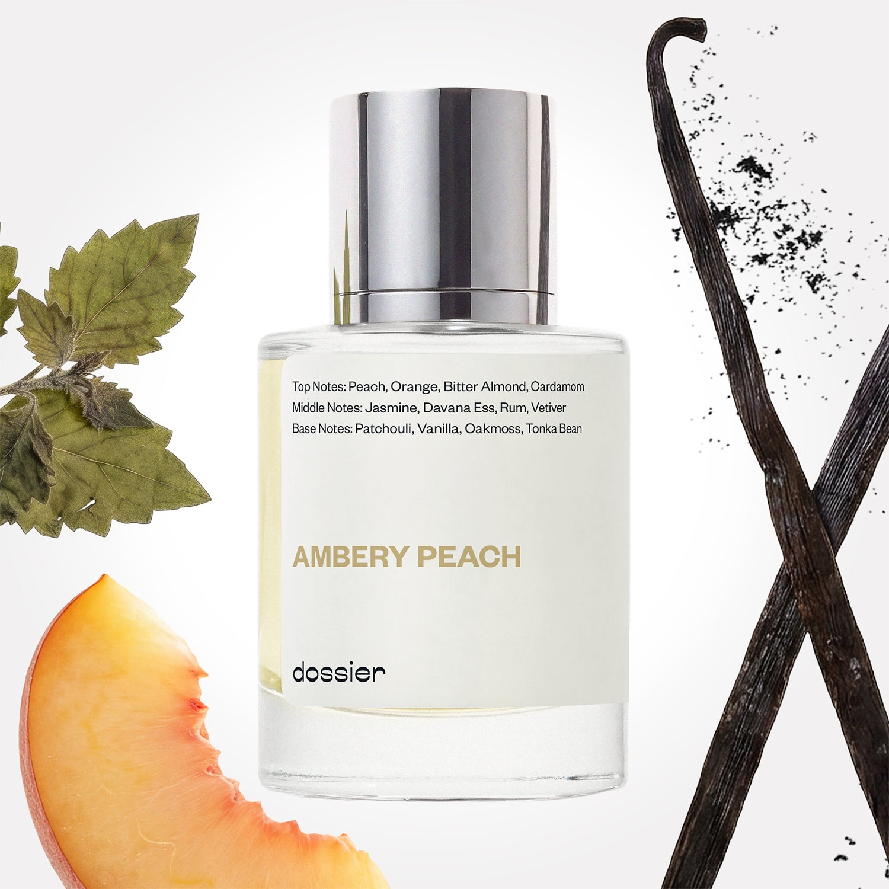

# Ambery Peach

- **Dossier Inspired by Tom Ford's Bitter Peach**
- **URL:** https://dossier.co/products/ambery-peach
- **SEO title:** Ambery Peach

## Pricing (sizes)

| Size/SKU | Member price | List price | Currency |
|---|---|---|---|
| 41180073820227 | 44.1 | 49 | USD |

## Content (scent notes, about, editorial)

Back Home / Perfumes / Dossier Impressions / AMBERY PEACH 

Unisex 

Sold out 

Ambery Peach

Eau de Parfum. Size: 50ml / 1.7oz 

members: $44.10

Guest:
$49

Inspired by Tom Ford's Bitter Peach Inspired by Tom Ford's Bitter Peach 
Inspired by Tom Ford's Bitter Peach 

Retail price 405 Crafted in France 
Scent Family: gourmand 

Notify Me 

Scent Notes Main Notes:

Peach

Patchouli

Vanilla

top: The first notes you smell 
peach , Orange, Bitter Almond, Cardamom 
middle: The heart of the perfume 
Jasmine, Davana Ess, Rum, Vetiver 
base: The notes that linger all day 
patchouli, vanilla , Oakmoss, Tonka Bean 
ingredients: Alcohol Denat., Fragrance/Parfum, Water/Aqua/Eau, Pogostemon Cablin Oil, Tetramethyl Acetyloctahydronaphthalenes, Hexamethylindanopyran, Vanillin, Linalool, Trimethylcyclopentenyl Methylisopentenol, Limonene, Coumarin, Citrus Limon (Lemon) Peel Oil, Citrus Aurantium Peel Oil, Linalyl Acetate, Pinene, Santalum Album (Sandalwood) Oil, Beta-Caryophyllene, Santalol, Acetyl Cedrene, Citronellol, Benzyl Cinnamate, Hexyl Cinnamal, Rose Ketones, Geraniol, Hexadecanolactone, Eugenol, Benzyl Benzoate, Narcissus Extract, Citral, Cinnamal, Terpineol, Geranyl Acetate, Benzaldehyde, Cinnamyl Alcohol, Cinnamomum Zeylanicum Bark Oil, Terpinolene, Farnesol, Laurus Nobilis Leaf Oil. 

Vegan
Cruelty-free

Clean ingredients

About Assertive, velvety, sultry, and boozy-sweet, Ambery Peach is a mouth-watering forbidden fruit for peach lovers. Ambery Peach combines ripe, juicy peach pulp nectar with bitter tones of patchouli, Davana essence, bitter almond, and oakmoss––all coated with luscious amber notes. 

Ambery Peach embodies the alluring duality you seek in a modern fragrance––interlaces decadent sweetness with tactile sensuality. The fragrance’s contemporary boozy gourmand and tantalizing notes rest upon a ground, timeless, and subtly sweet structure for a uniquely seductive combination that smells like an intoxicating union of pure heaven, sin, indulgence, and the divine. 

 

Scent Intensity: Statement 

Concentration: 18%

Gender: Unisex 

Shipping
Free shipping with 2+ items. 

Standard Shipping (with 2+ items) Auto-selected with 2+ items 
FREE 

Standard Shipping Auto-selected under 2 items 
$3.95 

Express shipping: 2 business days Select in checkout 
$19.00 

Returns
Free exchanges for all. Free returns with 

Exchanges
Free exchange, 1 time per order for all.

Returns
D+ members get 1 FREE return per order.
Non-members incur a $3.99/bottle return fee, 1 time per order.
Returns must be postmarked within 30 days of the initial order. Learn More 

FAQs Are these fragrances long lasting? They are designed to be very long lasting, just like designer fragrances, in some cases even longer, depending on the composition. 
When does the new packaging come out? We'll begin rolling out our new packaging across the U.S. and international markets soon! If you want to shop IRL - our new packaging first hits stores on January 11, 2026 at Walmart. Please note that if you are shopping online, you may receive a combination of our current and new packaging while we transition our inventory. 
How will I know what scent I like? We get it, shopping for perfumes online is hard! That's why we created a scent quiz, which will find the perfect scent for you Take the quiz (opens in new tab) 
Unsure about something? Ask us! help@dossier.co 

Best Layered With Combine 2 of our perfumes to create a third scent with layering, curated by our nose. Learn more 

You Might Love 

4.1 

Rated 4.1 out of 5 stars 

Based on 196 reviews 

Reviews 196 (tab expanded) Questions (tab collapsed) 

Filters 
Write a Review (Opens in a new window) 

196 reviews 
Sort Highest Rating Most Helpful Photos & Videos Most Recent Oldest Lowest Rating Least Helpful 

TN 

Theodora N. 
Verified Buyer 

4/28/26 

Rated 5 out of 5 stars 

Lovely cozy smell
Very nice replication of the original. Last for quite some time and it ends up with a warm vanilla smell. Very nice addition to my collection 

Read More Read more about this review 

Was this helpful? Yes, this review from Theodora N. was helpful. 0 people voted yes No, this review from Theodora N. was not helpful. 0 people voted no 

DP 

Dossier Perfumes 
4/28/26 
Theodora, thanks for sharing how it develops that cozy vanilla vibe and lasts so nicely! We’re thrilled it found its place in your collection. Enjoy every spritz!

CD 

Chris D. 
Verified Buyer 

4/20/26 

Rated 5 out of 5 stars 

Ambery Peach
Smells amazing!!! Just like the real deal!!! Perfect!! Ty

Read More Read more about this review 

Was this helpful? Yes, this review from Chris D. was helpful. 0 people voted yes No, this review from Chris D. was not helpful. 0 people voted no 

DP 

Dossier Perfumes 
4/20/26 
Thanks Chris! So happy it feels perfect for you ✨ Enjoy your new bottle!

MD 

Marilyn D. 
Verified Buyer 

4/12/26 

Rated 5 out of 5 stars 

Ambery Peach
Best scent yet!! This 1 last all day where a few of them do not. Love,love,love this 1🩷🩷 Thanks to Chanci from TikTok. It came highly recommended by her so I purchased 😊 So glad I did!!

Read More Read more about this review 

Was this helpful? Yes, this review from Marilyn D. was helpful. 0 people voted yes No, this review from Marilyn D. was not helpful. 0 people voted no 

DP 

Dossier Perfumes 
4/12/26 
Marilyn! We’re so thrilled it’s sticking with you all day, and that TikTok rec led you here 😊 Thanks for sharing the love and for trusting us with your vibe.

BI 

Bonnie I. I. 
Verified Buyer 

4/5/26 

Rated 5 out of 5 stars 

Pleasantly surprised...
I thought that this would be more peach forward, but it�s rich and ambery with that peach afterthought�intoxicating

Read More Read more about this review 

Was this helpful? Yes, this review from Bonnie I. I. was helpful. 0 people voted yes No, this review from Bonnie I. I. was not helpful. 0 people voted no 

DP 

Dossier Perfumes 
4/5/26 
Hey Bonnie, right? The way it shifts to that warm ambery vibe then teases peach later is magical. Enjoy it 😊

IT 

Isaack T. 
Verified Buyer 

4/4/26 

Rated 5 out of 5 stars 

It's so perfect
it last for long hours, very subtle and distinctive scent

Read More Read more about this review 

Was this helpful? Yes, this review from Isaack T. was helpful. 0 people voted yes No, this review from Isaack T. was not helpful. 0 people voted no 

DP 

Dossier Perfumes 
4/4/26 
Isaack, we’re so happy it lasts all day and feels uniquely you ✨

Loading... 

Loading... 

Show More 

Inspired by  Baccarat Rouge 540 
Inspired by  Black Opium 
Inspired by  Love, Don't Be Shy 
Inspired by  Good Girl 
Inspired by  Libre 
Inspired by  Flowerbomb 
Inspired by  Light Blue 
Inspired by  Not a Perfume 
Inspired by  Aventus 
Inspired by  Bleu de Chanel 
Inspired by  Mon Paris 
Inspired by  Coco Mademoiselle 
Inspired by  Tom Ford for Men 
Inspired by  For Her 
Inspired by  J'Adore Dior 
Inspired by  Alien 
Inspired by  Black Opium Perfume 
Inspired by  Lost Cherry Perfume 

GET UP TO 30% OFF 

Find us at these retailers. 

Be the first to know. 
Submit 

Shop the following countries. United States 

Discover.
AI Scent Finder 
Blog (opens in new tab) 
Scent Family 
Layering 
Scent Quiz 

Help.
Contact Us 
Returns 
FAQ 
Testimonials 
Accessibility 

More.
Store Locator 
Boutique 
Refer A Friend 
Index 

Download our app now.

Find us at these retailers. 

Be the first to know. 
Submit 

Shop the following countries. United States 

Discover.
AI Scent Finder 
Blog (opens in new tab) 
Scent Family 
Layering 
Scent Quiz 

Help.
Contact Us 
Returns 
FAQ 
Testimonials 
Accessibility 

More.

## Main Image

