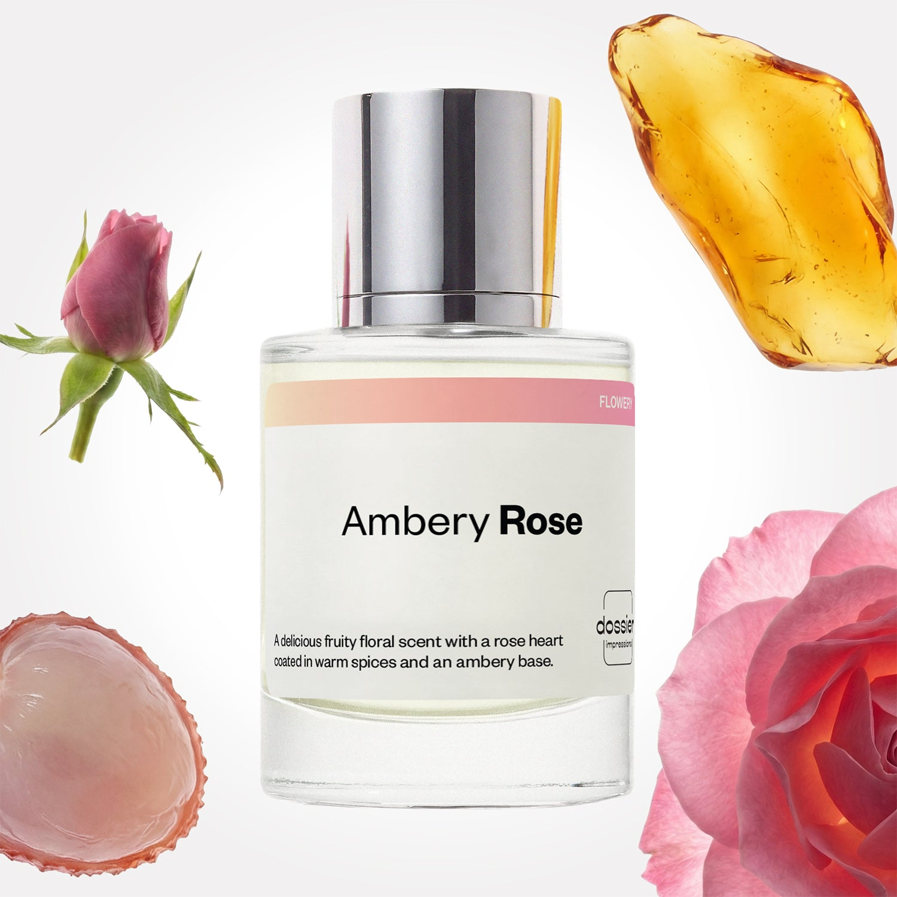

# Ambery Rose

- **Dossier Inspired by Parfums de Marly’s Delina**
- **URL:** https://dossier.co/products/ambery-rose
- **SEO title:** Ambery Rose

## Pricing (sizes)

| Size/SKU | Member price | List price | Currency |
|---|---|---|---|
| DI50AMRUS | 44.1 | 49 | USD |

## Content (scent notes, about, editorial)

Back Home / Perfumes / Dossier Impressions / AMBERY ROSE 

Women 

Ambery Rose

Eau de Parfum. Size: 50ml / 1.7oz 

members: $44.10

Guest:
$49

Inspired by Parfums de Marly's Delina Inspired by Parfums de Marly's Delina 
Inspired by Parfums de Marly's Delina 

Retail price 390 Crafted in France 
Scent Family: flowery 

Add to Cart 

Scent Notes Main Notes:

Lychee

Blackcurrant

Rose

Nutmeg

Amber

Cedarwood

top: The first notes you smell 
Lychee, Blackcurrant, Bergamot, Grapefruit 
middle: The heart of the perfume 
rose , Plum, nutmeg ess , Saffron 
base: The notes that linger all day 
amber , Vetiver, Musks, cedarwood 
ingredients: Alcohol Denat., Fragrance/Parfum, Water/Aqua/Eau, Tetramethyl Acetyloctahydronaphthalenes, Hexamethylindanopyran, Linalyl Acetate, Limonene, Pinene, Citrus Limon (Lemon) Peel Oil, Linalool, Citrus Aurantium Peel Oil, Vanillin, Geraniol, Myroxylon Pereirae Oil/Extract, Hexadecanolactone, Terpinolene, Benzyl Benzoate, Rose Flower Oil/Extract, Citronellol, Rose Ketones, Benzyl Cinnamate, Citral, Pelargonium Graveolens Flower Oil, Alpha-Terpinene, Geranyl Acetate, Beta-Caryophyllene, Isoeugenol, Benzyl Alcohol, Eugenol, Terpineol. 

Vegan
Cruelty-free

Clean ingredients

About Devour la beauté de rose with a love language of fruity freshness meets warm sensuality. Inspired by Parfum de Marly’s Delina, Ambery Rose opens with a crispy, delicate, and innocent fizz of fruity mélange of lychee, blackcurrant, bergamot, and grapefruit. The rich, nuanced fragrance then unfolds into the fragrance’s standout rose heart, blended with plum, nutmeg, and saffron notes. As this fruity, floral, and warm bouquet melts into your skin, the scent warms up with a mature, elegant, and sensual ambery accord at the base. Enjoy this evolution of amber, cedarwood, and subtle hints of vetiver and musks all day. 

 

Scent Intensity: Significant 

Concentration: 20%

Gender: Feminine 

Shipping
Free shipping with 2+ items. 

Standard Shipping (with 2+ items) Auto-selected with 2+ items 
FREE 

Standard Shipping Auto-selected under 2 items 
$3.95 

Express shipping: 2 business days Select in checkout 
$19.00 

Returns
Free exchanges for all. Free returns with 

Exchanges
Free exchange, 1 time per order for all.

Returns
D+ members get 1 FREE return per order.
Non-members incur a $3.99/bottle return fee, 1 time per order.
Returns must be postmarked within 30 days of the initial order. Learn More 

FAQs Are these fragrances long lasting? They are designed to be very long lasting, just like designer fragrances, in some cases even longer, depending on the composition. 
When does the new packaging come out? We'll begin rolling out our new packaging across the U.S. and international markets soon! If you want to shop IRL - our new packaging first hits stores on January 11, 2026 at Walmart. Please note that if you are shopping online, you may receive a combination of our current and new packaging while we transition our inventory. 
How will I know what scent I like? We get it, shopping for perfumes online is hard! That's why we created a scent quiz, which will find the perfect scent for you Take the quiz (opens in new tab) 
Unsure about something? Ask us! help@dossier.co 

Best Layered With Combine 2 of our perfumes to create a third scent with layering, curated by our nose. Learn more 

You Might Love 

4.3 

Rated 4.3 out of 5 stars 

Based on 200 reviews 

Reviews 200 (tab expanded) Questions (tab collapsed) 

Filters 
Write a Review (Opens in a new window) 

200 reviews 
Sort Highest Rating Most Helpful Photos & Videos Most Recent Oldest Lowest Rating Least Helpful 

A 

Anita 

6/30/26 

Rated 5 out of 5 stars 

5 Stars
Love it!!!

Read More Read more about this review 

Was this helpful? Yes, this review from Anita was helpful. 0 people voted yes No, this review from Anita was not helpful. 0 people voted no 

MP 

Megan P. 
Verified Buyer 

6/30/26 

Rated 5 out of 5 stars 

Addicting 
This smells so delicious! The rose is beautiful light and airy and the dry down keeps me smelling myself all day! Wow!

Read More Read more about this review 

Was this helpful? Yes, this review from Megan P. was helpful. 0 people voted yes No, this review from Megan P. was not helpful. 0 people voted no 

DP 

Dossier Perfumes 
7/1/26 
Megan! We’re thrilled this one keeps you feeling like you all day and that lovely rose note stays light and uplifting. Thanks for sharing your glow ✨

MG 

Miriam G. 
Verified Buyer 

6/24/26 

Rated 5 out of 5 stars 

Smell so good 😍
Lasting longer than expected 

Read More Read more about this review 

Was this helpful? Yes, this review from Miriam G. was helpful. 0 people voted yes No, this review from Miriam G. was not helpful. 0 people voted no 

DP 

Dossier Perfumes 
6/24/26 
Miriam, yay! So happy it lasts even longer than you expected 😊

CG 

Claudia G. 
Verified Buyer 

6/23/26 

Rated 5 out of 5 stars 

Close enough for me
I love Parfums De Marly Delina perfume but not the price. I have purchased Delina products such as body wash and hand lotion but not the perfume so I have been chasing dupes. I purchased the Ambery Rose excited dossier had a dupe or as they may say "influenced" scent. Totally forgetting I purchased the Covered in Roses perfume from Bath and Body Works which is a dupe of Delina. Frankly they both smell like Delina. I enjoy the scent so I wear it regularly. Dossier's version is longer lasting. If you are looking for the scent without the heavy price this Ambery Rose is the right one for you. Love dossier. 

Read More Read more about this review 

Was this helpful? Yes, this review from Claudia G. was helpful. 0 people voted yes No, this review from Claudia G. was not helpful. 0 people voted no 

DP 

Dossier Perfumes 
6/23/26 
Claudia, we love hearing you found a scent that gives you the vibe you adore without breaking the bank. It’s awesome that it lasts longer. Thanks for sharing! 💛

L 

Lynn 

6/20/26 

Rated 5 out of 5 stars 

5 Stars
LOVE IT ALL!!!

Read More Read more about this review 

Was this helpful? Yes, this review from Lynn was helpful. 0 people voted yes No, this review from Lynn was not helpful. 0 people voted no 

Loading... 

Loading... 

Show More 

Inspired by  Baccarat Rouge 540 
Inspired by  Black Opium 
Inspired by  Love, Don't Be Shy 
Inspired by  Good Girl 
Inspired by  Libre 
Inspired by  Flowerbomb 
Inspired by  Light Blue 
Inspired by  Not a Perfume 
Inspired by  Aventus 
Inspired by  Bleu de Chanel 
Inspired by  Mon Paris 
Inspired by  Coco Mademoiselle 
Inspired by  Tom Ford for Men 
Inspired by  For Her 
Inspired by  J'Adore Dior 
Inspired by  Alien 
Inspired by  Black Opium Perfume 
Inspired by  Lost Cherry Perfume 

GET UP TO 30% OFF 

Find us at these retailers. 

Be the first to know. 
Submit 

Shop the following countries. United States 

Discover.
AI Scent Finder 
Blog (opens in new tab) 
Scent Family 
Layering 
Scent Quiz 

Help.
Contact Us 
Returns 
FAQ 
Testimonials 
Accessibility 

More.
Store Locator 
Boutique 
Refer A Friend 
Index 

Download our app now.

Find us at these retailers. 

Be the first to know. 
Submit 

Shop the following countries. United States 

Discover.
AI Scent Finder 
Blog (opens in new tab) 
Scent Family 
Layering 
Scent Quiz 

Help.
Contact Us 
Returns 
FAQ 
Testimonials 
Accessibility 

More.

## Main Image

