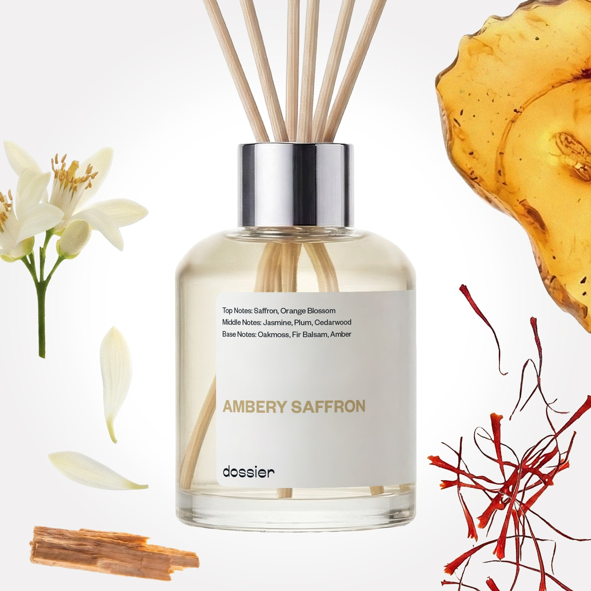

# Ambery Saffron Room Diffuser

- **Dossier Inspired by MFK's Baccarat Rouge 540**
- **URL:** https://dossier.co/products/ambery-saffron-room-diffuser
- **SEO title:** Baccarat Rouge 540 Dupe Perfume inspired by MFK: Ambery Saffron Room Diffuser

## Pricing (sizes)

| Size/SKU | Member price | List price | Currency |
|---|---|---|---|
| 810086660308 | 34.2 | 38 | USD |
| 40397936754755 | 34.2 | 38 | USD |
| 40397936853059 | 34.2 | 38 | USD |
| 40397936951363 | 34.2 | 38 | USD |
| 40397936820291 | 34.2 | 38 | USD |
| 40397936689219 | 34.2 | 38 | USD |
| 40397936885827 | 34.2 | 38 | USD |
| 41570854764611 | 34.2 | 38 | USD |

## Content (scent notes, about, editorial)

Back Home / Home Scents / Diffusers / AMBERY SAFFRON ROOM DIFFUSER 

Sold out 

Ambery Saffron Room Diffuser

Size: 100ml / 3.4oz 

members: $34.20

Guest:
$38

Inspired by MFK's Baccarat Rouge 540 Perfume Inspired by MFK's Baccarat Rouge 540 Perfume 
Inspired by MFK's Baccarat Rouge 540 Perfume 

Crafted in France 
Scent Family: warm 

Notify Me 

Scent Notes This perfume is: Sophisticated, minimalistic, cozy 
Main Notes:

Saffron

Orange Blossom

Cedarwood

Amber

top: The first notes you smell 
Violet Leaves, Cardamom 
middle: The heart of the perfume 
Orris, Ambrox, Cedarwood, Cypriol 
base: The notes that linger all day 
Musk, Sandalwood, Amber 
ingredients: Amyris Ess, Cardamom Ess, Carrot Seed Ess, Cypriol Ess, Incense Ess, Musk T, Cedramber, Timbersilk, Beta Ionone, Exaltolide, Polysantol, Vertenex, Ambrox DL, Phenoxanol, Undecavertol 

Vegan
Cruelty-free

Clean ingredients

About With the scorching heat of saffron, Ambery Saffron (inspired by MFK's Baccarat Rouge 540) opens up with a bang. Often avoided in perfumery because of its intensity, the warm temper of saffron is balanced with sizzling cedarwood and sultry amber.

With depth and an intoxicating spice that you won’t find anywhere else, Ambery Saffron (our impression of MFK's Baccarat Rouge 540) is full of mystery, delivering on warmth and unique texture.

Concentration: 22%

About this diffuser. 
The perfume diffuses in its environment by a natural and gradual evaporation through the wooden sticks.
The oil concentrate is diluted in alcohol, just like your favorite EDP or perfume is.
The formula of each diffuser has been reworked to both comply with the air care standards and to function optimally when used with wooden sticks.
Our diffusers are formulated for safe and stress free sniffing, no additives necessary.

LEARN MORE 

Tips How to Use.
Set up is easy: Place the reeds into the fragrance, sit back and relax as the smell of luxury fills the room.
Keep it fresh: Turn the reeds over from time to time. Doing this every 2-3 days will improve the diffusion of fragrance in the room.
24/7 luxury: For every 100ml diffuser, the fragrance will last at least one month when used continuously.
Hit pause: Reeds can be removed to "take a break" from the scent, and put back in the fragrance whenever you want. Save it for a special occasion or keep the good smells flowing 24/7, it’s up to you!

Shipping + Returns
Free exchanges for all. Free returns with 

Standard Shipping (with 2+ items) Auto-selected with 2+ items 
FREE 

Standard Shipping Auto-selected under 2 items 
$3.95 

Express shipping: 2 business days Select in checkout 
$19.00 

Returns for Diffusers
We cannot accept any returns for diffusers that had been used. In order to return a diffuser, proceed to our regular returns portal, and upload and image of your unused diffuser. If your diffuser has been used, your return request will be denied. 

FAQs Are these fragrances long lasting? They are designed to be very long lasting, just like designer fragrances, in some cases even longer, depending on the composition. 
When does the new packaging come out? We'll begin rolling out our new packaging across the U.S. and international markets soon! If you want to shop IRL - our new packaging first hits stores on January 11, 2026 at Walmart. Please note that if you are shopping online, you may receive a combination of our current and new packaging while we transition our inventory. 
How will I know what scent I like? We get it, shopping for perfumes online is hard! That's why we created a scent quiz, which will find the perfect scent for you Take the quiz (opens in new tab) 
Unsure about something? Ask us! help@dossier.co 

Details A Deep, Warm Sandalwood Experience

Santal 33, Le Labo’s long-standing fragrance, is undoubtedly one of the most defining scents of the decade. It’s so well-known that even some of the most iconic celebrities have taken to the unisex scent, such as Alexa Chung and Justin Bieber. 

This is a fragrance that has transcended cult status to become something that is at the same time coveted and ubiquitous. It’s a scent celebrated by perfumistas all over, and yet still enjoyably accessible to those who don’t know it.

Developed by perfumer Frank Voelkl, Le Labo’s Santal 33 was unveiled in 2011. With its woodsy-sweet scent, it has a rugged, yet not overly masculine appeal; if anything, it seems more androgynous. In any case, there is something universally sensual about this perfume, one that intoxicates both men and women alike.

Santal 33 greets you with a smoky, almost leathery aroma. This is accented by a woody accord (with bits of cedar, sandalwood, and turpentine) fused with a cream-like scent (thanks to the coconut and tonka bean). Iris, papyrus, and violet make up the top and middle notes, giving it an overall floral, musky aroma. In the background, a green cedar note is briefly discernible, together with a dab of cardamom, though they don’t stay around long. Late in Santal 33’s dry-down, sandalwood’s deep, warm character completely takes over, cementing its dominant run throughout the scent.

Santal 33, as a whole, gives off a subtle aroma of milk and roses mixed with dense, old woods. It’s a lovely, comforting, smooth scent as it opens and develops, although by the end, what you’re left with is a bunch of smoky, milky notes that capture the distinctive scent of Australian sandalwood. Many will love it — others not so much. But regardless of how you look at it, this is a very mature scent, one that is suited for anyone so inclined to appreciate the finer side of life.

Le Labo’s Santal 33 collection is available as an Eau de Parfum, body wash, body lotion, and candle.

Unfortunately, there is a downside to Le Labo’s signature scent, and that’s the price. It’s not cheap . On the plus side though, you can get the same scent for much less.

Enter Woody Sandalwood. This Le Labo’s Santal 33 dupe from Dossier.co is a lot cheaper than the original, and uses 100% Indian sandalwood — an ingredient rawer, earthier, and creamier than its Australian counterpart. The result is a much richer scent, one that strikes an ideal balance between the sharpness of woody notes and the smoothness of floral notes.

You Might Love 

4.0 

Rated 4.0 out of 5 stars 

Based on 79 reviews 

Reviews 79 (tab expanded) Questions (tab collapsed) 

Filters 
Write a Review (Opens in a new window) 

79 reviews 
Sort Highest Rating Most Helpful Photos & Videos Most Recent Oldest Lowest Rating Least Helpful 

T 

Tara 
Verified Buyer 

12/10/25 

Rated 5 out of 5 stars 

5 Stars
Smells amaxing even days later!! 🙌

Read More Read more about this review 

Was this helpful? Yes, this review from Tara was helpful. 0 people voted yes No, this review from Tara was not helpful. 0 people voted no 

DP 

Dossier Perfumes 
12/10/25 
Tara, yay so glad it holds up days later 🙌 love that staying power!

T 

Tara 

12/10/25 

Rated 5 out of 5 stars 

5 Stars
Smells amaxing even days later!! 🙌

Read More Read more about this review 

Was this helpful? Yes, this review from Tara was helpful. 0 people voted yes No, this review from Tara was not helpful. 0 people voted no 

BM 

Bethany M. 

9/8/25 

Rated 5 out of 5 stars 

Love love love
Love love love

Read More Read more about this review 

Was this helpful? Yes, this review from Bethany M. was helpful. 0 people voted yes No, this review from Bethany M. was not helpful. 0 people voted no 

DP 

Dossier Perfumes 
9/10/25 
Triple love = triple win. Thanks, Bethany! 💕

KP 

Karen P. 

8/29/25 

Rated 5 out of 5 stars 

Perfect!
Perfect!

Read More Read more about this review 

Was this helpful? Yes, this review from Karen P. was helpful. 0 people voted yes No, this review from Karen P. was not helpful. 0 people voted no 

DP 

Dossier Perfumes 
9/1/25 
We love hearing this, Karen! Sometimes the simple words say it all 💫

M 

Michelle 

8/27/25 

Rated 5 out of 5 stars 

Wonderful home scent
I have the original 540 in the perfume. It's one of my favorites. This diffuser smells just like it. My guest bathroom smells AMAZING. I absolutely LOVE this.

Read More Read more about this review 

Was this helpful? Yes, this review from Michelle was helpful. 0 people voted yes No, this review from Michelle was not helpful. 0 people voted no 

DP 

Dossier Perfumes 
9/1/25 
Turning a guest bathroom into a signature scent experience? Now that's a power move, Michelle!

Loading... 

Loading... 

Show More 

Inspired by  Baccarat Rouge 540 
Inspired by  Black Opium 
Inspired by  Love, Don't Be Shy 
Inspired by  Good Girl 
Inspired by  Libre 
Inspired by  Flowerbomb 
Inspired by  Light Blue 
Inspired by  Not a Perfume 
Inspired by  Aventus 
Inspired by  Bleu de Chanel 
Inspired by  Mon Paris 
Inspired by  Coco Mademoiselle 
Inspired by  Tom Ford for Men 
Inspired by  For Her 
Inspired by  J'Adore Dior 
Inspired by  Alien 
Inspired by  Black Opium Perfume 
Inspired by  Lost Cherry Perfume 

GET UP TO 30% OFF 

Find us at these retailers. 

Be the first to know. 
Submit 

Shop the following countries. United States 

Discover.
AI Scent Finder 
Blog (opens in new tab) 
Scent Family 
Layering 
Scent Quiz 

Help.
Contact Us 
Returns 
FAQ 
Testimonials 
Accessibility 

More.
Store Locator 
Boutique 
Refer A Friend 
Index 

Download our app now.

Find us at these retailers. 

Be the first to know. 
Submit 

Shop the following countries. United States 

Discover.
AI Scent Finder 
Blog (opens in new tab) 
Scent Family 
Layering 
Scent Quiz 

Help.
Contact Us 
Returns 
FAQ 
Testimonials 
Accessibility 

More.

## Main Image

