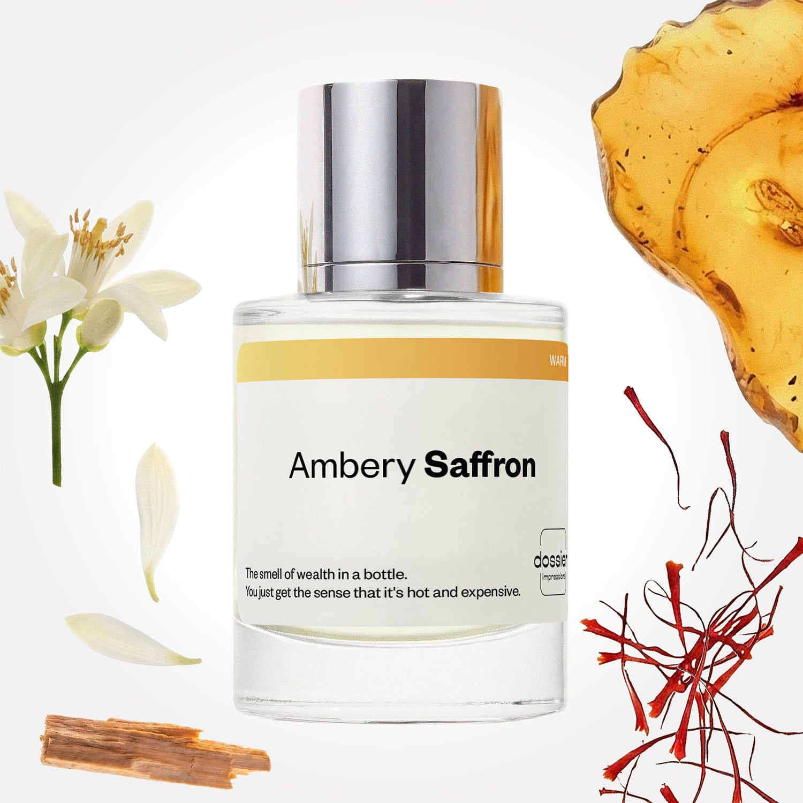

# Ambery Saffron

- **Dossier Inspired by MFK's Baccarat Rouge 540**
- **URL:** https://dossier.co/products/ambery-saffron
- **SEO title:** Baccarat Rouge 540 Dupe Perfume inspired by MFK : Ambery Saffron - Dossier Perfumes

## Pricing (sizes)

| Size/SKU | Member price | List price | Currency |
|---|---|---|---|
| 50mL | 44.1 | 49 | USD |
| 100ml | 71.1 | 79 | USD |
| 50ml+2.0+retail | 44.1 | 49 | USD |
| 2x100ml | 142.2 | 158 | USD |
| 2x50ml+2.0+retail | 88.2 | 98 | USD |
| travel+duo+50ml+++11ml | 56.7 | 63 | USD |

## Content (scent notes, about, editorial)

Back Home / Perfumes / Dossier Impressions / AMBERY SAFFRON 

Unisex 

Bestseller 

Ambery Saffron

Eau de Parfum. Size: 100ml / 3.4oz 

members: $71.10

Guest:
$79

Inspired by MFK's Baccarat Rouge 540 Inspired by MFK's Baccarat Rouge 540 
Inspired by MFK's Baccarat Rouge 540 

Retail price 665 Size
50mL $49

Best Value
100ml $79

Crafted in France 
Scent Family: warm 

Add to Cart 

Scent Notes This perfume is: Warm, a whiff of wealth 
Main Notes:

Saffron

Orange Blossom

Cedarwood

Amber

top: The first notes you smell 
Saffron, Orange Blossom 
middle: The heart of the perfume 
Jasmine, Plum, Cedarwood 
base: The notes that linger all day 
Oakmoss, Fir Balsam, Amber 
ingredients: Alcohol Denat., Fragrance/Parfum, Water/Aqua/Eau, Citrus Aurantium Peel Oil, Limonene, Pinene, Linalool, Benzyl Alcohol. 

Vegan
Cruelty-free

Clean ingredients

About With the scorching heat of saffron, Ambery Saffron (inspired by MFK's Baccarat Rouge 540) opens up with a bang. Often avoided in perfumery because of its intensity, the warm temper of saffron is balanced with sizzling cedarwood and sultry amber.

With depth and an intoxicating spice that you won’t find anywhere else, Ambery Saffron (our impression of MFK's Baccarat Rouge 540) is full of mystery, delivering on warmth and unique texture. 

Scent Intensity: Significant 

Concentration: 18%

Gender: Unisex 

Shipping
Free shipping with 2+ items. 

Standard Shipping (with 2+ items) Auto-selected with 2+ items 
FREE 

Standard Shipping Auto-selected under 2 items 
$3.95 

Express shipping: 2 business days Select in checkout 
$19.00 

Returns
Free exchanges for all. Free returns with 

Exchanges
Free exchange, 1 time per order for all.

Returns
D+ members get 1 FREE return per order.
Non-members incur a $3.99/bottle return fee, 1 time per order.
Returns must be postmarked within 30 days of the initial order. Learn More 

FAQs Are these fragrances long lasting? They are designed to be very long lasting, just like designer fragrances, in some cases even longer, depending on the composition. 
When does the new packaging come out? We'll begin rolling out our new packaging across the U.S. and international markets soon! If you want to shop IRL - our new packaging first hits stores on January 11, 2026 at Walmart. Please note that if you are shopping online, you may receive a combination of our current and new packaging while we transition our inventory. 
How will I know what scent I like? We get it, shopping for perfumes online is hard! That's why we created a scent quiz, which will find the perfect scent for you Take the quiz (opens in new tab) 
Unsure about something? Ask us! help@dossier.co 

Details We are not associated or affiliated with the brands mentioned here in any way.
Ambery Saffron

A Quiet Cult Classic That Became a Cultural Phenomenon

It needs no introduction: since social media has uncovered Baccarat’s Rouge 540 (the luxury fragrance Ambery Saffron is inspired by), everyone has been raving about it. We’re not that surprised — after all, it is one of the cleverest perfume compositions of recent years. But what is the story behind this iconic fragrance?

The luxury scent that Ambery Saffron is inspired by was created by the fine crystal company in partnership with globally acclaimed perfumer Francis Kurkdjian. Since its launch in 2015, the luxury scent Ambery Saffron is inspired by has cemented its status as an elegantly luxurious and intense scent. Stunning and unique in every conceivable way, there’s absolutely nothing boring about its scent profile.

The luxury scent that Ambery Saffron is inspired by opens with a powerful scent of amber wood. This is closely followed by notes of jasmine and cedar, which together create a fruity, sugary aroma. You’ll also get hints of rosemary, further adding to its sweet fragrance. Combined with a hearty dose of ambroxan, the fragrance gradually settles into this toasted sugar, candy floss vibe that makes everything seem addictively yummy. It’s a delicious scent that will make your mouth water.

However, despite the sweet fruity notes, they don’t overpower the nose; instead, they give off a light and airy sensation. The sweetness is just right so as not to be offensive even at close proximity. At a distance, the perfume has a distinctive clean, floral aroma, one that many may find themselves drawn to. 

The luxury scent that Ambery Saffron is inspired by comes in two different fragrances: Extrait de Parfum and Eau de Parfum (EDP). They share the same scent, but the silage and the pricing are different. 

The Baccarat Rouge 540 Extrait has a little more depth, longevity, and projection than the EDP. The Extrait is also significantly denser and adds a more substantial toasted quality on top of everything else. Everything about it feels heavier and more powerful. Aside from the Eau de Parfum and Extrait de Parfum, the luxury scent that Ambery Saffron is inspired by is also available as a candle, hair spray, body oil, and body cream. 

Recent years have seen the luxury scent that Ambery Saffron is inspired by become one of the most sought-after fragrances of all time. Perhaps it even seemed to be a worthwhile investment at some point in your life. This isn’t a perfume for the price-conscious, though. A 2.4 oz bottle of Baccarat Rouge 540 will set you back $325, a price tag that safely excludes it from impulse-buy territory when you’re shopping for perfume. 

But at Dossier, we’re all about opening doors to the best fragrances in the world. 

The result is Ambery Saffron, the perfect imitation of Baccarat Rouge 540. It is now available in Dossier’s collection of quality, iconic perfume dupes as a perfect blend of opulence and affordability.

Ambery Saffron is sweet, pretty, and every bit as beautiful as the original — with a far lighter price tag. Our iteration was specially crafted to pay tribute to the depth and intoxicating spice trail that you’ll find with the luxury scent Ambery Saffron is inspired by. It’s also not overly floral or woodsy, making it an ideal pick for both men and women.

Best Layered With Combine 2 of our perfumes to create a third scent with layering, curated by our nose. Learn more 

You Might Love 

4.3 

Rated 4.3 out of 5 stars 

Based on 13,281 reviews 

Reviews 13,281 (tab expanded) Questions 10 (tab collapsed) 

Filters 
Write a Review (Opens in a new window) 

13,281 reviews 
Sort Highest Rating Most Helpful Photos & Videos Most Recent Oldest Lowest Rating Least Helpful 

LJ 

Latoyia J. 
Verified Buyer 

7/1/26 

Rated 5 out of 5 stars 

Say no more!!!
The best thing I have smelled in a long time. I love it so much I can’t wait to try the other fragrances. 

Read More Read more about this review 

Was this helpful? Yes, this review from Latoyia J. was helpful. 0 people voted yes No, this review from Latoyia J. was not helpful. 0 people voted no 

DP 

Dossier Perfumes 
7/1/26 
Latoyia, we’re so happy Ambery Saffron checked all the boxes! We can’t wait to hear which fragrance you try next 😊

KC 

Karla Coker 

7/1/26 

Rated 5 out of 5 stars 

5 Stars
Love this fragrance, I get compliments on it all the time and want to know where I got it!

Read More Read more about this review 

Was this helpful? Yes, this review from Karla Coker was helpful. 0 people voted yes No, this review from Karla Coker was not helpful. 0 people voted no 

AB 

Ashley B. 
Verified Buyer 

6/30/26 

Rated 5 out of 5 stars 

⭐⭐⭐⭐⭐ From One of the Pickiest Fragrance People You’ll Meet
I am very, very picky when it comes to fragrances. Most perfumes and colognes either give me a headache or make me want to turn away after a few minutes. It has taken me years to figure out what I actually like, and until now my favorite combination was EOS Pistachio Crème lotion layered with Glossier You.
Believe it or not, what finally convinced me to try Ambery Saffron was the scent of a candle I found at Marshalls! It had amber, saffron, jasmine, and cedar notes, and I became absolutely obsessed with it. I started searching for a perfume with a similar scent profile and found Ambery Saffron.
The moment I opened the bottle, I knew I’d found it. It’s warm, sophisticated, luxurious, and somehow smells both cozy and expensive. I literally couldn’t stop smelling it. If you’re someone who’s extremely particular about fragrances like I am, don’t overlook this one. It completely exceeded my expectations. Finally!

Read More Read more about this review 

Was this helpful? Yes, this review from Ashley B. was helpful. 0 people voted yes No, this review from Ashley B. was not helpful. 0 people voted no 

DP 

Dossier Perfumes 
7/1/26 
Ashley, thanks for trusting us with your scent journey and for giving Ambery Saffron a chance. We’re thrilled it clicked and can’t wait to see what you explore next 😊

TB 

Teri B. 
Verified Buyer 

6/29/26 

Rated 5 out of 5 stars 

Love
This is awesome!

Read More Read more about this review 

Was this helpful? Yes, this review from Teri B. was helpful. 0 people voted yes No, this review from Teri B. was not helpful. 0 people voted no 

DP 

Dossier Perfumes 
6/29/26 
Teri, that makes us so happy to hear! Thanks for sharing the love 😊

SM 

Stephanie M. 
Verified Buyer 

6/28/26 

Rated 5 out of 5 stars 

Great unisex scent 
Great scent. Warm and sultry. 

Read More Read more about this review 

Was this helpful? Yes, this review from Stephanie M. was helpful. 0 people voted yes No, this review from Stephanie M. was not helpful. 0 people voted no 

DP 

Dossier Perfumes 
6/28/26 
Stephanie, we’re so happy you’re enjoying its warm vibes! Thanks for sharing 😊

Loading... 

Loading... 

Show More 

Inspired by  Baccarat Rouge 540 
Inspired by  Black Opium 
Inspired by  Love, Don't Be Shy 
Inspired by  Good Girl 
Inspired by  Libre 
Inspired by  Flowerbomb 
Inspired by  Light Blue 
Inspired by  Not a Perfume 
Inspired by  Aventus 
Inspired by  Bleu de Chanel 
Inspired by  Mon Paris 
Inspired by  Coco Mademoiselle 
Inspired by  Tom Ford for Men 
Inspired by  For Her 
Inspired by  J'Adore Dior 
Inspired by  Alien 
Inspired by  Black Opium Perfume 
Inspired by  Lost Cherry Perfume 

GET UP TO 30% OFF 

Find us at these retailers. 

Be the first to know. 
Submit 

Shop the following countries. United States 

Discover.
AI Scent Finder 
Blog (opens in new tab) 
Scent Family 
Layering 
Scent Quiz 

Help.
Contact Us 
Returns 
FAQ 
Testimonials 
Accessibility 

More.
Store Locator 
Boutique 
Refer A Friend 
Index 

Download our app now.

Find us at these retailers. 

Be the first to know. 
Submit 

Shop the following countries. United States 

Discover.
AI Scent Finder 
Blog (opens in new tab) 
Scent Family 
Layering 
Scent Quiz 

Help.
Contact Us 
Returns 
FAQ 
Testimonials 
Accessibility 

More.

## Main Image

