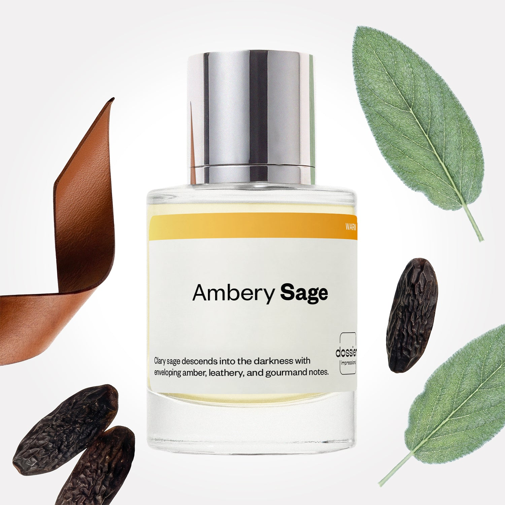

# Ambery Sage

- **Dossier Inspired by Tom Ford's Fucking Fabulous**
- **URL:** https://dossier.co/products/ambery-sage
- **SEO title:** Tom Ford Fucking Fabulous Dupe Perfume: Ambery Sage - Dossier Perfumes

## Pricing (sizes)

| Size/SKU | Member price | List price | Currency |
|---|---|---|---|
| DI50AMSAUS | 44.1 | 49 | USD |

## Content (scent notes, about, editorial)

Back Home / Perfumes / Dossier Impressions / AMBERY SAGE 

Unisex 

Bestseller 

Ambery Sage

Eau de Parfum. Size: 50ml / 1.7oz 

members: $44.10

Guest:
$49

Inspired by Tom Ford's Fucking Fabulous Inspired by Tom Ford's Fucking Fabulous 
Inspired by Tom Ford's Fucking Fabulous 

Retail price 405 Crafted in France 
Scent Family: warm 

Add to Cart 

Scent Notes This perfume is: An escape to the mountains 
Main Notes:

Bitter Almond

Sage

Lavender

Leather

Orris

Vanilla

Tonka Bean

top: The first notes you smell 
Bitter Almond, Sage, Lavender 
middle: The heart of the perfume 
Leathery Notes, Orris, Vanilla 
base: The notes that linger all day 
Amber, Blond Woods, Tonka Bean 
ingredients: Alcohol Denat., Fragrance/Parfum, Water/Aqua/Eau, Tetramethyl Acetyloctahydronaphthalenes, Linalyl Acetate, Limonene, Alpha-Isomethyl Ionone, Coumarin, Linalool, Citrus Limon (Lemon) Peel Oil, Pinene, Acetyl Cedrene, Citrus Aurantium Bergamia (Bergamot) Peel Oil, Pogostemon Cablin Oil, Hexyl Cinnamal, Citrus Aurantium Peel Oil, Citronellol, Terpineol, Dimethyl Phenethyl Acetate, Beta-Caryophyllene, Vanillin, Lavandula Oil/Extract, Cinnamyl Alcohol, Camphor, Benzyl Benzoate, Sclareol, Geranyl Acetate, Benzaldehyde, Citral, Geraniol, Terpinolene, Benzyl Cinnamate, Eugenol, Isoeugenol, Cinnamal, Farnesol, Alpha-Terpinene, Benzyl Alcohol, Anise Alcohol. 

Vegan
Cruelty-free

Clean ingredients

About Ambery Sage (inspired by Tom Ford's Fucking Fabulous) is a deep textural fragrance, opening on a dense sage and bitter almond duet, quickly gaining momentum thanks to a reconstituted but extremely expressive leather accord, ennobled by orris roots. In the background, tonka bean and amber notes still warm this luscious composition. 

Intoxicating, decadent, intense, Ambery Sage (our impression of Tom Ford's Fucking Fabulous) is the perfume of all excesses, without any compromise on the quality of raw materials.

Scent Intensity: Statement 

Concentration: 18%

Gender: Unisex 

Shipping
Free shipping with 2+ items. 

Standard Shipping (with 2+ items) Auto-selected with 2+ items 
FREE 

Standard Shipping Auto-selected under 2 items 
$3.95 

Express shipping: 2 business days Select in checkout 
$19.00 

Returns
Free exchanges for all. Free returns with 

Exchanges
Free exchange, 1 time per order for all.

Returns
D+ members get 1 FREE return per order.
Non-members incur a $3.99/bottle return fee, 1 time per order.
Returns must be postmarked within 30 days of the initial order. Learn More 

FAQs Are these fragrances long lasting? They are designed to be very long lasting, just like designer fragrances, in some cases even longer, depending on the composition. 
When does the new packaging come out? We'll begin rolling out our new packaging across the U.S. and international markets soon! If you want to shop IRL - our new packaging first hits stores on January 11, 2026 at Walmart. Please note that if you are shopping online, you may receive a combination of our current and new packaging while we transition our inventory. 
How will I know what scent I like? We get it, shopping for perfumes online is hard! That's why we created a scent quiz, which will find the perfect scent for you Take the quiz (opens in new tab) 
Unsure about something? Ask us! help@dossier.co 

Best Layered With Combine 2 of our perfumes to create a third scent with layering, curated by our nose. Learn more 

You Might Love 

4.1 

Rated 4.1 out of 5 stars 

Based on 1,040 reviews 

Reviews 1,040 (tab expanded) Questions 1 (tab collapsed) 

Filters 
Write a Review (Opens in a new window) 

1,040 reviews 
Sort Highest Rating Most Helpful Photos & Videos Most Recent Oldest Lowest Rating Least Helpful 

RS 

Rick S. 
Verified Buyer 

6/26/26 

Rated 5 out of 5 stars 

Will continue purchasing 
Love this!

Read More Read more about this review 

Was this helpful? Yes, this review from Rick S. was helpful. 0 people voted yes No, this review from Rick S. was not helpful. 0 people voted no 

DP 

Dossier Perfumes 
6/26/26 
Rick, thanks for sharing! We’re so happy you love it and will stick around 🙌

BQ 

Barry Q. Q. 
Verified Buyer 

5/25/26 

Rated 5 out of 5 stars 

F*n Fabulous 
Stays on the skin for along time, projects well.

Read More Read more about this review 

Was this helpful? Yes, this review from Barry Q. Q. was helpful. 0 people voted yes No, this review from Barry Q. Q. was not helpful. 0 people voted no 

DP 

Dossier Perfumes 
5/25/26 
Barry, love hearing it sticks around and gets those compliments all day! 😊

GP 

GEORGE P. 
Verified Buyer 

5/23/26 

Rated 5 out of 5 stars 

Nice
Very nice smell. Long lasting

Read More Read more about this review 

Was this helpful? Yes, this review from GEORGE P. was helpful. 0 people voted yes No, this review from GEORGE P. was not helpful. 0 people voted no 

DP 

Dossier Perfumes 
5/24/26 
George, we’re thrilled it’s sticking around all day. Thanks for sharing!

EO 

Emma o. O. 
Verified Buyer 

5/22/26 

Rated 5 out of 5 stars 

Looooove
This one is great. I adore it!!!!!

Read More Read more about this review 

Was this helpful? Yes, this review from Emma o. O. was helpful. 0 people voted yes No, this review from Emma o. O. was not helpful. 0 people voted no 

DP 

Dossier Perfumes 
5/22/26 
Thanks Emma! So happy you’re loving this scent 😊 Keep enjoying those spritzes!

J 

Jeff 

5/16/26 

Rated 5 out of 5 stars 

5 Stars
Just what I was looking for! Scent holds almost all day and is just a fantastic addition to the collection.

Read More Read more about this review 

Was this helpful? Yes, this review from Jeff was helpful. 0 people voted yes No, this review from Jeff was not helpful. 0 people voted no 

Loading... 

Loading... 

Show More 

Inspired by  Baccarat Rouge 540 
Inspired by  Black Opium 
Inspired by  Love, Don't Be Shy 
Inspired by  Good Girl 
Inspired by  Libre 
Inspired by  Flowerbomb 
Inspired by  Light Blue 
Inspired by  Not a Perfume 
Inspired by  Aventus 
Inspired by  Bleu de Chanel 
Inspired by  Mon Paris 
Inspired by  Coco Mademoiselle 
Inspired by  Tom Ford for Men 
Inspired by  For Her 
Inspired by  J'Adore Dior 
Inspired by  Alien 
Inspired by  Black Opium Perfume 
Inspired by  Lost Cherry Perfume 

GET UP TO 30% OFF 

Find us at these retailers. 

Be the first to know. 
Submit 

Shop the following countries. United States 

Discover.
AI Scent Finder 
Blog (opens in new tab) 
Scent Family 
Layering 
Scent Quiz 

Help.
Contact Us 
Returns 
FAQ 
Testimonials 
Accessibility 

More.
Store Locator 
Boutique 
Refer A Friend 
Index 

Download our app now.

Find us at these retailers. 

Be the first to know. 
Submit 

Shop the following countries. United States 

Discover.
AI Scent Finder 
Blog (opens in new tab) 
Scent Family 
Layering 
Scent Quiz 

Help.
Contact Us 
Returns 
FAQ 
Testimonials 
Accessibility 

More.

## Main Image

