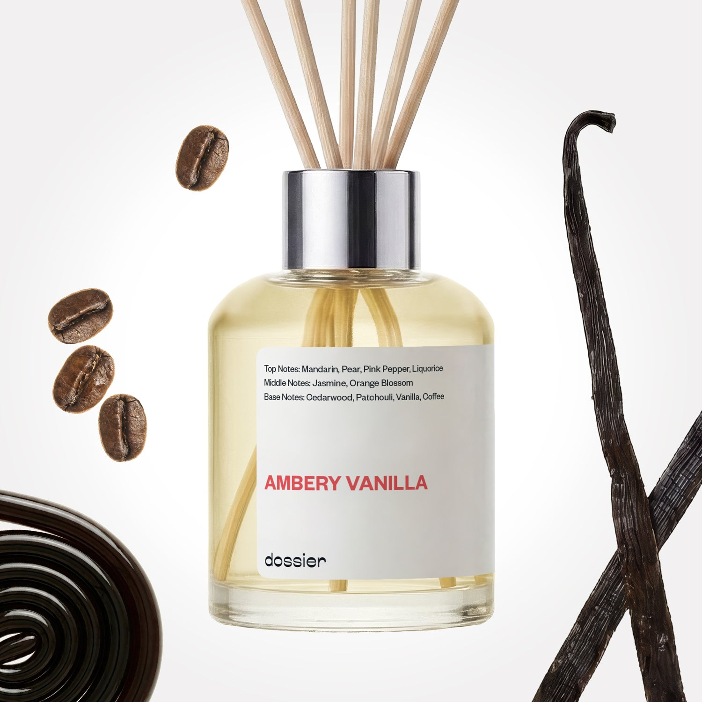

# Ambery Vanilla Room Diffuser

- **Dossier Inspired by YSL's Black Opium Perfume**
- **URL:** https://dossier.co/products/ambery-vanilla-diffuser
- **SEO title:** black opium diffuser Dupe impression - Ambery Vanilla Room Diffuser

## Pricing (sizes)

| Size/SKU | Member price | List price | Currency |
|---|---|---|---|
| 40397936754755 | 34.2 | 38 | USD |

## Content (scent notes, about, editorial)

Back Home / Home Scents / Diffusers / AMBERY VANILLA ROOM DIFFUSER 

Sold out 

Ambery Vanilla Room Diffuser

Size: 100ml / 3.4oz 

members: $34.20

Guest:
$38

Inspired by YSL's Black Opium Perfume Inspired by YSL's Black Opium Perfume 
Inspired by YSL's Black Opium Perfume 

Crafted in France 
Scent Family: warm 

Notify Me 

Scent Notes This perfume is: Rich, sweet, opulent 
Main Notes:

Liquorice

Vanilla

Coffee

top: The first notes you smell 
Mandarin, Pear, Pink Pepper, Liquorice 
middle: The heart of the perfume 
Jasmine, Orange Blossom 
base: The notes that linger all day 
Cedarwood, Patchouli, Vanilla, Coffee 
ingredients: Cedarwood Ess, Lemon Ess, Mandarin Ess, Patchouli Ess, Hedione, Iso E Super, Musk T, Benzyl Salicylate, Cis-3-Hexenyl Salicylate, Ethyl Linalol, Ethyl Vanilline, Florol, Trimofix, Osyrol, Ethyl Maltol, Linalyl Acetate, Cetalox, Linalol, Sandalore, Heliotropine Crystals, Cedramber, Dihydromyrcenol, Jasmonal H, Dimethyl Phenylethyl Carbinol, Hexyl Acetate, Geranyl Acetate, DMBC Acetate 

Vegan
Cruelty-free

Clean ingredients

About This undeniably cheerful scent is pure indulgence with every sniff. Immerse yourself in white flowers wrapped in vanilla, with coffee and a twist of liquorice.

Concentration: 22%

About this diffuser. 
The perfume diffuses in its environment by a natural and gradual evaporation through the wooden sticks.
The oil concentrate is diluted in alcohol, just like your favorite EDP or perfume is.
The formula of each diffuser has been reworked to both comply with the air care standards and to function optimally when used with wooden sticks.
Our diffusers are formulated for safe and stress free sniffing, no additives necessary.

LEARN MORE 

Tips How to Use.
Set up is easy: Place the reeds into the fragrance, sit back and relax as the smell of luxury fills the room.
Keep it fresh: Turn the reeds over from time to time. Doing this every 2-3 days will improve the diffusion of fragrance in the room.
24/7 luxury: For every 100ml diffuser, the fragrance will last at least one month when used continuously.
Hit pause: Reeds can be removed to "take a break" from the scent, and put back in the fragrance whenever you want. Save it for a special occasion or keep the good smells flowing 24/7, it’s up to you!

Shipping + Returns
Free exchanges for all. Free returns with 

Standard Shipping (with 2+ items) Auto-selected with 2+ items 
FREE 

Standard Shipping Auto-selected under 2 items 
$3.95 

Express shipping: 2 business days Select in checkout 
$19.00 

Returns for Diffusers
We cannot accept any returns for diffusers that had been used. In order to return a diffuser, proceed to our regular returns portal, and upload and image of your unused diffuser. If your diffuser has been used, your return request will be denied. 

FAQs Are these fragrances long lasting? They are designed to be very long lasting, just like designer fragrances, in some cases even longer, depending on the composition. 
When does the new packaging come out? We'll begin rolling out our new packaging across the U.S. and international markets soon! If you want to shop IRL - our new packaging first hits stores on January 11, 2026 at Walmart. Please note that if you are shopping online, you may receive a combination of our current and new packaging while we transition our inventory. 
How will I know what scent I like? We get it, shopping for perfumes online is hard! That's why we created a scent quiz, which will find the perfect scent for you Take the quiz (opens in new tab) 
Unsure about something? Ask us! help@dossier.co 

Details For The Woman Who Has the World at Her Feet

According to our history books, the original Opium was born in 1977, fueled by Yves Saint Laurent’s fascination with the Orient. But what they also tell us is that the fragrance was an astonishing success. It flew off shelves everywhere. Sales figures were beyond astronomical, reaching stratospheric heights never seen before. It’s safe to say that this was, at its time, the most popular perfume in the world. 

And now, it’s back. And completely reimagined for the modern woman. This newer, modern reimagining comes in the form of Yves Saint Laurent’s Black Opium, which was released in the fall of 2014. The fragrance was developed by Nathalie Lorson, Marie Salamagne, Honorine Blanc, and Olivier Cresp. And sure, it isn’t a new formula by any means — the creators simply gave it a contemporary twist. Nonetheless, the result is still an equally (if not more) intoxicating scent, one that rivals the original in every sense.

Black Opium is a warm gourmand perfume whose beauty is as seductive as its name suggests. The fragrance is supported by an enigmatic advertising campaign, calling empowered women everywhere to step forward. It speaks directly to the strong woman of today, inspiring her to live a life that’s vibrant and brimming with confidence. And it’s a call many are answering, too — if its commercial success is anything to go by. 

YSL’s intoxicating Black Opium Eau de Parfum begins with a burst of orange blossom right upfront. Immediately afterward, you get slight notes of adrenaline-rich coffee beans, followed by a hint of refreshing pear. Near the middle, the fragrance reclines into the softness of white flowers, giving the fragrance a firm calmness that befits the young, elegant woman that wears it. Nearing its base, Black Opium dries into a warm, coffee-tinged gourmand scent with a sticky musk that wraps around creamy vanilla bits. It’s yummy and oh-so addictive.

YSL’s Black Opium is a sweet, dark fragrance with a somewhat bitter edge. It’s not a subtle experience by any means, with a scent that constantly projects a sense of raw power and control. In other words, this isn’t a scent meant to be worn passively.

In its original form, YSL Black Opium comes as an Eau de Parfum. The original EDP is also available as a gift set. For a more potent brew, you might want to look at the YSL Black Opium Eau de Parfum Intense. If that isn’t enough for you, perhaps you’d be pleased to know that a certain Black Opium EDP Extreme exists. This is a darker version of the original with fewer sweet undertones.

Black Opium is a real rush to the senses. Infused with white flowers, smooth vanilla, and invigorating coffee, it’s everything we’d dared hope for in the modern woman’s perfume. We can’t get enough of it; so much so that its undertones became the inspiration behind Ambery Vanilla, our own YSL Black Opium dupe. Sensuous and yummy, our replica is the perfect scent for the woman who has the world at her feet. 

You Might Love 

4.5 

Rated 4.5 out of 5 stars 

Based on 69 reviews 

Reviews 69 (tab expanded) Questions (tab collapsed) 

Filters 
Write a Review (Opens in a new window) 

69 reviews 
Sort Highest Rating Most Helpful Photos & Videos Most Recent Oldest Lowest Rating Least Helpful 

M 

Maria 
Verified Buyer 

12/23/25 

Rated 5 out of 5 stars 

5 Stars
LOVE THE SMELL

Read More Read more about this review 

Was this helpful? Yes, this review from Maria was helpful. 0 people voted yes No, this review from Maria was not helpful. 0 people voted no 

DP 

Dossier Perfumes 
12/23/25 
Love that you’re loving the smell, Maria! Thanks for sharing the joy 😊

M 

Maria 

12/23/25 

Rated 5 out of 5 stars 

5 Stars
LOVE THE SMELL

Read More Read more about this review 

Was this helpful? Yes, this review from Maria was helpful. 0 people voted yes No, this review from Maria was not helpful. 0 people voted no 

GN 

Gerardo N. 

Verified Buyer 

12/19/25 

Rated 5 out of 5 stars 

Elegant
Elegant and beautiful. Takes its time

Read More Read more about this review 

Was this helpful? Yes, this review from Gerardo N. was helpful. 0 people voted yes No, this review from Gerardo N. was not helpful. 0 people voted no 

DP 

Dossier Perfumes 
12/19/25 
Thanks for sharing, Gerardo! So glad it feels elegant and lasts beautifully.

NC 

naneka c. 

Verified Buyer 

12/16/25 

Rated 5 out of 5 stars 

Fantastic
The scent is an elevated vanilla that lingers perfectly. It’s been a few days, and the scent is still going strong.

Read More Read more about this review 

Was this helpful? Yes, this review from naneka c. was helpful. 0 people voted yes No, this review from naneka c. was not helpful. 0 people voted no 

DP 

Dossier Perfumes 
12/16/25 
Naneka, woo! So happy that it’s still filling your space days later. There’s nothing like that lingering glow 😊

A 

Angie 

12/12/25 

Rated 5 out of 5 stars 

5 Stars
Beautiful, this is a present for a friend. I think she’ll love it.

Read More Read more about this review 

Was this helpful? Yes, this review from Angie was helpful. 0 people voted yes No, this review from Angie was not helpful. 0 people voted no 

Loading... 

Loading... 

Show More 

Inspired by  Baccarat Rouge 540 
Inspired by  Black Opium 
Inspired by  Love, Don't Be Shy 
Inspired by  Good Girl 
Inspired by  Libre 
Inspired by  Flowerbomb 
Inspired by  Light Blue 
Inspired by  Not a Perfume 
Inspired by  Aventus 
Inspired by  Bleu de Chanel 
Inspired by  Mon Paris 
Inspired by  Coco Mademoiselle 
Inspired by  Tom Ford for Men 
Inspired by  For Her 
Inspired by  J'Adore Dior 
Inspired by  Alien 
Inspired by  Black Opium Perfume 
Inspired by  Lost Cherry Perfume 

GET UP TO 30% OFF 

Find us at these retailers. 

Be the first to know. 
Submit 

Shop the following countries. United States 

Discover.
AI Scent Finder 
Blog (opens in new tab) 
Scent Family 
Layering 
Scent Quiz 

Help.
Contact Us 
Returns 
FAQ 
Testimonials 
Accessibility 

More.
Store Locator 
Boutique 
Refer A Friend 
Index 

Download our app now.

Find us at these retailers. 

Be the first to know. 
Submit 

Shop the following countries. United States 

Discover.
AI Scent Finder 
Blog (opens in new tab) 
Scent Family 
Layering 
Scent Quiz 

Help.
Contact Us 
Returns 
FAQ 
Testimonials 
Accessibility 

More.

## Main Image

