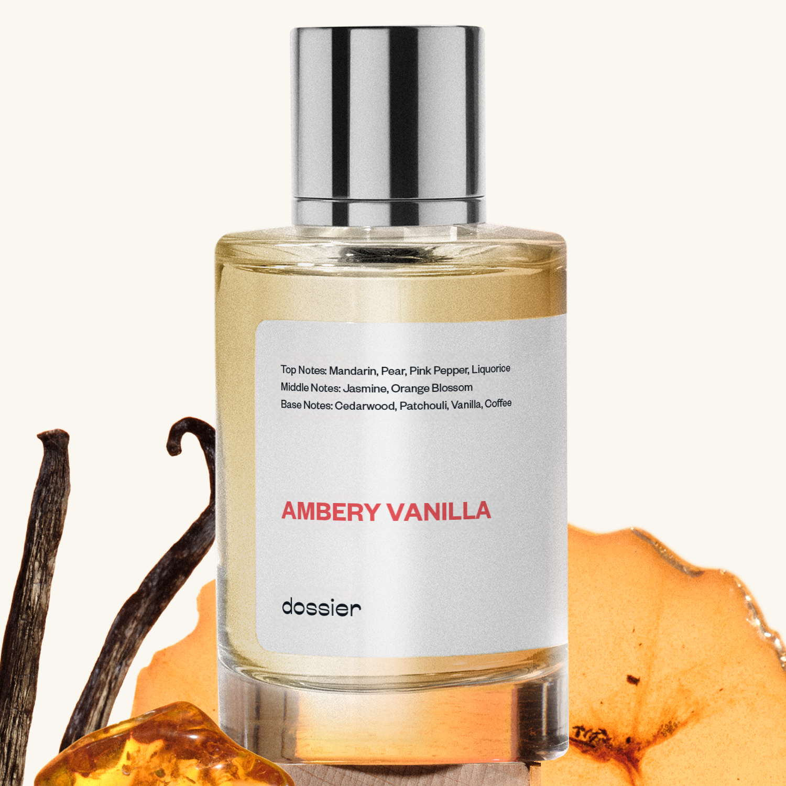

# Ambery Vanilla

- **Dossier Inspired by YSL's Black Opium**
- **URL:** https://dossier.co/products/ambery-vanilla
- **SEO title:** YSL Black Opium Dupe Perfume: Ambery Vanilla - Dossier Perfumes

## Pricing (sizes)

| Size/SKU | Member price | List price | Currency |
|---|---|---|---|
| Fragrance+50ml/1.7oz | 26.1 | 29 | USD |
| 100ml | 44.1 | 49 | USD |
| 200ml | 88.2 | 98 | USD |
| 2x50ml | 52.2 | 58 | USD |
| 3x50ml | 78.3 | 87 | USD |

## Content (scent notes, about, editorial)

Back Home / Perfumes / Dossier Impressions / AMBERY VANILLA 

Women 

Bestseller 

Ambery Vanilla

Eau de Parfum. Size: 100ml / 3.4oz 

members: $44.10

Guest:
$49

Inspired by YSL's Black Opium Inspired by YSL's Black Opium 
Inspired by YSL's Black Opium 

Retail price 165 Size
50ml $29

Best Value
100ml $49

Crafted in France 
Scent Family: warm 

Add to Cart 

Scent Notes This perfume is: The ultimate confidence boost 
Main Notes:

Liquorice

Vanilla

Coffee

top: The first notes you smell 
Mandarin, Pear, Pink Pepper, Liquorice 
middle: The heart of the perfume 
Jasmine, Orange Blossom 
base: The notes that linger all day 
Cedarwood, Patchouli, Vanilla, Coffee 
ingredients: Alcohol Denat., Fragrance/Parfum, Water/Aqua/Eau, Tetramethyl Acetyloctahydronaphthalenes, Benzyl Salicylate, Hexamethylindanopyran, Vanillin, Hydroxycitronellal, Linalyl Acetate, Linalool, Hexyl Cinnamal, Limonene, Dimethyl Phenethyl Acetate, Geranyl Acetate, Juniperus Virginiana Oil, Geraniol, Citrus Limon (Lemon) Peel Oil, Pogostemon Cablin Oil, Citronellol, Cinnamyl Alcohol, Citrus Aurantium Peel Oil, Rose Ketones, Amyl Cinnamal, Pinene, Benzyl Alcohol, Hexadecanol Acetone, Beta-Caryophyllene, Citral, Coumarin, Benzyl Benzoate. 

Vegan
Cruelty-free

Clean ingredients

About Ambery Vanilla (inspired by YSL's Black Opium) opens with a hint of pear mixed with a hidden note of licorice. Next, it evolves into highly qualitative notes of orange blossom and jasmine flowers, warmed up with deep vanilla and black coffee.

Sensuous and yummy, Ambery Vanilla (our impression of YSL's Black Opium) is a multi-faceted fragrance that starts off bright and gourmand, evolving into an intoxicating floralcy with warmth.

Scent Intensity: Statement 

Concentration: 15%

Gender: Feminine 

Shipping
Free shipping with 2+ items. 

Standard Shipping (with 2+ items) Auto-selected with 2+ items 
FREE 

Standard Shipping Auto-selected under 2 items 
$3.95 

Express shipping: 2 business days Select in checkout 
$19.00 

Returns
Free exchanges for all. Free returns with 

Exchanges
Free exchange, 1 time per order for all.

Returns
D+ members get 1 FREE return per order.
Non-members incur a $3.99/bottle return fee, 1 time per order.
Returns must be postmarked within 30 days of the initial order. Learn More 

FAQs Are these fragrances long lasting? They are designed to be very long lasting, just like designer fragrances, in some cases even longer, depending on the composition. 
When does the new packaging come out? We'll begin rolling out our new packaging across the U.S. and international markets soon! If you want to shop IRL - our new packaging first hits stores on January 11, 2026 at Walmart. Please note that if you are shopping online, you may receive a combination of our current and new packaging while we transition our inventory. 
How will I know what scent I like? We get it, shopping for perfumes online is hard! That's why we created a scent quiz, which will find the perfect scent for you Take the quiz (opens in new tab) 
Unsure about something? Ask us! help@dossier.co 

Details We are not associated or affiliated with the brands mentioned here in any way.
Ambery Vanilla

For The Woman Who Has the World at Her Feet

According to our history books, the original Opium was born in 1977, fueled by Yves Saint Laurent’s fascination with the Orient. But what they also tell us is that the fragrance was an astonishing success. It flew off shelves everywhere. Sales figures were beyond astronomical, reaching stratospheric heights never seen before. It’s safe to say that this was, at its time, the most popular perfume in the world. 

And now, it’s back. And completely reimagined for the modern woman. This newer, modern reimagining comes in the form of the fragrance that Dossier’s Ambery Vanilla was inspired by: Yves Saint Laurent’s Black Opium, which was released in the fall of 2014. The fragrance was developed by Nathalie Lorson, Marie Salamagne, Honorine Blanc, and Olivier Cresp. And sure, it isn’t a new formula by any means — the creators simply gave it a contemporary twist. Nonetheless, the result is still an equally (if not more) intoxicating scent, one that rivals the original in every sense.

The fragrance that Ambery Vanilla was inspired by is a warm gourmand perfume whose beauty is as seductive as its name suggests. The fragrance is supported by an enigmatic advertising campaign, calling empowered women everywhere to step forward. It speaks directly to the strong woman of today, inspiring her to live a life that’s vibrant and brimming with confidence. And it’s a call many are answering, too — if its commercial success is anything to go by. 

YSL’s Black Opium Eau de Parfum begins with a burst of orange blossom right upfront. Immediately afterward, you get slight notes of adrenaline-rich coffee beans, followed by a hint of refreshing pear. Near the middle, the fragrance reclines into the softness of white flowers, giving the fragrance a firm calmness that befits the young, elegant woman that wears it. Nearing its base, YSL’s Black Opium dries into a warm, coffee-tinged gourmand scent with a sticky musk that wraps around creamy vanilla bits. It’s yummy and oh-so addictive.

The luxury fragrance that Ambery Vanilla was inspired by is a sweet, dark fragrance with a somewhat bitter edge. It’s not a subtle experience by any means, with a scent that constantly projects a sense of raw power and control. In other words, this isn’t a scent meant to be worn passively.

In its original form, the luxury scent that Ambery Vanilla was inspired by comes as an Eau de Parfum. The original EDP is also available as a gift set. For a more potent brew, you might want to look at the Eau de Parfum Intense. If that isn’t enough for you, perhaps you’d be pleased to know that a certain EDP Extreme exists. This is a darker version of the original with fewer sweet undertones.

The luxury fragrance that Ambery Vanilla is inspired by is a real rush to the senses. Infused with white flowers, smooth vanilla, and invigorating coffee, it’s everything we’d dared hope for in the modern woman’s perfume. We can’t get enough of it; so much so that its undertones became the inspiration behind Ambery Vanilla, our own dupe. Sensuous and yummy, our replica is the perfect scent for the woman who has the world at her feet. 

Best Layered With Combine 2 of our perfumes to create a third scent with layering, curated by our nose. Learn more 

You Might Love 

4.6 

Rated 4.6 out of 5 stars 

Based on 8,550 reviews 

Reviews 8,550 (tab expanded) Questions 3 (tab collapsed) 

Filters 
Write a Review (Opens in a new window) 

8,550 reviews 
Sort Highest Rating Most Helpful Photos & Videos Most Recent Oldest Lowest Rating Least Helpful 

G 

Guillermina 

6/22/26 

Rated 5 out of 5 stars 

5 Stars
Love it.

Read More Read more about this review 

Was this helpful? Yes, this review from Guillermina was helpful. 0 people voted yes No, this review from Guillermina was not helpful. 0 people voted no 

PG 

Patricia G. 
Verified Buyer 

6/21/26 

Rated 5 out of 5 stars 

I recommend it smells delicious
It smells very rich, I loved it and I get along very quickly 

Read More Read more about this review 
Translated from Spanish Show original 

Was this helpful? Yes, this review from Patricia G. was helpful. 0 people voted yes No, this review from Patricia G. was not helpful. 0 people voted no 

DP 

Dossier Perfumes 
6/21/26 
¡Patricia, mil gracias por compartir! Nos alegra que lo disfrutes y llegó rápido 😊

D 

Delene 

6/19/26 

Rated 5 out of 5 stars 

5 Stars
I love the vanilla fragrance. The price is excellent!

Read More Read more about this review 

Was this helpful? Yes, this review from Delene was helpful. 0 people voted yes No, this review from Delene was not helpful. 0 people voted no 

M 

Mary 

6/18/26 

Rated 5 out of 5 stars 

5 Stars
I love all their products

Read More Read more about this review 

Was this helpful? Yes, this review from Mary was helpful. 0 people voted yes No, this review from Mary was not helpful. 0 people voted no 

GC 

Graciela C. 
Verified Buyer 

6/17/26 

Rated 5 out of 5 stars 

My favorite 
I loved smelling so good is my favorite cologne!

Read More Read more about this review 

Was this helpful? Yes, this review from Graciela C. was helpful. 0 people voted yes No, this review from Graciela C. was not helpful. 0 people voted no 

DP 

Dossier Perfumes 
6/17/26 
Graciela, so thrilled you’re loving Ambery Vanilla as your go-to cologne ✨ thanks!

Loading... 

Loading... 

Show More 

Inspired by  Baccarat Rouge 540 
Inspired by  Black Opium 
Inspired by  Love, Don't Be Shy 
Inspired by  Good Girl 
Inspired by  Libre 
Inspired by  Flowerbomb 
Inspired by  Light Blue 
Inspired by  Not a Perfume 
Inspired by  Aventus 
Inspired by  Bleu de Chanel 
Inspired by  Mon Paris 
Inspired by  Coco Mademoiselle 
Inspired by  Tom Ford for Men 
Inspired by  For Her 
Inspired by  J'Adore Dior 
Inspired by  Alien 
Inspired by  Black Opium Perfume 
Inspired by  Lost Cherry Perfume 

GET UP TO 30% OFF 

Find us at these retailers. 

Be the first to know. 
Submit 

Shop the following countries. United States 

Discover.
AI Scent Finder 
Blog (opens in new tab) 
Scent Family 
Layering 
Scent Quiz 

Help.
Contact Us 
Returns 
FAQ 
Testimonials 
Accessibility 

More.
Store Locator 
Boutique 
Refer A Friend 
Index 

Download our app now.

Find us at these retailers. 

Be the first to know. 
Submit 

Shop the following countries. United States 

Discover.
AI Scent Finder 
Blog (opens in new tab) 
Scent Family 
Layering 
Scent Quiz 

Help.
Contact Us 
Returns 
FAQ 
Testimonials 
Accessibility 

More.

## Main Image

