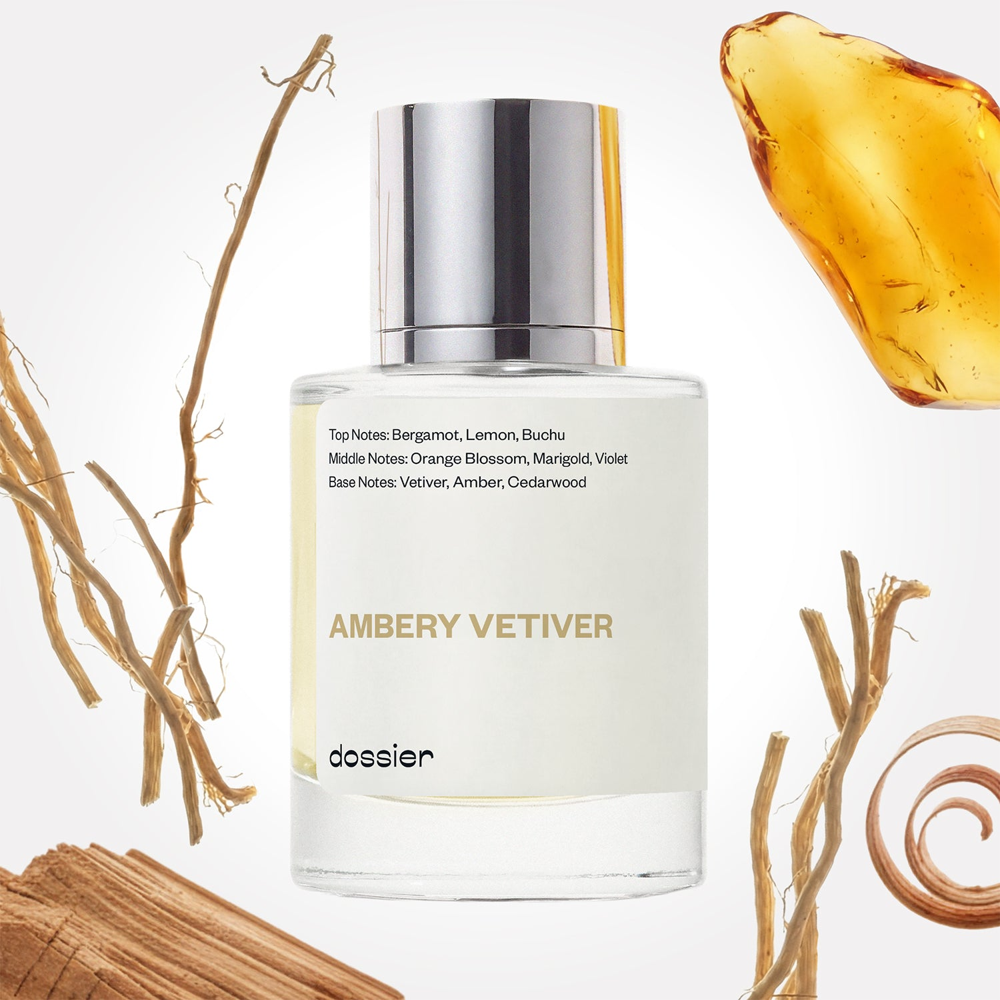

# Ambery Vetiver

- **Dossier Inspired by Byredo's Bal d'Afrique**
- **URL:** https://dossier.co/products/ambery-vetiver
- **SEO title:** Byredo's Bal d'Afrique Dupe Perfume : Ambery Vetiver - Dossier Perfumes

## Pricing (sizes)

| Size/SKU | Member price | List price | Currency |
|---|---|---|---|
| 39733368619075 | 44.1 | 49 | USD |

## Content (scent notes, about, editorial)

Back Home / Perfumes / Dossier Impressions / AMBERY VETIVER 

Unisex 

Sold out 

Ambery Vetiver

Eau de Parfum. Size: 50ml / 1.7oz 

members: $44.10

Guest:
$49

Inspired by Byredo's Bal d'Afrique Inspired by Byredo's Bal d'Afrique 
Inspired by Byredo's Bal d'Afrique 

Retail price 230 Crafted in France 
Scent Family: earthy 

Notify Me 

Scent Notes This perfume is: Natural, understated wealth 
Main Notes:

Marigold

Vetiver

Amber

Cedarwood

top: The first notes you smell 
Bergamot, Lemon, Bucchu 
middle: The heart of the perfume 
Orange Blossom, Marigold, Violet 
base: The notes that linger all day 
Vetiver, Amber, Cedarwood 
ingredients: Alcohol Denat., Fragrance/Parfum, Water/Aqua/Eau, Tetramethyl Acetyloctahydronaphthalenes, Juniperus Virginiana Oil, Hexamethylindanopyran, Limonene, Alpha-Isomethyl Ionone, Citrus Limon (Lemon) Peel Oil, Acetyl Cedrene, Citrus Aurantium Peel Oil, Linalyl Acetate, Beta-Caryophyllene, Pinene, Linalool, Coumarin, Citral, Rose Ketones, Geranyl Acetate, Terpinolene, Vanillin, Citronellol, Alpha-Terpinene, Terpineol, Benzyl Benzoate. 

Vegan
Cruelty-free

Clean ingredients

About Ambery Vetiver (inspired by Byredo's Bal d'Afrique) opens with a hint of fresh citrus relayed by more intense and rare raw materials, such as Buchu (a shrub native to South Africa whose leaves have a very pleasant smell approaching that of blackcurrant buds), or Tagete (a flower with fruity aromas of apple and passion fruit). However, the signature of the fragrance quickly arrives with the warmth of amber blended with the sophistication of vetiver. 

Deep and mysterious, Ambery Vetiver (our impression of Byredo's Bal d'Afrique) features unique raw materials to offer an olfactive journey full of imagination.

Scent Intensity: Statement 

Concentration: 18%

Gender: Unisex 

Shipping
Free shipping with 2+ items. 

Standard Shipping (with 2+ items) Auto-selected with 2+ items 
FREE 

Standard Shipping Auto-selected under 2 items 
$3.95 

Express shipping: 2 business days Select in checkout 
$19.00 

Returns
Free exchanges for all. Free returns with 

Exchanges
Free exchange, 1 time per order for all.

Returns
D+ members get 1 FREE return per order.
Non-members incur a $3.99/bottle return fee, 1 time per order.
Returns must be postmarked within 30 days of the initial order. Learn More 

FAQs Are these fragrances long lasting? They are designed to be very long lasting, just like designer fragrances, in some cases even longer, depending on the composition. 
When does the new packaging come out? We'll begin rolling out our new packaging across the U.S. and international markets soon! If you want to shop IRL - our new packaging first hits stores on January 11, 2026 at Walmart. Please note that if you are shopping online, you may receive a combination of our current and new packaging while we transition our inventory. 
How will I know what scent I like? We get it, shopping for perfumes online is hard! That's why we created a scent quiz, which will find the perfect scent for you Take the quiz (opens in new tab) 
Unsure about something? Ask us! help@dossier.co 

Best Layered With Combine 2 of our perfumes to create a third scent with layering, curated by our nose. Learn more 

You Might Love 

4.2 

Rated 4.2 out of 5 stars 

Based on 741 reviews 

Reviews 741 (tab expanded) Questions (tab collapsed) 

Filters 
Write a Review (Opens in a new window) 

741 reviews 
Sort Highest Rating Most Helpful Photos & Videos Most Recent Oldest Lowest Rating Least Helpful 

J 

Jordan 
Verified Buyer 

5/29/26 

Rated 5 out of 5 stars 

A Warm Hug on A Hard Day
This perfume is Signature Fragrance material, for sure. 
There's this moment where you're overstimulated, overwhelmed, and having a horrible, terrible, no-good, very bad day...and then someone gives you a hug. And you're just enveloped in the certainty and warmth and calm and reassurance that everything--no matter how big the problem was moments ago--everything is going to be A-Okay. 
This fragrance gives that "magic hug" energy. It's a hot cup of tea on a rainy day (that's probably the bergamot). It's the gentle, soft hint of the orange blossom and the clean calm of citrus. 
I feel like this scent is deceptively unintrusive. It's not loud or colorful or stark--It's subtle, lives on the skin, and it says, "you look like you need a cuddle". It's an introvert in cozy PJs, snuggling under a fluffy blanket with a good book on a Friday night. 
It's a sigh of relief with an amber base, and the calm, woody scent of a crackling fire, and the innate knowledge that nothing is going to ruin your peace right now. 

Read More Read more about this review 

Was this helpful? Yes, this review from Jordan was helpful. 0 people voted yes No, this review from Jordan was not helpful. 0 people voted no 

DP 

Dossier Perfumes 
5/29/26 
Jordan! We love hearing how this one wraps you in a cozy hug and brings peaceful moments. Glad it’s your rainy-day companion. Can’t wait to hear what you try next!

A 

AS 
Verified Buyer 

4/2/26 

Rated 5 out of 5 stars 

Nicely Amber-y
Ok, so I wasn't sure I was going to like this as I've seen the original described as a soapy, clean scent and citrus, neither or which appeal to me. But there was something also compelling about the list of ingredients, so I took a chance. I'm normally an earthy/woodsy (but not too green) scent person. Yes, this has some citrus at first, and an initial hint of clean, but it's really well rounded and the main scent I smell is amber, which I LOVE. Also the other lighter scents lift the amber in this one so it feels like a scent I can wear in summer, not just cold weather like a lot of amber perfumes. This was a very pleasant surprise!

Read More Read more about this review 

Was this helpful? Yes, this review from AS was helpful. 0 people voted yes No, this review from AS was not helpful. 0 people voted no 

DP 

Dossier Perfumes 
4/2/26 
That’s awesome to hear! Amber playing the lead role sounds like a win, especially with those brighter notes making it summer-friendly. Enjoy wearing it all season and beyond.

DD 

Desiree D. 
Verified Buyer 

3/23/26 

Rated 5 out of 5 stars 

SMELLS GREAT!
Super happy with my purchase, first off delivery was quick! Second, packaging was peefect and third the scent smells soooooooo good. This will definitely be my spring/summer perfume! You guys never disappoint, I have loved all my purchases! Next one for my is Musky Violet!! 

Read More Read more about this review 

Was this helpful? Yes, this review from Desiree D. was helpful. 0 people voted yes No, this review from Desiree D. was not helpful. 2 people voted no 

DP 

Dossier Perfumes 
3/23/26 
Thanks so much, Desiree! We’re glad delivery was quick and packaging spot-on, and that your new scent feels perfect for spring and summer. Musky Violet next? Yum!

KD 

Kath D. 
Verified Buyer 

3/8/26 

Rated 5 out of 5 stars 

Lasting smell
Smells almost exactly like the fragrance it’s inspired by, but at a fraction of the price

Read More Read more about this review 

Was this helpful? Yes, this review from Kath D. was helpful. 0 people voted yes No, this review from Kath D. was not helpful. 0 people voted no 

DP 

Dossier Perfumes 
3/8/26 
Hey Kath, thrilled that each spritz lasts and feels luxurious without the hefty price tag, cheers to that!

TM 

Tanika M. 
Verified Buyer 

3/4/26 

Rated 5 out of 5 stars 

MmmmGood!!!
This one smells good just like the original I will order again

Read More Read more about this review 

Was this helpful? Yes, this review from Tanika M. was helpful. 0 people voted yes No, this review from Tanika M. was not helpful. 0 people voted no 

DP 

Dossier Perfumes 
3/17/26 
Yes, Tanika! So happy Ambery Vetiver hits just right for you. Can't wait to have you back for your next order!

Loading... 

Loading... 

Show More 

Inspired by  Baccarat Rouge 540 
Inspired by  Black Opium 
Inspired by  Love, Don't Be Shy 
Inspired by  Good Girl 
Inspired by  Libre 
Inspired by  Flowerbomb 
Inspired by  Light Blue 
Inspired by  Not a Perfume 
Inspired by  Aventus 
Inspired by  Bleu de Chanel 
Inspired by  Mon Paris 
Inspired by  Coco Mademoiselle 
Inspired by  Tom Ford for Men 
Inspired by  For Her 
Inspired by  J'Adore Dior 
Inspired by  Alien 
Inspired by  Black Opium Perfume 
Inspired by  Lost Cherry Perfume 

GET UP TO 30% OFF 

Find us at these retailers. 

Be the first to know. 
Submit 

Shop the following countries. United States 

Discover.
AI Scent Finder 
Blog (opens in new tab) 
Scent Family 
Layering 
Scent Quiz 

Help.
Contact Us 
Returns 
FAQ 
Testimonials 
Accessibility 

More.
Store Locator 
Boutique 
Refer A Friend 
Index 

Download our app now.

Find us at these retailers. 

Be the first to know. 
Submit 

Shop the following countries. United States 

Discover.
AI Scent Finder 
Blog (opens in new tab) 
Scent Family 
Layering 
Scent Quiz 

Help.
Contact Us 
Returns 
FAQ 
Testimonials 
Accessibility 

More.

## Main Image

