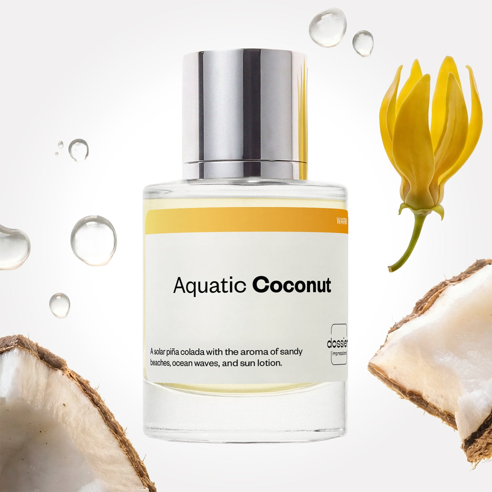

# Aquatic Coconut

- **Dossier Inspired by Maison Margiela's Replica Beach Walk**
- **URL:** https://dossier.co/products/aquatic-coconut
- **SEO title:** Maison Margiela's Replica Beach Walk Dupe Perfume: Aquatic Coconut - Dossier Perfumes

## Pricing (sizes)

| Size/SKU | Member price | List price | Currency |
|---|---|---|---|
| DI50ACOUS | 28.8 | 32 | USD |
| 39443205128259-boutique | 0 | 0 | USD |

## Content (scent notes, about, editorial)

Back Home / Perfumes / Dossier Impressions / AQUATIC COCONUT 

Unisex 

Bestseller 

Aquatic Coconut

Eau de Toilette. Size: 50ml / 1.7oz 

members: $28.80

Guest:
$32

Inspired by Maison Margiela's Replica Beach Walk Inspired by Maison Margiela's Replica Beach Walk 
Inspired by Maison Margiela's Replica Beach Walk 

Retail price 165 Crafted in France 
Scent Family: warm 

Add to Cart 

Scent Notes This perfume is: A solar piña colada 
Main Notes:

Aquatic Accord

Ylang Ylang

Coconut

Musks

top: The first notes you smell 
Bergamot, Pink Pepper, Lemon, Aquatic Accord 
middle: The heart of the perfume 
Ylang Ylang, Heliotrope Flower, Coconut 
base: The notes that linger all day 
Musks, Cedarwood, Benzoin, Tonka bean 
ingredients: Alcohol Denat., Fragrance/Parfum, Water/Aqua/Eau, Benzyl Salicylate, Amyl Cinnamal, Limonene, Hexyl Cinnamal, Citronellol, Linalool, Geraniol, Coumarin, Farnesol, Benzyl Alcohol, Citral, Benzyl Benzoate, Hydroxycitronellal, Amylcinnamyl Alcohol, Cinnamyl Alcohol, Isoeugenol. 

Vegan
Cruelty-free

Clean ingredients

About Aquatic Coconut (inspired by Maison Margiela's Replica Beach Walk) combines a salty watery accord with the sparkle of citrus and pink pepper. This effervescent marine wave continues with solar and warm notes of coconut, heliotrope flower, tonka bean and musks.

Highly evocative, solar and fresh at the same time, Aquatic Coconut (our impression of Maison Margiela's Replica Beach Walk) takes you back to the olfactory memories of a summer day on the beach, with the caress of a warm sea breeze, a subtle smell of sunscreen, and the sensual feeling of sand on the skin.

Scent Intensity: Statement 

Concentration: 18%

Gender: Unisex 

Shipping
Free shipping with 2+ items. 

Standard Shipping (with 2+ items) Auto-selected with 2+ items 
FREE 

Standard Shipping Auto-selected under 2 items 
$3.95 

Express shipping: 2 business days Select in checkout 
$19.00 

Returns
Free exchanges for all. Free returns with 

Exchanges
Free exchange, 1 time per order for all.

Returns
D+ members get 1 FREE return per order.
Non-members incur a $3.99/bottle return fee, 1 time per order.
Returns must be postmarked within 30 days of the initial order. Learn More 

FAQs Are these fragrances long lasting? They are designed to be very long lasting, just like designer fragrances, in some cases even longer, depending on the composition. 
When does the new packaging come out? We'll begin rolling out our new packaging across the U.S. and international markets soon! If you want to shop IRL - our new packaging first hits stores on January 11, 2026 at Walmart. Please note that if you are shopping online, you may receive a combination of our current and new packaging while we transition our inventory. 
How will I know what scent I like? We get it, shopping for perfumes online is hard! That's why we created a scent quiz, which will find the perfect scent for you Take the quiz (opens in new tab) 
Unsure about something? Ask us! help@dossier.co 

Details We are not associated or affiliated with the brands mentioned here in any way.
Aquatic Coconut

The Essence of Endless Summer Days

Concocted to whisk you away on a walk along your favorite beach – Maison Margiela’s Beach Walk (the fragrance that Dossier’s Aquatic Coconut is inspired by) from the Replica collection paints a carefree olfactory image of warm sand between your toes and salty ocean breeze caressing the cheeks, with a spritz of sunscreen on a lovely summer’s evening. Light, fresh, and sunny, it is our go-to scent for a touch of cheerfulness.

Created by perfumers Cavallier and Salamagne, the luxury fragrance that Aquatic Coconut is inspired by is a pleasant blend of citrusy freshness and sweet summer air – preserving our dearest memories of mid-year goodness in a vial. It opens with notes of lemon and bergamot, showering the air with rejuvenating bursts of sunlight. You will also notice a mild spiciness from the pink pepper, adding a spark of excitement to the sunny equation. The middle notes are the result of uniquely merging coconut milk, ylang-ylang, and heliotropes – reminding you fondly of a memorable stroll along the beach with a loved one. As the fragrance dries, its base notes of musk and cedar unwrap themselves, rounding off the summer sweetness with a delicate trace of sensuality and elegance.

A symbol of summertime loveliness, the luxury fragrance that Aquatic Coconut is inspired by is perfect if you’re looking for a light and natural fragrance that is not too overwhelming. Loved for its delicious freshness and warm sweet scent infused with just the right amount of floral airiness, the luxury fragrance that Aquatic Coconut is inspired by is a highly popular choice for daily wear among ladies during the spring and summer. However, its musky charm has also found itself a fanbase of males looking to soften their masculine edge.

Overall, it is light-hearted yet sophisticated, making it a wonderful unisex fragrance for users seeking a touch of sunlight and sea breeze.

Replica Beach Walk comes in the Eau de Toilette (EDT). Designed with users’ convenience in mind, it is also available in travel-size sprays and rollerballs. Despite its reputation of being a delicate scent, two sprays of the fragrance can generally last for several hours. However, we advise against three or more puffs at the same spot because the perfume will not dry sufficiently, becoming a tad harsh when deprived of its base notes.

If you would love to own a bottle of Replica Beach Walk, yet are wondering about less costly alternatives – you’ve come to the right place! Here at Dossier.co, we offer you Aquatic Coconut, a fragrance comparable to Replica Beach Walk in every dimension of scent, for less than half the price. Aquatic Coconut exults this holidays-on-a-beach vibe, reminiscent of the summery tones of the original fragrance. Skillfully titrated, it emanates an inviting waft of tropical saltiness and subtle sunscreen, coupled with a fresh coconut scent. Like the soft touch of an ocean breeze, the fragrance smells sweet, yet not overpowering – the perfect finishing touch of an airy summer outfit.

Best Layered With Combine 2 of our perfumes to create a third scent with layering, curated by our nose. Learn more 

You Might Love 

4.2 

Rated 4.2 out of 5 stars 

Based on 1,332 reviews 

Reviews 1,332 (tab expanded) Questions 1 (tab collapsed) 

Filters 
Write a Review (Opens in a new window) 

1,332 reviews 
Sort Highest Rating Most Helpful Photos & Videos Most Recent Oldest Lowest Rating Least Helpful 

DA 

Diane A. 
Verified Buyer 

6/22/26 

Rated 5 out of 5 stars 

Just as beachy as I had hoped
This fragrance smells just as wonderful as I had hoped- if not better. It reminds me of Bobbi Brown Beach, another summer favorite. What I especially like about DossierAquatic Coconut is how long-lasting the fragrance is. I spritz it on in the morning and still catch whiffs of it at night. So heavenly ❣️

Read More Read more about this review 

Was this helpful? Yes, this review from Diane A. was helpful. 0 people voted yes No, this review from Diane A. was not helpful. 0 people voted no 

J 

Jayda 

6/16/26 

Rated 5 out of 5 stars 

5 Stars
Omg!!!! It smells amazing like the beach! It reminds me of like coconut/floral/musky and sunscreen, which I love, being from Florida. It reminds me of this perfume from Sephora I think it was called like beachwalk or something and I always wanted it.😁 I definitely recommend if you're looking for a beachy sent that will have everybody complimenting you, as they do me. 💯😏

Read More Read more about this review 

Was this helpful? Yes, this review from Jayda was helpful. 0 people voted yes No, this review from Jayda was not helpful. 0 people voted no 

S 

Sonjay 

6/15/26 

Rated 5 out of 5 stars 

5 Stars
I absolutely love this fragrance

Read More Read more about this review 

Was this helpful? Yes, this review from Sonjay was helpful. 0 people voted yes No, this review from Sonjay was not helpful. 0 people voted no 

N 

Nina 

6/9/26 

Rated 5 out of 5 stars 

5 Stars
I absolutely love this fragrance for the Summer . Takes me to the Beach!

Read More Read more about this review 

Was this helpful? Yes, this review from Nina was helpful. 0 people voted yes No, this review from Nina was not helpful. 0 people voted no 

TR 

Tina R. R. 
Verified Buyer 

6/1/26 

Rated 5 out of 5 stars 

Summer Vacation 
Salty sea, beautiful coconut not too much like sunscreen but just enough to make you feel like you are on some tropical get away!

Read More Read more about this review 

Was this helpful? Yes, this review from Tina R. R. was helpful. 0 people voted yes No, this review from Tina R. R. was not helpful. 0 people voted no 

Loading... 

Loading... 

Show More 

Inspired by  Baccarat Rouge 540 
Inspired by  Black Opium 
Inspired by  Love, Don't Be Shy 
Inspired by  Good Girl 
Inspired by  Libre 
Inspired by  Flowerbomb 
Inspired by  Light Blue 
Inspired by  Not a Perfume 
Inspired by  Aventus 
Inspired by  Bleu de Chanel 
Inspired by  Mon Paris 
Inspired by  Coco Mademoiselle 
Inspired by  Tom Ford for Men 
Inspired by  For Her 
Inspired by  J'Adore Dior 
Inspired by  Alien 
Inspired by  Black Opium Perfume 
Inspired by  Lost Cherry Perfume 

GET UP TO 30% OFF 

Find us at these retailers. 

Be the first to know. 
Submit 

Shop the following countries. United States 

Discover.
AI Scent Finder 
Blog (opens in new tab) 
Scent Family 
Layering 
Scent Quiz 

Help.
Contact Us 
Returns 
FAQ 
Testimonials 
Accessibility 

More.
Store Locator 
Boutique 
Refer A Friend 
Index 

Download our app now.

Find us at these retailers. 

Be the first to know. 
Submit 

Shop the following countries. United States 

Discover.
AI Scent Finder 
Blog (opens in new tab) 
Scent Family 
Layering 
Scent Quiz 

Help.
Contact Us 
Returns 
FAQ 
Testimonials 
Accessibility 

More.

## Main Image

