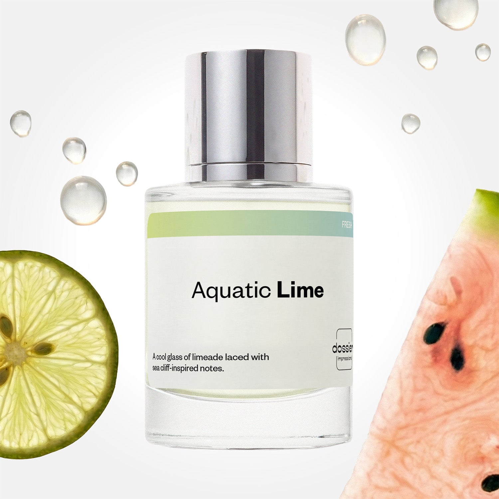

# Aquatic Lime

- **Dossier Inspired by Armani's Acqua Di Gio**
- **URL:** https://dossier.co/products/aquatic-lime
- **SEO title:** Acqua Di Gio by Armani Dupe Perfume : Aquatic Lime - Dossier Perfumes

## Pricing (sizes)

| Size/SKU | Member price | List price | Currency |
|---|---|---|---|
| DI50ALIUS | 26.1 | 29 | USD |
| DOSWA50ALI | 26.1 | 29 | USD |

## Content (scent notes, about, editorial)

Back Home / Perfumes / Dossier Impressions / AQUATIC LIME 

Men 

It's back! 

Aquatic Lime

Eau de Toilette. Size: 50ml / 1.7oz 

members: $26.10

Guest:
$29

Inspired by Giorgio Armani's Acqua Di Gio Inspired by Giorgio Armani's Acqua Di Gio 
Inspired by Giorgio Armani's Acqua Di Gio 

Retail price 94 Crafted in France 
Scent Family: fresh 

Add to Cart 

Scent Notes This perfume is: A cool glass of limeade 
Main Notes:

Lime

Watermelon

Marine Notes

Jasmine

Rosemary

top: The first notes you smell 
Bergamot, Lime, Watermelon 
middle: The heart of the perfume 
Marine notes, Jasmine, Rosemary 
base: The notes that linger all day 
Cedarwood, Oakmoss, Vetiver 
ingredients: Alcohol Denat., Fragrance/Parfum, Water/Aqua/Eau, Linalyl Acetate, Limonene, Linalool, Hexamethylindanopyran, Citrus Limon (Lemon) Peel Oil, Acetyl Cedrene, Citrus Aurantium Peel Oil, Citrus Aurantium Bergamia (Bergamot) Peel Oil, Tetramethyl Acetyloctahydronaphthalenes, Pinene, Alpha-Isomethyl Ionone, Benzyl Salicylate, Pogostemon Cablin Oil, Terpinolene, Geraniol, Geranyl Acetate, Citral, Beta-Caryophyllene, Citronellol, Terpineol, Eugenol, Camphor, Alpha-Terpinene, Rose Ketones, Cinnamyl Alcohol, Carvone. 

Vegan
Cruelty-free

Clean ingredients

About Aquatic Lime (inspired by Armani's Acqua Di Gio) features a splash of freshwater fruits, marine notes, and zesty lime, followed by sharpened and delicately assembled woodsy and moss notes.

Fresh and full of zest, Aquatic Lime (our impression of Armani's Acqua Di Gio) delivers lasting energy that will remind you of diving into the sea on a summer day, flooding the senses like a Mediterranean breeze. 

Scent Intensity: Significant 

Concentration: 12%

Gender: Masculine 

Shipping
Free shipping with 2+ items. 

Standard Shipping (with 2+ items) Auto-selected with 2+ items 
FREE 

Standard Shipping Auto-selected under 2 items 
$3.95 

Express shipping: 2 business days Select in checkout 
$19.00 

Returns
Free exchanges for all. Free returns with 

Exchanges
Free exchange, 1 time per order for all.

Returns
D+ members get 1 FREE return per order.
Non-members incur a $3.99/bottle return fee, 1 time per order.
Returns must be postmarked within 30 days of the initial order. Learn More 

FAQs Are these fragrances long lasting? They are designed to be very long lasting, just like designer fragrances, in some cases even longer, depending on the composition. 
When does the new packaging come out? We'll begin rolling out our new packaging across the U.S. and international markets soon! If you want to shop IRL - our new packaging first hits stores on January 11, 2026 at Walmart. Please note that if you are shopping online, you may receive a combination of our current and new packaging while we transition our inventory. 
How will I know what scent I like? We get it, shopping for perfumes online is hard! That's why we created a scent quiz, which will find the perfect scent for you Take the quiz (opens in new tab) 
Unsure about something? Ask us! help@dossier.co 

Details We are not associated or affiliated with the brands mentioned here in any way.
Aquatic Lime

A Majestic Dance Through the Depths of a Cerulean Sea

Fresh and full of zest, Dossier’s Aquatic Lime provides lasting energy, flooding your senses like a sea breeze in the summertime. The scent of Aquatic Lime pays homage to one of the most exquisite summer scents we’ve ever encountered – Acqua Di Gio by Giorgio Armani.

Wear it or smell it; either way, you’re sure to fall in love with the luxury scent that Aquatic Lime was inspired by. It’s vibrant, vigorous, and unapologetically sexy. The eau de toilette has been a stellar success for the Italian fragrance house and has received well-deserved praise since its introduction in 1997. With nearly universal appeal, it has consistently topped sales charts and continues to do so even today.

It’s not hard to see why, either. The luxury scent that Aquatic Lime is inspired by is a timeless classic. Featuring fresh, crisp notes that hint at mysterious, underlying depths behind its oceanic mask, it’s one of the few perfumes that creates an immediate affinity with any lover of fresh scents. 

The luxury cologne that Aquatic Lime is inspired by is a mild composition combining maritime scents with fruity notes. It’s a wonderful summer scent that begins deep in the ocean and ends on a breezy coastline lined with green, verdant cypress.

The fragrance opens with a shimmering marine fragrance derived from the likes of fresh neroli and Calabrian bergamot. It’s salty, briny, and unquestionably oceanic in origin. Citrus tones are also present — most notably a lime and lemon affair, but slightly tangerine-flavored. The middle notes hold dry, earthy surprises to complement the aquatic opening. Aromas of rosemary and patchouli emanate from the background, and, just for a moment, we see glimpses of a warm summer day somewhere on the bright, sunny shores of Italy. In the end, the luxury scent that Aquatic Lime is inspired by settles for something a little muskier, with logs of cedar and woody undertones. It’s a gentle dock to shore and a distinctly masculine end to a breathtaking journey across the Mediterranean.

The luxury scent that Aquatic Lime is inspired by has moderate longevity. You should get at least six hours’ use out of it, but sillage is definitely at its best for up to an hour after application.

While the projection here is good, it’s nowhere near overwhelming. Sure, you can still overspray and engulf the room, but with a standard application, you’re only able to smell a small radius around yourself. It’s a more "personal" scent, which makes it excellent for the workplace, dinner, or special occasions. Count on receiving lots of compliments when you wear it!

For years, the luxury scent that Aquatic Lime is inspired by has charmed the elite, drawing all to its enchanting marine embrace. It’s also where we found inspiration for our own oceanic and lush Acqua Di Gio dupe — Aquatic Lime. Dossier’s Acqua Di Gio clone incorporates an ocean quaintness and a warm, salty breeze of a seaside Mediterranean town to create a refreshing, fruity fragrance that everyone can afford.

Best Layered With Combine 2 of our perfumes to create a third scent with layering, curated by our nose. Learn more 

You Might Love 

4.5 

Rated 4.5 out of 5 stars 

Based on 853 reviews 

Reviews 853 (tab expanded) Questions 3 (tab collapsed) 

Filters 
Write a Review (Opens in a new window) 

853 reviews 
Sort Highest Rating Most Helpful Photos & Videos Most Recent Oldest Lowest Rating Least Helpful 

ND 

Nathaniel D. 
Verified Buyer 

6/26/26 

Rated 5 out of 5 stars 

Amazing 
This scent lasts A+

Read More Read more about this review 

Was this helpful? Yes, this review from Nathaniel D. was helpful. 0 people voted yes No, this review from Nathaniel D. was not helpful. 0 people voted no 

DP 

Dossier Perfumes 
6/26/26 
Nathaniel! That’s awesome to hear it sticks around all day 🙌

R 

Robbie 

6/23/26 

Rated 5 out of 5 stars 

5 Stars
Very fresh without being too loud, and has great performance so far.

Read More Read more about this review 

Was this helpful? Yes, this review from Robbie was helpful. 0 people voted yes No, this review from Robbie was not helpful. 0 people voted no 

IG 

Ileana G. 
Verified Buyer 

6/10/26 

Rated 5 out of 5 stars 

I loved it 
This perfume is very rich and very good fixative, very good quality 

Read More Read more about this review 
Translated from Spanish Show original 

Was this helpful? Yes, this review from Ileana G. was helpful. 0 people voted yes No, this review from Ileana G. was not helpful. 0 people voted no 

DP 

Dossier Perfumes 
6/10/26 
¡Genial, Ileana! Nos alegra que disfrutes tanto la fijación y la calidad.

OB 

Ojaswini B. 
Verified Buyer 

5/29/26 

Rated 5 out of 5 stars 

Long lasting and refreshing
This is a good perfume. It's a fresh, summer smell and it never goes out of style. 

Read More Read more about this review 

Was this helpful? Yes, this review from Ojaswini B. was helpful. 0 people voted yes No, this review from Ojaswini B. was not helpful. 0 people voted no 

J 

John 

5/27/26 

Rated 5 out of 5 stars 

5 Stars
Great smelling, last about 6-7 hours. I would sugest adding the scent it’s duplicating to the label on the bottle as it is only on the box label itself.

Read More Read more about this review 

Was this helpful? Yes, this review from John was helpful. 0 people voted yes No, this review from John was not helpful. 0 people voted no 

Loading... 

Loading... 

Show More 

Inspired by  Baccarat Rouge 540 
Inspired by  Black Opium 
Inspired by  Love, Don't Be Shy 
Inspired by  Good Girl 
Inspired by  Libre 
Inspired by  Flowerbomb 
Inspired by  Light Blue 
Inspired by  Not a Perfume 
Inspired by  Aventus 
Inspired by  Bleu de Chanel 
Inspired by  Mon Paris 
Inspired by  Coco Mademoiselle 
Inspired by  Tom Ford for Men 
Inspired by  For Her 
Inspired by  J'Adore Dior 
Inspired by  Alien 
Inspired by  Black Opium Perfume 
Inspired by  Lost Cherry Perfume 

GET UP TO 30% OFF 

Find us at these retailers. 

Be the first to know. 
Submit 

Shop the following countries. United States 

Discover.
AI Scent Finder 
Blog (opens in new tab) 
Scent Family 
Layering 
Scent Quiz 

Help.
Contact Us 
Returns 
FAQ 
Testimonials 
Accessibility 

More.
Store Locator 
Boutique 
Refer A Friend 
Index 

Download our app now.

Find us at these retailers. 

Be the first to know. 
Submit 

Shop the following countries. United States 

Discover.
AI Scent Finder 
Blog (opens in new tab) 
Scent Family 
Layering 
Scent Quiz 

Help.
Contact Us 
Returns 
FAQ 
Testimonials 
Accessibility 

More.

## Main Image

