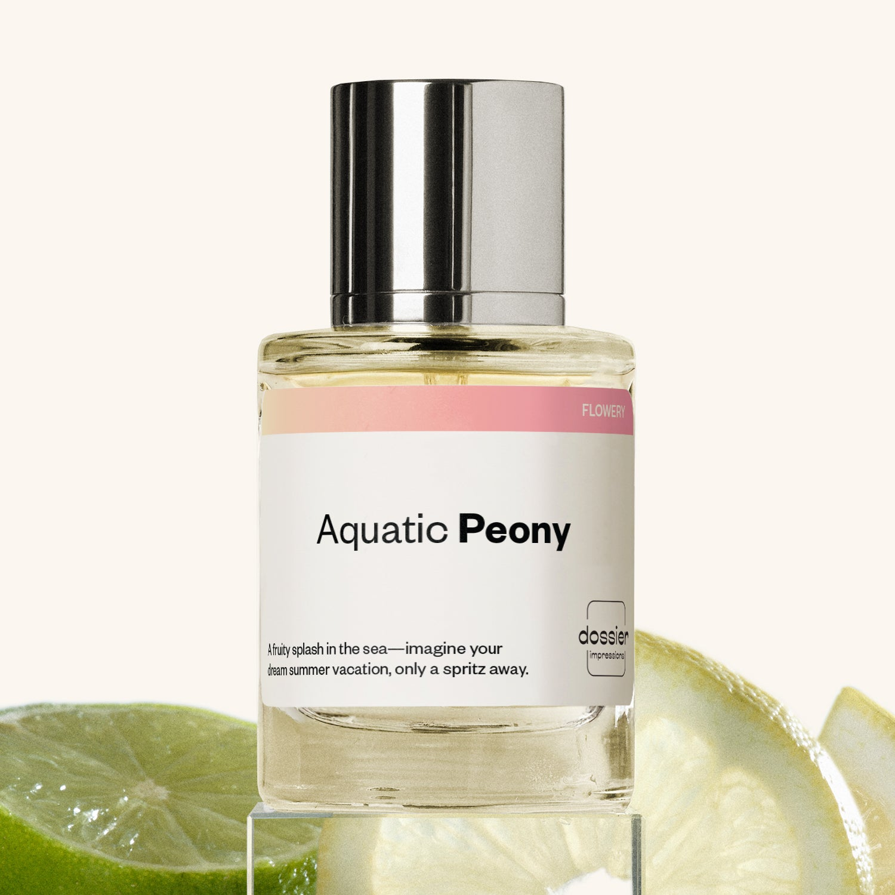

# Aquatic Peony

- **Dossier Inspired by Armani's Acqua Di Gioia**
- **URL:** https://dossier.co/products/aquatic-peony
- **SEO title:** Acqua Di Gioia by Armani Dupe Perfume : Aquatic Peony - Dossier Perfumes

## Pricing (sizes)

| Size/SKU | Member price | List price | Currency |
|---|---|---|---|
| DI50APEUS | 28.8 | 32 | USD |

## Content (scent notes, about, editorial)

Back Home / Perfumes / Dossier Impressions / AQUATIC PEONY 

Women 

Aquatic Peony

Eau de Parfum. Size: 50ml / 1.7oz 

members: $28.80

Guest:
$32

Inspired by Giorgio Armani's Acqua Di Gioia Inspired by Giorgio Armani's Acqua Di Gioia 
Inspired by Giorgio Armani's Acqua Di Gioia 

Retail price 105 Crafted in France 
Scent Family: flowery 

Add to Cart 

Scent Notes This perfume is: A fruity splash of the sea 
Main Notes:

Aquatic Accord

Peony

Jasmine

Pink Pepper

top: The first notes you smell 
Mint, Blackcurrant, Lemon, Aquatic accord 
middle: The heart of the perfume 
Peony, Jasmine, Pink Pepper 
base: The notes that linger all day 
Cedarwood, Labdanum 
ingredients: Alcohol Denat., Fragrance/Parfum, Water/Aqua/Eau, Tetramethyl Acetyloctahydronaphthalenes, Hexamethylindanopyran, Benzyl Salicylate, Limonene, Citrus Limon (Lemon) Peel Oil, Hydroxycitronellal, Citronellol, Alpha-Isomethyl Ionone, Citrus Aurantium Peel Oil, Geranyl Acetate, Hexyl Cinnamal, Pinene, Linalool, Geraniol, Mentha Viridis (Spearmint) Leaf Oil, Beta-Caryophyllene, Carvone, Citral, Terpineol, Anethole, Rose Ketones, Menthol, Vanillin, Terpinolene, Hexadecanolactone, Benzyl Alcohol, Acetyl Cedrene, Alpha-Terpinene. 

Vegan
Cruelty-free

Clean ingredients

About Aquatic Peony’s (inspired by Armani's Acqua Di Gioia) opening sparkles with marine notes, a touch of citrus, and a hint of fruitiness. 
Slowly, as the romantic peony and airy jasmine make their presence known, the scent closes with an unmatched freshness that will keep you on your toes.

Inspired by Italy’s Mediterranean coast, Aquatic Peony (our impression of Armani's Acqua Di Gioia) combines joyful femininity with a casual freshness.

Scent Intensity: Significant 

Concentration: 15%

Gender: Feminine 

Shipping
Free shipping with 2+ items. 

Standard Shipping (with 2+ items) Auto-selected with 2+ items 
FREE 

Standard Shipping Auto-selected under 2 items 
$3.95 

Express shipping: 2 business days Select in checkout 
$19.00 

Returns
Free exchanges for all. Free returns with 

Exchanges
Free exchange, 1 time per order for all.

Returns
D+ members get 1 FREE return per order.
Non-members incur a $3.99/bottle return fee, 1 time per order.
Returns must be postmarked within 30 days of the initial order. Learn More 

FAQs Are these fragrances long lasting? They are designed to be very long lasting, just like designer fragrances, in some cases even longer, depending on the composition. 
When does the new packaging come out? We'll begin rolling out our new packaging across the U.S. and international markets soon! If you want to shop IRL - our new packaging first hits stores on January 11, 2026 at Walmart. Please note that if you are shopping online, you may receive a combination of our current and new packaging while we transition our inventory. 
How will I know what scent I like? We get it, shopping for perfumes online is hard! That's why we created a scent quiz, which will find the perfect scent for you Take the quiz (opens in new tab) 
Unsure about something? Ask us! help@dossier.co 

Details We are not associated or affiliated with the brands mentioned here in any way.
Aquatic Peony

Start Your Day with A Breath of Fresh Mediterranean Air

The ocean has always had a special place in our hearts. It holds fond memories from our childhood; we frolicked in the waves, waded in the shallow waters, and scooped up treasures from the sea. Wouldn’t it be lovely if there was a fragrance that could evoke these precious moments spent near the ocean? Well, perhaps there is. Enter: Acqua Di Gioia, the luxury scent that inspired Dossier’s Aquatic Peony.

The luxury perfume that Aquatic Peony is inspired by is a luxurious eau de parfum that features distinct citrus, floral, and aquatic notes. It’s both understated and sophisticated at the same time, and perhaps one of the best women’s perfumes we’ve ever tried.

The luxury scent that Aquatic Peony is inspired by was launched in 2010, created by scent masters Loc Dong, Anne Flipo, and Dominique Ropion. The fragrance comes some 15 years after its well-known masculine predecessor and is one of many aquatic fragrances in a collection that captures Giorgio Armani’s vision for the everyday woman — joyful, elegant, and carefree. The luxury perfume that Aquatic Peony is inspired by draws inspiration from the tranquility and exhilaration of Pantelleria, a stunning island off the coast of Sicily. It’s a scent designed to transport you to the beach, and it doesn’t hold back. 

Citrusy lemon notes blend with minty fresh hints offering summer vibes. The fragrance develops into a bouquet of jasmine and peony florals that, when combined, lend it a distinctive floral character. Brown sugar and woody cedar notes create a musky, calming finish. 

The base notes go exceptionally well with the citrus notes in the opening, adding seamless warmth and depth to the fragrance. There’s also something to be said about Acqua Di Gioia’s mix of tingly jasmine and brown sugar, a pairing that brings an unusually animal touch to an already aromatic fragrance. 

And just as the ocean glistens under a sunny sky, the luxury perfume that Aquatic Peony is inspired by really shines during the warmer months of the year. The luxury scent that Aquatic Peony is inspired by is a pleasant scent for daytime wear with its light, clean fragrance. You can spray it on most parts of your body, including your neck, decolletage, and wrists. But our favorite place to apply is on the creases of the knees and elbows, where the scent tends to last longer.

Aquatic Peony is a quality replica of Armani’s iconic marine fragrance. Draped in a scent profile that mimics the original’s, Dossier’s dupe is a perfectly affordable feminine scent that will take you on a journey across the Mediterranean. Featuring the unique marine essences behind the luxury perfume that Aquatic Peony is inspired by, our replica promises the same enchanting images of crystal-clear waters, pure sand, and sea breezes for youthful femininity and a casual freshness. 

Best Layered With Combine 2 of our perfumes to create a third scent with layering, curated by our nose. Learn more 

You Might Love 

4.5 

Rated 4.5 out of 5 stars 

Based on 993 reviews 

Reviews 993 (tab expanded) Questions 2 (tab collapsed) 

Filters 
Write a Review (Opens in a new window) 

993 reviews 
Sort Highest Rating Most Helpful Photos & Videos Most Recent Oldest Lowest Rating Least Helpful 

KF 

Kimbur F. 
Verified Buyer 

6/22/26 

Rated 5 out of 5 stars 

Aquatic Peony. 
I love this scent. It's just like Aqua Di Gio for women and that has been my signature scent for years! I was so happy to find this at a fraction of the cost and it agrees so well with my body chemistry

Read More Read more about this review 

Was this helpful? Yes, this review from Kimbur F. was helpful. 0 people voted yes No, this review from Kimbur F. was not helpful. 0 people voted no 

DP 

Dossier Perfumes 
6/22/26 
Kimbur, we’re so glad Aquatic Peony hit that sweet spot of your longtime favorite while being easy on the wallet. It’s awesome it meshes so well with your chemistry! 🌸

MB 

Morgan B. 
Verified Buyer 

6/17/26 

Rated 5 out of 5 stars 

Smells Amazing
I love this perfume, it smells absolutely amazing and fresh! I’m so glad I ordered it and will be buying again :)

Read More Read more about this review 

Was this helpful? Yes, this review from Morgan B. was helpful. 0 people voted yes No, this review from Morgan B. was not helpful. 0 people voted no 

DP 

Dossier Perfumes 
6/17/26 
Morgan, thanks for sharing your thoughts! We’re so happy Aquatic Peony is a hit and that you’ll be back. Can’t wait to see you spritz again 🌸

DD 

DeAnn D. 
Verified Buyer 

6/16/26 

Rated 5 out of 5 stars 

One of my favorites! 
This is probably my 3 or 4 th bottle of Aquatic Peony. I absolutely adore the OG and Dossier’s inspired version is identical! I will continue to order more bottles!

Read More Read more about this review 

Was this helpful? Yes, this review from DeAnn D. was helpful. 0 people voted yes No, this review from DeAnn D. was not helpful. 0 people voted no 

DP 

Dossier Perfumes 
6/16/26 
DeAnn, we’re thrilled Aquatic Peony feels as perfect as the original for you. Thanks for coming back again and again 🙌 We can’t wait to keep you spritzed!

IC 

Iman C. 
Verified Buyer 

6/9/26 

Rated 5 out of 5 stars 

Fave
Love it, love the smell and the price!

Read More Read more about this review 

Was this helpful? Yes, this review from Iman C. was helpful. 0 people voted yes No, this review from Iman C. was not helpful. 0 people voted no 

DP 

Dossier Perfumes 
6/9/26 
Iman, we’re so happy you’re loving the scent and the price! 😊

D 

Davida 
Verified Buyer 

5/24/26 

Rated 5 out of 5 stars 

Absolutely Heavenly 
I didn’t even realize this was a dupe- I went on a blind buy splurge a few months back and let me tell you I absolutely fell In LOVE with this one! I now know what it is “ duping “ and torn between saying it’s the best dupe or even better than the “ original “. When it does come to dupes Dossier cannot be beat, they have many originals that have a permanent home with me! This perfume is definitely one of them!!

Read More Read more about this review 

Was this helpful? Yes, this review from Davida was helpful. 0 people voted yes No, this review from Davida was not helpful. 0 people voted no 

DP 

Dossier Perfumes 
5/24/26 
Davida, we’re thrilled you gave Aquatic Peony a blind buy chance and it’s become a permanent favorite! That means so much to us. Enjoy every spritz! 😊

Loading... 

Loading... 

Show More 

Inspired by  Baccarat Rouge 540 
Inspired by  Black Opium 
Inspired by  Love, Don't Be Shy 
Inspired by  Good Girl 
Inspired by  Libre 
Inspired by  Flowerbomb 
Inspired by  Light Blue 
Inspired by  Not a Perfume 
Inspired by  Aventus 
Inspired by  Bleu de Chanel 
Inspired by  Mon Paris 
Inspired by  Coco Mademoiselle 
Inspired by  Tom Ford for Men 
Inspired by  For Her 
Inspired by  J'Adore Dior 
Inspired by  Alien 
Inspired by  Black Opium Perfume 
Inspired by  Lost Cherry Perfume 

GET UP TO 30% OFF 

Find us at these retailers. 

Be the first to know. 
Submit 

Shop the following countries. United States 

Discover.
AI Scent Finder 
Blog (opens in new tab) 
Scent Family 
Layering 
Scent Quiz 

Help.
Contact Us 
Returns 
FAQ 
Testimonials 
Accessibility 

More.
Store Locator 
Boutique 
Refer A Friend 
Index 

Download our app now.

Find us at these retailers. 

Be the first to know. 
Submit 

Shop the following countries. United States 

Discover.
AI Scent Finder 
Blog (opens in new tab) 
Scent Family 
Layering 
Scent Quiz 

Help.
Contact Us 
Returns 
FAQ 
Testimonials 
Accessibility 

More.

## Main Image

