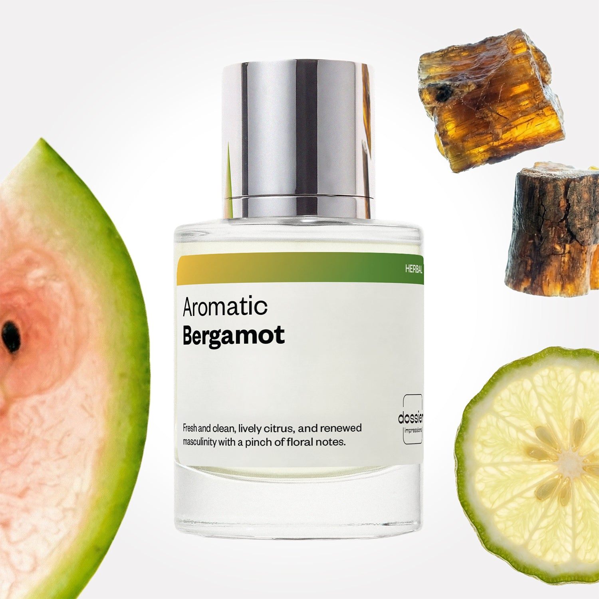

# Aromatic Bergamot

- **Dossier Inspired by YSL’s MYSLF**
- **URL:** https://dossier.co/products/aromatic-bergamot
- **SEO title:** Aromatic Bergamot

## Pricing (sizes)

| Size/SKU | Member price | List price | Currency |
|---|---|---|---|
| DI50ARBUS | 28.8 | 32 | USD |

## Content (scent notes, about, editorial)

Back Home / Perfumes / Dossier Impressions / AROMATIC BERGAMOT 

Men 

New 

Aromatic Bergamot

Eau de Toilette. Size: 50ml / 1.7oz 

members: $28.80

Guest:
$32

Inspired by YSL's MYSLF Inspired by YSL's MYSLF 
Inspired by YSL's MYSLF 

Retail price 130 Crafted in France 
Scent Family: herbal 

Add to Cart 

Scent Notes Main Notes:

Bergamot

Pineapple

Lavender

Geranium

Amberwood

top: The first notes you smell 
bergamot , Mint, pineapple 
middle: The heart of the perfume 
lavender, geranium , Orange Flower 
base: The notes that linger all day 
Tonka Bean, Patchouli, amberwood 
ingredients: Alcohol Denat., Fragrance/Parfum, Water/Aqua/Eau, Tetramethyl Acetyloctahydronaphthalenes, Citrus Limon (Lemon) Peel Oil, Linalool, Linalyl Acetate, Limonene, Coumarin, Pinene, Citronellol, Alpha Isomethyl Ionone, Pogostemon Cablin Oil, Beta-Caryophyllene, Citral, Vanillin, Geraniol, Lavandula Oil/Extract, Rose Ketones, Geranyl Acetate, Terpinolene, Camphor, Cinnamal, Terpineol, Anethole, Cinnamomum Zeylanicum Bark Oil, Alpha-Terpinene, Menthol, Benzyl Benzoate, Citrus Aurantium Peel Oil. 

Vegan
Cruelty-free

Clean ingredients

About Aromatic Bergamot offers harmony through duality that subtly challenges traditional masculine fragrances. The fragrance opens with fresh, lively bergamot, lavender, and pineapple notes. They juxtapose––and later interlace––with a warm tonka bean patchouli and amberwood base.

The addition of orange blossom incorporates a modern, almost gender-ambiguous element that blends perfectly with this masculine structure. This aromatic fougère fragrance offers a 100% contemporary and renewed masculinity that, while rooted in traditional codes, effortlessly incorporates a touch of ambivalence.

Scent Intensity: Significant 

Concentration: 18%

Gender: Masculine 

Shipping
Free shipping with 2+ items. 

Standard Shipping (with 2+ items) Auto-selected with 2+ items 
FREE 

Standard Shipping Auto-selected under 2 items 
$3.95 

Express shipping: 2 business days Select in checkout 
$19.00 

Returns
Free exchanges for all. Free returns with 

Exchanges
Free exchange, 1 time per order for all.

Returns
D+ members get 1 FREE return per order.
Non-members incur a $3.99/bottle return fee, 1 time per order.
Returns must be postmarked within 30 days of the initial order. Learn More 

FAQs Are these fragrances long lasting? They are designed to be very long lasting, just like designer fragrances, in some cases even longer, depending on the composition. 
When does the new packaging come out? We'll begin rolling out our new packaging across the U.S. and international markets soon! If you want to shop IRL - our new packaging first hits stores on January 11, 2026 at Walmart. Please note that if you are shopping online, you may receive a combination of our current and new packaging while we transition our inventory. 
How will I know what scent I like? We get it, shopping for perfumes online is hard! That's why we created a scent quiz, which will find the perfect scent for you Take the quiz (opens in new tab) 
Unsure about something? Ask us! help@dossier.co 

Best Layered With Combine 2 of our perfumes to create a third scent with layering, curated by our nose. Learn more 

You Might Love 

4.4 

Rated 4.4 out of 5 stars 

Based on 210 reviews 

Reviews 210 (tab expanded) Questions (tab collapsed) 

Filters 
Write a Review (Opens in a new window) 

210 reviews 
Sort Highest Rating Most Helpful Photos & Videos Most Recent Oldest Lowest Rating Least Helpful 

L 

Latanza 

6/28/26 

Rated 5 out of 5 stars 

5 Stars
It was a gift, but the person loved it.

Read More Read more about this review 

Was this helpful? Yes, this review from Latanza was helpful. 0 people voted yes No, this review from Latanza was not helpful. 0 people voted no 

K 

Kiontee 

6/26/26 

Rated 5 out of 5 stars 

5 Stars
Dossier is the best

Read More Read more about this review 

Was this helpful? Yes, this review from Kiontee was helpful. 0 people voted yes No, this review from Kiontee was not helpful. 0 people voted no 

B 

Brian 

6/24/26 

Rated 5 out of 5 stars 

5 Stars
So Dam Good 🤩

Read More Read more about this review 

Was this helpful? Yes, this review from Brian was helpful. 0 people voted yes No, this review from Brian was not helpful. 0 people voted no 

CL 

Chris L. 
Verified Buyer 

6/17/26 

Rated 5 out of 5 stars 

Compliments out the wazoooooo
I tried Dossier years ago but didn’t think much of it until I saw this one which had this combo of fragrance notes which I really wanted. And I keep getting compliments from friends and co-workers! Normally I feel like I’m pretty nose blind myself but apparently it’s pretty fragrant? 

Read More Read more about this review 

Was this helpful? Yes, this review from Chris L. was helpful. 0 people voted yes No, this review from Chris L. was not helpful. 0 people voted no 

DP 

Dossier Perfumes 
6/17/26 
Hey Chris! It’s awesome you’re getting all those compliments. Some scents really shine on people even if we think we’re nose blind. Keep enjoying and turning heads anytime 😊

IG 

Ileana G. 
Verified Buyer 

6/10/26 

Rated 5 out of 5 stars 

Very good
Loved it, very rich fragrance and great fixer 

Read More Read more about this review 
Translated from Spanish Show original 

Was this helpful? Yes, this review from Ileana G. was helpful. 0 people voted yes No, this review from Ileana G. was not helpful. 0 people voted no 

DP 

Dossier Perfumes 
6/10/26 
¡Ileana, gracias por compartir! Nos alegra que disfrutes la fijación y la fragancia 😊

Loading... 

Loading... 

Show More 

Inspired by  Baccarat Rouge 540 
Inspired by  Black Opium 
Inspired by  Love, Don't Be Shy 
Inspired by  Good Girl 
Inspired by  Libre 
Inspired by  Flowerbomb 
Inspired by  Light Blue 
Inspired by  Not a Perfume 
Inspired by  Aventus 
Inspired by  Bleu de Chanel 
Inspired by  Mon Paris 
Inspired by  Coco Mademoiselle 
Inspired by  Tom Ford for Men 
Inspired by  For Her 
Inspired by  J'Adore Dior 
Inspired by  Alien 
Inspired by  Black Opium Perfume 
Inspired by  Lost Cherry Perfume 

GET UP TO 30% OFF 

Find us at these retailers. 

Be the first to know. 
Submit 

Shop the following countries. United States 

Discover.
AI Scent Finder 
Blog (opens in new tab) 
Scent Family 
Layering 
Scent Quiz 

Help.
Contact Us 
Returns 
FAQ 
Testimonials 
Accessibility 

More.
Store Locator 
Boutique 
Refer A Friend 
Index 

Download our app now.

Find us at these retailers. 

Be the first to know. 
Submit 

Shop the following countries. United States 

Discover.
AI Scent Finder 
Blog (opens in new tab) 
Scent Family 
Layering 
Scent Quiz 

Help.
Contact Us 
Returns 
FAQ 
Testimonials 
Accessibility 

More.

## Main Image

