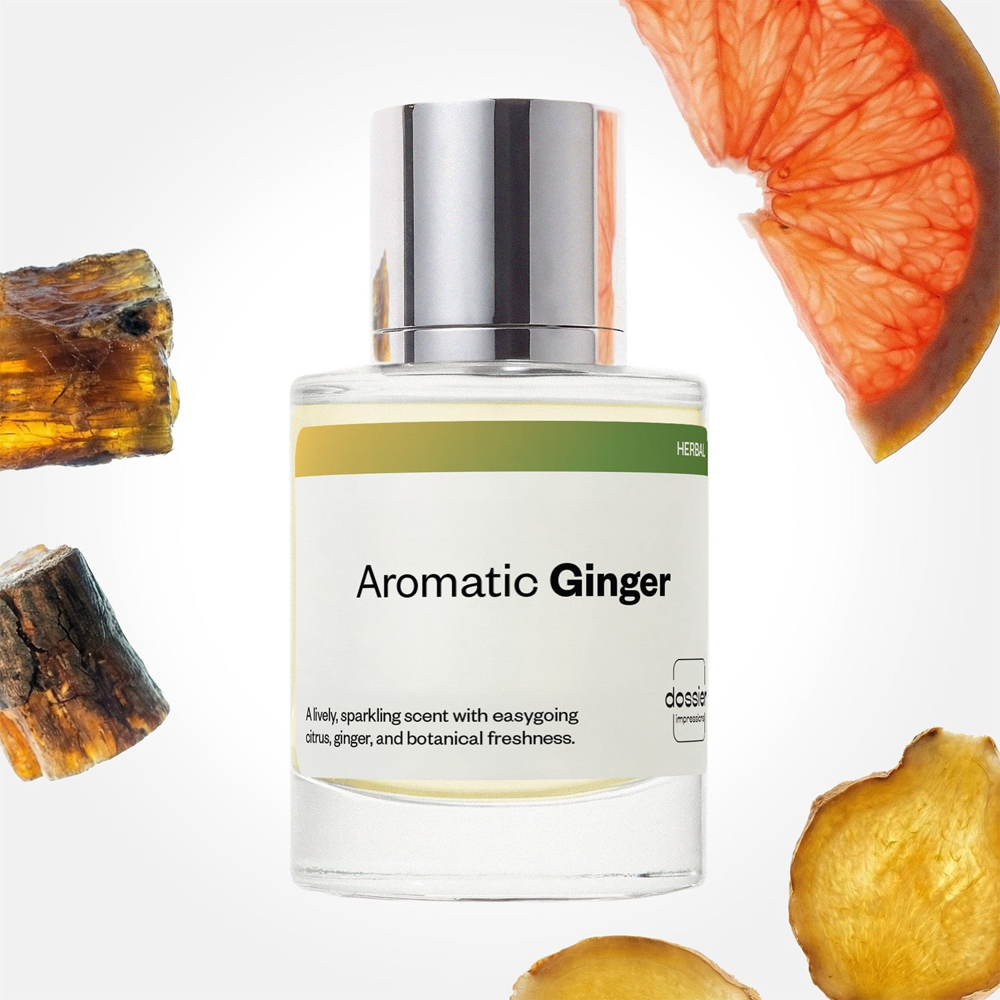

# Aromatic Ginger

- **Dossier Inspired by Louis Vuitton's L'Immensité**
- **URL:** https://dossier.co/products/aromatic-ginger
- **SEO title:** Louis Vuitton's L'Immensité Dupe Perfume: Aromatic Ginger - Dossier Perfumes

## Pricing (sizes)

| Size/SKU | Member price | List price | Currency |
|---|---|---|---|
| DI50ARGUS | 44.1 | 49 | USD |

## Content (scent notes, about, editorial)

Back Home / Perfumes / Dossier Impressions / AROMATIC GINGER 

Men 

Bestseller 

Aromatic Ginger

Eau de Parfum. Size: 50ml / 1.7oz 

members: $44.10

Guest:
$49

Inspired by Louis Vuitton's L'Immensité Inspired by Louis Vuitton's L'Immensité 
Inspired by Louis Vuitton's L'Immensité 

Retail price 345 Crafted in France 
Scent Family: herbal 

Add to Cart 

Scent Notes This perfume is: Lively, sparkling refreshment 
Main Notes:

Ginger

Grapefruit

Amberwood

top: The first notes you smell 
Ginger, Grapefruit, Marine Notes 
middle: The heart of the perfume 
Clary Sage, Rosemary, Geranium 
base: The notes that linger all day 
Amberwood, Ciste Labdanum 
ingredients: Alcohol Denat., Fragrance/Parfum, Water/Aqua/Eau, Tetramethyl Acetyloctahydronaphthalenes, Citrus Aurantium Bergamia (Bergamot) Peel Oil, Limonene, Linalyl Acetate, Linalool, Citrus Aurantium Peel Oil, Pogostemon Cablin Oil, Pinene, Benzyl Salicylate, Coumarin, Citral, Beta-Caryophyllene, Benzyl Benzoate, Terpinolene, Rose Ketones, Geranyl Acetate, Eugenol, Terpineol, Geraniol, Citronellol, Alpha-Terpinene, Acetyl Cedrene, Camphor, Farnesol. 

Vegan
Cruelty-free

Clean ingredients

About Top notes convey the initial impression of fresh ginger, marine saltiness, and sparkling citrus. Next, enter clary sage and rosemary bringing an herbaceous, aromatic tone into play. Last but not least, the outdoorsy elements come through. Amber wood and ciste labdanum (a wild Mediterranean shrub combining a balsam and amber aroma) warm the fragrance base without extinguishing its light ginger citrus freshness. 

Fresh and intense, Aromatic Ginger (inspired by Louis Vuitton's L'Immensité) is a masculine fragrance evoking the breadth of the great outdoors.

Scent Intensity: Significant 

Concentration: 18%

Gender: Masculine 

Shipping
Free shipping with 2+ items. 

Standard Shipping (with 2+ items) Auto-selected with 2+ items 
FREE 

Standard Shipping Auto-selected under 2 items 
$3.95 

Express shipping: 2 business days Select in checkout 
$19.00 

Returns
Free exchanges for all. Free returns with 

Exchanges
Free exchange, 1 time per order for all.

Returns
D+ members get 1 FREE return per order.
Non-members incur a $3.99/bottle return fee, 1 time per order.
Returns must be postmarked within 30 days of the initial order. Learn More 

FAQs Are these fragrances long lasting? They are designed to be very long lasting, just like designer fragrances, in some cases even longer, depending on the composition. 
When does the new packaging come out? We'll begin rolling out our new packaging across the U.S. and international markets soon! If you want to shop IRL - our new packaging first hits stores on January 11, 2026 at Walmart. Please note that if you are shopping online, you may receive a combination of our current and new packaging while we transition our inventory. 
How will I know what scent I like? We get it, shopping for perfumes online is hard! That's why we created a scent quiz, which will find the perfect scent for you Take the quiz (opens in new tab) 
Unsure about something? Ask us! help@dossier.co 

Details We are not associated or affiliated with the brands mentioned here in any way.
Aromatic Ginger

A Greek Adonis sharply adorned in a businessman’s striking suit

A decisively authoritative floral, the Louis Vuitton L’Immensité cologne (the fragrance that Dossier’s Aromatic Ginger is inspired by) commands respect while attractively maintaining poise and natural allure. It echoes the signature confidence of the Louis Vuitton brand and boasts an assertive self-assurance in tandem with soft whispers of reassurance and comfort. Launched only recently in 2018, this exquisite bouquet develops wisely on the nose with maturity and careful intent.

It starts off with handsomely possessing top tones of tangy bergamot, citrusy grapefruit, and ginger, before evolving into a desirable blend of mysterious passion and mediated sharpness. The crisply eloquent middle notes coalesce with purpose and graceful presence. In fact, the experience the luxury fragrance that Aromatic Ginger is inspired by provides is akin to the warmth of sage, the kiss of rosemary, and the embrace of geranium radiating through and through with collected confidence and masculine ascendancy.

The intense base notes of piquant ambroxan, warm amber, and irresistible labdanum create a sharp twist to the tale, stealing the senses away like a knightly hero who rescues his beloved princess from the dangers of nighttime. For such a sinister, darkly embellished scent, the luxury fragrance that Aromatic Ginger is inspired by is awfully sweet. It stays warmly vulnerable and open to the warmth and heartfelt nature of life outside the boardroom. Plus, its basal undertone of amber fused with soft and paternal rosemary unravels the illusion of luxurious business and professionalism.

You only have to glean the corked bottle of the luxury cologne that Aromatic Ginger is inspired by (with all that powerful demeanor and business acumen) to realize that this fragrance has been calculatedly crafted for men of substance. It is a black and white calligraphy forged into the clear bottle in such a way as to allow a vision of executive transparency – and one that opens into the surprisingly heart-warming soul of Hercules.

To experience the striking blend of the vulnerable that intermingles with authority and precision, you can buy the Louis Vuitton L’Immensité Cologne in 2 sizes: 100 ml and 200 ml, going for $270.00 and $405.00 respectively. And if you are looking for a handy travel spray, it also comes in 2 sizes. For a set of travel spray refills, you can buy 4 of them for $125.00. For a treat of ultimate luxury and exquisiteness, the Flacon d’Exception is designed around the essence of craftsmanship in a Baccarat crystal and vintage historic glassblowing style. It goes for $16,120.00.

Now, if you fancy a marvelous yet affordable cocktail of masculine poise blended perfectly with warmth and unguardedness, try Dossier’s Aromatic Ginger. Aromatic Ginger recreates the fusion of Greek god-like sharpness and romance – and one that rivals the amorous courtship between the wind and sea. Our Louis Vuitton L’Immensité dupe brilliantly captures the complexity of masculine identity with fresh and sparkling notes of citrus, fresh ginger, and amber. Aromatic Ginger is a fragrance that invites anyone to catch an essence of the natural masculine aromas while opening the doors to a refreshingly unshielded man. It is what you need if you crave an olfactory escape into the hedonistic pleasures of Pompeii. 

Best Layered With Combine 2 of our perfumes to create a third scent with layering, curated by our nose. Learn more 

You Might Love 

4.5 

Rated 4.5 out of 5 stars 

Based on 809 reviews 

Reviews 809 (tab expanded) Questions 2 (tab collapsed) 

Filters 
Write a Review (Opens in a new window) 

809 reviews 
Sort Highest Rating Most Helpful Photos & Videos Most Recent Oldest Lowest Rating Least Helpful 

C 

Cornelius 

6/29/26 

Rated 5 out of 5 stars 

5 Stars
Much love

Read More Read more about this review 

Was this helpful? Yes, this review from Cornelius was helpful. 0 people voted yes No, this review from Cornelius was not helpful. 0 people voted no 

FM 

Francisco M. 
Verified Buyer 

6/26/26 

Rated 5 out of 5 stars 

NEW FAVORITE
This entry has become my instant go-to for semi formal and casual events

Read More Read more about this review 

Was this helpful? Yes, this review from Francisco M. was helpful. 0 people voted yes No, this review from Francisco M. was not helpful. 0 people voted no 

DP 

Dossier Perfumes 
6/26/26 
Love that this one has become your go-to for both semi formal and casual! 😊

SK 

seyhmus k. 
Verified Buyer 

6/16/26 

Rated 5 out of 5 stars 

Almost identical
it smells just like LV

Read More Read more about this review 

Was this helpful? Yes, this review from seyhmus k. was helpful. 0 people voted yes No, this review from seyhmus k. was not helpful. 0 people voted no 

DP 

Dossier Perfumes 
6/16/26 
We’re glad it’s giving that luxe energy you love. Enjoy exploring our catalog!

L 

Lisa 
Verified Buyer 

6/16/26 

Rated 5 out of 5 stars 

Smells great!
I purchased this for my son. He’s been wearing it for the last few days. It smells amazing! He says it smells like the real thing. He sprayed it and left the house for a few hours. Came back and I can still smell it on him from a few feet away. It’s not overbearing. Smells clean and fresh but more of an upscale scent, not soapy. He’s been wanting the real LV bottle but I won’t buy that and we decided to settle on this dupe. He’s very happy with it and I’ll probably buy myself a bottle of it too. 

Read More Read more about this review 

Was this helpful? Yes, this review from Lisa was helpful. 0 people voted yes No, this review from Lisa was not helpful. 0 people voted no 

DP 

Dossier Perfumes 
6/16/26 
Lisa, we’re so glad your son’s been enjoying Aromatic Ginger’s clean, lasting vibe. Love that compliments keep rolling in! Let us know when you grab your own bottle! ✨

A 

Alexa 

6/4/26 

Rated 5 out of 5 stars 

5 Stars
Live it

Read More Read more about this review 

Was this helpful? Yes, this review from Alexa was helpful. 0 people voted yes No, this review from Alexa was not helpful. 0 people voted no 

Loading... 

Loading... 

Show More 

Inspired by  Baccarat Rouge 540 
Inspired by  Black Opium 
Inspired by  Love, Don't Be Shy 
Inspired by  Good Girl 
Inspired by  Libre 
Inspired by  Flowerbomb 
Inspired by  Light Blue 
Inspired by  Not a Perfume 
Inspired by  Aventus 
Inspired by  Bleu de Chanel 
Inspired by  Mon Paris 
Inspired by  Coco Mademoiselle 
Inspired by  Tom Ford for Men 
Inspired by  For Her 
Inspired by  J'Adore Dior 
Inspired by  Alien 
Inspired by  Black Opium Perfume 
Inspired by  Lost Cherry Perfume 

GET UP TO 30% OFF 

Find us at these retailers. 

Be the first to know. 
Submit 

Shop the following countries. United States 

Discover.
AI Scent Finder 
Blog (opens in new tab) 
Scent Family 
Layering 
Scent Quiz 

Help.
Contact Us 
Returns 
FAQ 
Testimonials 
Accessibility 

More.
Store Locator 
Boutique 
Refer A Friend 
Index 

Download our app now.

Find us at these retailers. 

Be the first to know. 
Submit 

Shop the following countries. United States 

Discover.
AI Scent Finder 
Blog (opens in new tab) 
Scent Family 
Layering 
Scent Quiz 

Help.
Contact Us 
Returns 
FAQ 
Testimonials 
Accessibility 

More.

## Main Image

