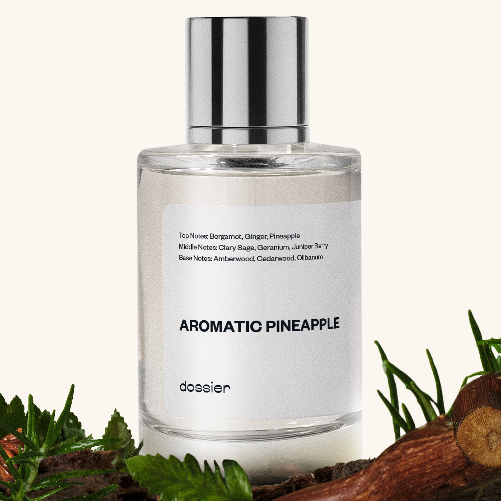

# Aromatic Pineapple

- **Dossier Inspired by YSL’s Y**
- **URL:** https://dossier.co/products/aromatic-pineapple
- **SEO title:** YSL Y Dupe Perfume: Aromatic Pineapple - Dossier Perfumes

## Pricing (sizes)

| Size/SKU | Member price | List price | Currency |
|---|---|---|---|
| DI50ARPUS | 26.1 | 29 | USD |
| 42335050629187 | 44.1 | 49 | USD |
| BF202517 | 159.3 | 177 | USD |
| DOSWA50ARP | 26.1 | 29 | USD |

## Content (scent notes, about, editorial)

Back Home / Perfumes / Dossier Impressions / AROMATIC PINEAPPLE 

Men 

It's back! 

Aromatic Pineapple

Eau de Parfum. Size: 100ml / 3.4oz 

members: $44.10

Guest:
$49

Inspired by YSL's Y Inspired by YSL's Y 
Inspired by YSL's Y 

Retail price 190 Pack
50ml $29

Best Value
100ml $49

Crafted in France 
Scent Family: herbal 

Add to Cart 

Scent Notes This perfume is: Tropical fun in the sun 
Main Notes:

Pineapple

Clary Sage

Geranium

Juniper Berry

top: The first notes you smell 
Bergamot, Ginger, Pineapple 
middle: The heart of the perfume 
Clary Sage, Geranium, Juniper Berry 
base: The notes that linger all day 
Amberwood, Cedarwood, Olibanum 
ingredients: Alcohol Denat., Fragrance/Parfum, Water/Aqua/Eau, Tetramethyl Acetyloctahydronaphthalenes, Limonene, Citrus Limon (Lemon) Peel Oil, Citrus Aurantium Bergamia (Bergamot) Peel Oil, Linalool, Linalyl Acetate, Acetyl Cedrene, Pinene, Juniperus Virginiana Oil, Lavandula Oil/Extract, Alpha-Isomethyl Ionone, Citral, Citronellol, Beta-Caryophyllene, Geranyl Acetate, Terpineol, Terpinolene, Rose Ketones, Pelargonium Graveolens Flower Oil, Coumarin, Geraniol, Alpha-Terpinene, Hexadecanolactone, Camphor. 

Vegan
Cruelty-free

Clean ingredients

About Aromatic Pineapple (Inspired by YSL’s Y) features juicy, fruity notes with geranium sage and juniperberry to express a crispy, invigorating, clean feeling. A combination of amber woods and olibanum ( also called frankincense) take over to make this cleansing effect last. 

Masculine, bright, and sharp like silver metal, Aromatic Pineapple (our impression of YSL’s Y) is softened by a woody ambery base, offering the perfect balance between freshness and strength.

Scent Intensity: Significant 

Concentration: 15%

Gender: Masculine 

Shipping
Free shipping with 2+ items. 

Standard Shipping (with 2+ items) Auto-selected with 2+ items 
FREE 

Standard Shipping Auto-selected under 2 items 
$3.95 

Express shipping: 2 business days Select in checkout 
$19.00 

Returns
Free exchanges for all. Free returns with 

Exchanges
Free exchange, 1 time per order for all.

Returns
D+ members get 1 FREE return per order.
Non-members incur a $3.99/bottle return fee, 1 time per order.
Returns must be postmarked within 30 days of the initial order. Learn More 

FAQs Are these fragrances long lasting? They are designed to be very long lasting, just like designer fragrances, in some cases even longer, depending on the composition. 
When does the new packaging come out? We'll begin rolling out our new packaging across the U.S. and international markets soon! If you want to shop IRL - our new packaging first hits stores on January 11, 2026 at Walmart. Please note that if you are shopping online, you may receive a combination of our current and new packaging while we transition our inventory. 
How will I know what scent I like? We get it, shopping for perfumes online is hard! That's why we created a scent quiz, which will find the perfect scent for you Take the quiz (opens in new tab) 
Unsure about something? Ask us! help@dossier.co 

Details We are not associated or affiliated with the brands mentioned here in any way.
Aromatic Pineapple

A Modern Vision of Refinement

Experience Yves Saint Laurent Y, an intense fragrance created by famed perfumer Dominique Ropion and the scent that Dossier’s Aromatic Pineapple fragrance is inspired by. The fragrance line that Dossier’s Aromatic Pineapple is inspired by offers something for every man. From a sophisticated eau de toilette to a seductive Eau de Parfum to hydrating aftershave balm, the luxury scent that Dossier’s Aromatic Pineapple fragrance is inspired by opens the door to the modern man’s elegance and masculinity. Authentic, bold, and fresh; and in YSL’s words: masculinity redefined.

The luxury scent that Aromatic Pineapple is inspired by was initially launched as an Eau de Toilette (EDT) in 2017 and opens up with a relaxed and crisp aroma. The beauty of this fragrance for men is derived from its blend of bergamot, sage, and ginger, which, when combined, offer a crisp, juicy freshness that challenges all conventions. With balsam fir, cedarwood, and marine ambergris at its base, this fragrance embodies the refined elegance of a tailored black jacket that is both elegant and strikingly sophisticated.

The fragrance’s notes are all put together in a simple, easy-to-wear way, making it suitable to wear in both casual and professional settings. It also helps that the luxury scent that Aromatic Pineapple is inspired by feels lighter and brighter than many of the typically heavier male fragrances out there. It gives off a refreshing sensation – much like taking a quick shower – but with a hint of musk and woodiness mixed in between.

But for something more potent, you can’t go wrong with the Eau De Parfum (EDP) version of the luxury fragrance that Aromatic Pineapple is inspired by, which starts with a strong ginger and bergamot blend – a powerful combination – similar to the original. However, the bergamot of the original EDT is paired with an even crisper apple note at the top. Meanwhile, you’ll also get the ginger spice infusion along with a base of amber, juniper berry, and tonka bean. We would describe the EDP version of the luxury fragrance that Aromatic Pineapple is inspired by as a super-fresh and aromatic fragrance with a touch of warmth and remarkable smoothness.

Meanwhile, for something in between, consider the softer YSL Y Le Parfum. This unique blend shares many similarities with the EDP, featuring apple and ginger in its opening notes. However, Le Parfum is a more mature fragrance, with a subtlety that allows it to be worn in more varied settings. The downside of this subtlety, though, is its poor performance relative to the EDP, with lower projection and longevity numbers.

Fans of the fragrance line that Aromatic Pineapple is inspired by may also enjoy the Eau Fraîche version, an exciting and contemporary interpretation of the signature scent. The sharpness of lemon is balanced by a note of geranium and cedarwood, forming a scent that exudes a woody, crisp fragrance of self-accomplishment. It’s a fresh and clean scent with a masculine touch, a welcome addition to the fragrance line.

Aromatic Pineapple is Dossier’s YSL Y dupe, filled with juicy fruit notes and geranium sage to express a crisp, invigorating, clean scent. This cleansing effect is brought about by the combined effect of amber woods and olibanum (also called frankincense). Our replica is equally sophisticated and masculine, perfect for the modern man in any environment he may find himself in.

Best Layered With Combine 2 of our perfumes to create a third scent with layering, curated by our nose. Learn more 

You Might Love 

4.5 

Rated 4.5 out of 5 stars 

Based on 1,595 reviews 

Reviews 1,595 (tab expanded) Questions 2 (tab collapsed) 

Filters 
Write a Review (Opens in a new window) 

1,595 reviews 
Sort Highest Rating Most Helpful Photos & Videos Most Recent Oldest Lowest Rating Least Helpful 

J 

James 

6/30/26 

Rated 5 out of 5 stars 

5 Stars
Smells fantastic and last a long time!

Read More Read more about this review 

Was this helpful? Yes, this review from James was helpful. 0 people voted yes No, this review from James was not helpful. 0 people voted no 

D 

Danielle 

6/29/26 

Rated 5 out of 5 stars 

5 Stars
My man smells soooo good😍

Read More Read more about this review 

Was this helpful? Yes, this review from Danielle was helpful. 0 people voted yes No, this review from Danielle was not helpful. 0 people voted no 

DB 

David B. 
Verified Buyer 

6/27/26 

Rated 5 out of 5 stars 

Aromatic Pinapple
Perfect

Read More Read more about this review 

Was this helpful? Yes, this review from David B. was helpful. 0 people voted yes No, this review from David B. was not helpful. 0 people voted no 

DP 

Dossier Perfumes 
6/27/26 
David, perfect is our favorite feedback! We’re so glad you love it 😊

J 

Jared 

6/26/26 

Rated 5 out of 5 stars 

5 Stars
The smell

Read More Read more about this review 

Was this helpful? Yes, this review from Jared was helpful. 0 people voted yes No, this review from Jared was not helpful. 0 people voted no 

GN 

Gerard N. 
Verified Buyer 

6/26/26 

Rated 5 out of 5 stars 

Godspace1
I actually go on YSL. And I will say that your cologne smells very good refreshing and non-synthetic. I’d like to test a couple of more and maybe I’ll do

Read More Read more about this review 

Was this helpful? Yes, this review from Gerard N. was helpful. 0 people voted yes No, this review from Gerard N. was not helpful. 0 people voted no 

DP 

Dossier Perfumes 
6/26/26 
Gerard thanks for trying our cologne! So glad it feels refreshing and natural. Feel free to explore more scents soon.

Loading... 

Loading... 

Show More 

Inspired by  Baccarat Rouge 540 
Inspired by  Black Opium 
Inspired by  Love, Don't Be Shy 
Inspired by  Good Girl 
Inspired by  Libre 
Inspired by  Flowerbomb 
Inspired by  Light Blue 
Inspired by  Not a Perfume 
Inspired by  Aventus 
Inspired by  Bleu de Chanel 
Inspired by  Mon Paris 
Inspired by  Coco Mademoiselle 
Inspired by  Tom Ford for Men 
Inspired by  For Her 
Inspired by  J'Adore Dior 
Inspired by  Alien 
Inspired by  Black Opium Perfume 
Inspired by  Lost Cherry Perfume 

GET UP TO 30% OFF 

Find us at these retailers. 

Be the first to know. 
Submit 

Shop the following countries. United States 

Discover.
AI Scent Finder 
Blog (opens in new tab) 
Scent Family 
Layering 
Scent Quiz 

Help.
Contact Us 
Returns 
FAQ 
Testimonials 
Accessibility 

More.
Store Locator 
Boutique 
Refer A Friend 
Index 

Download our app now.

Find us at these retailers. 

Be the first to know. 
Submit 

Shop the following countries. United States 

Discover.
AI Scent Finder 
Blog (opens in new tab) 
Scent Family 
Layering 
Scent Quiz 

Help.
Contact Us 
Returns 
FAQ 
Testimonials 
Accessibility 

More.

## Main Image

