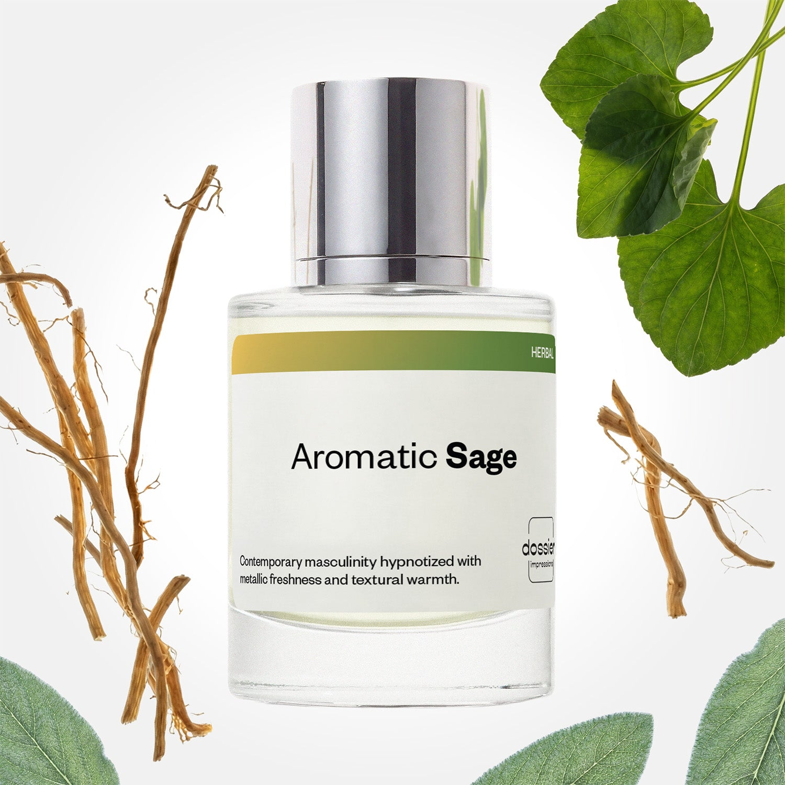

# Aromatic Sage

- **Dossier Inspired by Valentino's Born in Roma Uomo**
- **URL:** https://dossier.co/products/aromatic-sage
- **SEO title:** Aromatic Sage

## Pricing (sizes)

| Size/SKU | Member price | List price | Currency |
|---|---|---|---|
| DI50ARSUS | 28.8 | 32 | USD |

## Content (scent notes, about, editorial)

Back Home / Perfumes / Dossier Impressions / AROMATIC SAGE 

Men 

New 

Aromatic Sage

Eau de Parfum. Size: 50ml / 1.7oz 

members: $28.80

Guest:
$32

Inspired by Valentino's Born in Roma Uomo Inspired by Valentino's Born in Roma Uomo 
Inspired by Valentino's Born in Roma Uomo 

Retail price 100 Crafted in France 
Scent Family: herbal 

Add to Cart 

Scent Notes Main Notes:

Vetiver

top: The first notes you smell 
Pineapple, Pink Pepper, Waterfruits, Ginger 
middle: The heart of the perfume 
Sage, Violet leaf, Aromatic notes 
base: The notes that linger all day 
Vetiver, Benzoin, Amberwood 
ingredients: Alcohol Denat., Fragrance/Parfum, Water/Aqua/Eau, Tetramethyl Acetyloctahydronaphthalenes, Citrus Aurantium Bergamia (Bergamot) Peel Oil, Limonene, Linalyl Acetate, Benzyl Salicylate, Linalool, Citrus Limon (Lemon) Peel Oil, Coumarin, Citronellol, Pinene, Juniperus Virginiana Oil, Citrus Aurantium Peel Oil, Geraniol, Myroxylon Pereirae Oil/Extract, Alpha-Isomethyl Ionone, Benzyl Benzoate, Isoeugenyl Acetate, Citral, Geranyl Acetate, Beta-Caryophyllene, Benzyl Cinnamate, Rose Ketones, Terpineol, Terpinolene, Vanillin, Evernia Prunastri (Oakmoss) Extract, Sclareol, Alpha-Terpinene, Hexadecanolactone, Acetyl Cedrene, Menthol, Benzyl Alcohol, Isoeugenol. 

Vegan
Cruelty-free

Clean ingredients

About   Classic and contemporarily masculine, this warm, fresh, and slightly sweet fragrance is the perfect everyday scent. Modern and timeless elegance at its finest. 

Inspired by Valentino’s Born in Roma Uomo, Aromatic Sage opens with lively notes of pineapple, pink pepper, waterfruits, and ginger. The fragrance unfolds with a heart of sage, violet leaf, and aromatic notes begin to interlace with the top waterfruit notes for a refreshing, chilled metallic aroma. This cool essence warms up as the fragrance settles on the skin–––revealing a woody, textured, and delicate smoky base notes of vetiver, benzoin, and amberwood. 

Scent Intensity: Significant 

Concentration: 15%

Gender: Masculine 

Shipping
Free shipping with 2+ items. 

Standard Shipping (with 2+ items) Auto-selected with 2+ items 
FREE 

Standard Shipping Auto-selected under 2 items 
$3.95 

Express shipping: 2 business days Select in checkout 
$19.00 

Returns
Free exchanges for all. Free returns with 

Exchanges
Free exchange, 1 time per order for all.

Returns
D+ members get 1 FREE return per order.
Non-members incur a $3.99/bottle return fee, 1 time per order.
Returns must be postmarked within 30 days of the initial order. Learn More 

FAQs Are these fragrances long lasting? They are designed to be very long lasting, just like designer fragrances, in some cases even longer, depending on the composition. 
When does the new packaging come out? We'll begin rolling out our new packaging across the U.S. and international markets soon! If you want to shop IRL - our new packaging first hits stores on January 11, 2026 at Walmart. Please note that if you are shopping online, you may receive a combination of our current and new packaging while we transition our inventory. 
How will I know what scent I like? We get it, shopping for perfumes online is hard! That's why we created a scent quiz, which will find the perfect scent for you Take the quiz (opens in new tab) 
Unsure about something? Ask us! help@dossier.co 

Best Layered With Combine 2 of our perfumes to create a third scent with layering, curated by our nose. Learn more 

You Might Love 

4.4 

Rated 4.4 out of 5 stars 

Based on 81 reviews 

Reviews 81 (tab expanded) Questions (tab collapsed) 

Filters 
Write a Review (Opens in a new window) 

81 reviews 
Sort Highest Rating Most Helpful Photos & Videos Most Recent Oldest Lowest Rating Least Helpful 

KR 

Kinyell R. 

Verified Buyer 

12/28/25 

Rated 5 out of 5 stars 

In love
Get it

Read More Read more about this review 

Was this helpful? Yes, this review from Kinyell R. was helpful. 0 people voted yes No, this review from Kinyell R. was not helpful. 0 people voted no 

DP 

Dossier Perfumes 
12/28/25 
Kinyell, love that!! Happy you’re all in on this scent 😊 enjoy every spritz!

J 

Jesus 

12/24/25 

Rated 5 out of 5 stars 

5 Stars
Awesome products. Smells 90% identical and cant beat the price

Read More Read more about this review 

Was this helpful? Yes, this review from Jesus was helpful. 0 people voted yes No, this review from Jesus was not helpful. 0 people voted no 

NA 

Nino alves 

12/23/25 

Rated 5 out of 5 stars 

5 Stars
Good

Read More Read more about this review 

Was this helpful? Yes, this review from Nino alves was helpful. 0 people voted yes No, this review from Nino alves was not helpful. 0 people voted no 

NA 

Nino a. 
Verified Buyer 

12/23/25 

Rated 5 out of 5 stars 

5 Stars
Good

Read More Read more about this review 

Was this helpful? Yes, this review from Nino a. was helpful. 0 people voted yes No, this review from Nino a. was not helpful. 0 people voted no 

DP 

Dossier Perfumes 
12/23/25 
Nice, Nino! Happy it hit the mark for you. Thanks for sharing 😊

J 

jessica 
Verified Buyer 

12/18/25 

Rated 5 out of 5 stars 

5 Stars
Smells exactly like valentino! So so so good!

Read More Read more about this review 

Was this helpful? Yes, this review from jessica was helpful. 0 people voted yes No, this review from jessica was not helpful. 0 people voted no 

DP 

Dossier Perfumes 
12/18/25 
Jessica, we’re so pumped you’re loving it! Thanks for sharing the love 😊

Loading... 

Loading... 

Show More 

Inspired by  Baccarat Rouge 540 
Inspired by  Black Opium 
Inspired by  Love, Don't Be Shy 
Inspired by  Good Girl 
Inspired by  Libre 
Inspired by  Flowerbomb 
Inspired by  Light Blue 
Inspired by  Not a Perfume 
Inspired by  Aventus 
Inspired by  Bleu de Chanel 
Inspired by  Mon Paris 
Inspired by  Coco Mademoiselle 
Inspired by  Tom Ford for Men 
Inspired by  For Her 
Inspired by  J'Adore Dior 
Inspired by  Alien 
Inspired by  Black Opium Perfume 
Inspired by  Lost Cherry Perfume 

GET UP TO 30% OFF 

Find us at these retailers. 

Be the first to know. 
Submit 

Shop the following countries. United States 

Discover.
AI Scent Finder 
Blog (opens in new tab) 
Scent Family 
Layering 
Scent Quiz 

Help.
Contact Us 
Returns 
FAQ 
Testimonials 
Accessibility 

More.
Store Locator 
Boutique 
Refer A Friend 
Index 

Download our app now.

Find us at these retailers. 

Be the first to know. 
Submit 

Shop the following countries. United States 

Discover.
AI Scent Finder 
Blog (opens in new tab) 
Scent Family 
Layering 
Scent Quiz 

Help.
Contact Us 
Returns 
FAQ 
Testimonials 
Accessibility 

More.

## Main Image

