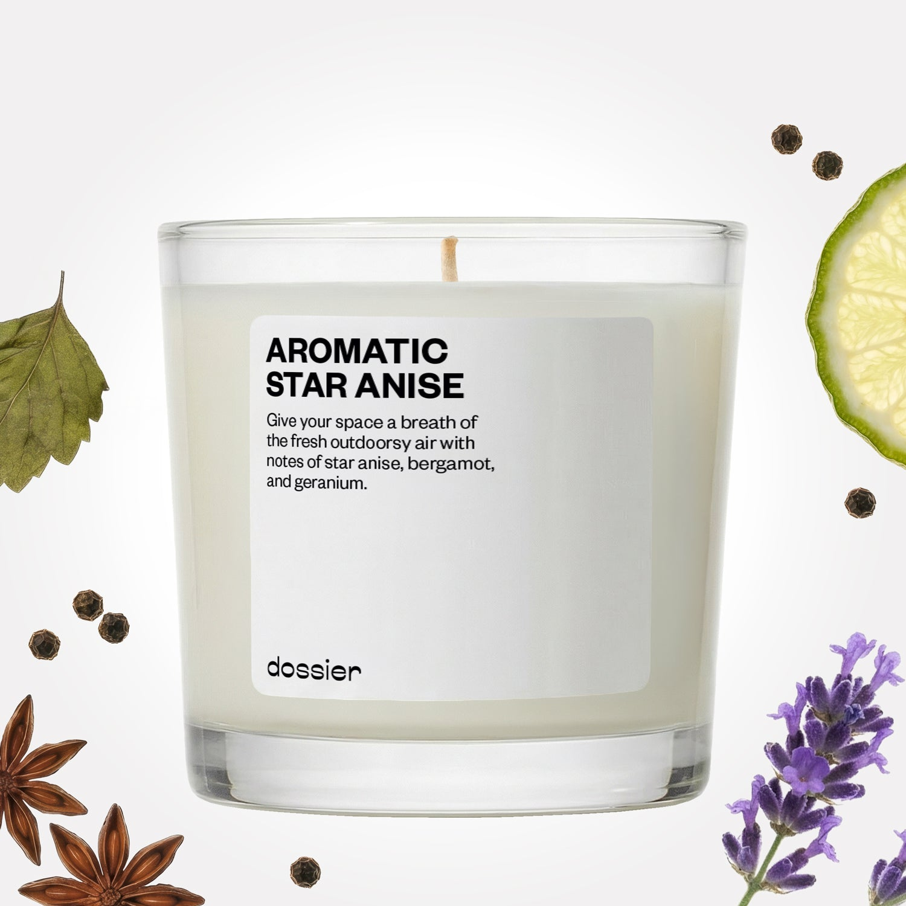

# Aromatic Star Anise Candle

- **Dossier Inspired by Dior's Sauvage Perfume**
- **URL:** https://dossier.co/products/aromatic-star-anise-candle
- **SEO title:** Aromatic Star Anise Candle: Inspired by Dior Sauvage Candle

## Pricing (sizes)

| Size/SKU | Member price | List price | Currency |
|---|---|---|---|
| 9oz | 35.1 | 39 | USD |
| 14oz | 48.6 | 54 | USD |

## Content (scent notes, about, editorial)

Back Home / Home Scents / Candles / AROMATIC STAR ANISE CANDLE 

Aromatic Star Anise Candle

Size: 14oz / 4 x 4 in. 

members: $48.60

Guest:
$54

Inspired by Dior's Sauvage Perfume Inspired by Dior's Sauvage Perfume 
Inspired by Dior's Sauvage Perfume 

Size
9oz $39

Best Value
14oz $54
OUT OF STOCK 

Crafted in France 
Scent Family: herbal 

Notify Me 

Scent Notes Main Notes:

Bergamot

Pepper

Star Anise

Geranium

top: The first notes you smell 
Bergamot, Pepper, Star Anise 
middle: The heart of the perfume 
Lavender, Nutmeg, Geranium 
base: The notes that linger all day 
Patchouli, Amberwood, Vetiver 
While Perfume Has Top, Middle, And Base Notes, Candles Burn In A Linear Pattern With A Few Main Scent Characteristics. Less Forward And Present. More Subtle And Permanent. That’s Because It’s Lit 
ingredients: Pink Pepper Ess, Elemi Ess, Chinese Geranium Ess, Lavender Ess, Patchouly Ess, Cepionate, Ambrox DL, Dihydromyrcenol, Timbersilk, Exaltolide, Linalol, Floropal, Verdox, Magnolan, Heliotropine, Cashmeran, Citral, Citronellol, Cis-3-Hexenyl Salicylate, Peonile, Coumarine, Mandarin Aldehyde, Pre Cyclemone B, Styrallyl Acetate, Ambrocenide. 

Vegan
Cruelty-free

Clean ingredients

About Bergamot, geranium, star anise, and lavender will bring a sophisticated outdoorsy atmosphere into your space. Inhale tones and subtle black pepper. Exhale your to-do list and any stresses on your mind. 

At Dossier, we not only want our products to smell amazing, but we want our consumers to feel good when they use them, too! That’s why our candles are 100% soy wax, with no additives or stabilizers. These natural formulas may cause textural irregularities on the edge of the glass, but this is completely normal and has no effect on the quality of the product. 

Tips Tips and wicks. 
Tip #1: First burn.
Your first burn should last 2 to 3 hours. Let the wax melt all across the top surface. Anything less than that will create a tunnel effect where a hole forms in the center.
A long first burn will also prevent hot wax from extinguishing your flame in the future. The scent of your candle will be stronger during the second lighting.

Tip #2: Trimmed wicks.
Hold that match! Before burning, cut your wick to about ¼ inch. This will avoid soot buildup. If you see your wick leaning, use tweezers to center it while the wax is still hot.

Tip #3: Safe storage.
Keep your candle out of direct sunlight. Ideally, your room should be 60° to 80° so your candle is not too hot or too cold — but just right. 

Tip #4: Burn time.
Each candle has a total burn time of about 25 hours before all of the wax is melted. 

Shipping + Returns
Free exchanges for all. Free returns with 

Standard Shipping (with 2+ items) Auto-selected with 2+ items 
FREE 

Standard Shipping Auto-selected under 2 items 
$3.95 

Express shipping: 2 business days Select in checkout 
$19.00 

Returns for Candles
We cannot accept any returns for candles that had been used (lit). In order to return a candle, proceed to our regular returns portal, and upload and image of your unused candle. If your candle has been used, your return request will be denied. 

You Might Love 

4.3 

Rated 4.3 out of 5 stars 

Based on 71 reviews 

Reviews 71 (tab expanded) Questions (tab collapsed) 

Filters 
Write a Review (Opens in a new window) 

71 reviews 
Sort Highest Rating Most Helpful Photos & Videos Most Recent Oldest Lowest Rating Least Helpful 

F 

Faith 
Verified Buyer 

12/15/25 

Rated 5 out of 5 stars 

5 Stars
Amazing fragrance profile!

Read More Read more about this review 

Was this helpful? Yes, this review from Faith was helpful. 0 people voted yes No, this review from Faith was not helpful. 0 people voted no 

DP 

Dossier Perfumes 
12/15/25 
We’re thrilled you’re loving it! Your comment just made our day 😊

F 

Faith 

12/15/25 

Rated 5 out of 5 stars 

5 Stars
Amazing fragrance profile!

Read More Read more about this review 

Was this helpful? Yes, this review from Faith was helpful. 0 people voted yes No, this review from Faith was not helpful. 0 people voted no 

SC 

Scarlet C. 

Verified Buyer 

11/20/25 

Rated 5 out of 5 stars 

Fantastic
favourite candle i own!

Read More Read more about this review 

Was this helpful? Yes, this review from Scarlet C. was helpful. 0 people voted yes No, this review from Scarlet C. was not helpful. 0 people voted no 

DP 

Dossier Perfumes 
11/20/25 
So thrilled our candle is your new fave, Scarlet!

K 

Kell 

7/14/25 

Rated 5 out of 5 stars 

Well Done
I'm not sure this is necessarily a home scent, but I don't mind my flat smelling like Sauvage at all.

Read More Read more about this review 

Was this helpful? Yes, this review from Kell was helpful. 0 people voted yes No, this review from Kell was not helpful. 0 people voted no 

DP 

Dossier Perfumes 
8/8/25 
Why not? 😏 So happy it’s giving your flat that signature freshness!

J 

Joyce 
Verified Buyer 

4/13/25 

Rated 5 out of 5 stars 

5 Stars
Love

Read More Read more about this review 

Was this helpful? Yes, this review from Joyce was helpful. 0 people voted yes No, this review from Joyce was not helpful. 0 people voted no 

DP 

Dossier Perfumes 
4/24/25 
One word, big energy. Joyce, we’re feeling the love right back!

Loading... 

Loading... 

Show More 

Inspired by  Baccarat Rouge 540 
Inspired by  Black Opium 
Inspired by  Love, Don't Be Shy 
Inspired by  Good Girl 
Inspired by  Libre 
Inspired by  Flowerbomb 
Inspired by  Light Blue 
Inspired by  Not a Perfume 
Inspired by  Aventus 
Inspired by  Bleu de Chanel 
Inspired by  Mon Paris 
Inspired by  Coco Mademoiselle 
Inspired by  Tom Ford for Men 
Inspired by  For Her 
Inspired by  J'Adore Dior 
Inspired by  Alien 
Inspired by  Black Opium Perfume 
Inspired by  Lost Cherry Perfume 

GET UP TO 30% OFF 

Find us at these retailers. 

Be the first to know. 
Submit 

Shop the following countries. United States 

Discover.
AI Scent Finder 
Blog (opens in new tab) 
Scent Family 
Layering 
Scent Quiz 

Help.
Contact Us 
Returns 
FAQ 
Testimonials 
Accessibility 

More.
Store Locator 
Boutique 
Refer A Friend 
Index 

Download our app now.

Find us at these retailers. 

Be the first to know. 
Submit 

Shop the following countries. United States 

Discover.
AI Scent Finder 
Blog (opens in new tab) 
Scent Family 
Layering 
Scent Quiz 

Help.
Contact Us 
Returns 
FAQ 
Testimonials 
Accessibility 

More.

## Main Image

