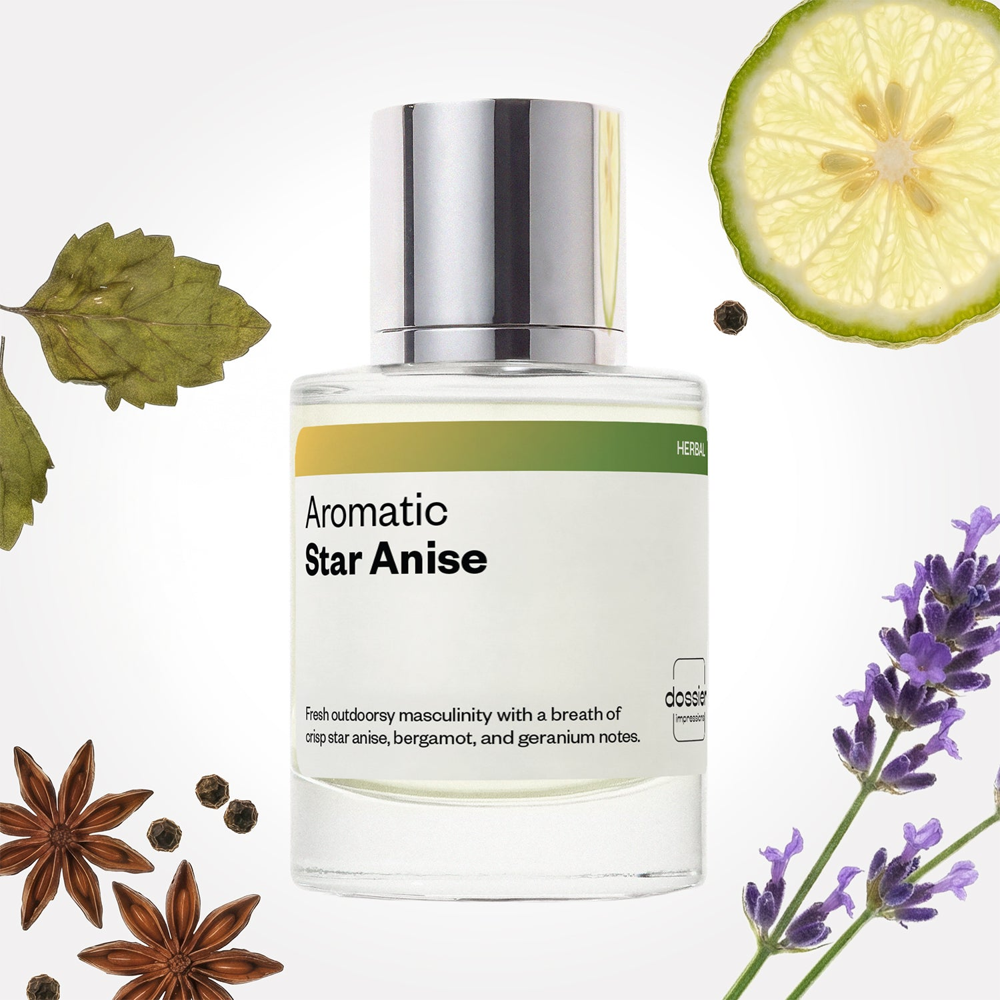

# Aromatic Star Anise

- **Dossier Inspired by Dior's Sauvage**
- **URL:** https://dossier.co/products/aromatic-star-anise
- **SEO title:** Dior Sauvage Dupe Perfume: Aromatic Star Anise - Dossier Perfumes

## Pricing (sizes)

| Size/SKU | Member price | List price | Currency |
|---|---|---|---|
| Fragrance+50ml/1.7oz | 26.1 | 29 | USD |
| 100ml | 44.1 | 49 | USD |
| BF+Free | 0 | 0 | USD |

## Content (scent notes, about, editorial)

Back Home / Perfumes / Dossier Impressions / AROMATIC STAR ANISE 

Men 

Bestseller 

Aromatic Star Anise

Eau de Parfum. Size: 100ml / 3.4oz 

members: $44.10

Guest:
$49

Inspired by Dior's Sauvage Inspired by Dior's Sauvage 
Inspired by Dior's Sauvage 

Retail price 157 Size
50ml $29

Best Value
100ml $49

Crafted in France 
Scent Family: herbal 

Add to Cart 

Scent Notes This perfume is: Full of fresh masculinity 
Main Notes:

Bergamot

Pepper

Star Anise

Geranium

top: The first notes you smell 
Bergamot, Pepper, Star Anise 
middle: The heart of the perfume 
Lavender, Nutmeg, Geranium 
base: The notes that linger all day 
Patchouli, Amberwood, Vetiver 
ingredients: Alcohol Denat., Water/Aqua/Eau, Fragrance/Parfum, Tetramethyl Acetyloctahydronaphthalenes, Linalyl Acetate, Linalool, Limonene, Hexamethylindanopyran, Citrus Aurantium Peel Oil, Pogostemon Cablin Oil, Pinene, Citrus Limon (Lemon) Peel Oil, Terpinolene, Citronellol, Coumarin, Lavandula Oil/Extract, Beta-Caryophyllene, Citral, Amyl Salicylate, Pelargonium Graveolens Flower Oil, Terpineol, Geranyl Acetate, Geraniol, Alpha-Terpinene, Vanillin, Carvone, Sclareol, Camphor, Rose Ketones. 

Vegan
Cruelty-free

Clean ingredients

About Aromatic Star Anise (inspired by Dior's Sauvage) rewrites a very classical masculine fragrance structure named "fougere" (a blend of citrus notes, lavender, geranium, and patchouli). Paired with highly qualitative raw materials and a touch of fantasy thanks to star anise, this scent delights the senses in a whole new way. 

Outdoorsy and fresh, Aromatic Star Anise (our impression of Dior's Sauvage) expresses strong, unmistakable masculinity.

Scent Intensity: Significant 

Concentration: 12%

Gender: Masculine 

Shipping
Free shipping with 2+ items. 

Standard Shipping (with 2+ items) Auto-selected with 2+ items 
FREE 

Standard Shipping Auto-selected under 2 items 
$3.95 

Express shipping: 2 business days Select in checkout 
$19.00 

Returns
Free exchanges for all. Free returns with 

Exchanges
Free exchange, 1 time per order for all.

Returns
D+ members get 1 FREE return per order.
Non-members incur a $3.99/bottle return fee, 1 time per order.
Returns must be postmarked within 30 days of the initial order. Learn More 

FAQs Are these fragrances long lasting? They are designed to be very long lasting, just like designer fragrances, in some cases even longer, depending on the composition. 
When does the new packaging come out? We'll begin rolling out our new packaging across the U.S. and international markets soon! If you want to shop IRL - our new packaging first hits stores on January 11, 2026 at Walmart. Please note that if you are shopping online, you may receive a combination of our current and new packaging while we transition our inventory. 
How will I know what scent I like? We get it, shopping for perfumes online is hard! That's why we created a scent quiz, which will find the perfect scent for you Take the quiz (opens in new tab) 
Unsure about something? Ask us! help@dossier.co 

Details We are not associated or affiliated with the brands mentioned here in any way.
Aromatic Star Anise

A World-Renowned Fragrance

Aromatic Star Anise from Dossier pays tribute to one of the most recognizable scents in the world: Sauvage by Dior.

The luxury scent that Aromatic Star Anise is inspired by is the perfect fragrance for today's man. Inspired by the wild woods, this unique blend features delicious notes of pepper, Calabrian bergamot, and vetiver. It's a combination effortlessly masculine yet sensual, a rugged beauty that breathes life into the skin.

Christian Dior first introduced the fragrance to the world in 2015. Fast forward almost a decade, and the luxury scent that Aromatic Star Anise is inspired by is still one of the most popular men's fragrances ever created.

This luxury scent that Aromatic Star Anise is inspired by comes in several variants: Dior Sauvage Eau de Parfum, Eau de Toilette, Eau de Cologne, and more recently, the Sauvage Elixir. This perfume was created by the legendary François Demachy, a master fragrance craftsman.

The luxury fragrance that Aromatic Star Anise is inspired by has a distinct, fresh citrusy scent that is more masculine than most fragrances. This raw concoction opens with a wonderfully rich bergamot layer, topped with a subtle peppery note. This is then accompanied by a flowery chorus of amberwood, vetiver, patchouli for a powerful but smooth finish.

Far from musky, the fragrance evokes an unusual freshness infused with an invigorating morning mist. It's a scent reminiscent of wild woods --- unbridled yet strangely self-aware, addictive in every way.

The exuberant portrayal of masculinity in the luxury scent that Aromatic Star Anise is inspired by is refreshing and undoubtedly contributed significantly to its phenomenal reception at launch.

The fragrance has also been praised for its longevity. A few sprays can easily keep you fresh for more than 7 hours. In addition, the luxury scent that Aromatic Star Anise is inspired by quickly fills any room with elegance thanks to an excellent projection of up to 5 feet.

If you're searching for a fresh, citrusy fragrance, Aromatic Star Anise is an affordable offer that fits any budget .

Dossier's Aromatic Star Anise is more sophisticated and richer than anything else available in the market. Designed based on the traditional French fragrance formula "fougere", which consists of a citrus scent with lavender, geranium, and patchouli notes, our take on this popular eau de toilette seduces all kinds of customers, with zero compromises on scent.

Aromatic Star Anise radiates a fresh, spicy flavor. Aside from the citrus note, you also get a delicious blend of juicy Calabrian bergamot, mandarin notes, and spiced star anise.

Best Layered With Combine 2 of our perfumes to create a third scent with layering, curated by our nose. Learn more 

You Might Love 

4.5 

Rated 4.5 out of 5 stars 

Based on 2,410 reviews 

Reviews 2,410 (tab expanded) Questions 4 (tab collapsed) 

Filters 
Write a Review (Opens in a new window) 

2,410 reviews 
Sort Highest Rating Most Helpful Photos & Videos Most Recent Oldest Lowest Rating Least Helpful 

LK 

Laura K. 
Verified Buyer 

6/15/26 

Rated 5 out of 5 stars 

Great price and great product 
I’ll be buying again!

Read More Read more about this review 

Was this helpful? Yes, this review from Laura K. was helpful. 0 people voted yes No, this review from Laura K. was not helpful. 0 people voted no 

DP 

Dossier Perfumes 
6/15/26 
Thanks Laura! We’re so happy you loved it and can’t wait for your return 😊

D 

Dominick 

6/15/26 

Rated 5 out of 5 stars 

5 Stars
Like both of them very much

Read More Read more about this review 

Was this helpful? Yes, this review from Dominick was helpful. 0 people voted yes No, this review from Dominick was not helpful. 0 people voted no 

LG 

LuWanza G. 
Verified Buyer 

6/11/26 

Rated 5 out of 5 stars 

Father’s Day Gift
Received on time hoping my husband loves it. Soon to find out 👍🏾

Read More Read more about this review 

Was this helpful? Yes, this review from LuWanza G. was helpful. 0 people voted yes No, this review from LuWanza G. was not helpful. 0 people voted no 

DP 

Dossier Perfumes 
6/11/26 
Thanks for sharing, LuWanza! We hope your husband loves it 😊

DV 

Dario V. 
Verified Buyer 

6/11/26 

Rated 5 out of 5 stars 

Good quality 
Good product 

Read More Read more about this review 
Translated from Spanish Show original 

Was this helpful? Yes, this review from Dario V. was helpful. 0 people voted yes No, this review from Dario V. was not helpful. 0 people voted no 

DP 

Dossier Perfumes 
6/11/26 
¡Gracias, Dario! Nos alegra que encuentres nuestro producto de calidad. ¡Esperamos verte pronto! 🌸

A 

Alexa 

6/4/26 

Rated 5 out of 5 stars 

5 Stars
Love it

Read More Read more about this review 

Was this helpful? Yes, this review from Alexa was helpful. 0 people voted yes No, this review from Alexa was not helpful. 0 people voted no 

Loading... 

Loading... 

Show More 

Inspired by  Baccarat Rouge 540 
Inspired by  Black Opium 
Inspired by  Love, Don't Be Shy 
Inspired by  Good Girl 
Inspired by  Libre 
Inspired by  Flowerbomb 
Inspired by  Light Blue 
Inspired by  Not a Perfume 
Inspired by  Aventus 
Inspired by  Bleu de Chanel 
Inspired by  Mon Paris 
Inspired by  Coco Mademoiselle 
Inspired by  Tom Ford for Men 
Inspired by  For Her 
Inspired by  J'Adore Dior 
Inspired by  Alien 
Inspired by  Black Opium Perfume 
Inspired by  Lost Cherry Perfume 

GET UP TO 30% OFF 

Find us at these retailers. 

Be the first to know. 
Submit 

Shop the following countries. United States 

Discover.
AI Scent Finder 
Blog (opens in new tab) 
Scent Family 
Layering 
Scent Quiz 

Help.
Contact Us 
Returns 
FAQ 
Testimonials 
Accessibility 

More.
Store Locator 
Boutique 
Refer A Friend 
Index 

Download our app now.

Find us at these retailers. 

Be the first to know. 
Submit 

Shop the following countries. United States 

Discover.
AI Scent Finder 
Blog (opens in new tab) 
Scent Family 
Layering 
Scent Quiz 

Help.
Contact Us 
Returns 
FAQ 
Testimonials 
Accessibility 

More.

## Main Image

