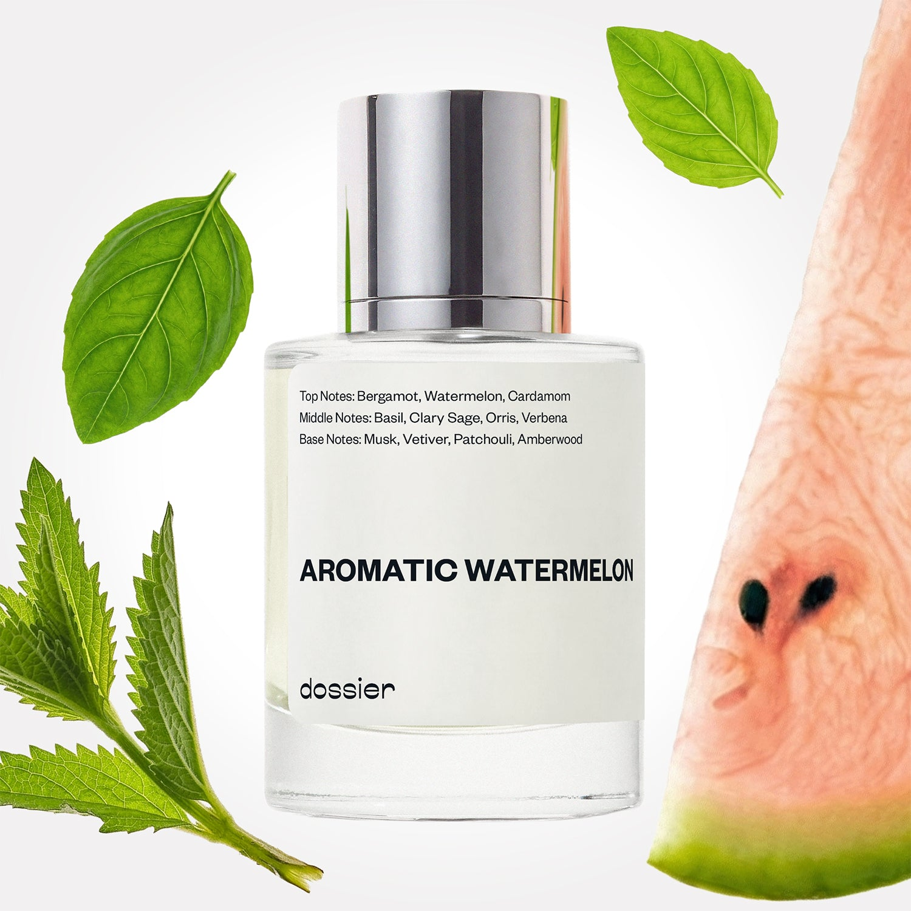

# Aromatic Watermelon

- **Dossier Inspired by Ralph Lauren's Polo Blue**
- **URL:** https://dossier.co/products/aromatic-watermelon
- **SEO title:** Ralph Lauren's Polo Blue Dupe Perfume: Aromatic Watermelon - Dossier Perfumes

## Pricing (sizes)

| Size/SKU | Member price | List price | Currency |
|---|---|---|---|
| 14165099053123 | 28.8 | 32 | USD |

## Content (scent notes, about, editorial)

Back Home / Perfumes / Dossier Impressions / AROMATIC WATERMELON 

Men 

It's back! 

Aromatic Watermelon

Eau de Toilette. Size: 50ml / 1.7oz 

members: $28.80

Guest:
$32

Inspired by Ralph Lauren's Polo Blue Inspired by Ralph Lauren's Polo Blue 
Inspired by Ralph Lauren's Polo Blue 

Retail price 95 Crafted in France 
Scent Family: herbal 

Add to Cart 

Scent Notes This perfume is: Fruity and sun drenched 
Main Notes:

Watermelon

Basil

Verbena

top: The first notes you smell 
Bergamot, Watermelon, Cardamon 
middle: The heart of the perfume 
Basil, Clary Sage, Orris, Verbena 
base: The notes that linger all day 
Musk, Vetiver, Patchouli, Amberwood 
ingredients: Alcohol Denat., Water/Aqua/Eau, Fragrance/Parfum, Hexamethylindanopyran, Tetramethyl Acetyloctahydronaphthalenes, Linalool, Linalyl Acetate, Pogostemon Cablin Oil, Limonene, Alpha-Isomethyl Ionone, Citrus Aurantium Peel Oil, Hexyl Cinnamal, Benzyl Salicylate, Citronellol, Acetyl Cedrene, Pinene, Beta-Caryophyllene, Hydroxycitronellal, Citral, Terpinolene, Eugenol, Isoeugenol, Terpineol, Hexadecanolactone, Geraniol, Camphor, Geranyl Acetate. 

Vegan
Cruelty-free

Clean ingredients

About Aromatic Watermelon (inspired by Ralph Lauren's Polo Blue) opens with a refreshing top of water fruits, basil, and verbena. This cooling effect lasts throughout, sustained by a subtle and sophisticated aromatic, woody, orris base.

Fresh, casual, and elegant at the same time, Aromatic Watermelon (our impression of Ralph Lauren's Polo Blue) is an outdoor fragrance, evoking sun-drenched days and salty, oceanside breezes. 

Scent Intensity: Significant 

Concentration: 12%

Gender: Masculine 

Shipping
Free shipping with 2+ items. 

Standard Shipping (with 2+ items) Auto-selected with 2+ items 
FREE 

Standard Shipping Auto-selected under 2 items 
$3.95 

Express shipping: 2 business days Select in checkout 
$19.00 

Returns
Free exchanges for all. Free returns with 

Exchanges
Free exchange, 1 time per order for all.

Returns
D+ members get 1 FREE return per order.
Non-members incur a $3.99/bottle return fee, 1 time per order.
Returns must be postmarked within 30 days of the initial order. Learn More 

FAQs Are these fragrances long lasting? They are designed to be very long lasting, just like designer fragrances, in some cases even longer, depending on the composition. 
When does the new packaging come out? We'll begin rolling out our new packaging across the U.S. and international markets soon! If you want to shop IRL - our new packaging first hits stores on January 11, 2026 at Walmart. Please note that if you are shopping online, you may receive a combination of our current and new packaging while we transition our inventory. 
How will I know what scent I like? We get it, shopping for perfumes online is hard! That's why we created a scent quiz, which will find the perfect scent for you Take the quiz (opens in new tab) 
Unsure about something? Ask us! help@dossier.co 

Details We are not associated or affiliated with the brands mentioned here in any way.
Aromatic Watermelon

Edge and vigor in a bottle

An essence of lively masculinity and joyous charm, the Ralph Lauren Polo Blue cologne (the fragrance that inspired Dossier’s Aromatic Watermelon) is a blend of the unrefined elements of nature that mingles with musky boldness. The luxury fragrance that Aromatic Watermelon is inspired by holds itself with primitive pride while still subtly offering an arresting air of elegance.

Created with a continuous evolution of scents, the luxury fragrance that Aromatic Watermelon is inspired by reveals the refreshing tones of this fragrance in a mingling cocktail of buoyancy and edge. At its opening, the top tones of the luxury fragrance that Aromatic Watermelon is inspired by are a stimulating blend of fresh cucumber, mouth-watering melon, and citrusy orange to create a fruitful fusion of the crisp and fresh, enhancing the natural scent of masculinity. This opens the door to the radiant middle tones of this fragrance: freshly picked basil, geranium, and deep notes of sage.

Last but not least, lively green notes darken to awaken the senses by inviting the heavenly base notes of woody suede and musk. This leathery finale allows the luxury fragrance that Aromatic Watermelon is inspired by to finesse the attention of anyone who happens to catch the earthliness of such a scent. This cologne is a carnal feast of aromas that are fused to embody an air of handsome charm, while retaining the multidimensional mix of fruit and floral.

To complement the freshness of the luxury fragrance that Aromatic Watermelon is inspired by, it is adorned in a strikingly royal blue bottle that stands with elegance and indulgence. Donning only Ralph Lauren’s notorious logo on the front, the simplicity of the design emulates the sleekness of the pelican, uncomplicated and adaptable to whatever you want it to be.

ou can buy the Ralph Lauren Polo Blue Eau de Parfum from online retailers in a smaller size of 40 ml (1.3 oz) for $55.00 or a larger 125 ml (4.2 oz) bottle for $108.00. You can also get the 175 ml body spray for $23.00. And if you want to pamper a special someone, you may find the gift set attuned to your needs. It includes the 125 ml cologne, a 30 ml travel spray, and the 100 ml shower gel, and goes for $113.00.

To experience the elegance of this earthly and vigorous scent for a cheaper price tag, look no further than Dossier’s Aromatic Watermelon. Our Ralph Lauren Polo Blue dupe is laced with carefully harnessed notes of love. It opens with refreshing top notes of basil paired with a citrusy and floral concoction and deals another hand with the secret twist of tantalizing verbena, adding an arresting air of coolness to the fragrance. A casual fragrance that proposes longevity and a charming attractiveness, our Aromatic Watermelon offers nonchalance without compromising on appeal and charm.

You Might Love 

4.5 

Rated 4.5 out of 5 stars 

Based on 536 reviews 

Reviews 536 (tab expanded) Questions 1 (tab collapsed) 

Filters 
Write a Review (Opens in a new window) 

536 reviews 
Sort Highest Rating Most Helpful Photos & Videos Most Recent Oldest Lowest Rating Least Helpful 

SL 

Shannon L. 
Verified Buyer 

3/9/26 

Rated 5 out of 5 stars 

If I could only wear one perfume...
Ok, I'm a huge perfume fan.. I know this is meant for men but it's so lovely!! Since receiving it, I wear it all the time and get so many compliments! 

Read More Read more about this review 

Was this helpful? Yes, this review from Shannon L. was helpful. 0 people voted yes No, this review from Shannon L. was not helpful. 0 people voted no 

DP 

Dossier Perfumes 
3/9/26 
Hey Shannon, love that this scent has you reaching for it daily. And those compliments? Totally deserved. Thanks for sharing how it surprised you in the best way!

A 

APRIL 

3/4/26 

Rated 5 out of 5 stars 

5 Stars
Smells absolutely amazing

Read More Read more about this review 

Was this helpful? Yes, this review from APRIL was helpful. 0 people voted yes No, this review from APRIL was not helpful. 0 people voted no 

L 

Lord 

1/7/26 

Rated 5 out of 5 stars 

5 Stars
love this one for an everyday/quick/clean scent

Read More Read more about this review 

Was this helpful? Yes, this review from Lord was helpful. 0 people voted yes No, this review from Lord was not helpful. 0 people voted no 

L 

Lord 
Verified Buyer 

1/7/26 

Rated 5 out of 5 stars 

5 Stars
love this one for an everyday/quick/clean scent

Read More Read more about this review 

Was this helpful? Yes, this review from Lord was helpful. 0 people voted yes No, this review from Lord was not helpful. 0 people voted no 

DP 

Dossier Perfumes 
1/7/26 
Love that, Lord! We’re so happy it’s your everyday quick pick-me-up!

DC 

Dolores C. 

Verified Buyer 

1/6/26 

Rated 5 out of 5 stars 

very unique scent
very unique scent

Read More Read more about this review 

Was this helpful? Yes, this review from Dolores C. was helpful. 0 people voted yes No, this review from Dolores C. was not helpful. 0 people voted no 

DP 

Dossier Perfumes 
1/6/26 
Dolores, woohoo! So cool you’re loving what makes this scent feel special 😊

Loading... 

Loading... 

Show More 

Inspired by  Baccarat Rouge 540 
Inspired by  Black Opium 
Inspired by  Love, Don't Be Shy 
Inspired by  Good Girl 
Inspired by  Libre 
Inspired by  Flowerbomb 
Inspired by  Light Blue 
Inspired by  Not a Perfume 
Inspired by  Aventus 
Inspired by  Bleu de Chanel 
Inspired by  Mon Paris 
Inspired by  Coco Mademoiselle 
Inspired by  Tom Ford for Men 
Inspired by  For Her 
Inspired by  J'Adore Dior 
Inspired by  Alien 
Inspired by  Black Opium Perfume 
Inspired by  Lost Cherry Perfume 

GET UP TO 30% OFF 

Find us at these retailers. 

Be the first to know. 
Submit 

Shop the following countries. United States 

Discover.
AI Scent Finder 
Blog (opens in new tab) 
Scent Family 
Layering 
Scent Quiz 

Help.
Contact Us 
Returns 
FAQ 
Testimonials 
Accessibility 

More.
Store Locator 
Boutique 
Refer A Friend 
Index 

Download our app now.

Find us at these retailers. 

Be the first to know. 
Submit 

Shop the following countries. United States 

Discover.
AI Scent Finder 
Blog (opens in new tab) 
Scent Family 
Layering 
Scent Quiz 

Help.
Contact Us 
Returns 
FAQ 
Testimonials 
Accessibility 

More.

## Main Image

