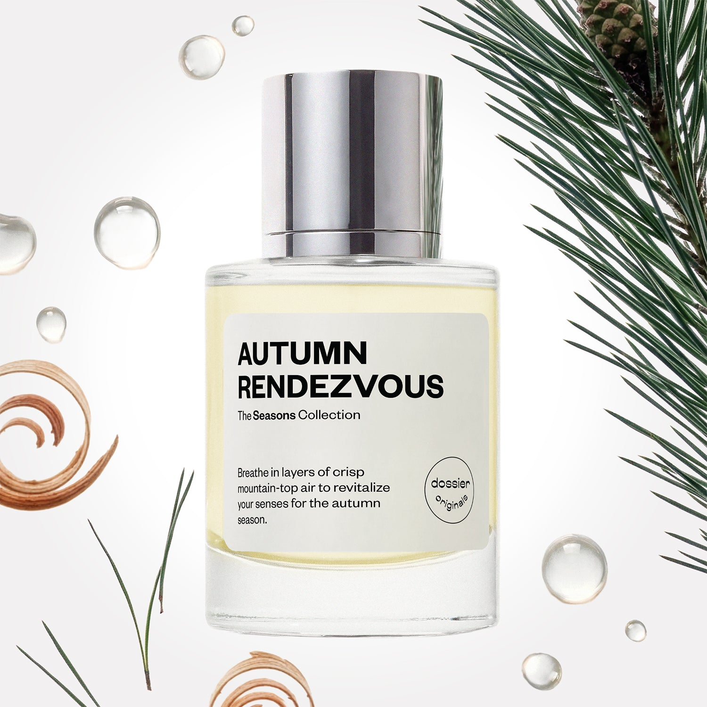

# Autumn Rendezvous

- **Dossier Dossier Originals**
- **URL:** https://dossier.co/products/autumn-rendezvous
- **SEO title:** Autumn Rendezvous

## Pricing (sizes)

| Size/SKU | Member price | List price | Currency |
|---|---|---|---|
| 42335055872067 | 35.1 | 39 | USD |

## Content (scent notes, about, editorial)

Back Home / Perfumes / Dossier Originals / AUTUMN RENDEZVOUS 

Unisex 

Autumn Rendezvous

Eau de Parfum. Size: 50ml / 1.7oz 

members: $35.10

Guest:
$39

Dossier Originals: The seasons collection 

With The Seasons Collection, we’ve bottled the distinctive sights, tastes, and emotions that capture the core memories and essence of these 4 distinctive times of the year. 
Crafted in France 
Scent Family: herbal 

Add to Cart 

Scent Notes Main Notes:

Rosemary

Fresh Air Accord

Pine

Fir Tree

Cedarwood

top: The first notes you smell 
Rosemary, Fresh Air Accord, Cassis, Green Notes 
middle: The heart of the perfume 
Pine Ess, Lavender, Violet, Muguet, Incense 
base: The notes that linger all day 
Fir Tree, Cedarwood, Sandalwood, Patchouli, Moss 
ingredients: Alcohol Denat., Fragrance/Parfum, Water/Aqua/Eau, Tetramethyl Acetyloctahydronaphthalenes, Hydroxycitronellal, Juniperus Virginiana Oil, Pogostemon Cablin Oil, Pinene, Coumarin, Limonene, Beta-Caryophyllene, Linalool, Linalyl Acetate, Santalum Album (Sandalwood) Oil, Terpineol, Santalol, Camphor, Benzyl Benzoate, Terpinolene, Vanillin, Eugenol, Alpha-Terpinene, Geranyl Acetate, Citronellol, Geraniol, Isoeugenol. 

Vegan
Cruelty-free

Clean ingredients

About A brisk autumn breeze on a hike that clears and revitalizes your mind, bottled into a fragrance. This fragrance captures all the sensory treasures of a seasonal stroll––the pure and crisp air, breezy and fresh greenery, and comforting warmth that makes autumn so inviting. 

Autumn Rendezvous refreshes your senses with opening notes of rosemary and fresh air accord with cassis and green notes. It then evolves to earthy notes of pine ess paired with lavender, violet, muguet, and incense at the heart. While still crisp, the scent warms up as it dries down with base notes of fir tree and cedarwood intermingled with sandalwood, patchouli, and moss. 

Enjoy a fresh, warm, woody, rich, and luscious aroma that primes your senses for the cold weather ahead.

Scent Intensity: Significant 

Concentration: 18%

Gender: Unisex 

Shipping
Free shipping with 2+ items. 

Standard Shipping (with 2+ items) Auto-selected with 2+ items 
FREE 

Standard Shipping Auto-selected under 2 items 
$3.95 

Express shipping: 2 business days Select in checkout 
$19.00 

Returns
Free exchanges for all. Free returns with 

Exchanges
Free exchange, 1 time per order for all.

Returns
D+ members get 1 FREE return per order.
Non-members incur a $3.99/bottle return fee, 1 time per order.
Returns must be postmarked within 30 days of the initial order. Learn More 

FAQs Are these fragrances long lasting? They are designed to be very long lasting, just like designer fragrances, in some cases even longer, depending on the composition. 
When does the new packaging come out? We'll begin rolling out our new packaging across the U.S. and international markets soon! If you want to shop IRL - our new packaging first hits stores on January 11, 2026 at Walmart. Please note that if you are shopping online, you may receive a combination of our current and new packaging while we transition our inventory. 
How will I know what scent I like? We get it, shopping for perfumes online is hard! That's why we created a scent quiz, which will find the perfect scent for you Take the quiz (opens in new tab) 
Unsure about something? Ask us! help@dossier.co 

Best Layered With Combine 2 of our perfumes to create a third scent with layering, curated by our nose. Learn more 

You Might Love 

4.1 

Rated 4.1 out of 5 stars 

Based on 45 reviews 

Reviews 45 (tab expanded) Questions (tab collapsed) 

Filters 
Write a Review (Opens in a new window) 

45 reviews 
Sort Highest Rating Most Helpful Photos & Videos Most Recent Oldest Lowest Rating Least Helpful 

RV 

Rachel V. 
Verified Buyer 

6/22/26 

Rated 5 out of 5 stars 

So strong and wonderful 
This is the most intense perfume I have ever tried. I put it on my pulse points and went to dinner then got home and went to bed. I could still smell it when I woke up the next day! So good! This is like an evergreen Forrest. So calm so green smelling. Absolutely wearing to work. 

Read More Read more about this review 

Was this helpful? Yes, this review from Rachel V. was helpful. 0 people voted yes No, this review from Rachel V. was not helpful. 0 people voted no 

DP 

Dossier Perfumes 
6/22/26 
Rachel, wow we love to hear how that evergreen vibe kept you company all night and into your workday. Keep enjoying those calm green feels and thanks for sharing!

N 

Noemi 

6/6/26 

Rated 5 out of 5 stars 

5 Stars
Fast and fabulous! Autumn rendezvous is so good.

Read More Read more about this review 

Was this helpful? Yes, this review from Noemi was helpful. 0 people voted yes No, this review from Noemi was not helpful. 0 people voted no 

M 

Mathew 

6/1/26 

Rated 5 out of 5 stars 

5 Stars
This is by far my favorite scent from the Dossier Original line! As an Autumn baby, it fully encapsulates the scent i have been searching a whole year for! Astoundingly earthy smell that seems to simulate a somewhat vanilla-ish note as it completes its drying period. I may have to buy another bottle in case it goes out of stock like the other originals have been.

Read More Read more about this review 

Was this helpful? Yes, this review from Mathew was helpful. 0 people voted yes No, this review from Mathew was not helpful. 0 people voted no 

M 

Meg 
Verified Buyer 

5/29/26 

Rated 5 out of 5 stars 

Smells like a walk through the woods!
Really love this scent quite a bit. It’s a perfect scent for autumn and winter too. Smells like a snow covered pine forest!

Read More Read more about this review 

Was this helpful? Yes, this review from Meg was helpful. 0 people voted yes No, this review from Meg was not helpful. 0 people voted no 

DP 

Dossier Perfumes 
5/29/26 
Meg, love that this scent takes you on a snowy pine forest stroll! Perfect for autumn and winter.

J 

John 
Verified Buyer 

4/3/26 

Rated 5 out of 5 stars 

Dayum son where'd you find this?
If you love the outdoor and taking a hike in the Rocky Mountains, here ya go. I love the outdoors and pine smells. This might not be for the faint of heart if you don't like spruce like smells. But it's fresh and piney. Good if you're a part time hippie who is tired of patchouli.

Read More Read more about this review 

Was this helpful? Yes, this review from John was helpful. 0 people voted yes No, this review from John was not helpful. 0 people voted no 

DP 

Dossier Perfumes 
4/3/26 
Hey John! We love how you’re channeling those Rocky Mountain pine feels. It’s awesome to find a scent that matches your outdoor spirit. Thanks for sharing your fresh, piney take! 😊

Loading... 

Loading... 

Show More 

Inspired by  Baccarat Rouge 540 
Inspired by  Black Opium 
Inspired by  Love, Don't Be Shy 
Inspired by  Good Girl 
Inspired by  Libre 
Inspired by  Flowerbomb 
Inspired by  Light Blue 
Inspired by  Not a Perfume 
Inspired by  Aventus 
Inspired by  Bleu de Chanel 
Inspired by  Mon Paris 
Inspired by  Coco Mademoiselle 
Inspired by  Tom Ford for Men 
Inspired by  For Her 
Inspired by  J'Adore Dior 
Inspired by  Alien 
Inspired by  Black Opium Perfume 
Inspired by  Lost Cherry Perfume 

GET UP TO 30% OFF 

Find us at these retailers. 

Be the first to know. 
Submit 

Shop the following countries. United States 

Discover.
AI Scent Finder 
Blog (opens in new tab) 
Scent Family 
Layering 
Scent Quiz 

Help.
Contact Us 
Returns 
FAQ 
Testimonials 
Accessibility 

More.
Store Locator 
Boutique 
Refer A Friend 
Index 

Download our app now.

Find us at these retailers. 

Be the first to know. 
Submit 

Shop the following countries. United States 

Discover.
AI Scent Finder 
Blog (opens in new tab) 
Scent Family 
Layering 
Scent Quiz 

Help.
Contact Us 
Returns 
FAQ 
Testimonials 
Accessibility 

More.

## Main Image

