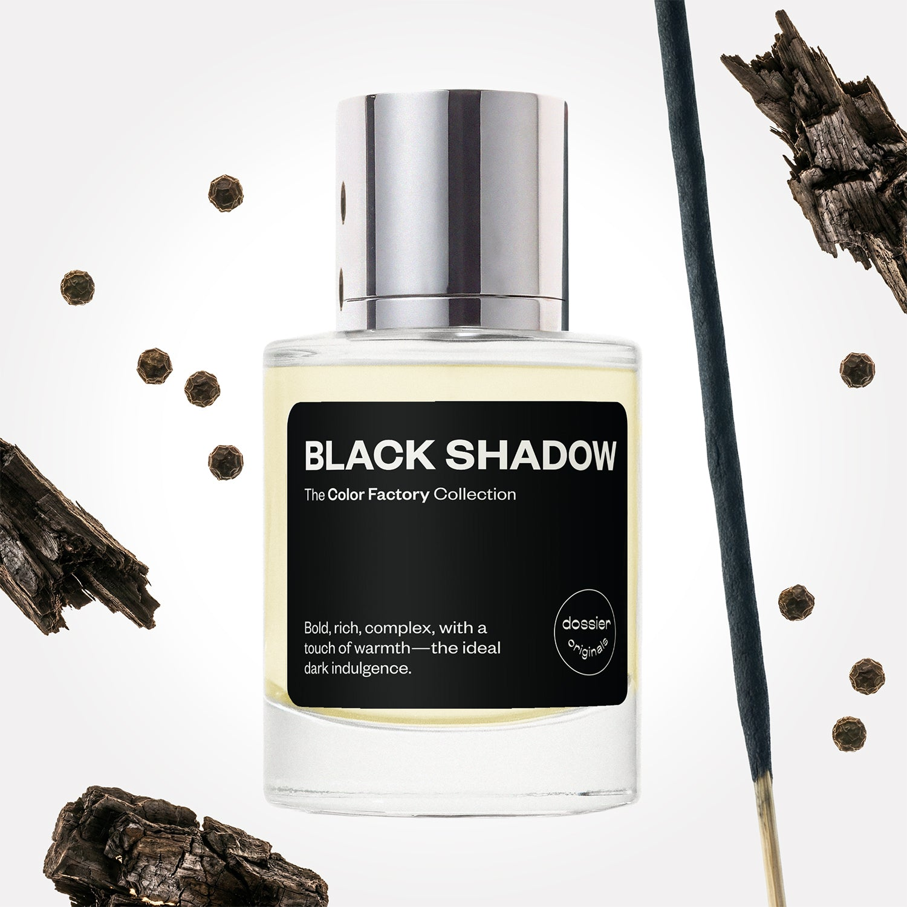

# Black Shadow

- **Dossier Dossier Originals**
- **URL:** https://dossier.co/products/black-shadow
- **SEO title:** Black Shadow

## Pricing (sizes)

| Size/SKU | Member price | List price | Currency |
|---|---|---|---|
| 41570658648131 | 35.1 | 39 | USD |

## Content (scent notes, about, editorial)

Back Home / Perfumes / Dossier Originals / BLACK SHADOW 

Unisex 

New 

Black Shadow

Eau de Parfum. Size: 50ml / 1.7oz 

members: $35.10

Guest:
$39

Dossier Originals: The color factory collection 

Crafted in France 
Scent Family: earthy 

Add to Cart 

Scent Notes Main Notes:

Black Pepper

Cade Wood

Incense

Guaiac Wood

top: The first notes you smell 
Black Pepper, Elemi, Cade wood 
middle: The heart of the perfume 
Incense, Cardamom, Black Coffee 
base: The notes that linger all day 
Black Vanilla, Ambroxan, Guaiacwood 
ingredients: Alcohol Denat., Fragrance/Parfum, Tetramethyl Acetyloctahydronaphthalenes, Water/Aqua/Eau, Pinene, Limonene, Beta-Caryophyllene, Acetyl Cedrene, Linalyl Acetate, Terpineol, Linalool, Terpinolene, Geraniol, Carvone, Farnesol, Citral. 

Vegan
Cruelty-free

Clean ingredients

About Intense and woody, Black Shadow atomizes understated luxury and sophistication. It intertwines effortless elegance with the mystery of the night, featuring an evocative blend of warm spices, vibrant woods, and earthy balsamic notes. 

The fragrance first seduces your senses through a mélange of spicy black pepper and leathery cade wood before enveloping your skin with warm spice, resinous, and slightly bitter lusciousness with a piercing black coffee heart. 

Black Shadow dries down to black vanilla and guaiac wood base to echo a smoky woodiness and ambery warmth that will leave you in a delightful, elevated trance. 

Scent Intensity: Statement 

Concentration: 20%

Gender: Unisex 

Shipping
Free shipping with 2+ items. 

Standard Shipping (with 2+ items) Auto-selected with 2+ items 
FREE 

Standard Shipping Auto-selected under 2 items 
$3.95 

Express shipping: 2 business days Select in checkout 
$19.00 

Returns
Free exchanges for all. Free returns with 

Exchanges
Free exchange, 1 time per order for all.

Returns
D+ members get 1 FREE return per order.
Non-members incur a $3.99/bottle return fee, 1 time per order.
Returns must be postmarked within 30 days of the initial order. Learn More 

FAQs Are these fragrances long lasting? They are designed to be very long lasting, just like designer fragrances, in some cases even longer, depending on the composition. 
When does the new packaging come out? We'll begin rolling out our new packaging across the U.S. and international markets soon! If you want to shop IRL - our new packaging first hits stores on January 11, 2026 at Walmart. Please note that if you are shopping online, you may receive a combination of our current and new packaging while we transition our inventory. 
How will I know what scent I like? We get it, shopping for perfumes online is hard! That's why we created a scent quiz, which will find the perfect scent for you Take the quiz (opens in new tab) 
Unsure about something? Ask us! help@dossier.co 

Best Layered With Combine 2 of our perfumes to create a third scent with layering, curated by our nose. Learn more 

You Might Love 

4.0 

Rated 4.0 out of 5 stars 

Based on 104 reviews 

Reviews 104 (tab expanded) Questions (tab collapsed) 

Filters 
Write a Review (Opens in a new window) 

104 reviews 
Sort Highest Rating Most Helpful Photos & Videos Most Recent Oldest Lowest Rating Least Helpful 

LH 

Laura H. 
Verified Buyer 

6/20/26 

Rated 5 out of 5 stars 

Catholic Mass in a Bottle
I really enjoy this fragrance for the scent memories it brings up. The blend of warm, sm*key, and pepper-y scents reminds me of holiday mass as a kid, where they would light incense, the smell of the wooden pews, the whole thing. As for the scent itself, it's very well blended and personally I find it androgynous. I understand people seeing it as masculine for it's very wo*dy and earthy profile, but to me the smell of trees isn't gendered, you just have to like smelling like trees. Personally, I love that. I also like how the wo*d notes aren't super dry (think pickled sandalwood) or super wet (think oakmoss), they're just full and rich. The scent feels alive. Very well blended, and it seems to stay a mostly consistent scent throughout the wear (I don't get super distinct top, middle, and base phases). Longevity is ok on skin, but it lasts a long time on clothes. It also layers well with a variety of fragrances, my favorite of which so far is with Spicy Mimosa from Dossier. 

Read More Read more about this review 

Was this helpful? Yes, this review from Laura H. was helpful. 0 people voted yes No, this review from Laura H. was not helpful. 0 people voted no 

DP 

Dossier Perfumes 
6/20/26 
Hey Laura! We love that this scent brings back such cozy holiday mass memories. It’s great to hear it wears consistently and layers nicely. Thanks for sharing your experience!

SC 

Sam C. 
Verified Buyer 

6/19/26 

Rated 5 out of 5 stars 

Dossier have oudone themselves again.
I've been using Dossier products for a while now. I've held off on purchasing from the Dossier originals line so this was my first one. I don't know why I have always been skeptical of the Dossier originals since I know Dossier is good based on their impressions alone. But man am I glad to have tried this one. This scent is so deep and rich, it feels like I'm physically wearing a million dollars somehow. If you could wear a large amount of money, this would be the closest way to do it. If you're thinking about getting this one, just get it. I will definitely be trying out the other Originals. Thanks Dossier :)

Read More Read more about this review 

Was this helpful? Yes, this review from Sam C. was helpful. 0 people voted yes No, this review from Sam C. was not helpful. 0 people voted no 

DP 

Dossier Perfumes 
6/19/26 
Sam, we’re thrilled our Originals pick feels so luxe for you. Thanks for trusting us and sharing all that love. Can’t wait for you to explore more Originals!

K 

Kate 

6/7/26 

Rated 5 out of 5 stars 

5 Stars
A unique scent with a dark twist. This perfume has a scent of black pepper, black coffee and incense. Its like nothing i have ever smelled before in one perfume. It truly earns the name Black Shadow.

Read More Read more about this review 

Was this helpful? Yes, this review from Kate was helpful. 0 people voted yes No, this review from Kate was not helpful. 0 people voted no 

J 

Jordan 
Verified Reviewer 

5/29/26 

Rated 5 out of 5 stars 

Not for me, but delicious for a guy
I love this for a guy, but for me it's way too masculine, thank you very much (*flicks skirt and reapplies lipgloss). I like a lot of unisex scents that say "fresh from the woods/ the garden/the orchard" or something (I'm looking at you, Jo Malone). This fragrance is not that.
I wasn't sure what to expect with this scent, but it wasn't something SOOOO super masculine. If I smelled a guy wearing this, I'd walk past him a few times taking big whiffs, before changing tactics to "conveniently" hover nearby to get a few more deep inhales. He'd for sure alert security, but I think it would be worth it.
This is giving black t-shirt, old jeans, and leather duffle. It's giving grown man energy infused with pepper, wood and grilling out on a cool, quiet night with my buddy from the navy and nowhere pressing to be. It's easy confidence and slow-living, casually sipping on a steaming cup of black coffee. 
The dude wearing this learned how to change a tire when he was 7 and mowed his neighbor's front lawn every saturday because she was old and his daddy had him doin' their lawn anyway. He can't remember the last time he didn't hold the door for a woman, never saw the appeal of getting so ticked off at a bar that it led to a fight, and doesn't say much more than is required to get the point across. 
It's giving, "yes I'm an alpha male, but I have sunday movie nights with my mama like clockwork, and I got 3 baby sisters who got this as a present, and they seem to know about this sorta…

Read More Read more about this review 

Was this helpful? Yes, this review from Jordan was helpful. 0 people voted yes No, this review from Jordan was not helpful. 0 people voted no 

DP 

Dossier Perfumes 
5/29/26 
Hey Jordan! Totally get it – sometimes a scent lands stronger than we expect, but we love how clearly you see that easygoing guy energy. If you’d like something more garden-fresh, you can explore our catalog or reach out at help@dossier.co anytime 😊

S 

Season 

4/19/26 

Rated 5 out of 5 stars 

5 Stars
Absolutely amazing smell. Lasts all day! I have been asked what am I wearing almost every time I have it on.

Read More Read more about this review 

Was this helpful? Yes, this review from Season was helpful. 0 people voted yes No, this review from Season was not helpful. 0 people voted no 

Loading... 

Loading... 

Show More 

Inspired by  Baccarat Rouge 540 
Inspired by  Black Opium 
Inspired by  Love, Don't Be Shy 
Inspired by  Good Girl 
Inspired by  Libre 
Inspired by  Flowerbomb 
Inspired by  Light Blue 
Inspired by  Not a Perfume 
Inspired by  Aventus 
Inspired by  Bleu de Chanel 
Inspired by  Mon Paris 
Inspired by  Coco Mademoiselle 
Inspired by  Tom Ford for Men 
Inspired by  For Her 
Inspired by  J'Adore Dior 
Inspired by  Alien 
Inspired by  Black Opium Perfume 
Inspired by  Lost Cherry Perfume 

GET UP TO 30% OFF 

Find us at these retailers. 

Be the first to know. 
Submit 

Shop the following countries. United States 

Discover.
AI Scent Finder 
Blog (opens in new tab) 
Scent Family 
Layering 
Scent Quiz 

Help.
Contact Us 
Returns 
FAQ 
Testimonials 
Accessibility 

More.
Store Locator 
Boutique 
Refer A Friend 
Index 

Download our app now.

Find us at these retailers. 

Be the first to know. 
Submit 

Shop the following countries. United States 

Discover.
AI Scent Finder 
Blog (opens in new tab) 
Scent Family 
Layering 
Scent Quiz 

Help.
Contact Us 
Returns 
FAQ 
Testimonials 
Accessibility 

More.

## Main Image

