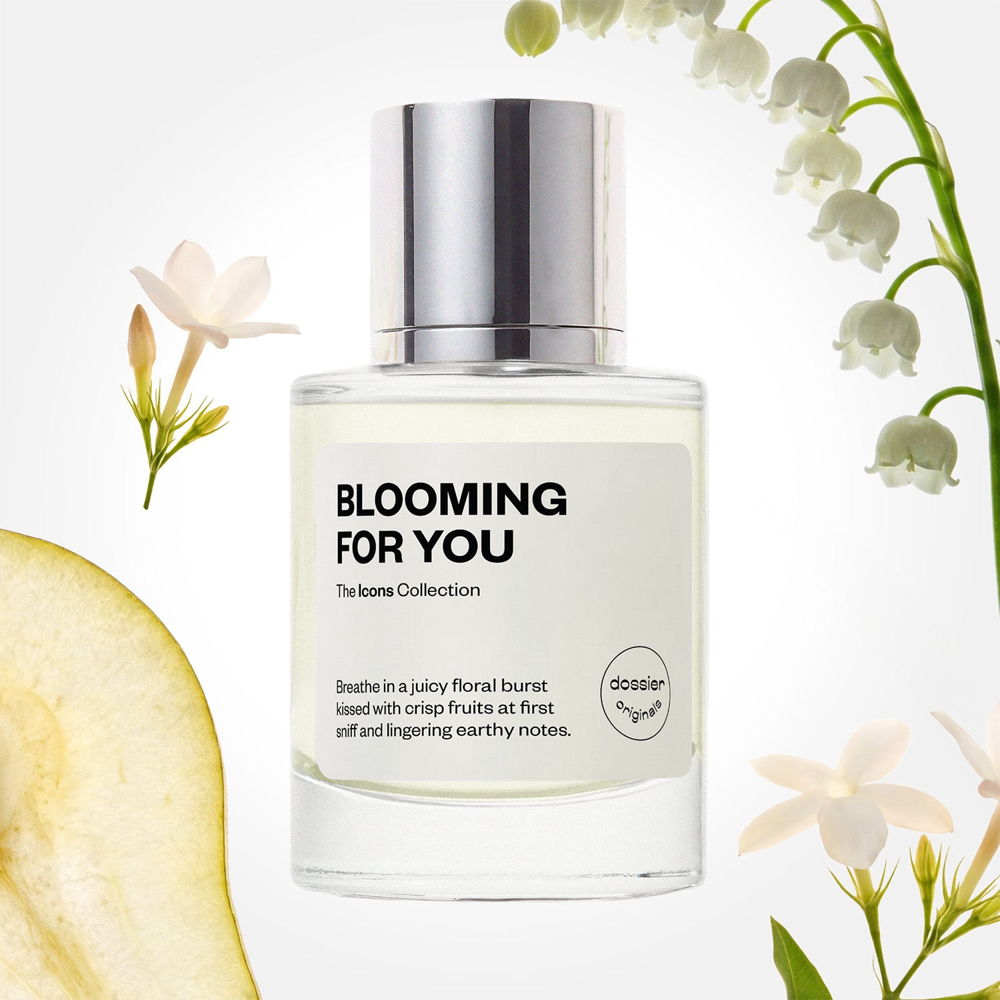

# Blooming For You

- **Dossier Dossier Originals**
- **URL:** https://dossier.co/products/blooming-for-you
- **SEO title:** Blooming For You

## Pricing (sizes)

| Size/SKU | Member price | List price | Currency |
|---|---|---|---|
| BLFY050ORUSP2XX | 35.1 | 39 | USD |
| 10 | 0 | 0 | USD |

## Content (scent notes, about, editorial)

Back Home / Perfumes / Dossier Originals / BLOOMING FOR YOU 

Unisex 

New 

Blooming For You

Eau de Parfum. Size: 50ml / 1.7oz 

members: $35.10

Guest:
$39

Dossier Originals: The icons collection 
Our most noteworthy fragrances EVER.
Expertly crafted magic with your most beloved notes via the Creative Lab.

Crafted in France 
Scent Family: flowery 

Add to Cart 

Scent Notes Main Notes:

Pear

Violet

Jasmine Sambac

Lily of the Valley

top: The first notes you smell 
Pear, Blackcurrant, Bergamot, Grapefruit 
middle: The heart of the perfume 
Violet, Jasmine Sambac, Lily of the Valley, Rose 
base: The notes that linger all day 
White Musks, Patchouli, Cistus, Incense 
ingredients: Alcohol Denat., Fragrance/Parfum, Water/Aqua/Eau, Benzyl Salicylate, Tetramethyl Acetyloctahydronaphthalenes, Hexamethylindanopyran, Linalool, Alpha-Isomethyl Ionone, Linalyl Acetate, Hydroxycitronellal, Vanillin, Limonene, Citrus Aurantium Peel Oil, Pinene, Geranyl Acetate, Geraniol, Juniperus Virginiana Oil, Pogostemon Cablin Oil, Cinnamyl Alcohol, Dimethyl Phenethyl Acetate, Terpinolene, Citronellol, Beta-Caryophyllene, Citral, Benzyl Alcohol, Rose Ketones, Terpineol, Benzyl Benzoate, Methyl Salicylate, Rose Flower Oil/Extract, Farnesol, Eugenol, Benzaldehyde. 

Vegan
Cruelty-free

Clean ingredients

About Bite into the ripe garden of radiant floral with lush fruits and a whisper of luminous earthiness. Blooming For You entrances your senses in bouquet-centered bliss with dewy and petally blooms covered in uplifting and zesty fruits and supporting deep, sensual, and smoky notes. 

First experience with a crisp opening sweet burst of pear, blackcurrant, bergamot, and grapefruit top notes. The fragrance then evolves to a dazzling flowery heart of violet, jasmine sambac, lily of the valley, and subtle rose notes for a lush, airy, and charming bouquet in full bloom. Once settled on the skin, the grounding base notes of white musks, patchouli, cistus, and incense counter the ripeness and juiciness to balance the scent with a rich mystique. 

Floral paradise reimagined in a spritz.

Scent Intensity: Significant 

Concentration: 25%

Gender: Unisex 

Shipping
Free shipping with 2+ items. 

Standard Shipping (with 2+ items) Auto-selected with 2+ items 
FREE 

Standard Shipping Auto-selected under 2 items 
$3.95 

Express shipping: 2 business days Select in checkout 
$19.00 

Returns
Free exchanges for all. Free returns with 

Exchanges
Free exchange, 1 time per order for all.

Returns
D+ members get 1 FREE return per order.
Non-members incur a $3.99/bottle return fee, 1 time per order.
Returns must be postmarked within 30 days of the initial order. Learn More 

FAQs Are these fragrances long lasting? They are designed to be very long lasting, just like designer fragrances, in some cases even longer, depending on the composition. 
When does the new packaging come out? We'll begin rolling out our new packaging across the U.S. and international markets soon! If you want to shop IRL - our new packaging first hits stores on January 11, 2026 at Walmart. Please note that if you are shopping online, you may receive a combination of our current and new packaging while we transition our inventory. 
How will I know what scent I like? We get it, shopping for perfumes online is hard! That's why we created a scent quiz, which will find the perfect scent for you Take the quiz (opens in new tab) 
Unsure about something? Ask us! help@dossier.co 

Best Layered With Combine 2 of our perfumes to create a third scent with layering, curated by our nose. Learn more 

You Might Love 

4.5 

Rated 4.5 out of 5 stars 

Based on 13 reviews 

Reviews 13 (tab expanded) Questions (tab collapsed) 

Filters 
Write a Review (Opens in a new window) 

13 reviews 
Sort Highest Rating Most Helpful Photos & Videos Most Recent Oldest Lowest Rating Least Helpful 

DD 

DeAnn D. 
Verified Buyer 

6/13/26 

Rated 5 out of 5 stars 

Love Bkooming for You! 
I absolutely LOVE this perfume!!! It is a soft and feminine floral scent! It’s the “ soft ****” perfume I love to wear in the daytime AND to bed at night. ♥️

Read More Read more about this review 

Was this helpful? Yes, this review from DeAnn D. was helpful. 0 people voted yes No, this review from DeAnn D. was not helpful. 0 people voted no 

DP 

Dossier Perfumes 
6/13/26 
We’re so happy this has become your go-to soft floral, whether it’s morning coffee or winding down at night. Thanks for sharing your love with us! 💛

A 

ANH 

5/14/26 

Rated 5 out of 5 stars 

From Like to Love
I bought all 6 bottles of the Icons collection and I kept them all, there is not a single bad one. I liked Blooming for You but like others, I thought maybe it is too sweet. Then I saw a Youtuber suggest to layer with Better Days and wow, she was not wrong. I would have never thought to put these two together but I love it now!

Read More Read more about this review 

Was this helpful? Yes, this review from ANH was helpful. 0 people voted yes No, this review from ANH was not helpful. 0 people voted no 

DP 

Dossier Perfumes 
5/14/26 
Hey ANH! We’re so happy you found your perfect layering combo. Trying scents together can totally change the game, and we love that you gave it a shot. Thanks for sharing!

SV 

Susana V. 

Verified Buyer 

1/4/26 

Rated 5 out of 5 stars 

Love the grapefruit coming through!
As an amateur perfumist, I was so excited about ordering a box of originals from dossier! This one is so beautiful and the hate fruit really pops up! Well done dossier!

Read More Read more about this review 

Was this helpful? Yes, this review from Susana V. was helpful. 0 people voted yes No, this review from Susana V. was not helpful. 0 people voted no 

DP 

Dossier Perfumes 
1/4/26 
Susana, we’re thrilled that this scent is bringing those zesty grapefruit vibes to life! It’s so fun to see your amateur perfumist experiments paying off. Enjoy every spritz!

JW 

Jam W. 

Verified Buyer 

12/11/25 

Rated 5 out of 5 stars 

Incredibly Floral!
As soon as I smelled the bottle cap, I was transported to a field of bloomed flowers in the springtime. This scent is floral, warm, and comforting. 10/10 for the smell and strength!!! One of my favorites.

Read More Read more about this review 

Was this helpful? Yes, this review from Jam W. was helpful. 0 people voted yes No, this review from Jam W. was not helpful. 0 people voted no 

DP 

Dossier Perfumes 
12/11/25 
Jam, reading this made our day! It’s amazing how it can whisk you off to a springtime bloom, and we’re thrilled it’s one of your top picks 😊

C 

Cami 

Verified Buyer 

12/5/25 

Rated 5 out of 5 stars 

Refreshing
You can mostly only smell the grapefruit but personally that was not a problem for me so I really liked it!! The shipping was real quick and overall I’m excited to use it

Read More Read more about this review 

Was this helpful? Yes, this review from Cami was helpful. 0 people voted yes No, this review from Cami was not helpful. 0 people voted no 

DP 

Dossier Perfumes 
12/5/25 
Hey Cami, thanks for sharing! We’re so glad that grapefruit vibe worked perfectly and you enjoyed the quick delivery. Can’t wait for you to keep enjoying it every day 😊

Loading... 

Loading... 

Show More 

Inspired by  Baccarat Rouge 540 
Inspired by  Black Opium 
Inspired by  Love, Don't Be Shy 
Inspired by  Good Girl 
Inspired by  Libre 
Inspired by  Flowerbomb 
Inspired by  Light Blue 
Inspired by  Not a Perfume 
Inspired by  Aventus 
Inspired by  Bleu de Chanel 
Inspired by  Mon Paris 
Inspired by  Coco Mademoiselle 
Inspired by  Tom Ford for Men 
Inspired by  For Her 
Inspired by  J'Adore Dior 
Inspired by  Alien 
Inspired by  Black Opium Perfume 
Inspired by  Lost Cherry Perfume 

GET UP TO 30% OFF 

Find us at these retailers. 

Be the first to know. 
Submit 

Shop the following countries. United States 

Discover.
AI Scent Finder 
Blog (opens in new tab) 
Scent Family 
Layering 
Scent Quiz 

Help.
Contact Us 
Returns 
FAQ 
Testimonials 
Accessibility 

More.
Store Locator 
Boutique 
Refer A Friend 
Index 

Download our app now.

Find us at these retailers. 

Be the first to know. 
Submit 

Shop the following countries. United States 

Discover.
AI Scent Finder 
Blog (opens in new tab) 
Scent Family 
Layering 
Scent Quiz 

Help.
Contact Us 
Returns 
FAQ 
Testimonials 
Accessibility 

More.

## Main Image

