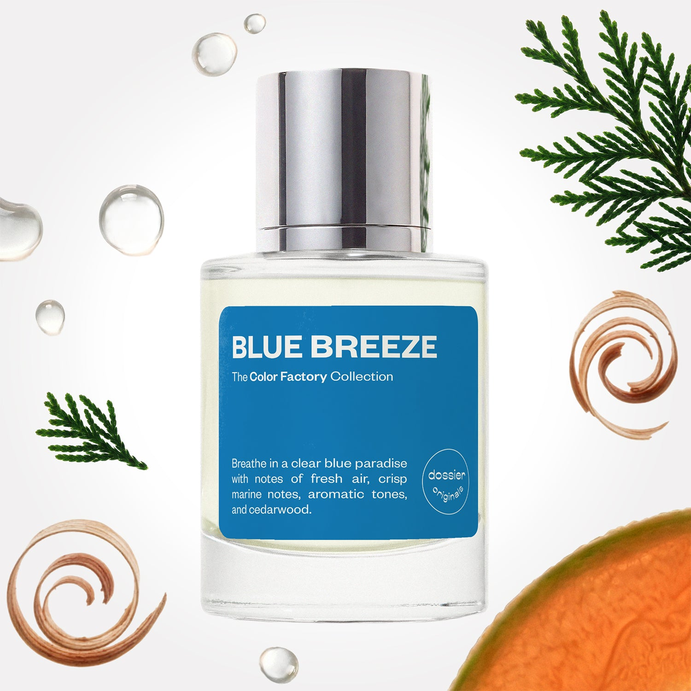

# Blue Breeze

- **Dossier Dossier Originals**
- **URL:** https://dossier.co/products/blue-breeze
- **SEO title:** Blue Breeze

## Pricing (sizes)

| Size/SKU | Member price | List price | Currency |
|---|---|---|---|
| DOS50BB | 35.1 | 39 | USD |

## Content (scent notes, about, editorial)

Back Home / Perfumes / Dossier Originals / BLUE BREEZE 

Unisex 

New 

Blue Breeze

Eau de Parfum. Size: 50ml / 1.7oz 

members: $35.10

Guest:
$39

Dossier Originals: The color factory collection 

Crafted in France 
Scent Family: fresh 

Add to Cart 

Scent Notes Main Notes:

Fresh Air Accord

Cypress

Melon

Grapefruit

Marine Notes

Cedarwood

top: The first notes you smell 
fresh air accord , cypress , melon , grapefruit , Bergamot 
middle: The heart of the perfume 
Ginger, Juniper, Rosemary, Cardamom 
base: The notes that linger all day 
marine notes , Thyme, Oakmoss, Musks, cedarwood 
ingredients: Alcohol Denat., Fragrance/Parfum, Water/Aqua/Eau, Tetramethyl Acetyloctahydronaphthalenes, Hexamethylindanopyran, Vanillin, Benzyl Salicylate, Limonene, Hydroxycitronellal, Citrus Limon (Lemon) Peel Oil, Linalyl Acetate, Citrus Aurantium Bergamia (Bergamot) Peel Oil, Pinene, Linalool, Alpha-Isomethyl Ionone, Citrus Aurantium Peel Oil, Citronellol, Terpinolene, Coumarin, Citral, Benzaldehyde, Jasmine Oil/Extract, Beta-Caryophyllene, Geranyl Acetate, Benzyl Benzoate, Benzyl Alcohol, Terpineol, Cananga Odorata Oil/Extract, Alpha-Terpinene, Geraniol, Methyl Salicylate, Farnesol, Isoeugenol, Eugenol. 

Vegan
Cruelty-free

Clean ingredients

About Experience the infinite bliss of crisp, crashing waves and a clear blue sky via fragrance. This scent captures all facets of the color “blue” with refreshing, aromatic, and subtly metallic notes that euphoric spirit of seaside breeze and timeless masculinity. 

Blue Breeze opens with invigorating notes of fresh air accord, cypress, melon, grapefruit, and bergamot notes for a fresh, aromatic scent, with a hint of a juicy zesty feel. A savory aroma unveils itself with a herbal and spice-laden heart of ginger, juniper, rosemary, and cardamom before Blue Breeze cascades into oceanic marine notes and cedarwood with an undercurrent of thyme, oakmoss, and musks at the base. 

So tranquil, masculine, and timeless, this scent will become your true blue fragrance with a spritz.

Scent Intensity: Significant 

Concentration: 18%

Gender: Unisex 

Shipping
Free shipping with 2+ items. 

Standard Shipping (with 2+ items) Auto-selected with 2+ items 
FREE 

Standard Shipping Auto-selected under 2 items 
$3.95 

Express shipping: 2 business days Select in checkout 
$19.00 

Returns
Free exchanges for all. Free returns with 

Exchanges
Free exchange, 1 time per order for all.

Returns
D+ members get 1 FREE return per order.
Non-members incur a $3.99/bottle return fee, 1 time per order.
Returns must be postmarked within 30 days of the initial order. Learn More 

FAQs Are these fragrances long lasting? They are designed to be very long lasting, just like designer fragrances, in some cases even longer, depending on the composition. 
When does the new packaging come out? We'll begin rolling out our new packaging across the U.S. and international markets soon! If you want to shop IRL - our new packaging first hits stores on January 11, 2026 at Walmart. Please note that if you are shopping online, you may receive a combination of our current and new packaging while we transition our inventory. 
How will I know what scent I like? We get it, shopping for perfumes online is hard! That's why we created a scent quiz, which will find the perfect scent for you Take the quiz (opens in new tab) 
Unsure about something? Ask us! help@dossier.co 

Best Layered With Combine 2 of our perfumes to create a third scent with layering, curated by our nose. Learn more 

You Might Love 

4.3 

Rated 4.3 out of 5 stars 

Based on 62 reviews 

Reviews 62 (tab expanded) Questions 1 (tab collapsed) 

Filters 
Write a Review (Opens in a new window) 

62 reviews 
Sort Highest Rating Most Helpful Photos & Videos Most Recent Oldest Lowest Rating Least Helpful 

DD 

DeAnn D. 
Verified Buyer 

6/13/26 

Rated 5 out of 5 stars 

Summer vibes 
Blue Breeze perfume emits total summer vibes! It is a clean, fresh, coastal scent that is out of this world! It is unisex so my husband I both wear it! 

Read More Read more about this review 

Was this helpful? Yes, this review from DeAnn D. was helpful. 0 people voted yes No, this review from DeAnn D. was not helpful. 0 people voted no 

AM 

Abbie M. 
Verified Buyer 

6/8/26 

Rated 5 out of 5 stars 

Blue Breeze 
Love this!! Very fresh and summertime smells. I will be purchasing again!

Read More Read more about this review 

Was this helpful? Yes, this review from Abbie M. was helpful. 0 people voted yes No, this review from Abbie M. was not helpful. 0 people voted no 

DP 

Dossier Perfumes 
6/8/26 
Abbie, we’re so happy it’s bringing those sunny vibes! Can’t wait for your next spritz 😊

AR 

Azuin R. R. 
Verified Buyer 

5/27/26 

Rated 5 out of 5 stars 

My smelling is elevated 
I love the fresh and clean scent. Not over powering. It lasts a while 

Read More Read more about this review 

Was this helpful? Yes, this review from Azuin R. R. was helpful. 0 people voted yes No, this review from Azuin R. R. was not helpful. 0 people voted no 

DP 

Dossier Perfumes 
5/27/26 
Azuin, so happy this scent feels fresh and lasts for you! Keep enjoying that clean vibe and exploring more.

A 

Anndora 

5/20/26 

Rated 5 out of 5 stars 

5 Stars
Long lasting refreshing scent

Read More Read more about this review 

Was this helpful? Yes, this review from Anndora was helpful. 0 people voted yes No, this review from Anndora was not helpful. 0 people voted no 

C 

Caroline 

3/1/26 

Rated 5 out of 5 stars 

5 Stars
I love this scent and got several
Compliments when wearing it.

Read More Read more about this review 

Was this helpful? Yes, this review from Caroline was helpful. 0 people voted yes No, this review from Caroline was not helpful. 0 people voted no 

Loading... 

Loading... 

Show More 

Inspired by  Baccarat Rouge 540 
Inspired by  Black Opium 
Inspired by  Love, Don't Be Shy 
Inspired by  Good Girl 
Inspired by  Libre 
Inspired by  Flowerbomb 
Inspired by  Light Blue 
Inspired by  Not a Perfume 
Inspired by  Aventus 
Inspired by  Bleu de Chanel 
Inspired by  Mon Paris 
Inspired by  Coco Mademoiselle 
Inspired by  Tom Ford for Men 
Inspired by  For Her 
Inspired by  J'Adore Dior 
Inspired by  Alien 
Inspired by  Black Opium Perfume 
Inspired by  Lost Cherry Perfume 

GET UP TO 30% OFF 

Find us at these retailers. 

Be the first to know. 
Submit 

Shop the following countries. United States 

Discover.
AI Scent Finder 
Blog (opens in new tab) 
Scent Family 
Layering 
Scent Quiz 

Help.
Contact Us 
Returns 
FAQ 
Testimonials 
Accessibility 

More.
Store Locator 
Boutique 
Refer A Friend 
Index 

Download our app now.

Find us at these retailers. 

Be the first to know. 
Submit 

Shop the following countries. United States 

Discover.
AI Scent Finder 
Blog (opens in new tab) 
Scent Family 
Layering 
Scent Quiz 

Help.
Contact Us 
Returns 
FAQ 
Testimonials 
Accessibility 

More.

## Main Image

