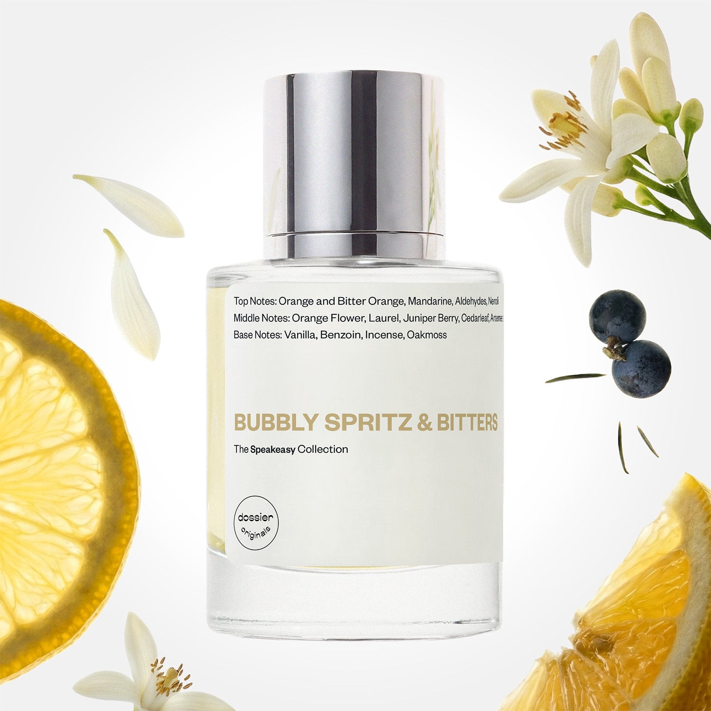

# Bubbly Spritz & Bitters

- **Dossier Dossier Originals**
- **URL:** https://dossier.co/products/bubbly-spritz-bitters
- **SEO title:** Bubbly Spritz & Bitters - Dossier Perfumes

## Pricing (sizes)

| Size/SKU | Member price | List price | Currency |
|---|---|---|---|
| 50ml | 35.1 | 39 | USD |

## Content (scent notes, about, editorial)

Back Home / Perfumes / Dossier Originals / BUBBLY SPRITZ & BITTERS 

Unisex 

Bubbly Spritz & Bitters

Eau de Parfum. Size: 50ml / 1.7oz 

members: $35.10

Guest:
$39

Dossier Originals: The speakeasy 

Crafted with celebration on the mind, the Speakeasy Collection captures all the bubbly, warm, or even smokey sensations that come with every sip– or in this case, spritz! 
Crafted in France 
Scent Family: gourmand 

Add to Cart 

Scent Notes Main Notes:

Orange

Bitter Orange

Orange Flower

Juniper Berry

Vanilla

top: The first notes you smell 
Orange and Bitter Orange, Mandarine, Aldehydes, Neroli 
middle: The heart of the perfume 
Orange Flower, Laurel, Juniper Berry, Cedarleaf, Artemesa 
base: The notes that linger all day 
Vanilla, Benzoin, Incense, Oakmoss 
ingredients: Alcohol Denat., Fragrance/Parfum, Water/Aqua/Eau, Limonene, Citrus Aurantium Peel Oil, Tetramethyl Acetyloctahydronaphthalenes, Hydroxycitronellal, Benzyl Salicylate, Geraniol, Pinene, Linalool, Citronellol, Citrus Aurantium Flower Oil, Laurus Nobilis Leaf Oil, Terpineol, Camphor, Linalyl Acetate, Citral, Rose Ketones, Beta-Caryophyllene, Terpinolene, Carvone, Vanillin, Geranyl Acetate, Farnesol, Benzyl Benzoate, Alpha-Terpinene, Eugenol, Citrus Limon (Lemon) Peel Oil. 

Vegan
Cruelty-free

Clean ingredients

About The perfect apertivo––a harmony between bitter and sweet in the spritz cocktail. Orange notes combine effortlessly with aromatics, enriched with a hint of vanilla and benzoin to underline gourmand facets. 

One spritz will delight your senses with all the vibrant sensations of lying beachside on the Italian Riviera.

Scent Intensity: Statement 

Concentration: 20%

Gender: Unisex 

Shipping
Free shipping with 2+ items. 

Standard Shipping (with 2+ items) Auto-selected with 2+ items 
FREE 

Standard Shipping Auto-selected under 2 items 
$3.95 

Express shipping: 2 business days Select in checkout 
$19.00 

Returns
Free exchanges for all. Free returns with 

Exchanges
Free exchange, 1 time per order for all.

Returns
D+ members get 1 FREE return per order.
Non-members incur a $3.99/bottle return fee, 1 time per order.
Returns must be postmarked within 30 days of the initial order. Learn More 

FAQs Are these fragrances long lasting? They are designed to be very long lasting, just like designer fragrances, in some cases even longer, depending on the composition. 
When does the new packaging come out? We'll begin rolling out our new packaging across the U.S. and international markets soon! If you want to shop IRL - our new packaging first hits stores on January 11, 2026 at Walmart. Please note that if you are shopping online, you may receive a combination of our current and new packaging while we transition our inventory. 
How will I know what scent I like? We get it, shopping for perfumes online is hard! That's why we created a scent quiz, which will find the perfect scent for you Take the quiz (opens in new tab) 
Unsure about something? Ask us! help@dossier.co 

Best Layered With Combine 2 of our perfumes to create a third scent with layering, curated by our nose. Learn more 

You Might Love 

3.9 

Rated 3.9 out of 5 stars 

Based on 145 reviews 

Reviews 145 (tab expanded) Questions 1 (tab collapsed) 

Filters 
Write a Review (Opens in a new window) 

145 reviews 
Sort Highest Rating Most Helpful Photos & Videos Most Recent Oldest Lowest Rating Least Helpful 

J 

Janhavi 
Verified Reviewer 

4/8/26 

Rated 5 out of 5 stars 

So fresh 
Very underrated. My favorite perfume out of all the dossier perfumes. I got it as a part of the discovery set but I'm addicted to this one! 

Read More Read more about this review 

Was this helpful? Yes, this review from Janhavi was helpful. 0 people voted yes No, this review from Janhavi was not helpful. 0 people voted no 

DP 

Dossier Perfumes 
4/8/26 
Hey Janhavi! What a hidden gem, right? So glad it jumped from the discovery set into a favorite spot.

I 

iobio 
Verified Reviewer 

3/28/26 

Rated 5 out of 5 stars 

Let it settle on your skin! Then: so good!
I admit I was taken aback when I first sprayed this: the opening is harsh and weird and every time I put it on, I'm not sure I want to continue to wear it. Then, say 7-10 minutes later, it "settles" into a much more balanced and delightful composition! I especially like how the juniper and citrus play off each other. Definitely unisex, nice depth, can be used for layering, too. 

Read More Read more about this review 

Was this helpful? Yes, this review from iobio was helpful. 0 people voted yes No, this review from iobio was not helpful. 0 people voted no 

DP 

Dossier Perfumes 
3/28/26 
Thanks for sharing how it really unfolds on your skin! We love that patient moment brings out its true balance and depth. Keep layering and enjoying all its playful sides 😊

IG 

iryna g. 

12/1/25 

Rated 5 out of 5 stars 

favorite
Got this as a sample and it turned out to be my favorite original scent.
Summery, fresh, citrus skin zesty.
So far this is my Dossier favorite.

Read More Read more about this review 

Was this helpful? Yes, this review from iryna g. was helpful. 0 people voted yes No, this review from iryna g. was not helpful. 0 people voted no 

DP 

Dossier Perfumes 
12/1/25 
Iryna, we’re thrilled a sample blossomed into your go-to! Glad that zesty, sun-kissed vibe won you over. When you’re ready, grab the full size for endless summer spritz 😊

E 

Eric 

Verified Buyer 

10/23/25 

Rated 5 out of 5 stars 

Interesting, warm, yummy
I love this! I went into their store and was looking for a more fresh citrusy scent but this one really stood out to me. It’s still citrusy but has so much warmth and a bit of complexity — all of the other citrus scents felt too flat for me but this one is interesting in a good way.

Read More Read more about this review 

Was this helpful? Yes, this review from Eric was helpful. 0 people voted yes No, this review from Eric was not helpful. 0 people voted no 

DP 

Dossier Perfumes 
10/23/25 
Thanks for sharing, Eric! We love that this one surprised you with its cozy complexity. Enjoy rocking that vibrant warmth, and mix up the vibe with light spritz layer 😊

J 

Jordyn 

10/23/25 

Rated 5 out of 5 stars 

Great for true citrus lovers! 10/10
I really like this scent. I’m a huge citrus fan and if you are too, try this fragrance! It’s so fresh, and so bright. It’s not sweet, but more of a fresh/bitter smell of a fresh orange peel. It reminds me of sipping aperol spritz in Italy (which has always been my favorite drink). Dossier you did such a good job, it’s one of my favorites!

Read More Read more about this review 

Was this helpful? Yes, this review from Jordyn was helpful. 0 people voted yes No, this review from Jordyn was not helpful. 0 people voted no 

DP 

Dossier Perfumes 
10/23/25 
Jordyn it’s awesome to hear this citrus burst is hitting the mark for you 💛 Nothing beats that fresh peel energy. Keep spraying and soaking up those aperol spritz vibes!

Loading... 

Loading... 

Show More 

Inspired by  Baccarat Rouge 540 
Inspired by  Black Opium 
Inspired by  Love, Don't Be Shy 
Inspired by  Good Girl 
Inspired by  Libre 
Inspired by  Flowerbomb 
Inspired by  Light Blue 
Inspired by  Not a Perfume 
Inspired by  Aventus 
Inspired by  Bleu de Chanel 
Inspired by  Mon Paris 
Inspired by  Coco Mademoiselle 
Inspired by  Tom Ford for Men 
Inspired by  For Her 
Inspired by  J'Adore Dior 
Inspired by  Alien 
Inspired by  Black Opium Perfume 
Inspired by  Lost Cherry Perfume 

GET UP TO 30% OFF 

Find us at these retailers. 

Be the first to know. 
Submit 

Shop the following countries. United States 

Discover.
AI Scent Finder 
Blog (opens in new tab) 
Scent Family 
Layering 
Scent Quiz 

Help.
Contact Us 
Returns 
FAQ 
Testimonials 
Accessibility 

More.
Store Locator 
Boutique 
Refer A Friend 
Index 

Download our app now.

Find us at these retailers. 

Be the first to know. 
Submit 

Shop the following countries. United States 

Discover.
AI Scent Finder 
Blog (opens in new tab) 
Scent Family 
Layering 
Scent Quiz 

Help.
Contact Us 
Returns 
FAQ 
Testimonials 
Accessibility 

More.

## Main Image

