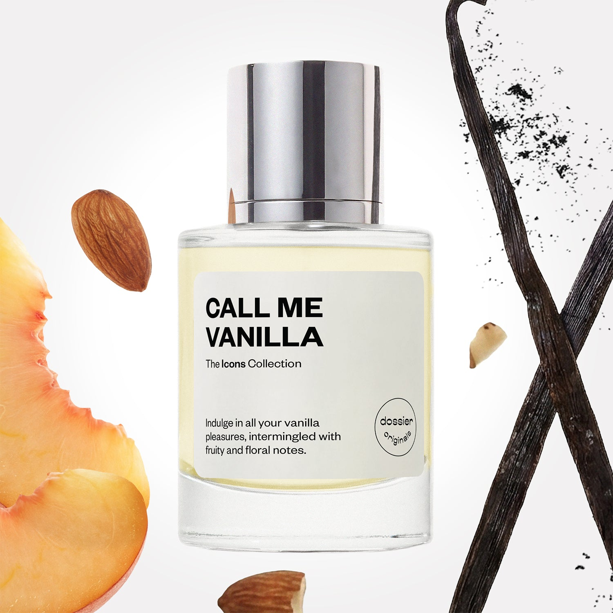

# Call Me Vanilla

- **Dossier Dossier Originals**
- **URL:** https://dossier.co/products/call-me-vanilla
- **SEO title:** Call Me Vanilla

## Pricing (sizes)

| Size/SKU | Member price | List price | Currency |
|---|---|---|---|
| 42316178718787 | 35.1 | 39 | USD |
| 3 | 0 | 0 | USD |

## Content (scent notes, about, editorial)

Back Home / Perfumes / Dossier Originals / CALL ME VANILLA 

Unisex 

New 

Call Me Vanilla

Eau de Parfum. Size: 50ml / 1.7oz 

members: $35.10

Guest:
$39

Dossier Originals: The icons collection 
Our most noteworthy fragrances EVER.
Expertly crafted magic with your most beloved notes via the Creative Lab.

Crafted in France 
Scent Family: warm 

Add to Cart 

Scent Notes Main Notes:

Almond

Jasmine

Vanilla

top: The first notes you smell 
Almond, Peach, Pink Pepper, Lime, Rum 
middle: The heart of the perfume 
Jasmin, Orange Flower, Iris, Tuberose 
base: The notes that linger all day 
Vanilla, Benzoin, Tonka Bean, Musks, White Woods 
ingredients: Alcohol Denat., Fragrance/Parfum, Water/Aqua/Eau, Tetramethyl Acetyloctahydronaphthalenes, Hexamethylindanopyran, Vanillin, Benzyl Salicylate, Limonene, Hydroxycitronellal, Citrus Limon (Lemon) Peel Oil, Linalyl Acetate, Citrus Aurantium Bergamia (Bergamot) Peel Oil, Pinene, Linalool, Alpha-Isomethyl Ionone, Citrus Aurantium Peel Oil, Citronellol, Terpinolene, Coumarin, Citral, Benzaldehyde, Jasmine Oil/Extract, Beta-Caryophyllene, Geranyl Acetate, Benzyl Benzoate, Benzyl Alcohol, Terpineol, Cananga Odorata Oil/Extract, Alpha-Terpinene, Geraniol, Methyl Salicylate, Farnesol, Isoeugenol, Eugenol. 

Vegan
Cruelty-free

Clean ingredients

About Quench your desire for the most intoxicating vanilla fragrance in one spritz. Call Me Vanilla satisfies the senses with an amuse bouche of edible top notes before evolving into a luscious bouquet at the heart and a devourable vanilla-forward base.

Expect a sweet refreshing scent at first sniff with gourmand and crisp fruity notes of almond and peach supported by licks of pink pepper, lime, and rum. The fragrance then enraptures the skin in a sensual jasmine-forward bouquet for a heart interlaced with orange flower, iris, and tuberose notes.

As the scent dries down, relish in a lingering vanilla-centric base blended alongside notes of benzoin, tonka bean, musks, and white woods. Devourable, warm, and sensual. Experience a kiss of vanilla bliss via fragrance.

Scent Intensity: Significant 

Concentration: 20%

Gender: Unisex 

Shipping
Free shipping with 2+ items. 

Standard Shipping (with 2+ items) Auto-selected with 2+ items 
FREE 

Standard Shipping Auto-selected under 2 items 
$3.95 

Express shipping: 2 business days Select in checkout 
$19.00 

Returns
Free exchanges for all. Free returns with 

Exchanges
Free exchange, 1 time per order for all.

Returns
D+ members get 1 FREE return per order.
Non-members incur a $3.99/bottle return fee, 1 time per order.
Returns must be postmarked within 30 days of the initial order. Learn More 

FAQs Are these fragrances long lasting? They are designed to be very long lasting, just like designer fragrances, in some cases even longer, depending on the composition. 
When does the new packaging come out? We'll begin rolling out our new packaging across the U.S. and international markets soon! If you want to shop IRL - our new packaging first hits stores on January 11, 2026 at Walmart. Please note that if you are shopping online, you may receive a combination of our current and new packaging while we transition our inventory. 
How will I know what scent I like? We get it, shopping for perfumes online is hard! That's why we created a scent quiz, which will find the perfect scent for you Take the quiz (opens in new tab) 
Unsure about something? Ask us! help@dossier.co 

Best Layered With Combine 2 of our perfumes to create a third scent with layering, curated by our nose. Learn more 

You Might Love 

4.1 

Rated 4.1 out of 5 stars 

Based on 46 reviews 

Reviews 46 (tab expanded) Questions (tab collapsed) 

Filters 
Write a Review (Opens in a new window) 

46 reviews 
Sort Highest Rating Most Helpful Photos & Videos Most Recent Oldest Lowest Rating Least Helpful 

L 

Lindsay 
Verified Reviewer 

6/21/26 

Rated 5 out of 5 stars 

So under hyped 
This is such a sophisticated, complex, lovely, light gourmand. It is as clean as it is sweet, perfect for any season and just about any occasion. Safe for work, but also great for a date night. I will never go without it.

Read More Read more about this review 

Was this helpful? Yes, this review from Lindsay was helpful. 0 people voted yes No, this review from Lindsay was not helpful. 0 people voted no 

DP 

Dossier Perfumes 
6/21/26 
Lindsay, this feedback totally made our day! It’s awesome that it’s clean, sweet, and versatile for work and date nights. Thanks for sharing, and enjoy your signature scent! ✨

LH 

Laura H. 
Verified Buyer 

6/20/26 

Rated 5 out of 5 stars 

Signature Summer Scent!
I've tried a few vanilla-forward scents from Dossier so far, and by far this is my absolute favorite. The opening is so well-done, and feels truly androgynous with this uplifting lime, party fun ***, and slightly grounding almond. As it wears, I start to get hints of the florals, but this really isn't an "in-your-face" floral fragrance. If anything, the florals just add nuance to the really cool top and a really long-lasting vanilla base. After about 2-3 hours, the vanilla gets more prominent (but it is still a fresh and fun vanilla scent). The best part? It lasts ALL day, like 8+ hours when I spray it on my chest, where it hits both my skin and my top. 
I haven't smelled a blend of notes like this before, and I am thrilled. I honestly have preferred more of the Dossier original scents than their impressions so far, often finding them stronger, longer lasting, and just more unique. Keep doing what you're doing, Dossier! Thank you for making my new summer signature scent! 

Read More Read more about this review 

Was this helpful? Yes, this review from Laura H. was helpful. 0 people voted yes No, this review from Laura H. was not helpful. 0 people voted no 

DP 

Dossier Perfumes 
6/22/26 
Laura, we love to hear that it became your signature summer scent! Your feedback has us beaming. So glad you're loving our originals and finding them unique and strong. Here's to many more amazing summer days with your new favorite! 😊

AB 

Allesha B. 
Verified Buyer 

6/12/26 

Rated 5 out of 5 stars 

I wouldn't say Vanilla 
She says call her vanilla but I would beg to differ. When I think of vanilla I lean towards cookies and frosting and cake. This fragrance comes across to me as more floral and soft. I wouldn't even say it's unisex. It smells like a very girly fragrance. It doesn't even present to me as a warm fragrance, at least not on my skin. However, I do love it and it has become one of my new favorites in my collection. 
It starts of strong and then dries down to this beautiful floral peach. 

Read More Read more about this review 

Was this helpful? Yes, this review from Allesha B. was helpful. 0 people voted yes No, this review from Allesha B. was not helpful. 0 people voted no 

DP 

Dossier Perfumes 
6/12/26 
Allesha, thanks for sharing your experience! Skin chemistry really makes each scent feel unique, and peachy florals can shine bright. We love that it found a spot in your lineup ✨

M 

Maggie 

6/8/26 

Rated 5 out of 5 stars 

Soooo good!
I sprayed this in target and shopped and kept smelling it and it got better and better on my skin. It's such a nicely done scent. I get vanilla and i smell the benzoin too, which is super nice. I think it'll be a nice layering scent!

Read More Read more about this review 

Was this helpful? Yes, this review from Maggie was helpful. 0 people voted yes No, this review from Maggie was not helpful. 0 people voted no 

DP 

Dossier Perfumes 
6/8/26 
Maggie! We love hearing how it evolves on your skin and picks up those warm vanilla and benzoin touches. Layering vibes ahead, have fun making it your own!

MW 

Mishanna W. 
Verified Buyer 

4/26/26 

Rated 5 out of 5 stars 

Pleasant 
Very appealing 

Read More Read more about this review 

Was this helpful? Yes, this review from Mishanna W. was helpful. 0 people voted yes No, this review from Mishanna W. was not helpful. 0 people voted no 

DP 

Dossier Perfumes 
4/26/26 
Thanks, Mishanna! We’re so glad you find it very appealing 😊

Loading... 

Loading... 

Show More 

Inspired by  Baccarat Rouge 540 
Inspired by  Black Opium 
Inspired by  Love, Don't Be Shy 
Inspired by  Good Girl 
Inspired by  Libre 
Inspired by  Flowerbomb 
Inspired by  Light Blue 
Inspired by  Not a Perfume 
Inspired by  Aventus 
Inspired by  Bleu de Chanel 
Inspired by  Mon Paris 
Inspired by  Coco Mademoiselle 
Inspired by  Tom Ford for Men 
Inspired by  For Her 
Inspired by  J'Adore Dior 
Inspired by  Alien 
Inspired by  Black Opium Perfume 
Inspired by  Lost Cherry Perfume 

GET UP TO 30% OFF 

Find us at these retailers. 

Be the first to know. 
Submit 

Shop the following countries. United States 

Discover.
AI Scent Finder 
Blog (opens in new tab) 
Scent Family 
Layering 
Scent Quiz 

Help.
Contact Us 
Returns 
FAQ 
Testimonials 
Accessibility 

More.
Store Locator 
Boutique 
Refer A Friend 
Index 

Download our app now.

Find us at these retailers. 

Be the first to know. 
Submit 

Shop the following countries. United States 

Discover.
AI Scent Finder 
Blog (opens in new tab) 
Scent Family 
Layering 
Scent Quiz 

Help.
Contact Us 
Returns 
FAQ 
Testimonials 
Accessibility 

More.

## Main Image

