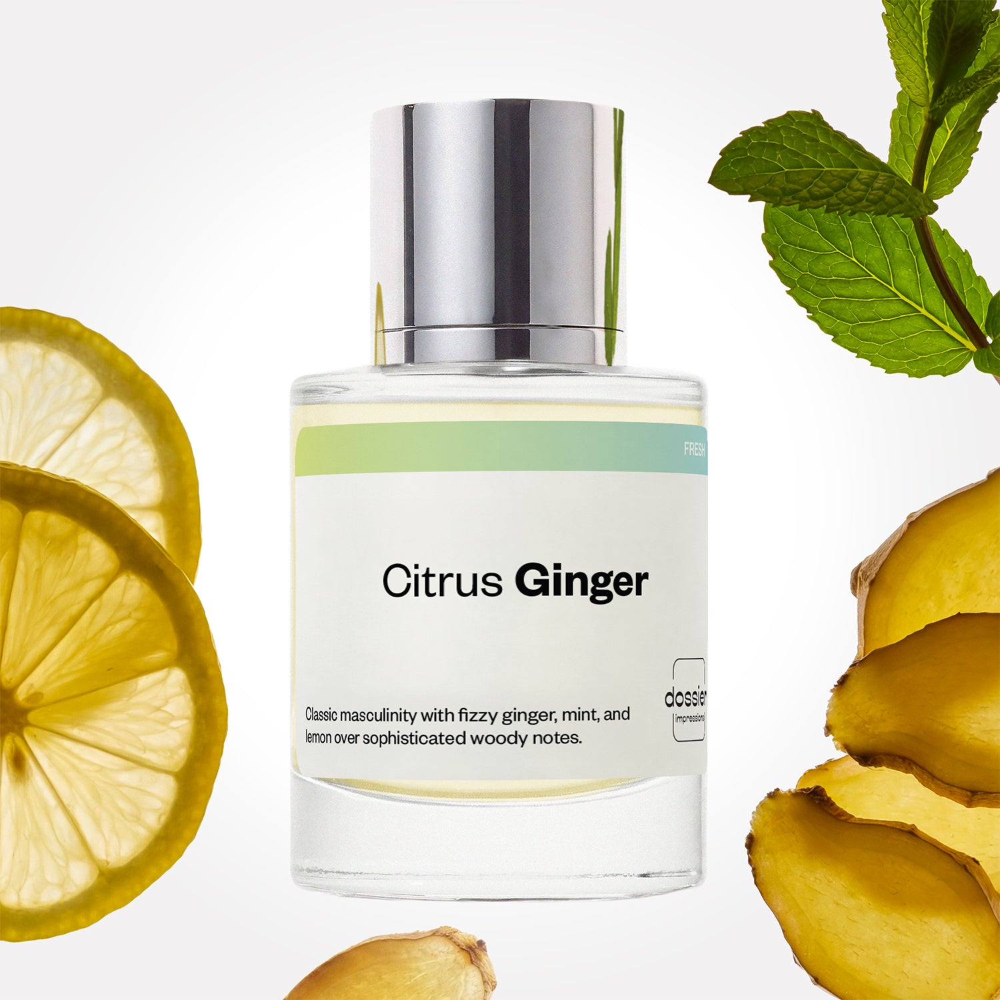

# Citrus Ginger

- **Dossier Inspired by Chanel's Bleu de Chanel**
- **URL:** https://dossier.co/products/citrus-ginger
- **SEO title:** Bleu de Chanel Dupe Perfume : Citrus Ginger Perfume - Dossier Perfumes

## Pricing (sizes)

| Size/SKU | Member price | List price | Currency |
|---|---|---|---|
| DI50CGIUS | 26.1 | 29 | USD |
| 16 | 0 | 0 | USD |
| DOSWA50CGI | 26.1 | 29 | USD |

## Content (scent notes, about, editorial)

Back Home / Perfumes / Dossier Impressions / CITRUS GINGER 

Men 

Bestseller 

Citrus Ginger

Eau de Parfum. Size: 50ml / 1.7oz 

members: $26.10

Guest:
$29

Inspired by Chanel's Bleu de Chanel Inspired by Chanel's Bleu de Chanel 
Inspired by Chanel's Bleu de Chanel 

Retail price 132 Crafted in France 
Scent Family: fresh 

Add to Cart 

Scent Notes This perfume is: A cold ginger beer over ice 
Main Notes:

Peppermint

Lemon

Ginger

top: The first notes you smell 
Peppermint, Lemon, Ginger 
middle: The heart of the perfume 
Vetiver, Pink Pepper, Nutmeg 
base: The notes that linger all day 
Sandalwood, Incense, Cedarwood 
ingredients: Alcohol Denat., Fragrance/Parfum, Water/Aqua/Eau, Tetramethyl Acetyloctahydronaphthalenes, Citrus Limon (Lemon) Peel Oil, Limonene, Linalyl Acetate, Linalool, Pinene, Pogostemon Cablin Oil, Citrus Aurantium Peel Oil, Citronellol, Acetyl Cedrene, Santalol, Santalum Album (Sandalwood) Oil, Terpinolene, Coumarin, Citral, Beta-Caryophyllene, Pelargonium Graveolens Flower Oil, Geranyl Acetate, Evernia Prunastri (Oakmoss) Extract, Anethole, Geraniol, Rose Ketones, Alpha-Terpinene, Terpineol, Hexadecanolactone, Camphor, Eugenol. 

Vegan
Cruelty-free

Clean ingredients

About Citrus Ginger (inspired by Chanel's Bleu de Chanel) opens with a minty freshness combined with fizzy ginger and lemon zest. The scent then unfolds to a base of textural and sophisticated woody notes, with a spicy touch.

Clean, masculine, and qualitative, Citrus Ginger (our impression of Chanel's Bleu de Chanel) is the perfect expression of timeless elegance.

Scent Intensity: Significant 

Concentration: 15%

Gender: Masculine 

Shipping
Free shipping with 2+ items. 

Standard Shipping (with 2+ items) Auto-selected with 2+ items 
FREE 

Standard Shipping Auto-selected under 2 items 
$3.95 

Express shipping: 2 business days Select in checkout 
$19.00 

Returns
Free exchanges for all. Free returns with 

Exchanges
Free exchange, 1 time per order for all.

Returns
D+ members get 1 FREE return per order.
Non-members incur a $3.99/bottle return fee, 1 time per order.
Returns must be postmarked within 30 days of the initial order. Learn More 

FAQs Are these fragrances long lasting? They are designed to be very long lasting, just like designer fragrances, in some cases even longer, depending on the composition. 
When does the new packaging come out? We'll begin rolling out our new packaging across the U.S. and international markets soon! If you want to shop IRL - our new packaging first hits stores on January 11, 2026 at Walmart. Please note that if you are shopping online, you may receive a combination of our current and new packaging while we transition our inventory. 
How will I know what scent I like? We get it, shopping for perfumes online is hard! That's why we created a scent quiz, which will find the perfect scent for you Take the quiz (opens in new tab) 
Unsure about something? Ask us! help@dossier.co 

Details We are not associated or affiliated with the brands mentioned here in any way.
Citrus Ginger

Elegance And Strength in One Fragrance

Bleu de Chanel (the luxury fragrance that Citrus Ginger is inspired by) is a perfume that has become synonymous with the luxury fashion house. The timeless classic was introduced in 2010 and has remained a favorite among perfume connoisseurs ever since, thanks to its aromatic, fresh, and grapefruit scent.

Bleu’s scent begins at the bottom of the forest floor while slowly rising to the top, clinging to mosses, barks, and leaves to create a stunning canopy of fresh pine.

Citrus and spice are the key opening notes of this cologne. The scent begins with a burst of tart grapefruit and creamy bergamot. While citrus notes are more prominent in the opening act, these are soon followed by the spicier, minty notes from coriander and pepper. Underneath all of this is a slowly arising warm amber, smelling slightly of smoky incense. Glimpses of its true woody nature emerge as the smell takes a delightfully rustic turn. Featuring calming elements of fruit, flowers, and earthy spice, Bleu’s middle notes are very much woodland-like, adding to the blissful chill of being in a pine forest in the mountains. But it’s in the base notes that the luxury cologne that Citrus Ginger is inspired by reaches its peak of freshness. Aromas of rough cedars stand in striking contrast with the sylvan sandalwood from New Caledonia, giving off an overall pleasing, creamy texture to the fragrance.

Overall, we love how the clash of the hard and the smooth lends the scent a vigorous character. Early citrusy scents lend a feeling of lightness to the fragrance without taking away from its serious nature. Meanwhile, the woody and spicy notes (accompanied by a hint of fresh greens) provide Bleu with a pleasing depth and give it a much more masculine aesthetic.

The scent’s staying power, of course, varies according to the concentration you choose. For instance, the Eau de Parfum (EDP) version of the luxury scent that Citrus Ginger is inspired by will easily stay on the skin for more than 7 hours. The Bleu de Chanel Parfum, however, is more concentrated and lasts for over 12 hours.

Projection starts out rather strong but gradually settles near the wearer. Not enough to take out a room, but definitely noticeable by someone a few feet away.

The luxury scent that Citrus Ginger is inspired by has a more formal, sophisticated presence, so it makes for a superb office scent and is excellent for black-tie events. Don’t be afraid to try the fragrance in a more casual setting, such as for an evening out in the city or when you go shopping.

Inspired by Chanel’s quintessential fragrance, Dossier’s Citrus Ginger presents the same sophisticated combination of woody and citrus notes you’d find in Bleu, with zero compromises and for a fraction of the price. With its clean and masculine scent, Citrus Ginger is a Bleu de Chanel dupe that’s guaranteed to bring out the best in any man.

Best Layered With Combine 2 of our perfumes to create a third scent with layering, curated by our nose. Learn more 

You Might Love 

4.4 

Rated 4.4 out of 5 stars 

Based on 1,647 reviews 

Reviews 1,647 (tab expanded) Questions 1 (tab collapsed) 

Filters 
Write a Review (Opens in a new window) 

1,647 reviews 
Sort Highest Rating Most Helpful Photos & Videos Most Recent Oldest Lowest Rating Least Helpful 

EE 

Eugenia E. 
Verified Buyer 

6/30/26 

Rated 5 out of 5 stars 

Perfection 
For sure I’m going to buy another one. Is the perfect dupe 

Read More Read more about this review 

Was this helpful? Yes, this review from Eugenia E. was helpful. 0 people voted yes No, this review from Eugenia E. was not helpful. 0 people voted no 

DP 

Dossier Perfumes 
7/1/26 
That makes us so happy! Can’t wait to welcome you back for another bottle.

TC 

Theoden C. 
Verified Buyer 

6/26/26 

Rated 5 out of 5 stars 

This will be my new signature scent 
This is a scent is so good. I'm so impressed! After trying other perfumeries attempt at this, Dossier's attempt is delightfully right on target. 

Read More Read more about this review 

Was this helpful? Yes, this review from Theoden C. was helpful. 0 people voted yes No, this review from Theoden C. was not helpful. 0 people voted no 

DP 

Dossier Perfumes 
6/26/26 
Theoden, wow thanks so much for sharing this praise! We’re stoked our version hit the mark for you. Can’t wait to see which scent adventure you try next 😊

R 

Robbie 

6/23/26 

Rated 5 out of 5 stars 

5 Stars
Smells really close to bleu de chanel, and also reminds me a lot of dylan blue by Versace. Excllent performance, and extremely mass appealing.

Read More Read more about this review 

Was this helpful? Yes, this review from Robbie was helpful. 0 people voted yes No, this review from Robbie was not helpful. 0 people voted no 

RP 

Rene P. 
Verified Buyer 

6/17/26 

Rated 5 out of 5 stars 

Great perfume 
I love it better the channel 

Read More Read more about this review 

Was this helpful? Yes, this review from Rene P. was helpful. 0 people voted yes No, this review from Rene P. was not helpful. 0 people voted no 

DP 

Dossier Perfumes 
6/17/26 
Rene, that means a lot! We’re so happy our fragrance shines for you 💛

NL 

Nashawn L. 
Verified Buyer 

6/10/26 

Rated 5 out of 5 stars 

Amazing 
Absolutely amazing 

Read More Read more about this review 

Was this helpful? Yes, this review from Nashawn L. was helpful. 0 people voted yes No, this review from Nashawn L. was not helpful. 0 people voted no 

DP 

Dossier Perfumes 
6/10/26 
Thanks Nashawn! We’re so happy you’re loving it ✨

Loading... 

Loading... 

Show More 

Inspired by  Baccarat Rouge 540 
Inspired by  Black Opium 
Inspired by  Love, Don't Be Shy 
Inspired by  Good Girl 
Inspired by  Libre 
Inspired by  Flowerbomb 
Inspired by  Light Blue 
Inspired by  Not a Perfume 
Inspired by  Aventus 
Inspired by  Bleu de Chanel 
Inspired by  Mon Paris 
Inspired by  Coco Mademoiselle 
Inspired by  Tom Ford for Men 
Inspired by  For Her 
Inspired by  J'Adore Dior 
Inspired by  Alien 
Inspired by  Black Opium Perfume 
Inspired by  Lost Cherry Perfume 

GET UP TO 30% OFF 

Find us at these retailers. 

Be the first to know. 
Submit 

Shop the following countries. United States 

Discover.
AI Scent Finder 
Blog (opens in new tab) 
Scent Family 
Layering 
Scent Quiz 

Help.
Contact Us 
Returns 
FAQ 
Testimonials 
Accessibility 

More.
Store Locator 
Boutique 
Refer A Friend 
Index 

Download our app now.

Find us at these retailers. 

Be the first to know. 
Submit 

Shop the following countries. United States 

Discover.
AI Scent Finder 
Blog (opens in new tab) 
Scent Family 
Layering 
Scent Quiz 

Help.
Contact Us 
Returns 
FAQ 
Testimonials 
Accessibility 

More.

## Main Image

