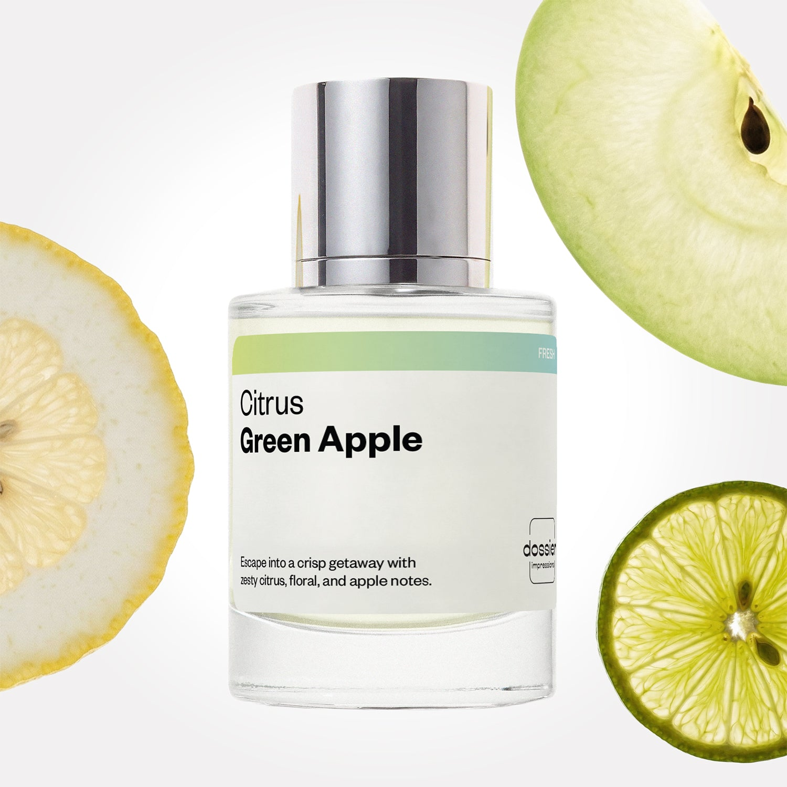

# Citrus Green Apple

- **Dossier Inspired by Dolce & Gabbana's Light Blue Women**
- **URL:** https://dossier.co/products/citrus-green-apple
- **SEO title:** D&G’S Light Blue Dupe Perfume: Citrus Green Apple - Dossier Perfumes

## Pricing (sizes)

| Size/SKU | Member price | List price | Currency |
|---|---|---|---|
| DI50CGAUS | 28.8 | 32 | USD |

## Content (scent notes, about, editorial)

Back Home / Perfumes / Dossier Impressions / CITRUS GREEN APPLE 

Women 

Bestseller 

Citrus Green Apple

Eau de Toilette. Size: 50ml / 1.7oz 

members: $28.80

Guest:
$32

Inspired by Dolce & Gabbana's Light Blue Women Inspired by Dolce & Gabbana's Light Blue Women 
Inspired by Dolce & Gabbana's Light Blue Women 

Retail price 114 Crafted in France 
Scent Family: fresh 

Add to Cart 

Scent Notes This perfume is: A crisp, Italian getaway 
Main Notes:

Green Apple

Lime

Cedrat

top: The first notes you smell 
Green Apple, Lime, Cedrat 
middle: The heart of the perfume 
Bluebell, Jasmine, Rose 
base: The notes that linger all day 
Amber, Cedarwood, Musk 
ingredients: Alcohol Denat., Fragrance/Parfum, Water/Aqua/Eau, Tetramethyl Acetyloctahydronaphthalenes, Hexamethylindanopyran, Limonene, Citrus Limon (Lemon) Peel Oil, Juniperus Virginiana Oil, Citrus Aurantium Peel Oil, Pinene, Citral, Beta-Caryophyllene, Geranyl Acetate, Linalool, Terpinolene, Citronellol, Rose Ketones, Cinnamomum Zeylanicum Bark Oil, Alpha-Terpinene, Cinnamal, Carvone. 

Vegan
Cruelty-free

Clean ingredients

About Citrus Green Apple (inspired by D&G’S Light Blue) opens with a burst of lime and cédrat - a Mediterranean citrus fruit that offers notes of zesty floral. This fizzy splash effect is blended with green apple and fresh flowers for a unique coupling that’s bound to awaken the senses.

Joyful, nature-inspired, and full of invigorating energy, Citrus Green Apple (our impression of D&G’S Light Blue) encapsulates the magic of an Italian summer that you hope never ends. 

Scent Intensity: Significant 

Concentration: 20%

Gender: Feminine 

Shipping
Free shipping with 2+ items. 

Standard Shipping (with 2+ items) Auto-selected with 2+ items 
FREE 

Standard Shipping Auto-selected under 2 items 
$3.95 

Express shipping: 2 business days Select in checkout 
$19.00 

Returns
Free exchanges for all. Free returns with 

Exchanges
Free exchange, 1 time per order for all.

Returns
D+ members get 1 FREE return per order.
Non-members incur a $3.99/bottle return fee, 1 time per order.
Returns must be postmarked within 30 days of the initial order. Learn More 

FAQs Are these fragrances long lasting? They are designed to be very long lasting, just like designer fragrances, in some cases even longer, depending on the composition. 
When does the new packaging come out? We'll begin rolling out our new packaging across the U.S. and international markets soon! If you want to shop IRL - our new packaging first hits stores on January 11, 2026 at Walmart. Please note that if you are shopping online, you may receive a combination of our current and new packaging while we transition our inventory. 
How will I know what scent I like? We get it, shopping for perfumes online is hard! That's why we created a scent quiz, which will find the perfect scent for you Take the quiz (opens in new tab) 
Unsure about something? Ask us! help@dossier.co 

Details We are not associated or affiliated with the brands mentioned here in any way.
Citrus Green Apple

The Essence of Summer in A Bottle

For many, Dolce and Gabbana Light Blue (the luxury perfume that Citrus Green Apple is inspired by) has a nostalgic air. It’s an old acquaintance, but not one easily forgotten. And why would it be? This is an impressive perfume, sensual and irresistible, reflecting the joy of a light breeze with a touch of sweetness. It’s summer condensed into one bottle — infused with the utmost freshness for a (deservingly) iconic scent. 

The luxury scent that Citrus Green Apple is inspired by first debuted in 2001. Since its release, the luxury fragrance that Citrus Green Apple is inspired by has won several perfume awards, including being named one of the most innovative scents of the century at the Museum of Arts and Design in NYC.

Dolce And Gabbana’s Light Blue line of perfumes have a distinctly contemporary touch, with a very clean, light, and fresh scent. Its overall profile teases light, floral notes, with subtle hints of wood throughout.

LThe luxury scent that Citrus Green Apple is inspired by starts bright and citrusy, combining Sicilian citron, fresh apple, and spontaneous bluebells for a delightfully fruity scent. The middle notes contain elements of bamboo and white rose, giving the fragrance some feminine nuances. Under all of this — a light, chaste jasmine scent. As we reach the perfume’s depths, we find notes of amber, cedar, and musk.

The softer characteristics of the luxury perfume that Citrus Green Apple is inspired by may appeal to women more than men. But despite its floral citrus scent, the scent is not overly feminine. On the contrary, it’s a balanced, pleasant fragrance that many men might appreciate just as well.

Sometimes it’s nice to wear something light, airy, and not overpowering; the luxury scent that Citrus Green Apple is inspired by is perfect for that. The fragrance will leave a soft scent trail without taking over a room. Even though it’s light, people will still be able to tell you’re wearing something nice, so you’ll have no trouble getting compliments. The luxury scent that Citrus Green Apple is inspired by should last for approximately six hours — good enough for most social situations, such as work or a day out with friends.

Summer and spring are the best seasons for the luxury perfume that Citrus Green Apple is inspired by. With its nature-inspired scent, this fragrance is perfect for warmer weather. The scent is fresh and decidedly casual, making it ideal for wear during the day rather than at night, when more sophisticated notes may be preferable.

The luxury fragrance that Citrus Green Apple is inspired by is sold as an Eau de Toilette Spray and Intense Eau de Parfum Spray, with the latter offering a more refreshing vibe over the original.

Indulgent, playful, and full of energy: Dossier’s Citrus Green Apple is a Dolce and Gabbana Light Blue dupe with the same invigorating notes of sparkling citrus and cedarwood. Taking its lead from the same coastal vistas that inspired Dolce & Gabbana, our replica perfectly captures the magic and romance of an Italian summer spent with someone you love.

Best Layered With Combine 2 of our perfumes to create a third scent with layering, curated by our nose. Learn more 

You Might Love 

4.4 

Rated 4.4 out of 5 stars 

Based on 2,553 reviews 

Reviews 2,553 (tab expanded) Questions (tab collapsed) 

Filters 
Write a Review (Opens in a new window) 

2,553 reviews 
Sort Highest Rating Most Helpful Photos & Videos Most Recent Oldest Lowest Rating Least Helpful 

A 

Abbie 
Verified Buyer 

6/30/26 

Rated 5 out of 5 stars 

Smells amazing 
This perfume smells amazing and lasts a long time! It’s a young, fresh, fruity smell. Also—Dossier customer service was so kind to me in the process of ordering this scent. Huge fan! 

Read More Read more about this review 

Was this helpful? Yes, this review from Abbie was helpful. 0 people voted yes No, this review from Abbie was not helpful. 0 people voted no 

DP 

Dossier Perfumes 
7/1/26 
Abbie, we’re thrilled it’s lasting all day and living up to that fresh, fruity vibe. And yay for kind vibes from our team 😊 Thanks for being a fan!

JT 

Jennifer T. 
Verified Buyer 

6/29/26 

Rated 5 out of 5 stars 

Lovely
Crisp and suddle scent. So many compliments. 

Read More Read more about this review 

Was this helpful? Yes, this review from Jennifer T. was helpful. 0 people voted yes No, this review from Jennifer T. was not helpful. 0 people voted no 

DP 

Dossier Perfumes 
6/29/26 
Jennifer, that subtle crisp vibe totally shines on you. Cheers to compliments! ✨

S 

Shaquana 

6/23/26 

Rated 5 out of 5 stars 

5 Stars
Love it

Read More Read more about this review 

Was this helpful? Yes, this review from Shaquana was helpful. 0 people voted yes No, this review from Shaquana was not helpful. 0 people voted no 

A 

Amber 

6/21/26 

Rated 5 out of 5 stars 

5 Stars
Love this!

Read More Read more about this review 

Was this helpful? Yes, this review from Amber was helpful. 0 people voted yes No, this review from Amber was not helpful. 0 people voted no 

RS 

Rebecca S. 
Verified Buyer 

6/21/26 

Rated 5 out of 5 stars 

I’m in love with Dossier 
I love that I’ve found dupes of favorite scents that last. This smells fantastic and lasts all day. 

Read More Read more about this review 

Was this helpful? Yes, this review from Rebecca S. was helpful. 0 people voted yes No, this review from Rebecca S. was not helpful. 0 people voted no 

DP 

Dossier Perfumes 
6/21/26 
Rebecca! We’re so happy it lasts all day and you’re loving it. Thanks for sharing, and happy spritzing! 🙌

Loading... 

Loading... 

Show More 

Inspired by  Baccarat Rouge 540 
Inspired by  Black Opium 
Inspired by  Love, Don't Be Shy 
Inspired by  Good Girl 
Inspired by  Libre 
Inspired by  Flowerbomb 
Inspired by  Light Blue 
Inspired by  Not a Perfume 
Inspired by  Aventus 
Inspired by  Bleu de Chanel 
Inspired by  Mon Paris 
Inspired by  Coco Mademoiselle 
Inspired by  Tom Ford for Men 
Inspired by  For Her 
Inspired by  J'Adore Dior 
Inspired by  Alien 
Inspired by  Black Opium Perfume 
Inspired by  Lost Cherry Perfume 

GET UP TO 30% OFF 

Find us at these retailers. 

Be the first to know. 
Submit 

Shop the following countries. United States 

Discover.
AI Scent Finder 
Blog (opens in new tab) 
Scent Family 
Layering 
Scent Quiz 

Help.
Contact Us 
Returns 
FAQ 
Testimonials 
Accessibility 

More.
Store Locator 
Boutique 
Refer A Friend 
Index 

Download our app now.

Find us at these retailers. 

Be the first to know. 
Submit 

Shop the following countries. United States 

Discover.
AI Scent Finder 
Blog (opens in new tab) 
Scent Family 
Layering 
Scent Quiz 

Help.
Contact Us 
Returns 
FAQ 
Testimonials 
Accessibility 

More.

## Main Image

