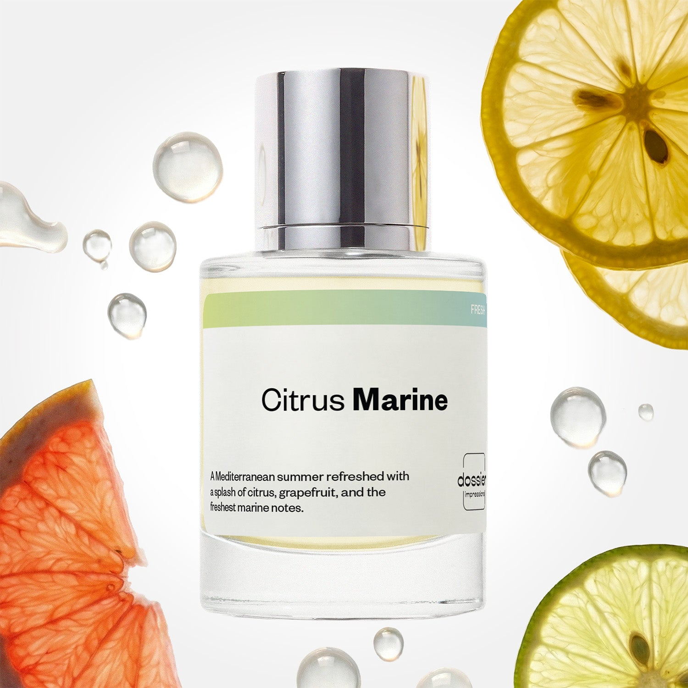

# Citrus Marine

- **Dossier Inspired by Dolce & Gabbana's Light Blue Men**
- **URL:** https://dossier.co/products/citrus-marine
- **SEO title:** Dolce & Gabbana's Light Blue Dupe Perfume: Citrus Marine - Dossier Perfumes

## Pricing (sizes)

| Size/SKU | Member price | List price | Currency |
|---|---|---|---|
| DI50CMAUS | 26.1 | 29 | USD |
| DOSWA50CMA | 26.1 | 29 | USD |

## Content (scent notes, about, editorial)

Back Home / Perfumes / Dossier Impressions / CITRUS MARINE 

Men 

It's back! 

Citrus Marine

Eau de Toilette. Size: 50ml / 1.7oz 

members: $26.10

Guest:
$29

Inspired by Dolce & Gabbana's Light Blue Men Inspired by Dolce & Gabbana's Light Blue Men 
Inspired by Dolce & Gabbana's Light Blue Men 

Retail price 106 Crafted in France 
Scent Family: fresh 

Add to Cart 

Scent Notes This perfume is: A splash of citrus 
Main Notes:

Citrus

Grapefruit

Mandarin

Marine Notes

Black Pepper

top: The first notes you smell 
Citrus, Grapefruit, Mandarin 
middle: The heart of the perfume 
Marine Notes, Juniper, Black Pepper 
base: The notes that linger all day 
Oakmoss, Amberwood, Incense 
ingredients: Alcohol Denat., Fragrance/Parfum, Water/Aqua/Eau, Citrus Aurantium Bergamia (Bergamot) Peel Oil, Tetramethyl Acetyloctahydronaphthalenes, Linalool, Limonene, Linalyl Acetate, Pinene, Pogostemon Cablin Oil, Hexyl Cinnamal, Geraniol, Alpha-Isomethyl Ionone, Beta-Caryophyllene, Citral, Geranyl Acetate, Terpineol, Citronellol, Terpinolene, Sclareol, Alpha-Terpinene, Camphor, Farnesol, Acetyl Cedrene. 

Vegan
Cruelty-free

Clean ingredients

About Citrus Marine (inspired by Dolce & Gabbana's Light Blue) opens with a burst of citrus and grapefruit zests, blended with peppery and refreshing marine notes. This fizzing splash effect is sustained with a subtle incense and dry woody, ambery accord.  Joyful, outdoorsy, and energizing, Citrus Marine (our impression of Dolce & Gabbana's Light Blue) captures the smell of a Mediterranean summer, offering an incredibly long-lasting freshness. 

Scent Intensity: Significant 

Concentration: 15%

Gender: Masculine 

Shipping
Free shipping with 2+ items. 

Standard Shipping (with 2+ items) Auto-selected with 2+ items 
FREE 

Standard Shipping Auto-selected under 2 items 
$3.95 

Express shipping: 2 business days Select in checkout 
$19.00 

Returns
Free exchanges for all. Free returns with 

Exchanges
Free exchange, 1 time per order for all.

Returns
D+ members get 1 FREE return per order.
Non-members incur a $3.99/bottle return fee, 1 time per order.
Returns must be postmarked within 30 days of the initial order. Learn More 

FAQs Are these fragrances long lasting? They are designed to be very long lasting, just like designer fragrances, in some cases even longer, depending on the composition. 
When does the new packaging come out? We'll begin rolling out our new packaging across the U.S. and international markets soon! If you want to shop IRL - our new packaging first hits stores on January 11, 2026 at Walmart. Please note that if you are shopping online, you may receive a combination of our current and new packaging while we transition our inventory. 
How will I know what scent I like? We get it, shopping for perfumes online is hard! That's why we created a scent quiz, which will find the perfect scent for you Take the quiz (opens in new tab) 
Unsure about something? Ask us! help@dossier.co 

Best Layered With Combine 2 of our perfumes to create a third scent with layering, curated by our nose. Learn more 

You Might Love 

4.5 

Rated 4.5 out of 5 stars 

Based on 452 reviews 

Reviews 452 (tab expanded) Questions 2 (tab collapsed) 

Filters 
Write a Review (Opens in a new window) 

452 reviews 
Sort Highest Rating Most Helpful Photos & Videos Most Recent Oldest Lowest Rating Least Helpful 

SM 

Stephen M. 
Verified Buyer 

6/19/26 

Rated 5 out of 5 stars 

Honest impressions 
I have not received my order as of yet but I can tell you that the fragrances that I have ordered have been wonderful as I’m sure this will be!Dossier has been awesome, a package got lost in the mail and not only did they replace that order but also gave me another fragrance at no cost to me! All I can say is “WOW “ Fantastic customer support!! I will be ordering from Dossier again!

Read More Read more about this review 

Was this helpful? Yes, this review from Stephen M. was helpful. 0 people voted yes No, this review from Stephen M. was not helpful. 0 people voted no 

DP 

Dossier Perfumes 
6/19/26 
Stephen, thank you for your patience and sweet words! We’re so happy you’re loving your scents and felt cared for. Can’t wait for your next spritz to arrive and brighten your day 💛

S 

Sarah 

6/16/26 

Rated 5 out of 5 stars 

5 Stars
Favorite smell

Read More Read more about this review 

Was this helpful? Yes, this review from Sarah was helpful. 0 people voted yes No, this review from Sarah was not helpful. 0 people voted no 

R 

Rene 

5/29/26 

Rated 5 out of 5 stars 

5 Stars
Love this scent, and it lasts all day! I work in a manufacturing facility and i still smell myself through the oil and metals ! Love it !!

Read More Read more about this review 

Was this helpful? Yes, this review from Rene was helpful. 0 people voted yes No, this review from Rene was not helpful. 0 people voted no 

BK 

Ben K. 
Verified Reviewer 

3/25/26 

Rated 5 out of 5 stars 

better than Light Blue
I got light blue man to compare, and my wife said she prefers this one. I agree! its fresher, the scent is a little more crisp and complex, and it feels like it lasts longer. Plus I don't mind using more since its so cheap. Thanks, Dossier!

Read More Read more about this review 

Was this helpful? Yes, this review from Ben K. was helpful. 0 people voted yes No, this review from Ben K. was not helpful. 0 people voted no 

DP 

Dossier Perfumes 
3/25/26 
Hey Ben! Love hearing this one beat Light Blue in your book, and your wife’s too. It’s awesome that it’s crisp, long-lasting, and wallet-friendly for extra spritz 😊

JH 

Jocelyn H. 

Verified Buyer 

1/30/26 

Rated 5 out of 5 stars 

Smells great!! Didn’t disappoint!
I got this scent as a gift for a family member for Christmas and it didn’t disappoint. They loved it and it smells great! Definitely a more masculine smelling cologne.

Read More Read more about this review 

Was this helpful? Yes, this review from Jocelyn H. was helpful. 0 people voted yes No, this review from Jocelyn H. was not helpful. 0 people voted no 

DP 

Dossier Perfumes 
1/30/26 
Jocelyn, thanks for letting us know your family member loved this cologne! It’s awesome to hear our scent hit the mark. Wishing you both many more great spritz moments 😊

Loading... 

Loading... 

Show More 

Inspired by  Baccarat Rouge 540 
Inspired by  Black Opium 
Inspired by  Love, Don't Be Shy 
Inspired by  Good Girl 
Inspired by  Libre 
Inspired by  Flowerbomb 
Inspired by  Light Blue 
Inspired by  Not a Perfume 
Inspired by  Aventus 
Inspired by  Bleu de Chanel 
Inspired by  Mon Paris 
Inspired by  Coco Mademoiselle 
Inspired by  Tom Ford for Men 
Inspired by  For Her 
Inspired by  J'Adore Dior 
Inspired by  Alien 
Inspired by  Black Opium Perfume 
Inspired by  Lost Cherry Perfume 

GET UP TO 30% OFF 

Find us at these retailers. 

Be the first to know. 
Submit 

Shop the following countries. United States 

Discover.
AI Scent Finder 
Blog (opens in new tab) 
Scent Family 
Layering 
Scent Quiz 

Help.
Contact Us 
Returns 
FAQ 
Testimonials 
Accessibility 

More.
Store Locator 
Boutique 
Refer A Friend 
Index 

Download our app now.

Find us at these retailers. 

Be the first to know. 
Submit 

Shop the following countries. United States 

Discover.
AI Scent Finder 
Blog (opens in new tab) 
Scent Family 
Layering 
Scent Quiz 

Help.
Contact Us 
Returns 
FAQ 
Testimonials 
Accessibility 

More.

## Main Image

