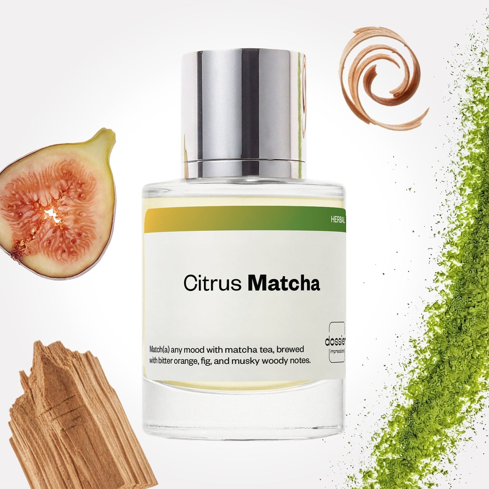

# Citrus Matcha

- **Dossier Inspired by Le Labo's Thé Matcha 26**
- **URL:** https://dossier.co/products/citrus-matcha
- **SEO title:** Citrus Matcha

## Pricing (sizes)

| Size/SKU | Member price | List price | Currency |
|---|---|---|---|
| DI50CMATUS | 44.1 | 49 | USD |

## Content (scent notes, about, editorial)

Back Home / Perfumes / Dossier Impressions / CITRUS MATCHA 

Unisex 

Bestseller 

Citrus Matcha

Eau de Parfum. Size: 50ml / 1.7oz 

members: $44.10

Guest:
$49

Inspired by Le Labo's Thé Matcha 26 Inspired by Le Labo's Thé Matcha 26 
Inspired by Le Labo's Thé Matcha 26 

Retail price 235 Crafted in France 
Scent Family: herbal 

Add to Cart 

Scent Notes Main Notes:

Matcha Tea

Fig

Cedarwood

top: The first notes you smell 
Bitter Orange, Bergamot 
middle: The heart of the perfume 
Matcha Tea, Fig, Vetiver 
base: The notes that linger all day 
Cedar Wood, Musks 
ingredients: Alcohol Denat., Fragrance/Parfum, Water/Aqua/Eau, Limonene, Linalool, Eugenol, Citronellol, Citral, Geraniol. 

Vegan
Cruelty-free

Clean ingredients

About Citrus Matcha is an exceptional blend that intertwines the distinct scent of matcha tea, bitter orange, and fig, resting upon a foundation of musky woody notes like cedarwood and vetiver. Harmony is struck between soft, creamy accents and earthy, bitter tones, seamlessly enhancing each other’s characteristics. Every spritz evokes a sense of reassurance and depth, instilling inner peace and serenity. Citrus Matcha is effortlessly wearable, exuding a subtle yet delightful signature scent that is both highly distinctive and captivating.

Scent Intensity: Significant 

Concentration: 20%

Gender: Unisex 

Shipping
Free shipping with 2+ items. 

Standard Shipping (with 2+ items) Auto-selected with 2+ items 
FREE 

Standard Shipping Auto-selected under 2 items 
$3.95 

Express shipping: 2 business days Select in checkout 
$19.00 

Returns
Free exchanges for all. Free returns with 

Exchanges
Free exchange, 1 time per order for all.

Returns
D+ members get 1 FREE return per order.
Non-members incur a $3.99/bottle return fee, 1 time per order.
Returns must be postmarked within 30 days of the initial order. Learn More 

FAQs Are these fragrances long lasting? They are designed to be very long lasting, just like designer fragrances, in some cases even longer, depending on the composition. 
When does the new packaging come out? We'll begin rolling out our new packaging across the U.S. and international markets soon! If you want to shop IRL - our new packaging first hits stores on January 11, 2026 at Walmart. Please note that if you are shopping online, you may receive a combination of our current and new packaging while we transition our inventory. 
How will I know what scent I like? We get it, shopping for perfumes online is hard! That's why we created a scent quiz, which will find the perfect scent for you Take the quiz (opens in new tab) 
Unsure about something? Ask us! help@dossier.co 

Best Layered With Combine 2 of our perfumes to create a third scent with layering, curated by our nose. Learn more 

You Might Love 

4.2 

Rated 4.2 out of 5 stars 

Based on 497 reviews 

Reviews 497 (tab expanded) Questions 3 (tab collapsed) 

Filters 
Write a Review (Opens in a new window) 

497 reviews 
Sort Highest Rating Most Helpful Photos & Videos Most Recent Oldest Lowest Rating Least Helpful 

TB 

Tony3611 B. 
Verified Buyer 

6/20/26 

Rated 5 out of 5 stars 

Awesome 
Smells like summer in a bottle.

Read More Read more about this review 

Was this helpful? Yes, this review from Tony3611 B. was helpful. 0 people voted yes No, this review from Tony3611 B. was not helpful. 0 people voted no 

J 

Jordan 
Verified Buyer 

5/29/26 

Rated 5 out of 5 stars 

The Most Masculine Scent I'll Wear
I love this fragrance, BUT I almost didn't give it another try. 
I smelled it on cardstock, in the air, on my clothes...didn't love it. Sprayed it on myself and something about it just works. It's couple drops shy of crossing over into "too masculine", but it stops at juuuuust the right spot. It's more herbal than earthy. 
It smells like outside, in a good, classy, intentional way.

Read More Read more about this review 

Was this helpful? Yes, this review from Jordan was helpful. 0 people voted yes No, this review from Jordan was not helpful. 0 people voted no 

DP 

Dossier Perfumes 
5/29/26 
Jordan you’re right, skin chemistry can flip a whole vibe. We’re thrilled it lands just on your side of the line. Keep enjoying that outdoorsy flair, and thanks for sharing!

KB 

Kimberly B. 
Verified Buyer 

5/26/26 

Rated 5 out of 5 stars 

Love!
This scent is amazing! I had smelled it at a store that carried a similar scent - and loved it, but then found this one and it is awesome :) so happy to have it for a fraction of the price w!

Read More Read more about this review 

Was this helpful? Yes, this review from Kimberly B. was helpful. 0 people voted yes No, this review from Kimberly B. was not helpful. 0 people voted no 

DP 

Dossier Perfumes 
5/26/26 
Kimberly, we’re thrilled this one hit the spot for you…and at a sweet price too! It’s awesome when you discover a new go-to that fits your vibe. Enjoy spritzing!

MB 

Monica B. 
Verified Buyer 

5/24/26 

Rated 5 out of 5 stars 

Decent dupe for Le Labo
My co worker couldn’t tell a difference. Very close dupe to Le Labo Matcha 🍵 

Read More Read more about this review 

Was this helpful? Yes, this review from Monica B. was helpful. 0 people voted yes No, this review from Monica B. was not helpful. 0 people voted no 

DP 

Dossier Perfumes 
5/24/26 
Thanks for sharing! We love hearing it’s so spot on for you and your coworker.

JC 

Jerome C. 
Verified Buyer 

5/20/26 

Rated 5 out of 5 stars 

Really good scent 
Love the way it smells. It’s not overwhelming at all. 

Read More Read more about this review 

Was this helpful? Yes, this review from Jerome C. was helpful. 0 people voted yes No, this review from Jerome C. was not helpful. 0 people voted no 

DP 

Dossier Perfumes 
5/20/26 
Jerome, so happy to hear that! Glad it’s light and just right 😊

Loading... 

Loading... 

Show More 

Inspired by  Baccarat Rouge 540 
Inspired by  Black Opium 
Inspired by  Love, Don't Be Shy 
Inspired by  Good Girl 
Inspired by  Libre 
Inspired by  Flowerbomb 
Inspired by  Light Blue 
Inspired by  Not a Perfume 
Inspired by  Aventus 
Inspired by  Bleu de Chanel 
Inspired by  Mon Paris 
Inspired by  Coco Mademoiselle 
Inspired by  Tom Ford for Men 
Inspired by  For Her 
Inspired by  J'Adore Dior 
Inspired by  Alien 
Inspired by  Black Opium Perfume 
Inspired by  Lost Cherry Perfume 

GET UP TO 30% OFF 

Find us at these retailers. 

Be the first to know. 
Submit 

Shop the following countries. United States 

Discover.
AI Scent Finder 
Blog (opens in new tab) 
Scent Family 
Layering 
Scent Quiz 

Help.
Contact Us 
Returns 
FAQ 
Testimonials 
Accessibility 

More.
Store Locator 
Boutique 
Refer A Friend 
Index 

Download our app now.

Find us at these retailers. 

Be the first to know. 
Submit 

Shop the following countries. United States 

Discover.
AI Scent Finder 
Blog (opens in new tab) 
Scent Family 
Layering 
Scent Quiz 

Help.
Contact Us 
Returns 
FAQ 
Testimonials 
Accessibility 

More.

## Main Image

