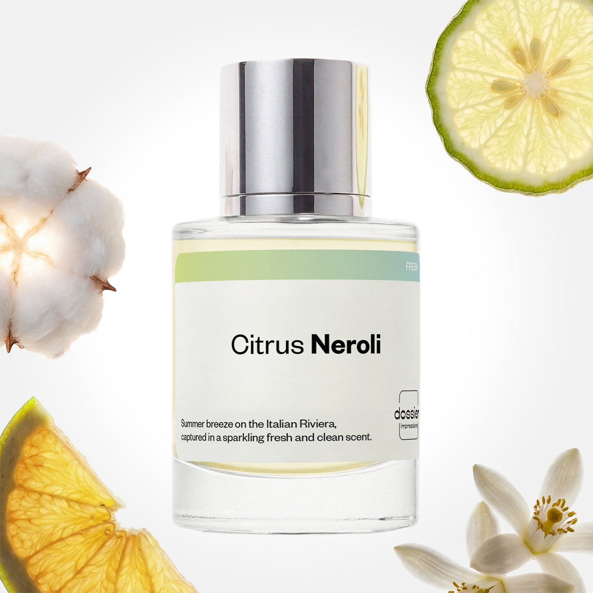

# Citrus Neroli

- **Dossier Inspired by Tom Ford's Neroli Portofino**
- **URL:** https://dossier.co/products/citrus-neroli
- **SEO title:** Tom Ford's Neroli Portofino Dupe Perfume: Citrus Neroli - Dossier Perfumes

## Pricing (sizes)

| Size/SKU | Member price | List price | Currency |
|---|---|---|---|
| DI50CNEUS | 44.1 | 49 | USD |

## Content (scent notes, about, editorial)

Back Home / Perfumes / Dossier Impressions / CITRUS NEROLI 

Unisex 

Citrus Neroli

Eau de Parfum. Size: 50ml / 1.7oz 

members: $44.10

Guest:
$49

Inspired by Tom Ford's Neroli Portofino Inspired by Tom Ford's Neroli Portofino 
Inspired by Tom Ford's Neroli Portofino 

Retail price 300 Crafted in France 
Scent Family: fresh 

Add to Cart 

Scent Notes This perfume is: A fresh summer breeze in Italy 
Main Notes:

Neroli

Bergamot

Musks

Amber

top: The first notes you smell 
Neroli, Bergamot, Mandarin, Lemon 
middle: The heart of the perfume 
Orange Blossom, Jasmine, Lavender 
base: The notes that linger all day 
Musks, Amber 
ingredients: Alcohol Denat., Fragrance/Parfum, Water/Aqua/Eau, Linalyl Acetate, Linalool, Limonene, Citrus Aurantium Bergamia (Bergamot) Peel Oil, Citrus Limon (Lemon) Peel Oil, Citrus Aurantium Flower Oil, Pinene, Geranyl Acetate, Hydroxycitronellal, Geraniol, Citral, Terpineol, Camphor, Beta-Caryophyllene, Farnesol, Terpinolene, Citronellol, Alpha-Terpinene, Hexadecanolactone, Carvone. 

Vegan
Cruelty-free

Clean ingredients

About Citrus Neroli (inspired by Tom Ford's Neroli Portofino) lifts traditional Cologne structure up, mixing armfuls of effervescent, fizzing citrus notes. In this fragrance, association of musk and neroli (distilled orange blossom) brings a pure cleanness sensation, also carrying softness and long lastingness to the sparkling freshness.

Directly inspired by the smells and sensations of the Italian Riviera, Citrus Neroli (our impression of Tom Ford's Neroli Portofino) combines freshness and warmth.

Hidden behind an apparent simplicity, the beauty of this complex construction can make it surprisingly addictive, though. 

Scent Intensity: Soft 

Concentration: 18%

Gender: Unisex 

Shipping
Free shipping with 2+ items. 

Standard Shipping (with 2+ items) Auto-selected with 2+ items 
FREE 

Standard Shipping Auto-selected under 2 items 
$3.95 

Express shipping: 2 business days Select in checkout 
$19.00 

Returns
Free exchanges for all. Free returns with 

Exchanges
Free exchange, 1 time per order for all.

Returns
D+ members get 1 FREE return per order.
Non-members incur a $3.99/bottle return fee, 1 time per order.
Returns must be postmarked within 30 days of the initial order. Learn More 

FAQs Are these fragrances long lasting? They are designed to be very long lasting, just like designer fragrances, in some cases even longer, depending on the composition. 
When does the new packaging come out? We'll begin rolling out our new packaging across the U.S. and international markets soon! If you want to shop IRL - our new packaging first hits stores on January 11, 2026 at Walmart. Please note that if you are shopping online, you may receive a combination of our current and new packaging while we transition our inventory. 
How will I know what scent I like? We get it, shopping for perfumes online is hard! That's why we created a scent quiz, which will find the perfect scent for you Take the quiz (opens in new tab) 
Unsure about something? Ask us! help@dossier.co 

Details We are not associated or affiliated with the brands mentioned here in any way.
Citrus Neroli

For All That Is Beautiful

Inspired by the rich citrusy scent of neroli – a flower lending its name from the Italian Riviera, Tom Ford’s Neroli Portofino (the fragrance that Dossier’s Citrus Neroli is inspired by) calls to mind the unique olfactory properties of its eponym – fresh, honeyed, and full of floral luxury. The fragrance stands out from other brands, transporting you to a blissful stroll amidst lemon trees and myrtle bushes, with the wonderful smell of verdant foliage lingering in the crisp hot air of a summer’s day. That is why we love the luxury fragrance that Citrus Neroli is inspired by – its citrusy-floral scent, earthy yet clean – paints us an astounding picture of Mother Nature’s raw beauty.

The brainchild of Rodrigo Flores-Roux, the luxury fragrance that Citrus Neroli is inspired by hits the air first with clean citrusy notes featuring lemon, bergamot, and bitter orange. The perfume emits a refreshing fragrance calling to mind a sparkling rivulet of water along the lemon meadow during an early summer’s frolic. Middle notes of floral delicacy then follow through with aromas of jasmine and neroli – entangling to form a complex combination of rich floral fruitiness with a tinge of spiciness, granting it a wild touch of sensuality.

As the perfume dries down, the base notes of ambrette and angelica reveal themselves, slicing through the floral punch with a scent of musky woodiness. The ambrette effuses a nutty fragrance that gently subtracts from the acidic sweetness – like a stir of light cool breeze waltzing through a lush tropical forest.

A perfume paying homage to an Italian Princess, the luxury fragrance that Citrus Neroli is inspired by is aristocracy and hopeful melancholy captured in a bottle – a fragrance both exotic and enticing. It is a successful fusion of antiquity with poise, of rawness with refinement.

An Eau De Parfum (EDP), Neroli Portofino comes in 30 ml, 50 ml, and 100 ml respectively. While its projection lasts for one to two hours after application, the fragrance will cling lightly to the skin for roughly five to six hours. Other than the EDP, the fragrance is also available as a ody spray and a candle.

If the olfactory picture of Tom Ford’s Neroli Portofino enthralls you, don’t let its hefty price tag hinder you. Here at Dossier.co, we present you with Citrus Neroli, a dupe offering all the charms of Neroli Portofino for a fraction of its price. Citrus Neroli bursts open in clean citrusy notes of lemon, bergamot, and mandarin. The dry-down diffuses a blend of musk and neroli, making it a delightful mixture of woody sweetness and floral softness. Don’t be fooled by its simplicity, though – its appeal of refreshing airiness can compel you to addiction.

You Might Love 

4.1 

Rated 4.1 out of 5 stars 

Based on 670 reviews 

Reviews 670 (tab expanded) Questions (tab collapsed) 

Filters 
Write a Review (Opens in a new window) 

670 reviews 
Sort Highest Rating Most Helpful Photos & Videos Most Recent Oldest Lowest Rating Least Helpful 

EL 

Erika L. 
Verified Reviewer 

4/23/26 

Rated 5 out of 5 stars 

Pure freshness 
super fresh and clean—like a burst of citrus right after a shower. It’s light, a little floral, and really easy to wear every day without being too strong. I love how it feels bright and uplifting but still a bit classy. Definitely a go-to if you like simple, fresh scents 100/10

Read More Read more about this review 

Was this helpful? Yes, this review from Erika L. was helpful. 0 people voted yes No, this review from Erika L. was not helpful. 0 people voted no 

DP 

Dossier Perfumes 
4/23/26 
Erika, it’s awesome to hear how refreshing and bright it feels after the shower. Knowing it’s become your simple, everyday pick makes our day. Thanks for sharing!

TH 

Tim H. 
Verified Buyer 

4/13/26 

Rated 5 out of 5 stars 

You Got It Right!
This is the perfect impression of Tom Ford�s Neroli Portofino. I�m so excited to wear it everyday and my wife is loving it on me. It�s a must own especially for Florida dwellers. The scent just compliments the culture. 

Read More Read more about this review 

Was this helpful? Yes, this review from Tim H. was helpful. 0 people voted yes No, this review from Tim H. was not helpful. 0 people voted no 

DP 

Dossier Perfumes 
4/13/26 
Love that you’re loving it and getting so many compliments in Florida! Everyday wear just got more vibrant, and we’re thrilled your wife’s a fan too. Enjoy! 😊

EP 

Elvis P. 
Verified Buyer 

3/4/26 

Rated 5 out of 5 stars 

Nenuco’s older brother 
This perfume smells identical to Nenuco baby cologne, but with more lasting power. I got about 5 hours of longevity and moderate projection. 

Read More Read more about this review 

Was this helpful? Yes, this review from Elvis P. was helpful. 0 people voted yes No, this review from Elvis P. was not helpful. 0 people voted no 

DP 

Dossier Perfumes 
3/13/26 
So glad you're loving our grown-up version! Enjoy every spritz, Elvis!

G 

geriann 

3/1/26 

Rated 5 out of 5 stars 

5 Stars
My husband says it smells really fresh and clean!

Read More Read more about this review 

Was this helpful? Yes, this review from geriann was helpful. 0 people voted yes No, this review from geriann was not helpful. 0 people voted no 

J 

jim 
Verified Buyer 

1/14/26 

Rated 5 out of 5 stars 

5 Stars
Smells like Aqua di Parma at a fraction of the cost

Read More Read more about this review 

Was this helpful? Yes, this review from jim was helpful. 0 people voted yes No, this review from jim was not helpful. 0 people voted no 

DP 

Dossier Perfumes 
1/14/26 
Jim! Love that it brings luxe vibes without the luxe price tag 😊

Loading... 

Loading... 

Show More 

Inspired by  Baccarat Rouge 540 
Inspired by  Black Opium 
Inspired by  Love, Don't Be Shy 
Inspired by  Good Girl 
Inspired by  Libre 
Inspired by  Flowerbomb 
Inspired by  Light Blue 
Inspired by  Not a Perfume 
Inspired by  Aventus 
Inspired by  Bleu de Chanel 
Inspired by  Mon Paris 
Inspired by  Coco Mademoiselle 
Inspired by  Tom Ford for Men 
Inspired by  For Her 
Inspired by  J'Adore Dior 
Inspired by  Alien 
Inspired by  Black Opium Perfume 
Inspired by  Lost Cherry Perfume 

GET UP TO 30% OFF 

Find us at these retailers. 

Be the first to know. 
Submit 

Shop the following countries. United States 

Discover.
AI Scent Finder 
Blog (opens in new tab) 
Scent Family 
Layering 
Scent Quiz 

Help.
Contact Us 
Returns 
FAQ 
Testimonials 
Accessibility 

More.
Store Locator 
Boutique 
Refer A Friend 
Index 

Download our app now.

Find us at these retailers. 

Be the first to know. 
Submit 

Shop the following countries. United States 

Discover.
AI Scent Finder 
Blog (opens in new tab) 
Scent Family 
Layering 
Scent Quiz 

Help.
Contact Us 
Returns 
FAQ 
Testimonials 
Accessibility 

More.

## Main Image

