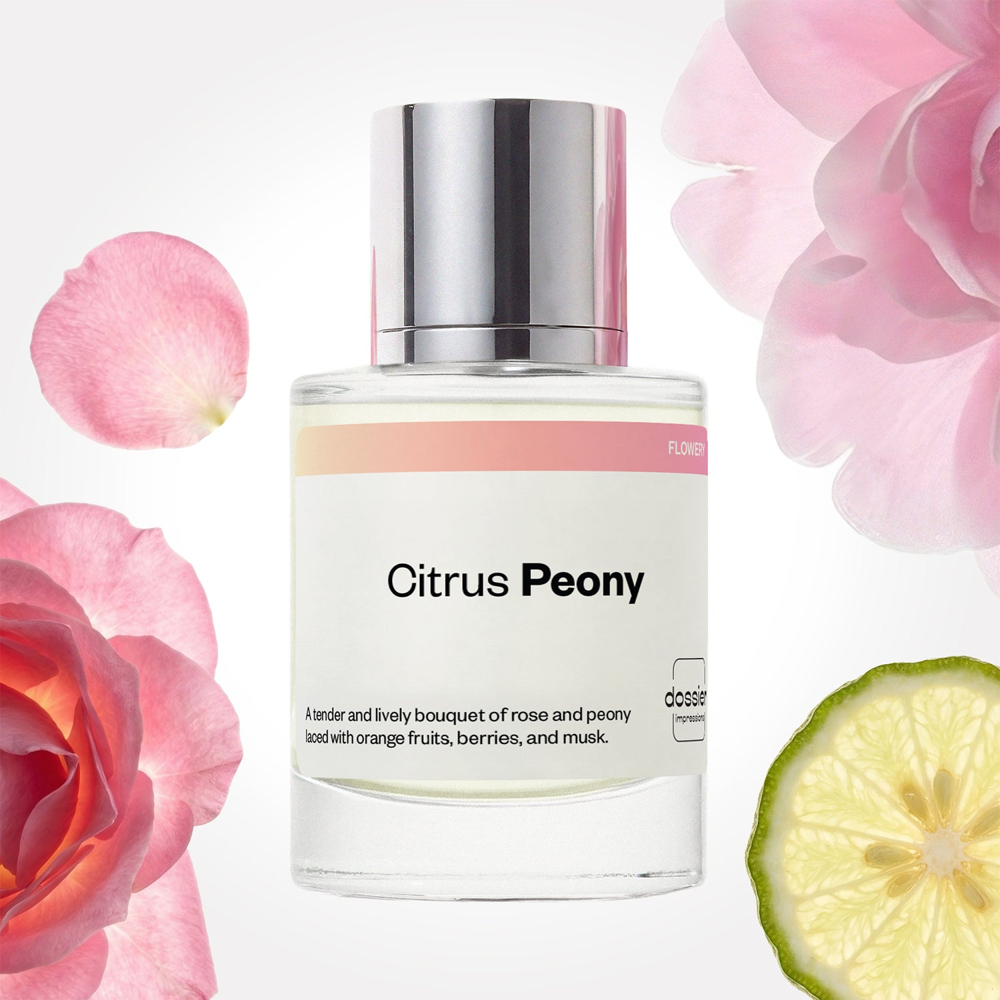

# Citrus Peony

- **Dossier Inspired by Dior's Miss Dior Blooming Bouquet**
- **URL:** https://dossier.co/products/citrus-peony
- **SEO title:** Miss Dior Blooming Bouquet Dupe Perfume: Citrus Peony - Dossier Perfumes

## Pricing (sizes)

| Size/SKU | Member price | List price | Currency |
|---|---|---|---|
| DI50CPEUS | 28.8 | 32 | USD |

## Content (scent notes, about, editorial)

Back Home / Perfumes / Dossier Impressions / CITRUS PEONY 

Women 

Citrus Peony

Eau de Toilette. Size: 50ml / 1.7oz 

members: $28.80

Guest:
$32

Inspired by Dior's Miss Dior Blooming Bouquet Inspired by Dior's Miss Dior Blooming Bouquet 
Inspired by Dior's Miss Dior Blooming Bouquet 

Retail price 113 Crafted in France 
Scent Family: flowery 

Add to Cart 

Scent Notes This perfume is: A radiant, blooming bouquet 
Main Notes:

Mandarin

Bergamot

Musks

Peach

Raspberry

top: The first notes you smell 
Mandarin, Bergamot, Blackcurrant 
middle: The heart of the perfume 
Rose, Apricot, Peony 
base: The notes that linger all day 
Musks, Peach, Raspberry 
ingredients: Alcohol Denat., Fragrance/Parfum, Water/Aqua/Eau, Limonene, Linalyl Acetate, Citrus Limon (Lemon) Peel Oil, Citrus Aurantium Bergamia (Bergamot) Peel Oil, Hexyl Cinnamal, Citrus Aurantium Peel Oil, Benzyl Salicylate, Pinene, Alpha-Isomethyl Ionone, Linalool, Citronellol, Geraniol, Citral, Pogostemon Cablin Oil, Geranyl Acetate, Isoeugenol, Hexadecanolactone, Rose Ketones, Rose Flower Oil/Extract, Terpinolene, Beta-Caryophyllene, Terpineol, Alpha-Terpinene, Methyl Salicylate, Benzyl Alcohol, Eugenol. 

Vegan
Cruelty-free

Clean ingredients

About Citrus Peony (inspired by Dior's Miss Dior Blooming Bouquet) is a tribute to rose and peony, a delicate flower with a leafy, so ft, and rosy smell. This bouquet vibrates on top with mandarin and bergamot fizz to gradually soften it with fresh notes. Finally, it settles on a cloud of white musk and mild fruity base notes.

Tender and lively, Citrus Peony (our impression of Dior's Miss Dior Blooming Bouquet) evokes the innocent radiance of the first days of spring bloom.

Scent Intensity: Soft 

Concentration: 18%

Gender: Feminine 

Shipping
Free shipping with 2+ items. 

Standard Shipping (with 2+ items) Auto-selected with 2+ items 
FREE 

Standard Shipping Auto-selected under 2 items 
$3.95 

Express shipping: 2 business days Select in checkout 
$19.00 

Returns
Free exchanges for all. Free returns with 

Exchanges
Free exchange, 1 time per order for all.

Returns
D+ members get 1 FREE return per order.
Non-members incur a $3.99/bottle return fee, 1 time per order.
Returns must be postmarked within 30 days of the initial order. Learn More 

FAQs Are these fragrances long lasting? They are designed to be very long lasting, just like designer fragrances, in some cases even longer, depending on the composition. 
When does the new packaging come out? We'll begin rolling out our new packaging across the U.S. and international markets soon! If you want to shop IRL - our new packaging first hits stores on January 11, 2026 at Walmart. Please note that if you are shopping online, you may receive a combination of our current and new packaging while we transition our inventory. 
How will I know what scent I like? We get it, shopping for perfumes online is hard! That's why we created a scent quiz, which will find the perfect scent for you Take the quiz (opens in new tab) 
Unsure about something? Ask us! help@dossier.co 

Details We are not associated or affiliated with the brands mentioned here in any way.
Citrus Peony

Sink into the supple kiss of a delicate rose

A blossoming garden of budding roses in blush, magenta, and fuchsia, the Miss Dior Blooming Bouquet (the fragrance that Citrus Peony is inspired by) is an essence of sparkling rosé infused clouds. Oozing delightful elegance and feathery splendor, this 8-year-old scent from the collection of Miss Dior fragrances is a pleasurable bouquet of roses, reminiscent of the early days of youthful springtime.

A beauteous blend of floral and aromatic lightness, the luxury fragrance that Citrus Peony is inspired by undoubtedly pays tribute to the rose. A fresh signature scent designed to be perfect for daily use (as well as the special occasion of a wedding day), Blossoming Bouquet will never fail to captivate and pleasure you every time you catch the rosy cocktail of its floral aroma.

The luxury fragrance that Citrus Peony is inspired by opens with a citrusy top note of flamboyant Sicilian mandarin to tempt and entice the senses for more. Softening this tangy start are the supple middle notes of pastel pink peony, Damask rose, and a fruity explosion of ripe peach and sweet apricot. This is the epitome of dewy drops of mouth-watering fruit and flowers on dainty rosebud lips. For a beautiful epilogue of aromas, these scents are underscored by an enigmatic base note of fresh white musk to leave a silky experience of the extraordinary tingling on the skin. The luxury fragrance that Citrus Peony is inspired by is a leap into a plumed paradise of rose petals in all glorious shades of pink and white – a cotton candied swirl of delight.

Decorated with a silvery-ribboned bow elegantly crafted at the neck of the bottle, this Eau de Parfum is cased in beauty and feminine lusciousness. A blush center calligraphed with delicate writing and framed with a clear rim, this design emanates elegance and daintiness. A heavenly experience for women, transforming everything you touch to a miniature bouquet of pinks and taffies.

To purchase a delicious experience of heavenly roses fused with a fruity cocktail, you can get Miss Dior Blooming Bouquet in 4 sizes (30 ml – 150 ml) between the prices of $64.00 and $152.00. To get a 20 ml rollerball for easy application and intensity, it will cost $45.00. And if you wish to treat a loved one to a chic present, you can get the gift set. It includes the 10 ml travel spray and the 100 ml Eau de Toilette spray and goes for $107.00. You can also get the 200 ml moisturizing body lotion for $60.00.

To indulge in the lusciousness of paradisiacal flowers and apricot for a smaller price tag, simply shop for Dossier’s Citrus Peony. Our Miss Dior Blooming Bouquet dupe projects an aura of innocent luxury and daintiness. Sparkling mandarin and citrusy bergamot top notes fizzle away to reveal the softness of rose and dewy peony. A tender garden of flowers topped with a burst of fruits and citrus, our Citrus Peony is an enticingly delicate and loving spell of beauty and femininity. A spritz of this fragrance opens the eternal gates to Elysian Fields of pink roses and blossoming peonies.

You Might Love 

4.5 

Rated 4.5 out of 5 stars 

Based on 727 reviews 

Reviews 727 (tab expanded) Questions 1 (tab collapsed) 

Filters 
Write a Review (Opens in a new window) 

727 reviews 
Sort Highest Rating Most Helpful Photos & Videos Most Recent Oldest Lowest Rating Least Helpful 

TS 

Tammy S. 
Verified Buyer 

6/27/26 

Rated 5 out of 5 stars 

Amazing 
Love this one a lot! Refreshing and smells good!

Read More Read more about this review 

Was this helpful? Yes, this review from Tammy S. was helpful. 0 people voted yes No, this review from Tammy S. was not helpful. 0 people voted no 

DP 

Dossier Perfumes 
6/27/26 
Tammy, we’re thrilled Citrus Peony is giving you that boost! Keep enjoying it 😊

JR 

Jennifer R. 
Verified Buyer 

6/17/26 

Rated 5 out of 5 stars 

LOVE IT!!!!!!
Flowery without being overpowering!! Smells like a lovely light citrus bouquet of flowers!!! One of my favorites!!!!

Read More Read more about this review 

Was this helpful? Yes, this review from Jennifer R. was helpful. 0 people voted yes No, this review from Jennifer R. was not helpful. 0 people voted no 

DP 

Dossier Perfumes 
6/17/26 
Jennifer, yay we’re thrilled it’s just floral enough without taking over and makes your day feel brighter. Thanks for sharing!

TZ 

Teri Z. 
Verified Buyer 

6/13/26 

Rated 5 out of 5 stars 

Citrus peony
Lovely perfume - delicate & light but fragrance is very attractive

Read More Read more about this review 

Was this helpful? Yes, this review from Teri Z. was helpful. 0 people voted yes No, this review from Teri Z. was not helpful. 0 people voted no 

DP 

Dossier Perfumes 
6/13/26 
Teri, thank you! We’re thrilled you find it so delicate yet totally captivating 😊

KL 

Kari L. L. 
Verified Buyer 

6/10/26 

Rated 5 out of 5 stars 

AWESOME
Love love love this scent

Read More Read more about this review 

Was this helpful? Yes, this review from Kari L. L. was helpful. 0 people voted yes No, this review from Kari L. L. was not helpful. 0 people voted no 

DP 

Dossier Perfumes 
6/10/26 
Kari, yay! We’re thrilled you’re loving it, thanks for sharing 😊

LC 

Liliana C. 
Verified Buyer 

6/3/26 

Rated 5 out of 5 stars 

Love this
Smells very similar to Miss Dior blossoming bouquet ! Love this clean non-toxic version for a fraction of the price ! 

Read More Read more about this review 

Was this helpful? Yes, this review from Liliana C. was helpful. 0 people voted yes No, this review from Liliana C. was not helpful. 0 people voted no 

DP 

Dossier Perfumes 
6/3/26 
Liliana, we’re thrilled you love our clean option at such a sweet price point! Thanks for sharing 💛

Loading... 

Loading... 

Show More 

Inspired by  Baccarat Rouge 540 
Inspired by  Black Opium 
Inspired by  Love, Don't Be Shy 
Inspired by  Good Girl 
Inspired by  Libre 
Inspired by  Flowerbomb 
Inspired by  Light Blue 
Inspired by  Not a Perfume 
Inspired by  Aventus 
Inspired by  Bleu de Chanel 
Inspired by  Mon Paris 
Inspired by  Coco Mademoiselle 
Inspired by  Tom Ford for Men 
Inspired by  For Her 
Inspired by  J'Adore Dior 
Inspired by  Alien 
Inspired by  Black Opium Perfume 
Inspired by  Lost Cherry Perfume 

GET UP TO 30% OFF 

Find us at these retailers. 

Be the first to know. 
Submit 

Shop the following countries. United States 

Discover.
AI Scent Finder 
Blog (opens in new tab) 
Scent Family 
Layering 
Scent Quiz 

Help.
Contact Us 
Returns 
FAQ 
Testimonials 
Accessibility 

More.
Store Locator 
Boutique 
Refer A Friend 
Index 

Download our app now.

Find us at these retailers. 

Be the first to know. 
Submit 

Shop the following countries. United States 

Discover.
AI Scent Finder 
Blog (opens in new tab) 
Scent Family 
Layering 
Scent Quiz 

Help.
Contact Us 
Returns 
FAQ 
Testimonials 
Accessibility 

More.

## Main Image

