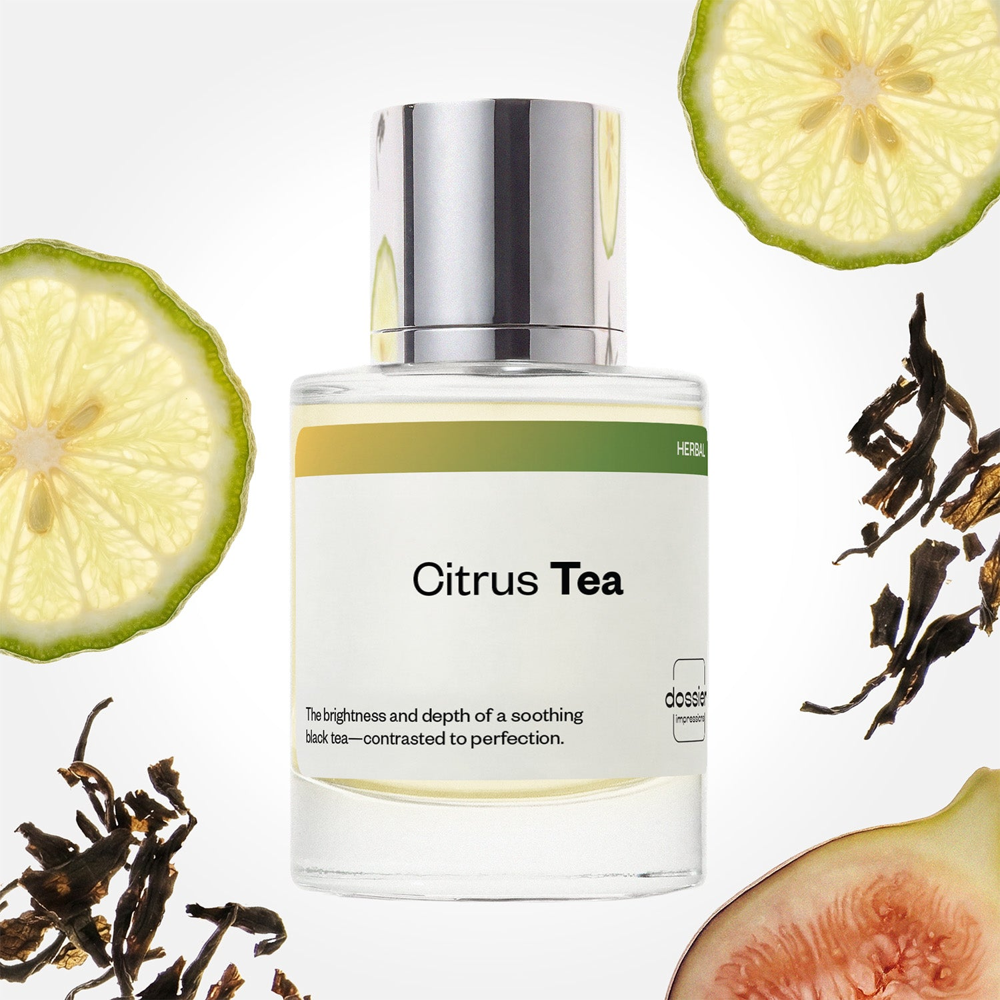

# Citrus Tea

- **Dossier Inspired by Le Labo Fragrances' Thé Noir 29**
- **URL:** https://dossier.co/products/citrus-tea
- **SEO title:** Thé Noir 29 by Le Labo Dupe Perfume: Citrus Tea - Dossier Perfumes

## Pricing (sizes)

| Size/SKU | Member price | List price | Currency |
|---|---|---|---|
| DI50CTEUS | 44.1 | 49 | USD |

## Content (scent notes, about, editorial)

Back Home / Perfumes / Dossier Impressions / CITRUS TEA 

Unisex 

Bestseller 

Citrus Tea

Eau de Parfum. Size: 50ml / 1.7oz 

members: $44.10

Guest:
$49

Inspired by Le Labo's Thé Noir 29 Inspired by Le Labo's Thé Noir 29 
Inspired by Le Labo's Thé Noir 29 

Retail price 235 Crafted in France 
Scent Family: herbal 

Add to Cart 

Scent Notes This perfume is: A fresh cup of tea with lemon 
Main Notes:

Bergamot

Fig

Black Tea

Cedarwood

Musks

Hay

Peach

Incense

top: The first notes you smell 
Bergamot, Fig, Black Tea 
middle: The heart of the perfume 
Bay Leaf, Tobacco, Jasmine, Vetiver 
base: The notes that linger all day 
Cedarwood, Musk, Hay, Peach, Incense 
ingredients: Alcohol Denat., Fragrance/Parfum, Water/Aqua/Eau, Tetramethyl Acetyloctahydronaphthalenes, Juniperus Virginiana Oil, Citrus Aurantium Bergamia (Bergamot) Peel Oil, Limonene, Pogostemon Cablin Oil, Linalyl Acetate, Isoeugenyl Acetate, Citrus Limon (Lemon) Peel Oil, Pinene, Linalool, Eugenol, Beta-Caryophyllene, Citronellol, Geraniol, Citrus Aurantium Peel Oil, Rose Flower Oil/Extract, Rose Ketones, Laurus Nobilis Leaf Oil, Citral, Terpineol, Isoeugenol, Eugenia Caryophyllus Oil, Terpinolene, Geranyl Acetate, Jasmine Oil/Extract, Cinnamomum Zeylanicum Bark Oil, Cinnamal, Benzyl Alcohol, Alpha-Terpinene, Benzaldehyde, Acetyl Cedrene, Benzyl Benzoate, Eucalyptus Globulus Oil. 

Vegan
Cruelty-free

Clean ingredients

About Citrus Tea (inspired by Le Labo's Thé Noir 29) writing is very linear, at the opposite of traditional top/middle/base fragrances. It offers a unique and lasting freshness, made of bergamot, tea leaf, bay leaf, fig and clear jasmine. Denser notes of wood, incense and hay infuse through this clarity, without ever weighting down the fragrance.

Peerless, utterly original yet still incredibly easy to wear, Citrus Tea (our impression of Le Labo's Thé Noir 29) carries a permanent oscillation between lightness and shadow, freshness and depth.

Scent Intensity: Significant 

Concentration: 25%

Gender: Unisex 

Shipping
Free shipping with 2+ items. 

Standard Shipping (with 2+ items) Auto-selected with 2+ items 
FREE 

Standard Shipping Auto-selected under 2 items 
$3.95 

Express shipping: 2 business days Select in checkout 
$19.00 

Returns
Free exchanges for all. Free returns with 

Exchanges
Free exchange, 1 time per order for all.

Returns
D+ members get 1 FREE return per order.
Non-members incur a $3.99/bottle return fee, 1 time per order.
Returns must be postmarked within 30 days of the initial order. Learn More 

FAQs Are these fragrances long lasting? They are designed to be very long lasting, just like designer fragrances, in some cases even longer, depending on the composition. 
When does the new packaging come out? We'll begin rolling out our new packaging across the U.S. and international markets soon! If you want to shop IRL - our new packaging first hits stores on January 11, 2026 at Walmart. Please note that if you are shopping online, you may receive a combination of our current and new packaging while we transition our inventory. 
How will I know what scent I like? We get it, shopping for perfumes online is hard! That's why we created a scent quiz, which will find the perfect scent for you Take the quiz (opens in new tab) 
Unsure about something? Ask us! help@dossier.co 

Details We are not associated or affiliated with the brands mentioned here in any way.
Citrus Tea

A brand brimming with sophistication and opulence

An ode to the marriage of black tea leaves and forgivingly fruity fig, the Le Labo Noir 29 fragrance (the scent that Dossier’s Citrus Tea is inspired by) provides a sneak peek into the secret lives of the ultra-wealthy. It is a burst of rich opulence that dances intimately on the taste buds. It is a divine scent that echoes a vintage postcard of sophisticated grace and refinement. Think of it as the aromatic equivalent of a vacation in the Azores – with all those vineyard-covered slopes, lush forests, and crystal-clear waterfalls.

The luxury fragrance that Citrus Tea is inspired by is urbane and simple at the same time – much like a breakfast of French coffee and buttery croissant. It opens with a brew of sweet fig, acidic bergamot, and subtleties of dry bay leaf, before giving way to skillfully matched middle notes of white musk and warm cedar. Superbly paired base notes of tobacco and hay also provide an exquisitely dreamy finale as the fragrance assimilates with the skin. The overall effect is a delectable scent that fills the air with a heavenly vision of affluence and wisdom.

The dry leaf notes of Le Labo Noir 29 mirror the elegance of a Chinese cup of black tea paired with the smoky undertones of rich tobacco, grassy vetiver, and musk. These notes awaken maturity and step through time to visit the nights of cigar-filled air and musky hay, seemingly taken straight out of a western movie.

To indulge in the musky scent of vintage tobacco blended with sweet tones of citrus and black tea, Le Labo’s Thé Noir 29 cologne can be bought from online retailers in 2 sizes (50 ml and 100 ml) and goes for $175.00 and $250.00 respectively. And for the smaller 15 ml sample travel size with a rollerball tip for your convenience, the price is $65.00. You can also experience this scent as a moisturizing second skin: the 237 ml bottle of body lotion is priced at $51.00. Finally, if you want the 120 ml bottle of body oil or the 237 ml shower gel, they cost $51.00 and $41.00 respectively.

Luxury can be experienced at an affordable price if you know where to look. If the sophisticated charm of rich tobacco is something you are looking for, grab Dossier’s Citrus Tea. Offering ebbing oscillation of fruity sweetness and heady potence, our Le Labo Noir 29 dupe is a playful balance of the tame and wild, the classic and modern, the fresh and vintage. It is crafted to conjure mental images of the Isle of Skye. Look no further if you wish to swim in the undercurrents of shadowy incense and dry hay showered with complements of fresh fig and tangy bergamot. Citrus Tea is a feast of complexly delicious notes interwoven to create an aroma of freshness and rich affluence.

Best Layered With Combine 2 of our perfumes to create a third scent with layering, curated by our nose. Learn more 

You Might Love 

4.2 

Rated 4.2 out of 5 stars 

Based on 1,097 reviews 

Reviews 1,097 (tab expanded) Questions 4 (tab collapsed) 

Filters 
Write a Review (Opens in a new window) 

1,097 reviews 
Sort Highest Rating Most Helpful Photos & Videos Most Recent Oldest Lowest Rating Least Helpful 

CM 

Cheryl M. 
Verified Buyer 

6/28/26 

Rated 5 out of 5 stars 

I am obsessed with my Citrus Tea
My daughter had bought the same scent for me when she was in Italy and paid a little over two hundred dollars for it. I fell in love with it, and so did everyone who had the privilege of smelling it on me. It was identified only by a number so I didn't have a name. I Googled the exact number on the front of the bottle with a little bit of information from the bottle, and Dossier came up with three different fragrances that could possibly imitate that fragrance.
After researching the three different fragrances and the one that my daughter had bought for me, I came up with Citrus Tea from Dossier. I was a bit skeptical because it was a little bit over $50 compared to the over $200. When I received it and spritzted a little on my arm... I was so excited because it was exactly that same fragrance as the one my daughter brought me from Italy, and I had already used almost all of that bottle.
Thank you, Dossier, for providing these fragrances for us who wish to pay only a fraction of the Italian perfumes.

Read More Read more about this review 

Was this helpful? Yes, this review from Cheryl M. was helpful. 0 people voted yes No, this review from Cheryl M. was not helpful. 0 people voted no 

DP 

Dossier Perfumes 
6/28/26 
We’re thrilled to hear Citrus Tea hit the spot and brought back those Italian memories, Cheryl! Thanks for sharing your story and letting us bring you luxe vibes at value.

JR 

Jennifer R. 
Verified Buyer 

6/17/26 

Rated 5 out of 5 stars 

Love it!
One of my favorite scents! A true unisex, everyday wear fragrance 

Read More Read more about this review 

Was this helpful? Yes, this review from Jennifer R. was helpful. 0 people voted yes No, this review from Jennifer R. was not helpful. 0 people voted no 

DP 

Dossier Perfumes 
6/17/26 
Thanks for sharing! It’s awesome to hear it’s become your everyday go-to with that perfect unisex vibe 😊

CW 

C.J. W. 
Verified Reviewer 

6/9/26 

Rated 5 out of 5 stars 

I had no idea!
I sprayed this fragrance on the first day and immediately said, "NO"! I put it aside and sprayed it on my bed after changing sheets. I don't know what I was smelling, but yesterday, it received rave reviews from women!

Read More Read more about this review 

Was this helpful? Yes, this review from C.J. W. was helpful. 0 people voted yes No, this review from C.J. W. was not helpful. 0 people voted no 

ST 

Sharnise T. 
Verified Buyer 

6/4/26 

Rated 5 out of 5 stars 

👍🏾
I love this scent, smells almost exactly like Le Labo! It’s very strong imo and last for quite a while! 

Read More Read more about this review 

Was this helpful? Yes, this review from Sharnise T. was helpful. 0 people voted yes No, this review from Sharnise T. was not helpful. 0 people voted no 

DP 

Dossier Perfumes 
6/4/26 
Sharnise, love hearing you’re enjoying it and getting lasting power! Keep enjoying the strength, feel free to explore more scents.

NP 

Neri P. 
Verified Buyer 

5/25/26 

Rated 5 out of 5 stars 

Amazing 
Smells exactly like “The Noir 29” 
10/10

Read More Read more about this review 

Was this helpful? Yes, this review from Neri P. was helpful. 0 people voted yes No, this review from Neri P. was not helpful. 0 people voted no 

DP 

Dossier Perfumes 
5/25/26 
Neri, thanks for the 10/10! We’re thrilled Citrus Tea hit that luxe vibe you love.

Loading... 

Loading... 

Show More 

Inspired by  Baccarat Rouge 540 
Inspired by  Black Opium 
Inspired by  Love, Don't Be Shy 
Inspired by  Good Girl 
Inspired by  Libre 
Inspired by  Flowerbomb 
Inspired by  Light Blue 
Inspired by  Not a Perfume 
Inspired by  Aventus 
Inspired by  Bleu de Chanel 
Inspired by  Mon Paris 
Inspired by  Coco Mademoiselle 
Inspired by  Tom Ford for Men 
Inspired by  For Her 
Inspired by  J'Adore Dior 
Inspired by  Alien 
Inspired by  Black Opium Perfume 
Inspired by  Lost Cherry Perfume 

GET UP TO 30% OFF 

Find us at these retailers. 

Be the first to know. 
Submit 

Shop the following countries. United States 

Discover.
AI Scent Finder 
Blog (opens in new tab) 
Scent Family 
Layering 
Scent Quiz 

Help.
Contact Us 
Returns 
FAQ 
Testimonials 
Accessibility 

More.
Store Locator 
Boutique 
Refer A Friend 
Index 

Download our app now.

Find us at these retailers. 

Be the first to know. 
Submit 

Shop the following countries. United States 

Discover.
AI Scent Finder 
Blog (opens in new tab) 
Scent Family 
Layering 
Scent Quiz 

Help.
Contact Us 
Returns 
FAQ 
Testimonials 
Accessibility 

More.

## Main Image

