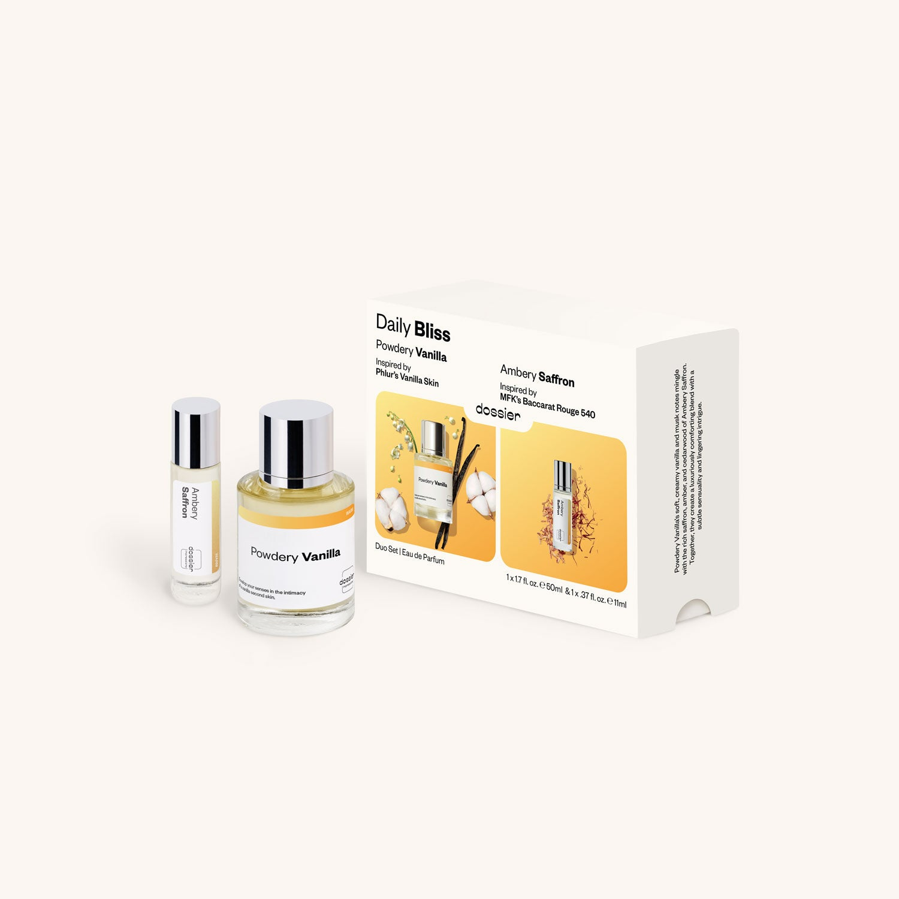

# Daily Bliss Duo

- **Dossier Dossier Perfumes**
- **URL:** https://dossier.co/products/daily-bliss-duo
- **SEO title:** Daily Bliss Duo

## Pricing (sizes)

| Size/SKU | Member price | List price | Currency |
|---|---|---|---|
| DOSTARGETDUO2026DB | 28.8 | 32 | USD |

## Content (scent notes, about, editorial)

Back Home / Perfumes / Gift Sets / DAILY BLISS DUO 

$46 Value
New 

Daily Bliss Duo

Eau de Parfum. Size: 50ml / 1.7oz, 11ml / 0.39oz 

Powdery Vanilla’s soft, creamy vanilla and musk notes layered with the rich saffron, amber, and cedarwood of Ambery Saffron. Together, they create a luxuriously comforting blend with a subtle sensuality and lingering intrigue. 

members: $28.80

Guest:
$32

Crafted in France 

Add to Cart 

What is Included Includes: Powdery Vanilla (50ml) Inspired by: Phlur's  Vanilla Skin 
Ambery Saffron (11ml) Inspired by: MFK's Baccarat Rouge 540 

Shipping
Free shipping with 2+ items. 

Standard Shipping (with 2+ items) Auto-selected with 2+ items 
FREE 

Standard Shipping Auto-selected under 2 items 
$3.95 

Express shipping: 2 business days Select in checkout 
$19.00 

Returns
This product is not refundable.

FAQs Are these fragrances long lasting? They are designed to be very long lasting, just like designer fragrances, in some cases even longer, depending on the composition. 
When does the new packaging come out? We'll begin rolling out our new packaging across the U.S. and international markets soon! If you want to shop IRL - our new packaging first hits stores on January 11, 2026 at Walmart. Please note that if you are shopping online, you may receive a combination of our current and new packaging while we transition our inventory. 
How will I know what scent I like? We get it, shopping for perfumes online is hard! That's why we created a scent quiz, which will find the perfect scent for you Take the quiz (opens in new tab) 
Unsure about something? Ask us! help@dossier.co 

You Might Love 

4.0 

Rated 4.0 out of 5 stars 

Based on 4 reviews 

Reviews 4 (tab expanded) Questions (tab collapsed) 

Filters 
Write a Review (Opens in a new window) 

4 reviews 
Sort Highest Rating Most Helpful Photos & Videos Most Recent Oldest Lowest Rating Least Helpful 

A 

Arielle 

7/1/26 

Rated 5 out of 5 stars 

5 Stars
Both scents are amazing. I cant wait to wear them. The Powdery Vanilla smells so luxurious and expensive!

Read More Read more about this review 

Was this helpful? Yes, this review from Arielle was helpful. 0 people voted yes No, this review from Arielle was not helpful. 0 people voted no 

A 

Amara 

6/26/26 

Rated 5 out of 5 stars 

5 Stars
Love the duo! Such a good value. And they both smell lovely!

Read More Read more about this review 

Was this helpful? Yes, this review from Amara was helpful. 0 people voted yes No, this review from Amara was not helpful. 0 people voted no 

RK 

Rafiatou K. 
Verified Buyer 

5/12/26 

Rated 5 out of 5 stars 

Anazing
Love the vanilla smell 

Read More Read more about this review 

Was this helpful? Yes, this review from Rafiatou K. was helpful. 0 people voted yes No, this review from Rafiatou K. was not helpful. 0 people voted no 

DP 

Dossier Perfumes 
5/12/26 
So glad you’re loving that vanilla vibe, Rafiatou! Thanks for sharing 😊

SN 

Stacy N. 
Verified Buyer 

5/27/26 

Rated 1 out of 5 stars 

Headache 
It smells ok but trigger a bad headache for me.

Read More Read more about this review 

Was this helpful? Yes, this review from Stacy N. was helpful. 0 people voted yes No, this review from Stacy N. was not helpful. 0 people voted no 

DP 

Dossier Perfumes 
5/28/26 
Sorry to hear it gave you a headache, Stacy! What scents do you usually wear? If you’d like help exploring different scent families, we're here to help.

Loading... 

Loading... 

Inspired by  Baccarat Rouge 540 
Inspired by  Black Opium 
Inspired by  Love, Don't Be Shy 
Inspired by  Good Girl 
Inspired by  Libre 
Inspired by  Flowerbomb 
Inspired by  Light Blue 
Inspired by  Not a Perfume 
Inspired by  Aventus 
Inspired by  Bleu de Chanel 
Inspired by  Mon Paris 
Inspired by  Coco Mademoiselle 
Inspired by  Tom Ford for Men 
Inspired by  For Her 
Inspired by  J'Adore Dior 
Inspired by  Alien 
Inspired by  Black Opium Perfume 
Inspired by  Lost Cherry Perfume 

GET UP TO 30% OFF 

Find us at these retailers. 

Be the first to know. 
Submit 

Shop the following countries. United States 

Discover.
AI Scent Finder 
Blog (opens in new tab) 
Scent Family 
Layering 
Scent Quiz 

Help.
Contact Us 
Returns 
FAQ 
Testimonials 
Accessibility 

More.
Store Locator 
Boutique 
Refer A Friend 
Index 

Download our app now.

Find us at these retailers. 

Be the first to know. 
Submit 

Shop the following countries. United States 

Discover.
AI Scent Finder 
Blog (opens in new tab) 
Scent Family 
Layering 
Scent Quiz 

Help.
Contact Us 
Returns 
FAQ 
Testimonials 
Accessibility 

More.

## Main Image

