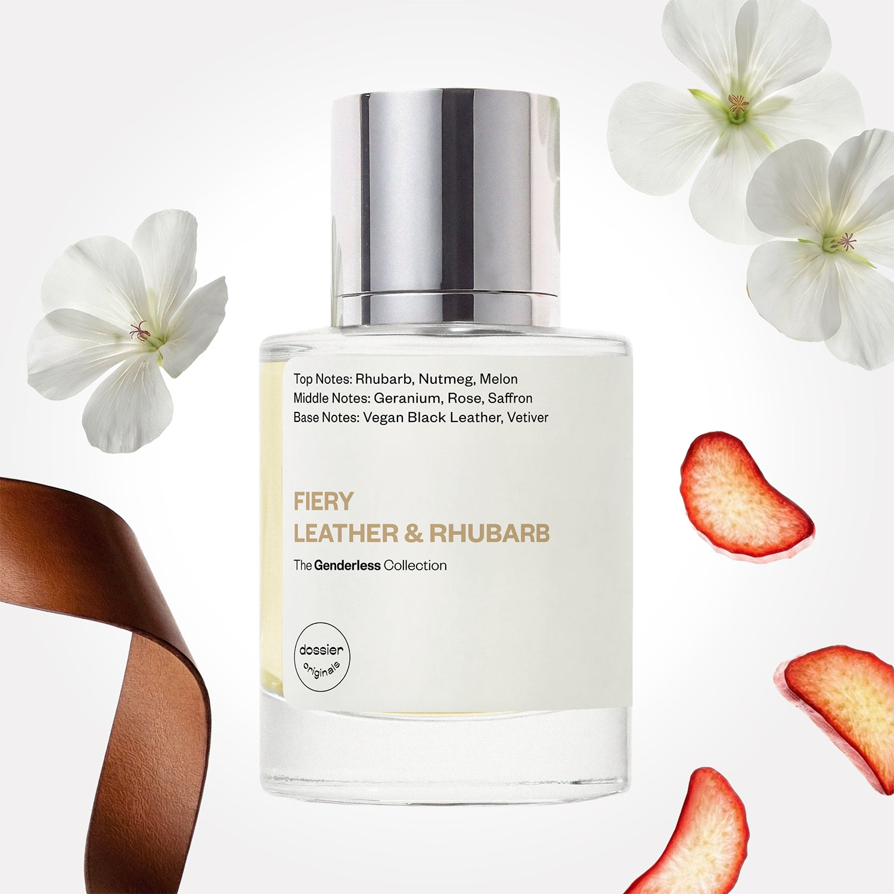

# Fiery Leather & Rhubarb

- **Dossier Dossier Originals**
- **URL:** https://dossier.co/products/fiery-leather-rhubarb
- **SEO title:** Fiery Leather & Rhubarb Perfume - Dossier Perfumes

## Pricing (sizes)

| Size/SKU | Member price | List price | Currency |
|---|---|---|---|
| 39919425749059 | 35.1 | 39 | USD |

## Content (scent notes, about, editorial)

Back Home / Perfumes / Dossier Originals / FIERY LEATHER & RHUBARB 

Unisex 

Sold out 

Fiery Leather & Rhubarb

Eau de Parfum. Size: 50ml / 1.7oz 

members: $35.10

Guest:
$39

Dossier Originals: The genderless collection 

The Genderless Collection melds traditionally masculine and traditionally feminine scents to create unique, genderfluid perfumes for all. 
Crafted in France 
Scent Family: earthy 

Notify Me 

Scent Notes Main Notes:

Geranium

Rose

Saffron

top: The first notes you smell 
Rhubarb, Nutmeg, Melon 
middle: The heart of the perfume 
Geranium, Rose, Saffron 
base: The notes that linger all day 
Vegan black Leather, Vetiver 
ingredients: Alcohol Denat., Water/Aqua/Eau, Fragrance/Parfum, Tetramethyl Acetyloctahydronaphthalenes, Linalyl Acetate, Juniperus Virginiana Oil, Pelargonium Graveolens Flower Oil, Pinene, Citronellol, Methyl 2-Octynoate, Benzaldehyde, Rose Ketones, Geraniol, Linalool, Vanillin, Beta-Caryophyllene, Limonene, Benzyl Benzoate. 

Vegan
Cruelty-free

Clean ingredients

About Love or hate it, this perfume makes a statement. 

Fiery Leather & Rhubarb interlaces an unconventional medley of raw materials built on a vegan black leather accord foundation, enhanced with florals, and rhubarb. 

Every ingredient elevates another to deliver a balance of masculine leather and feminine florals with vegetal notes of rhubarb.

Scent Intensity: Statement 

Concentration: 15%

Gender: Unisex 

Shipping
Free shipping with 2+ items. 

Standard Shipping (with 2+ items) Auto-selected with 2+ items 
FREE 

Standard Shipping Auto-selected under 2 items 
$3.95 

Express shipping: 2 business days Select in checkout 
$19.00 

Returns
Free exchanges for all. Free returns with 

Exchanges
Free exchange, 1 time per order for all.

Returns
D+ members get 1 FREE return per order.
Non-members incur a $3.99/bottle return fee, 1 time per order.
Returns must be postmarked within 30 days of the initial order. Learn More 

FAQs Are these fragrances long lasting? They are designed to be very long lasting, just like designer fragrances, in some cases even longer, depending on the composition. 
When does the new packaging come out? We'll begin rolling out our new packaging across the U.S. and international markets soon! If you want to shop IRL - our new packaging first hits stores on January 11, 2026 at Walmart. Please note that if you are shopping online, you may receive a combination of our current and new packaging while we transition our inventory. 
How will I know what scent I like? We get it, shopping for perfumes online is hard! That's why we created a scent quiz, which will find the perfect scent for you Take the quiz (opens in new tab) 
Unsure about something? Ask us! help@dossier.co 

You Might Love 

3.0 

Rated 3.0 out of 5 stars 

Based on 272 reviews 

Reviews 272 (tab expanded) Questions 1 (tab collapsed) 

Filters 
Write a Review (Opens in a new window) 

272 reviews 
Sort Highest Rating Most Helpful Photos & Videos Most Recent Oldest Lowest Rating Least Helpful 

A 

Alexis 
Verified Reviewer 

4/24/26 

Rated 5 out of 5 stars 

MY FAVORITE
I've been looking for a more unique scent so I went into the flagship store to sample some - as soon as I smelled this, it was like heaven. Sometimes I layer with Lord of Misrule or Patchouli oil and it's like a dream - I get stopped so much in public for this one asking what I'm wearing.. Definitely a staple, and lasts long! 

Read More Read more about this review 

Was this helpful? Yes, this review from Alexis was helpful. 0 people voted yes No, this review from Alexis was not helpful. 0 people voted no 

DP 

Dossier Perfumes 
4/24/26 
Alexis, we’re so happy you found a staple in this scent and that layering with patchouli oil adds extra magic. Those public compliments sound dreamy ✨

TB 

Texas B. 

Verified Buyer 

12/22/25 

Rated 5 out of 5 stars 

My Signature Scent for 2+ Years!
MASCULINITY At it's BEST!
1)LEATHER 2)SMOKE 3)RHUBARB 🔥
This Fragrance is such an Amazing Manly Scent! Not sure why it's "Unisex"? As much as I love it, I'm not sure I'd want to smell it on a woman. .

Read More Read more about this review 

Was this helpful? Yes, this review from Texas B. was helpful. 0 people voted yes No, this review from Texas B. was not helpful. 0 people voted no 

DP 

Dossier Perfumes 
12/22/25 
Hey Texas, we’re thrilled Fiery Leather & Rhubarb has been your go-to for 2+ years! Unisex means anyone can wear it, but your take makes total sense. Thanks so much!

P 

pauline 

11/25/25 

Rated 5 out of 5 stars 

5 Stars
Classy scent 👍🏼

Read More Read more about this review 

Was this helpful? Yes, this review from pauline was helpful. 0 people voted yes No, this review from pauline was not helpful. 0 people voted no 

AC 

Adrian C. 

9/16/25 

Rated 5 out of 5 stars 

ALLURING
Love, love , LOVE this scent! It blends so well with Ambery Saffron, Woody Sandalwood and the Golden Rum perfume. Each combination is redolent and attractive in its own way, but it’s just as lovely on its own! I get so many compliments from people, asking me what fragrance I’m wearing. It makes me smile and feel nice, especially when you put the daily effort into a fragrant routine.

Read More Read more about this review 

Was this helpful? Yes, this review from Adrian C. was helpful. 0 people voted yes No, this review from Adrian C. was not helpful. 0 people voted no 

DP 

Dossier Perfumes 
9/16/25 
This is everything, Adrian! That’s a layering masterpiece right there! Keep shining with those Dossier combos!

S 

Stephen 

7/31/25 

Rated 5 out of 5 stars 

ENIGMATIC!
What a scent!
The warmth of the leather with the sweetness of the juicy fruit rhubarb. 
A bit of an enigmatic scent for sure -- opposites, duality, allure.

Read More Read more about this review 

Was this helpful? Yes, this review from Stephen was helpful. 0 people voted yes No, this review from Stephen was not helpful. 0 people voted no 

DP 

Dossier Perfumes 
8/4/25 
Stephen, we’re calling it! Your review is pure charisma. Opposites, allure, and a little mystery? That’s fragrance done right.

Loading... 

Loading... 

Show More 

Inspired by  Baccarat Rouge 540 
Inspired by  Black Opium 
Inspired by  Love, Don't Be Shy 
Inspired by  Good Girl 
Inspired by  Libre 
Inspired by  Flowerbomb 
Inspired by  Light Blue 
Inspired by  Not a Perfume 
Inspired by  Aventus 
Inspired by  Bleu de Chanel 
Inspired by  Mon Paris 
Inspired by  Coco Mademoiselle 
Inspired by  Tom Ford for Men 
Inspired by  For Her 
Inspired by  J'Adore Dior 
Inspired by  Alien 
Inspired by  Black Opium Perfume 
Inspired by  Lost Cherry Perfume 

GET UP TO 30% OFF 

Find us at these retailers. 

Be the first to know. 
Submit 

Shop the following countries. United States 

Discover.
AI Scent Finder 
Blog (opens in new tab) 
Scent Family 
Layering 
Scent Quiz 

Help.
Contact Us 
Returns 
FAQ 
Testimonials 
Accessibility 

More.
Store Locator 
Boutique 
Refer A Friend 
Index 

Download our app now.

Find us at these retailers. 

Be the first to know. 
Submit 

Shop the following countries. United States 

Discover.
AI Scent Finder 
Blog (opens in new tab) 
Scent Family 
Layering 
Scent Quiz 

Help.
Contact Us 
Returns 
FAQ 
Testimonials 
Accessibility 

More.

## Main Image

