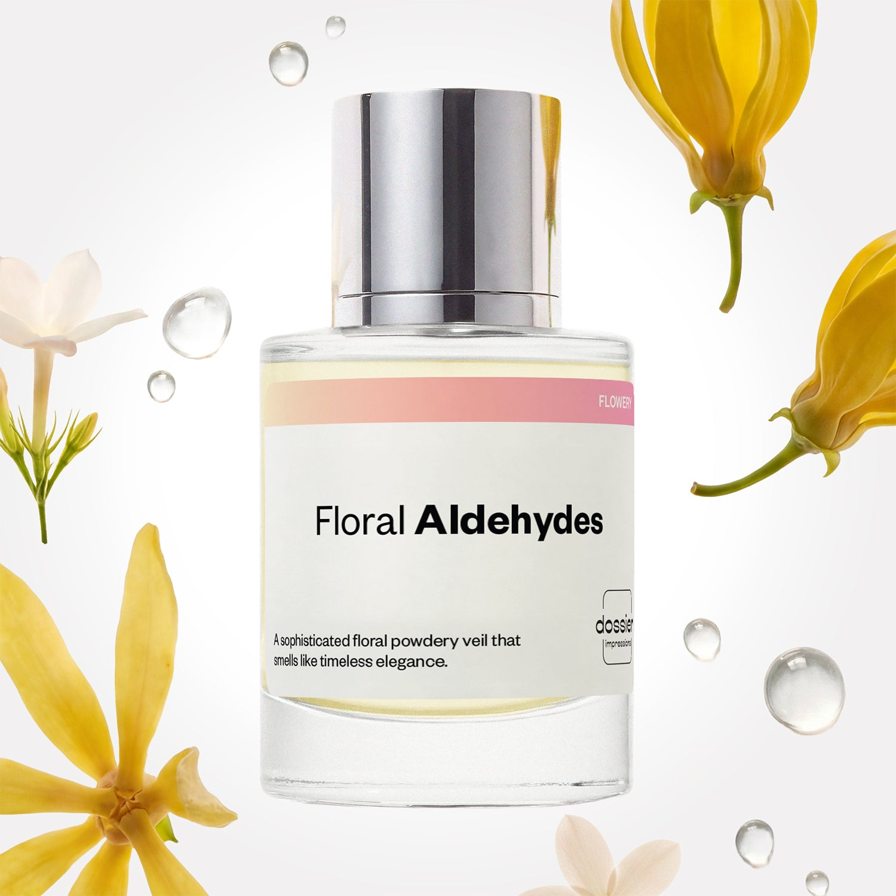

# Floral Aldehydes

- **Dossier Inspired by Chanel's N°5**
- **URL:** https://dossier.co/products/floral-aldehydes
- **SEO title:** Chanel's N°5 Dupe Perfume: Floral Aldehydes - Dossier Perfumes

## Pricing (sizes)

| Size/SKU | Member price | List price | Currency |
|---|---|---|---|
| DI50FLAUS | 28.8 | 32 | USD |

## Content (scent notes, about, editorial)

Back Home / Perfumes / Dossier Impressions / FLORAL ALDEHYDES 

Women 

Floral Aldehydes

Eau de Parfum. Size: 50ml / 1.7oz 

members: $28.80

Guest:
$32

Inspired by Chanel's N°5 Inspired by Chanel's N°5 
Inspired by Chanel's N°5 

Retail price 143 Crafted in France 
Scent Family: flowery 

Add to Cart 

Scent Notes This perfume is: A sophisticated, powdery veil 
Main Notes:

Aldehydes

Neroli

Bergamot

Ylang Ylang

Jasmine

May Rose

top: The first notes you smell 
Aldehydes, Neroli, Bergamot 
middle: The heart of the perfume 
Ylang Ylang, Jasmine, May Rose 
base: The notes that linger all day 
Vetiver,Sandalwood, Orris 
ingredients: Alcohol Denat., Water/Aqua/Eau, Fragrance/Parfum, Linalool, Coumarin, Citrus Aurantium Bergamia (Bergamot) Peel Oil, Linalyl Acetate, Alpha-Isomethyl Ionone, Hydroxycitronellal, Geraniol, Limonene, Citronellol, Vanillin, Benzyl Benzoate, Cananga Odorata Oil/Extract, Jasmine Oil/Extract, Cinnamyl Alcohol, Pinene, Geranyl Acetate, Santalol, Santalum Album (Sandalwood) Oil, Eugenol, Eugenia Caryophyllus Oil, Terpineol, Benzyl Salicylate, Citral, Beta-Caryophyllene, Pelargonium Graveolens Flower Oil, Benzyl Cinnamate, Isoeugenol, Rose Flower Oil/Extract, Isoeugenyl Acetate, Pogostemon Cablin Oil, Benzyl Alcohol, Farnesol, Terpinolene, Anethole, Alpha Terpinene, Eugenyl Acetate, Cinnamal, Methyl Salicylate. 

Vegan
Cruelty-free

Clean ingredients

About Floral Aldehydes (inspired by Chanel's N°5) is an iconic composition blending a bouquet of white floral notes with synthetic molecules discovered more than a century ago: the aldehydes. On its own, one might find aldehydes' scent rather aggressive. However, when married with our sweet floral bouquet, they boost the floral notes, adding a dazzling touch, unlike any other scent. 

With a distinctly feminine appeal, Floral Aldehydes (our impression of Chanel's N°5) will quickly become an eternal classic that turns heads. 

Scent Intensity: Statement 

Concentration: 12%

Gender: Feminine 

Shipping
Free shipping with 2+ items. 

Standard Shipping (with 2+ items) Auto-selected with 2+ items 
FREE 

Standard Shipping Auto-selected under 2 items 
$3.95 

Express shipping: 2 business days Select in checkout 
$19.00 

Returns
Free exchanges for all. Free returns with 

Exchanges
Free exchange, 1 time per order for all.

Returns
D+ members get 1 FREE return per order.
Non-members incur a $3.99/bottle return fee, 1 time per order.
Returns must be postmarked within 30 days of the initial order. Learn More 

FAQs Are these fragrances long lasting? They are designed to be very long lasting, just like designer fragrances, in some cases even longer, depending on the composition. 
When does the new packaging come out? We'll begin rolling out our new packaging across the U.S. and international markets soon! If you want to shop IRL - our new packaging first hits stores on January 11, 2026 at Walmart. Please note that if you are shopping online, you may receive a combination of our current and new packaging while we transition our inventory. 
How will I know what scent I like? We get it, shopping for perfumes online is hard! That's why we created a scent quiz, which will find the perfect scent for you Take the quiz (opens in new tab) 
Unsure about something? Ask us! help@dossier.co 

Details We are not associated or affiliated with the brands mentioned here in any way.
Floral Aldehydes

The World’s Most Popular Aldehydic Floral

Chanel No. 5 (the fragrance that inspired Dossier’s Floral Aldehydes) is one of the most iconic fragrances in luxury fragrance history, with a bottle being sold worldwide every 30 seconds. Its alluring effects conjure up images of elegance, chic, power, and high fashion — perfect for women of exceptional beauty and style.

One could argue that the perfume’s claim to fame is its meticulously hand-sealed glass bottles, upending much of what we thought we knew about perfume packaging. Or perhaps one would attribute its popularity to the countless Chanel No. 5 commercials and endorsements by celebrities such as Marilyn Monroe, who once famously said that "a few drops of Chanel No. 5" were all she wore to bed.

And you won’t be wrong. In their own way, these factors were undoubtedly important to the fragrance’s success. But as far as we’re concerned, what makes the luxury perfume that Floral Aldehydes is inspired by so extraordinary is its innovative formulation. This is a concoction that uses more than 80 ingredients in a multi-layered, complex formulation process, including aldehydes (one of the first to do so). The resulting fragrance is something of an enigma — a one-of-a-kind amalgam of both natural and synthetic elements.

The unmistakable aldehydic quality of the luxury perfume that Floral Aldehydes is inspired by, coupled with a complex blend of notes, makes it difficult to pinpoint the exact scent. But if we had to try, we’d say it’s somewhat citrusy, distinctly floral, and exceedingly feminine. 

The luxury fragrance that Floral Aldehydes is inspired by opens with a burst of freshness and sparkle thanks to the heavy dose of aldehydes combined with more familiar notes such as zingy bergamot, lemon, and delicious neroli. However, the effervescent top notes are quickly lost in the presence of the glorious middle notes of rose, jasmine heart, and lily-of-the-valley. Underneath this floral whirlwind lies a vibrant sensuality: captivating notes of vetiver, vanilla, amber, and sandalwood. Combined with a sultry musk, the luxury scent that Floral Aldehydes is inspired by uses its base notes to enfold you in its powerful embrace. A touch of earthy oakmoss and patchouli completes the aroma.

Dossier draws a page from the French luxury house’s century-old recipe to create a Chanel No. 5 dupe with an exquisite scent, reminiscent of the original fragrance. Floral Aldehydes is a floral scent you can wear with confidence, panache, and poise — qualities that befit a woman who knows exactly what she wants in life and will do whatever it takes to get there.

You Might Love 

3.9 

Rated 3.9 out of 5 stars 

Based on 839 reviews 

Reviews 839 (tab expanded) Questions 1 (tab collapsed) 

Filters 
Write a Review (Opens in a new window) 

839 reviews 
Sort Highest Rating Most Helpful Photos & Videos Most Recent Oldest Lowest Rating Least Helpful 

D 

Delene 

6/19/26 

Rated 5 out of 5 stars 

5 Stars
It smells wonderful. It reminds me of Chanel No 5. It last quite a while and the price is excellent.

Read More Read more about this review 

Was this helpful? Yes, this review from Delene was helpful. 0 people voted yes No, this review from Delene was not helpful. 0 people voted no 

PP 

Patricia P. 
Verified Buyer 

6/16/26 

Rated 5 out of 5 stars 

Perfection
This is incredible! It smells exactly like Chanel #5!! And it lasts all day! Usually I can’t smell what I’m wearing after a few hours but I can smell it on my skin even late in the day. Thank you so much for making such a high quality product so affordable! I will absolutely carpet customer. I am definitely spreading the good news. 

Read More Read more about this review 

Was this helpful? Yes, this review from Patricia P. was helpful. 0 people voted yes No, this review from Patricia P. was not helpful. 0 people voted no 

DP 

Dossier Perfumes 
6/16/26 
Patricia thanks so much! We’re thrilled it feels so luxe and stays with you all day. That’s exactly why we do this. Keep sharing the love and happy spritzing!

IP 

Ivan P. 
Verified Buyer 

6/11/26 

Rated 5 out of 5 stars 

Very Elegant 
I wasn’t sure what to expect since I heard it was inspired by Chanel No.5 but it smelled really great! The floral scent is divine and lasts a good while!

Read More Read more about this review 

Was this helpful? Yes, this review from Ivan P. was helpful. 0 people voted yes No, this review from Ivan P. was not helpful. 0 people voted no 

DP 

Dossier Perfumes 
6/11/26 
Ivan! We’re thrilled you gave Floral Aldehydes a try, glad it delivered that elegant floral vibe and stuck around all day. Thanks for sharing your experience 💫

N 

Nadia 

5/28/26 

Rated 5 out of 5 stars 

5 Stars
I love this perfume, pretty close to the original No. 5, stays on skin and on clothes for over 6 hrs 👌🏻 i buy it to layer it with other perfumes and create something new and dossier didn’t disappoint. Keep up with the good job but please send the samples full, mine was almost empty.

Read More Read more about this review 

Was this helpful? Yes, this review from Nadia was helpful. 0 people voted yes No, this review from Nadia was not helpful. 0 people voted no 

EO 

Emma o. O. 
Verified Buyer 

5/22/26 

Rated 5 out of 5 stars 

Interesting
I have never smelled Chanel number five before ever and I'm a middle-aged woman. So I bought this because I wanted to have the Chanel number five sort of smell in my home. It's not terrible at all. It's just not for me. very sophisticated, very waspy old money kind of smell. It is very strong. It has a long-lasting scent to it. It is not bad, it's just not for me.

Read More Read more about this review 

Was this helpful? Yes, this review from Emma o. O. was helpful. 0 people voted yes No, this review from Emma o. O. was not helpful. 0 people voted no 

DP 

Dossier Perfumes 
5/22/26 
Emma, thanks for sharing your thoughts on Floral Aldehydes. It’s sophisticated, long-lasting. Even if it wasn’t your cup of tea, exploring our catalog help you find a better fit.

Loading... 

Loading... 

Show More 

Inspired by  Baccarat Rouge 540 
Inspired by  Black Opium 
Inspired by  Love, Don't Be Shy 
Inspired by  Good Girl 
Inspired by  Libre 
Inspired by  Flowerbomb 
Inspired by  Light Blue 
Inspired by  Not a Perfume 
Inspired by  Aventus 
Inspired by  Bleu de Chanel 
Inspired by  Mon Paris 
Inspired by  Coco Mademoiselle 
Inspired by  Tom Ford for Men 
Inspired by  For Her 
Inspired by  J'Adore Dior 
Inspired by  Alien 
Inspired by  Black Opium Perfume 
Inspired by  Lost Cherry Perfume 

GET UP TO 30% OFF 

Find us at these retailers. 

Be the first to know. 
Submit 

Shop the following countries. United States 

Discover.
AI Scent Finder 
Blog (opens in new tab) 
Scent Family 
Layering 
Scent Quiz 

Help.
Contact Us 
Returns 
FAQ 
Testimonials 
Accessibility 

More.
Store Locator 
Boutique 
Refer A Friend 
Index 

Download our app now.

Find us at these retailers. 

Be the first to know. 
Submit 

Shop the following countries. United States 

Discover.
AI Scent Finder 
Blog (opens in new tab) 
Scent Family 
Layering 
Scent Quiz 

Help.
Contact Us 
Returns 
FAQ 
Testimonials 
Accessibility 

More.

## Main Image

