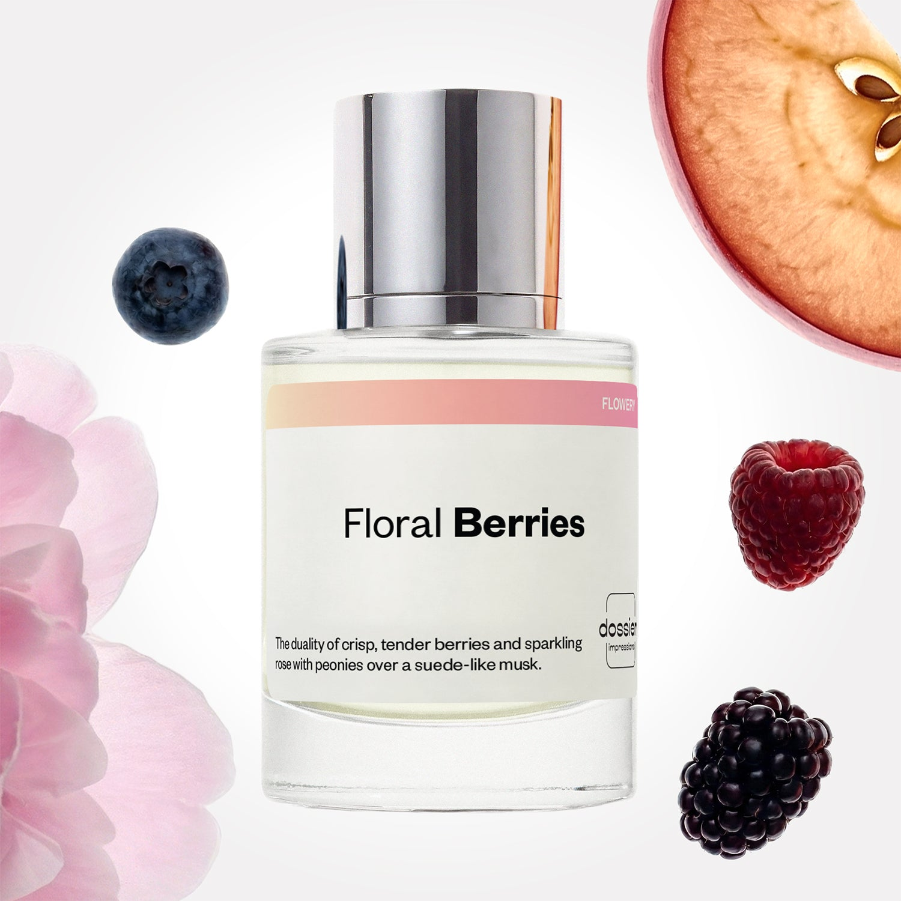

# Floral Berries

- **Dossier Inspired by Jo Malone's Peony & Blush Suede**
- **URL:** https://dossier.co/products/floral-berries
- **SEO title:** Jo Malone's Peony & Blush Suede Dupe Perfume: Floral Berries - Dossier Perfumes

## Pricing (sizes)

| Size/SKU | Member price | List price | Currency |
|---|---|---|---|
| DI50FLBUS | 28.8 | 32 | USD |

## Content (scent notes, about, editorial)

Back Home / Perfumes / Dossier Impressions / FLORAL BERRIES 

Unisex 

Floral Berries

Eau de Parfum. Size: 50ml / 1.7oz 

members: $28.80

Guest:
$32

Inspired by Jo Malone's Peony & Blush Suede Inspired by Jo Malone's Peony & Blush Suede 
Inspired by Jo Malone's Peony & Blush Suede 

Retail price 118 Crafted in France 
Scent Family: flowery 

Add to Cart 

Scent Notes This perfume is: The color pink as a fragrance 
Main Notes:

Peony

Red Apple

Berries

Suede Accord

Musks

top: The first notes you smell 
Peony, Red Apple, Berries 
middle: The heart of the perfume 
Rose, Carnation, Jasmine 
base: The notes that linger all day 
Suede Accord, Musks 
ingredients: Alcohol Denat., Fragrance/Parfum, Water/Aqua/Eau, Benzyl Salicylate, Tetramethyl Acetyloctahydronaphthalenes, Alpha-Isomethyl Ionone, Benzyl Alcohol, Geraniol, Linalyl Acetate, Citronellol, Hydroxycitronellal, Acetyl Cedrene, Linalool, Vanillin, Eugenol, Citrus Aurantium Bergamia (Bergamot) Peel Oil, Pogostemon Cablin Oil, Limonene, Cinnamyl Alcohol, Rose Ketones, Pinene, Terpineol, Rose Flower Oil/Extract, Hexadecanolactone, Benzyl Benzoate, Beta-Caryophyllene, Citral, Isoeugenol, Benzaldehyde. 

Vegan
Cruelty-free

Clean ingredients

About It transforms the crisp tenderness of berries and the sparkling bloom of roses and peonies into an irresistible scent. Beyond the initial impression, the juicy acidity of red apple hits aromatically next. As the fragrance evaporates, blush suede balances the berry sweetness with a powdery musk that harmonize together beautifully. 

Charming and delicate, Floral Berries (inspired by Jo Malone's Peony & Blush Suede) comes to life as a soft pink fragrance.

Scent Intensity: Soft 

Concentration: 18%

Gender: Unisex 

Shipping
Free shipping with 2+ items. 

Standard Shipping (with 2+ items) Auto-selected with 2+ items 
FREE 

Standard Shipping Auto-selected under 2 items 
$3.95 

Express shipping: 2 business days Select in checkout 
$19.00 

Returns
Free exchanges for all. Free returns with 

Exchanges
Free exchange, 1 time per order for all.

Returns
D+ members get 1 FREE return per order.
Non-members incur a $3.99/bottle return fee, 1 time per order.
Returns must be postmarked within 30 days of the initial order. Learn More 

FAQs Are these fragrances long lasting? They are designed to be very long lasting, just like designer fragrances, in some cases even longer, depending on the composition. 
When does the new packaging come out? We'll begin rolling out our new packaging across the U.S. and international markets soon! If you want to shop IRL - our new packaging first hits stores on January 11, 2026 at Walmart. Please note that if you are shopping online, you may receive a combination of our current and new packaging while we transition our inventory. 
How will I know what scent I like? We get it, shopping for perfumes online is hard! That's why we created a scent quiz, which will find the perfect scent for you Take the quiz (opens in new tab) 
Unsure about something? Ask us! help@dossier.co 

Details We are not associated or affiliated with the brands mentioned here in any way.
Floral Berries

A flirtatious dance of seduction and irresistibility

The epitome of exquisite fragility and voluptuous bloom, the Jo Malone Peony and Blush Suede cologne (the fragrance that Dossier’s Floral Berries is inspired by) is a breathtaking leap into a field of peonies, while experiencing the crisp bite of a mouth-wateringly juicy apple. It radiates youthful exuberance with an energy-infused top note of red apple. And while you’re still enjoying it, it goes on to uncover medium and base floral notes of peonies and delicious hints of honey and nectar. Plus, there are subtle floral clues of jasmine, rose and carnations all coming through in a delightful thrill to the senses. Think of it as a burst of juicy acidity.

Wearing the luxury fragrance that Floral Berries is inspired by conjures a feeling akin to stepping beyond youth into womanhood and experiencing the fervor femininity has to offer. And for something so delicately attractive and youthful, the fresh crispness of the red apple breaks through to a sharper and tangier flavor that blends with the softness of the gorgeous peonies to offer a bolder statement of seduction and allure. This floral, fruity fragrance possesses an innocent charm that will ask shyly to be gazed at with awe. One spritz is enough to last through the duration of the day, while the tenderness of the fragrance will continue to evolve and display new floral colors.

And there’s more: the bottle. The Jo Malone Peony and Blush Suede’s bottle reverberates the style and class the luxury brand is known for. It is a sleek set up with a commanding silver cap. It is a style aesthetic that adds to the luxuriant bloom and frisky sensuality of the perfume it houses.

If you want to wear this flirtatious feast of floral fruitiness, you can get the 100 ml bottle of Jo Malone Peony and Blush Suede cologne for $117.00 and the smaller 30 ml bottle for $81.00. You can also get the 60 g Travel Candle for $27.00 and the larger 600 g Deluxe Candle for $140.00. In a similar line, the 250 ml bath oil goes for $52.00 while the 175 ml body crème costs $74.00. Finally, if you want to treat yourself or a loved one to the gift set (which includes the body and hand-wash, the body crème and the cologne), you can get it for $116.00.

Now, if you’re crushing on the Jo Malone Peony and Blush Suede fragrance but would rather have something cheaper, Floral Berries from Dossier is a perfect match. Our dupe is a cocktail of irresistibility and tenderness – and one that creates a feeling of seductive affection. With freshly picked rose and peony top notes blended mystically with the fruity fusion of apple and berries, Floral Berries is an effortless display of femininity and love. The first whiff is teasing, the second is intoxicating, and the third is just plain addictive. If you’re looking to have a really good time, this is the perfume for you.

Best Layered With Combine 2 of our perfumes to create a third scent with layering, curated by our nose. Learn more 

You Might Love 

4.4 

Rated 4.4 out of 5 stars 

Based on 777 reviews 

Reviews 777 (tab expanded) Questions 2 (tab collapsed) 

Filters 
Write a Review (Opens in a new window) 

777 reviews 
Sort Highest Rating Most Helpful Photos & Videos Most Recent Oldest Lowest Rating Least Helpful 

L 

Lezlie 

6/7/26 

Rated 5 out of 5 stars 

5 Stars
I liked the fragrance. It got a lot of attention.

Read More Read more about this review 

Was this helpful? Yes, this review from Lezlie was helpful. 0 people voted yes No, this review from Lezlie was not helpful. 0 people voted no 

CB 

Cher B. 
Verified Buyer 

5/29/26 

Rated 5 out of 5 stars 

Wonderful scent, great sillage 
Floral Berries is a wonderful match for Jo Malone’s Peony Blush Suede and the scent stays with me all day, which the Jo Malone scent doesn’t. 

Read More Read more about this review 

Was this helpful? Yes, this review from Cher B. was helpful. 0 people voted yes No, this review from Cher B. was not helpful. 0 people voted no 

DP 

Dossier Perfumes 
5/29/26 
We’re so happy our Floral Berries keeps you surrounded by that lovely vibe all day long, and that it brings extra compliments your way. Thanks for sharing!

SW 

Susannah W. 
Verified Buyer 

5/26/26 

Rated 5 out of 5 stars 

Obsessed 
Waited forever for this one to be stocked ❤️
It's one of my all time favorite scents, it is spot on for the joe malone blushing suede and peony but lasts way way longer. Highly recommend

Read More Read more about this review 

Was this helpful? Yes, this review from Susannah W. was helpful. 0 people voted yes No, this review from Susannah W. was not helpful. 0 people voted no 

DP 

Dossier Perfumes 
5/27/26 
Susannah, we’re so happy you finally got this one and it’s living up to your expectations. Thanks for sharing how long it stays on, happy spritzing!

WT 

Wendy T. 
Verified Buyer 

5/20/26 

Rated 5 out of 5 stars 

Floral berries 
It's like taking a walk into a garden with juicy berries

Read More Read more about this review 

Was this helpful? Yes, this review from Wendy T. was helpful. 0 people voted yes No, this review from Wendy T. was not helpful. 0 people voted no 

DP 

Dossier Perfumes 
5/20/26 
Hey Wendy, loving that it wraps you in a juicy berry garden walk 😊 Thanks!

ME 

maria e. 
Verified Buyer 

5/16/26 

Rated 5 out of 5 stars 

Floral Berries
So perfect. I love the scent so much.

Read More Read more about this review 

Was this helpful? Yes, this review from maria e. was helpful. 0 people voted yes No, this review from maria e. was not helpful. 0 people voted no 

DP 

Dossier Perfumes 
5/16/26 
Maria, we’re thrilled Floral Berries feels perfect for you. Thank you so much!

Loading... 

Loading... 

Show More 

Inspired by  Baccarat Rouge 540 
Inspired by  Black Opium 
Inspired by  Love, Don't Be Shy 
Inspired by  Good Girl 
Inspired by  Libre 
Inspired by  Flowerbomb 
Inspired by  Light Blue 
Inspired by  Not a Perfume 
Inspired by  Aventus 
Inspired by  Bleu de Chanel 
Inspired by  Mon Paris 
Inspired by  Coco Mademoiselle 
Inspired by  Tom Ford for Men 
Inspired by  For Her 
Inspired by  J'Adore Dior 
Inspired by  Alien 
Inspired by  Black Opium Perfume 
Inspired by  Lost Cherry Perfume 

GET UP TO 30% OFF 

Find us at these retailers. 

Be the first to know. 
Submit 

Shop the following countries. United States 

Discover.
AI Scent Finder 
Blog (opens in new tab) 
Scent Family 
Layering 
Scent Quiz 

Help.
Contact Us 
Returns 
FAQ 
Testimonials 
Accessibility 

More.
Store Locator 
Boutique 
Refer A Friend 
Index 

Download our app now.

Find us at these retailers. 

Be the first to know. 
Submit 

Shop the following countries. United States 

Discover.
AI Scent Finder 
Blog (opens in new tab) 
Scent Family 
Layering 
Scent Quiz 

Help.
Contact Us 
Returns 
FAQ 
Testimonials 
Accessibility 

More.

## Main Image

