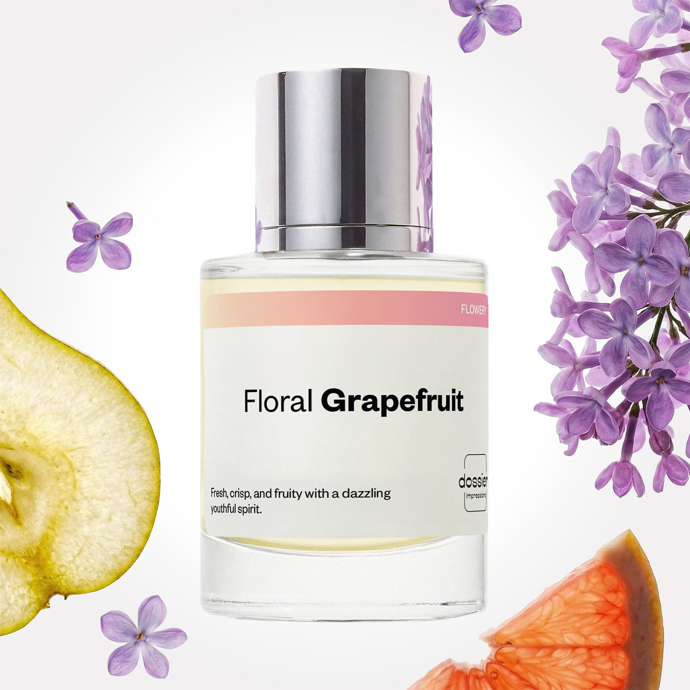

# Floral Grapefruit

- **Dossier Inspired by Chanel's Chance Eau Tendre**
- **URL:** https://dossier.co/products/floral-grapefruit
- **SEO title:** Chanel's Chance Eau Tendre Dupe Perfume: Floral Grapefruit - Dossier Perfumes

## Pricing (sizes)

| Size/SKU | Member price | List price | Currency |
|---|---|---|---|
| DI50FLGUS | 28.8 | 32 | USD |

## Content (scent notes, about, editorial)

Back Home / Perfumes / Dossier Impressions / FLORAL GRAPEFRUIT 

Women 

Floral Grapefruit

Eau de Toilette. Size: 50ml / 1.7oz 

members: $28.80

Guest:
$32

Inspired by Chanel's Chance Eau Tendre Inspired by Chanel's Chance Eau Tendre 
Inspired by Chanel's Chance Eau Tendre 

Retail price 116 Crafted in France 
Scent Family: flowery 

Add to Cart 

Scent Notes This perfume is: A soft spring breeze 
Main Notes:

Grapefruit

Lilac

Pear

top: The first notes you smell 
Grapefruit, Pear, Blackcurrant 
middle: The heart of the perfume 
Hyacinth, Jasmine, Lilac 
base: The notes that linger all day 
Orris, Musks, Amber Woods 
ingredients: Alcohol Denat., Fragrance/Parfum, Water/Aqua/Eau, Tetramethyl Acetyloctahydronaphthalenes, Juniperus Virginiana Oil, Alpha-Isomethyl Ionone, Linalyl Acetate, Linalool, Citronellol, Hydroxycitronellal, Hexyl Cinnamal, Limonene, Geraniol, Beta-Caryophyllene, Rose Ketones, Dimethyl Phenethyl Acetate, Jasmine Oil/Extract, Vanillin, Rose Flower Oil/Extract, Benzyl Alcohol, Citral, Pinene, Benzyl Benzoate. 

Vegan
Cruelty-free

Clean ingredients

About Floral Grapefruit (inspired by Chanel's Chance Eau Tendre) is a delicate floral bouquet that blends highly qualitative essences of lilac, jasmine, and hyacinth, enlightened on top with a fizzy cocktail of grapefruit, blackcurrant, and pear.

Beaming, sparkling, and petally, Floral Grapefruit (our impression of Chanel's Chance Eau Tendre) is a soft and nuanced combination.

Scent Intensity: Soft 

Concentration: 18%

Gender: Feminine 

Shipping
Free shipping with 2+ items. 

Standard Shipping (with 2+ items) Auto-selected with 2+ items 
FREE 

Standard Shipping Auto-selected under 2 items 
$3.95 

Express shipping: 2 business days Select in checkout 
$19.00 

Returns
Free exchanges for all. Free returns with 

Exchanges
Free exchange, 1 time per order for all.

Returns
D+ members get 1 FREE return per order.
Non-members incur a $3.99/bottle return fee, 1 time per order.
Returns must be postmarked within 30 days of the initial order. Learn More 

FAQs Are these fragrances long lasting? They are designed to be very long lasting, just like designer fragrances, in some cases even longer, depending on the composition. 
When does the new packaging come out? We'll begin rolling out our new packaging across the U.S. and international markets soon! If you want to shop IRL - our new packaging first hits stores on January 11, 2026 at Walmart. Please note that if you are shopping online, you may receive a combination of our current and new packaging while we transition our inventory. 
How will I know what scent I like? We get it, shopping for perfumes online is hard! That's why we created a scent quiz, which will find the perfect scent for you Take the quiz (opens in new tab) 
Unsure about something? Ask us! help@dossier.co 

Details We are not associated or affiliated with the brands mentioned here in any way.
Floral Grapefruit

A contemporary take on French elegance

Autumns winds are a true sensation, and you can wear them – thanks to Chanel Chance Eau Tendre Eau de Parfum Spray, our inspiration for the Dossier Floral Grapefruit fragrance. This perfume, which prides itself as “a dazzling constellation of notes”, starts off as a sweet and fascinating fusion of quince, grapefruit, hyacinth, and jasmine. Once it settles down, you’ll taste the smell of richer florals, such as musk, iris, Virginia cedar, and amber.

The hyacinth and jasmine central notes are especially unmistakable, awakening your senses like the breath of revitalizing ocean breeze.

Unleash your gusto with just a few spritz of this perfume as it reaches into the depths of your soul with rejuvenating power. With a style similar to that of the scarlet sunset, and vigor similar to that of the winds that surf the prairies, the Eau de Parfum that Floral Grapefruit is inspired by is an irrepressible and energetic free spirit.

Once you’ve tried it, you never get enough of it. It is a sumptuous and exotic floral that lifts your spirits and brightens up your day. It encapsulates the unquenchable life and spirit of 20th-century Paris.

Even the name of this perfume is classy: the “Chanel Chance Eau Tendre” label has the sassy style of the French written all over it. If you want to smell as fresh as the word itself, this fragrance is the way to go. It delivers a feeling of perpetual, icy-cold freshness that is genuinely unequivocally pleasing.

As a plus, the bottle is too beautiful to pass up. It has a tasteful, urban, and dignified design only matched by the gracefulness of the liquid inside.

So much good was put into this product – and that’s why it’s such a classic masterpiece. Sport it on vacation or when you simply want to concoct a mind’s eye view of one. This is your ticket to the breathtaking gardens of Wonderland.

Chanel Chance Eau Tendre is the spirit of beauty trapped in a bottle. It is stunning on the surface as well as the inside. But if you’re on the market for a replica that comes close to the original, try Dossier’s Floral Grapefruit. Brimming with the zeal of a fizzy, frozen strawberry daiquiri, our Chanel Chance Eau Tendre dupe is a cheerful event right from the first spritz. It’s a zingy mix of lilac, jasmine, and hyacinth, sweetened with grapefruit, blackcurrant, and pear. This is a true dreamland classic. Floral grapefruit is the perfume for the prototypical, adventurous, and modern lady – as well as the creatively uninhibited type.

Best Layered With Combine 2 of our perfumes to create a third scent with layering, curated by our nose. Learn more 

You Might Love 

4.5 

Rated 4.5 out of 5 stars 

Based on 1,655 reviews 

Reviews 1,655 (tab expanded) Questions 3 (tab collapsed) 

Filters 
Write a Review (Opens in a new window) 

1,655 reviews 
Sort Highest Rating Most Helpful Photos & Videos Most Recent Oldest Lowest Rating Least Helpful 

LY 

Latanya Y. A. 
Verified Buyer 

6/30/26 

Rated 5 out of 5 stars 

I love this scent 
This scent is PERFECT for warm weather, it isn't loud it is subtle and a compliment getter. I will be purchasing another bottle

Read More Read more about this review 

Was this helpful? Yes, this review from Latanya Y. A. was helpful. 0 people voted yes No, this review from Latanya Y. A. was not helpful. 0 people voted no 

DP 

Dossier Perfumes 
7/1/26 
Latanya, so glad it’s the perfect warm-weather pick, stays subtle yet earns compliments 🙌 can’t wait to see your next bottle

A 

Angel 

6/18/26 

Rated 5 out of 5 stars 

5 Stars
I will buy it again ❤️❤️❤️

Read More Read more about this review 

Was this helpful? Yes, this review from Angel was helpful. 0 people voted yes No, this review from Angel was not helpful. 0 people voted no 

A 

Adriana 

6/17/26 

Rated 5 out of 5 stars 

5 Stars
Me encanto🥰

Read More Read more about this review 

Was this helpful? Yes, this review from Adriana was helpful. 0 people voted yes No, this review from Adriana was not helpful. 0 people voted no 

S 

Shannon 

6/15/26 

Rated 5 out of 5 stars 

5 Stars
The perfect Summer scent. I am on my second bottle. This Chanel inspiration is a great buy.

Read More Read more about this review 

Was this helpful? Yes, this review from Shannon was helpful. 0 people voted yes No, this review from Shannon was not helpful. 0 people voted no 

S 

Suzie 
Verified Buyer 

6/13/26 

Rated 5 out of 5 stars 

Smells just like the original 
I love this scent! It will always be my favorite. I get so many compliments when I wear it. It really is a beautiful fragrance. 

Read More Read more about this review 

Was this helpful? Yes, this review from Suzie was helpful. 0 people voted yes No, this review from Suzie was not helpful. 0 people voted no 

DP 

Dossier Perfumes 
6/13/26 
Suzie, yay! We’re so happy it’s your go-to and that compliments keep rolling in. You deserve every one. Keep enjoying and exploring our catalog whenever you like! ✨

Loading... 

Loading... 

Show More 

Inspired by  Baccarat Rouge 540 
Inspired by  Black Opium 
Inspired by  Love, Don't Be Shy 
Inspired by  Good Girl 
Inspired by  Libre 
Inspired by  Flowerbomb 
Inspired by  Light Blue 
Inspired by  Not a Perfume 
Inspired by  Aventus 
Inspired by  Bleu de Chanel 
Inspired by  Mon Paris 
Inspired by  Coco Mademoiselle 
Inspired by  Tom Ford for Men 
Inspired by  For Her 
Inspired by  J'Adore Dior 
Inspired by  Alien 
Inspired by  Black Opium Perfume 
Inspired by  Lost Cherry Perfume 

GET UP TO 30% OFF 

Find us at these retailers. 

Be the first to know. 
Submit 

Shop the following countries. United States 

Discover.
AI Scent Finder 
Blog (opens in new tab) 
Scent Family 
Layering 
Scent Quiz 

Help.
Contact Us 
Returns 
FAQ 
Testimonials 
Accessibility 

More.
Store Locator 
Boutique 
Refer A Friend 
Index 

Download our app now.

Find us at these retailers. 

Be the first to know. 
Submit 

Shop the following countries. United States 

Discover.
AI Scent Finder 
Blog (opens in new tab) 
Scent Family 
Layering 
Scent Quiz 

Help.
Contact Us 
Returns 
FAQ 
Testimonials 
Accessibility 

More.

## Main Image

