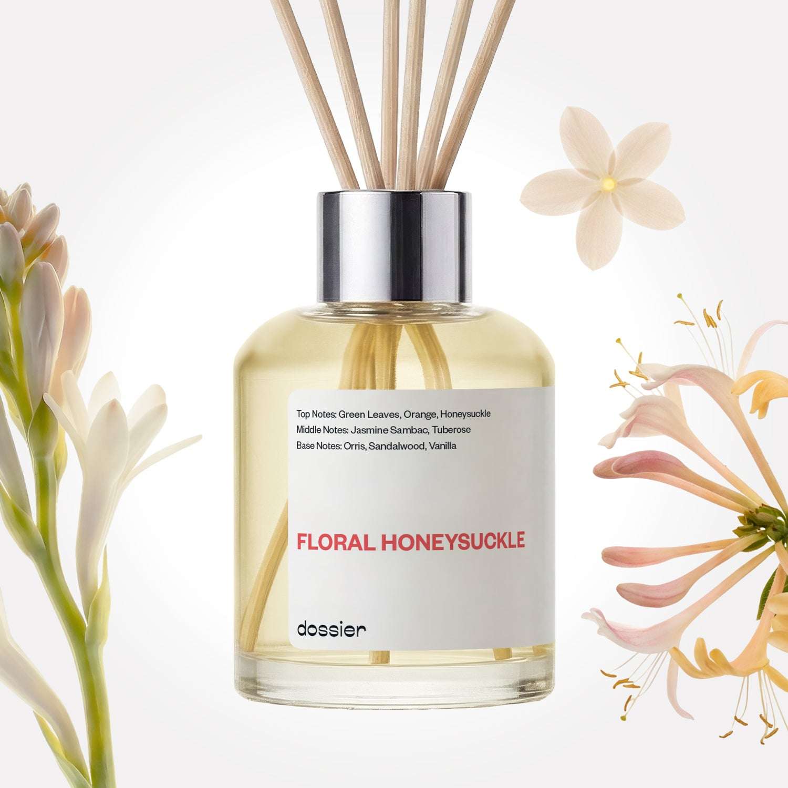

# Floral Honeysuckle Room Diffuser

- **Dossier Inspired by Gucci's Bloom Perfume**
- **URL:** https://dossier.co/products/floral-honeysuckle-diffuser
- **SEO title:** Gucci bloom diffuser Dupe impression - Floral Honeysuckle Room Diffuser

## Pricing (sizes)

| Size/SKU | Member price | List price | Currency |
|---|---|---|---|
| 40397936820291 | 34.2 | 38 | USD |

## Content (scent notes, about, editorial)

Back Home / Home Scents / Diffusers / FLORAL HONEYSUCKLE ROOM DIFFUSER 

Sold out 

Floral Honeysuckle Room Diffuser

Size: 100ml / 3.4oz 

members: $34.20

Guest:
$38

Inspired by Gucci's Bloom Perfume Inspired by Gucci's Bloom Perfume 
Inspired by Gucci's Bloom Perfume 

Crafted in France 
Scent Family: flowery 

Notify Me 

Scent Notes This perfume is: Soft, petally, feminine 
Main Notes:

Honeysuckle

Jasmine Sambac

Tuberose

top: The first notes you smell 
Green Leaves, Orange, Honeysuckle 
middle: The heart of the perfume 
Jasmine Sambac, Tuberose 
base: The notes that linger all day 
Orris, Sandalwood, Vanilla 
ingredients: Jasmine Abs, Ylang Ess, Florol, Hedione, Linalol, Benzyl Salicylate, Musk T, Iso E Super, Benzyl Benzoate, Hydroxycitronellal, Amyl Salicylate, Benzyl Acetate, Phenylethyl Alcohol, Cis-3-Hexenyl Benzoate, Citronellol, Cyclohexyl Salicylate, Methyl Anthranilate, Citronellyl Acetate, Delta Decalactone, C18 Aldehyde, Geraniol 

Vegan
Cruelty-free

Clean ingredients

About This dreamy, delicate fragrance will transport your senses to walking through a colorful garden in spring, among tuberose, jasmine and honeysuckle.

Concentration: 22%

About this diffuser. 
The perfume diffuses in its environment by a natural and gradual evaporation through the wooden sticks.
The oil concentrate is diluted in alcohol, just like your favorite EDP or perfume is.
The formula of each diffuser has been reworked to both comply with the air care standards and to function optimally when used with wooden sticks.
Our diffusers are formulated for safe and stress free sniffing, no additives necessary.

LEARN MORE 

Tips How to Use.
Set up is easy: Place the reeds into the fragrance, sit back and relax as the smell of luxury fills the room.
Keep it fresh: Turn the reeds over from time to time. Doing this every 2-3 days will improve the diffusion of fragrance in the room.
24/7 luxury: For every 100ml diffuser, the fragrance will last at least one month when used continuously.
Hit pause: Reeds can be removed to "take a break" from the scent, and put back in the fragrance whenever you want. Save it for a special occasion or keep the good smells flowing 24/7, it’s up to you!

Shipping + Returns
Free exchanges for all. Free returns with 

Standard Shipping (with 2+ items) Auto-selected with 2+ items 
FREE 

Standard Shipping Auto-selected under 2 items 
$3.95 

Express shipping: 2 business days Select in checkout 
$19.00 

Returns for Diffusers
We cannot accept any returns for diffusers that had been used. In order to return a diffuser, proceed to our regular returns portal, and upload and image of your unused diffuser. If your diffuser has been used, your return request will be denied. 

FAQs Are these fragrances long lasting? They are designed to be very long lasting, just like designer fragrances, in some cases even longer, depending on the composition. 
When does the new packaging come out? We'll begin rolling out our new packaging across the U.S. and international markets soon! If you want to shop IRL - our new packaging first hits stores on January 11, 2026 at Walmart. Please note that if you are shopping online, you may receive a combination of our current and new packaging while we transition our inventory. 
How will I know what scent I like? We get it, shopping for perfumes online is hard! That's why we created a scent quiz, which will find the perfect scent for you Take the quiz (opens in new tab) 
Unsure about something? Ask us! help@dossier.co 

Details Gucci’s Heart of Eden

Gucci’s Bloom evokes the ambiance of a lush, idyllic garden. And much like the resurgence of the great House itself (under the watchful eye of Alessandro Michele since 2015), Gucci’s floral fragrance is both classically elegant and subversively provocative, redefining what makes a floral fragrance, well, floral .

Gucci Bloom is a nod to Gucci’s days of pure quality. The opening is lovely — a vivid view of leafy greens enclosing stalks of velvety jasmine, hidden but still subtly fragrant. Soon, you discover the fragrance’s true essence — middle notes that encompass a fierce floral heart. Jasmine explicitly introduces itself yet again, this time with greater force and vigor. Heady tuberose notes cut right through with a rich, waxy, and simply delightful scent. Plus, contributions from a flower native to South India known as Rangoon creeper, with bold, sweet overtones. Finally, the fragrance dries down to a powdery note, signaling a refined close to this floral scent.

Gucci Bloom’s notes may read as overly floral on paper, but they are in no way overpowering. In fact, we love how light and subtle the floral notes here are. The floral bouquet comes through with a wispy, breezy quality. It’s a smooth blend that allows each ingredient to showcase its own unique facets.

And allow us to say, Gucci Bloom is realistic. Wearing Bloom smells like you’re wearing actual flowers. And sure, we hear lots of talk about fancy floral touches in this and that, but when it comes to Bloom, it’s the real thing. Everything is fresh, au naturel , with just the right amount of sweetness and green. The absence of synthetic scents, or any hints of human interference at all, makes this a very delectable scent. And one that we certainly won’t mind having.

Gucci Bloom is the first in a fantastic floral collection of scents. Each fragrance offers something truly distinctive. There’s the original Gucci Bloom perfume (the inspiration for our dupe, Floral Honeysuckle), which also comes in a three-piece gift set comprising a bottle of Gucci Bloom Eau de Parfum, rollerball, and body lotion. A spate of delightful flankers follows, including Gucci Bloom Acqua Di Fiori Eau de Toilette, Bloom Ambrosia Di Fiori Eau de Parfum, Bloom Profumo Di Fiori, and Bloom Nettare Di Fiori Eau de Parfum, which is undoubtedly the heaviest scent of the lot.

Gucci’s beloved floral fragrance is all we’re looking for in a bottle of elegant, feminine perfume. For the same amounts of freshness and juicy greens, take a gander at Dossier’s Floral Honeysuckle. Our Gucci Bloom dupe embodies a similar softness you would expect from something so floral. You’ll find a familiar opening of lush green notes, complemented by notes of white flowers that glow under the warmth of evening musk.

You Might Love 

4.3 

Rated 4.3 out of 5 stars 

Based on 55 reviews 

Reviews 55 (tab expanded) Questions (tab collapsed) 

Filters 
Write a Review (Opens in a new window) 

55 reviews 
Sort Highest Rating Most Helpful Photos & Videos Most Recent Oldest Lowest Rating Least Helpful 

MN 

marsha n. 

10/20/25 

Rated 5 out of 5 stars 

love!
this room diffuser smells really nice in my bedroom.
thanks , dossier

Read More Read more about this review 

Was this helpful? Yes, this review from marsha n. was helpful. 0 people voted yes No, this review from marsha n. was not helpful. 0 people voted no 

DP 

Dossier Perfumes 
10/20/25 
That’s awesome to hear, Marsha! Our diffuser’s here to keep your bedroom vibing 😊

PM 

Pauline M. 

9/13/25 

Rated 5 out of 5 stars 

Light and fresh
Exactly what I wanted.

Read More Read more about this review 

Was this helpful? Yes, this review from Pauline M. was helpful. 0 people voted yes No, this review from Pauline M. was not helpful. 0 people voted no 

DP 

Dossier Perfumes 
9/15/25 
Pauline, yay for a perfect match! Love that this diffuser is giving your space those feel-good vibes you were after. ✨

G 

Giuliana 

6/20/25 

Rated 5 out of 5 stars 

5 Stars
Love the smell

Read More Read more about this review 

Was this helpful? Yes, this review from Giuliana was helpful. 0 people voted yes No, this review from Giuliana was not helpful. 0 people voted no 

DP 

Dossier Perfumes 
6/24/25 
Short, sweet, and straight to the reeds, Giuliana! So glad it’s scenting your space with love.

G 

Giuliana 

6/20/25 

Rated 5 out of 5 stars 

5 Stars
Love the smell

Read More Read more about this review 

Was this helpful? Yes, this review from Giuliana was helpful. 0 people voted yes No, this review from Giuliana was not helpful. 0 people voted no 

DP 

Dossier Perfumes 
6/24/25 
Short, sweet, and straight to the reeds, Giuliana! So glad it’s scenting your space with love.

K 

Kathleen 

6/4/25 

Rated 5 out of 5 stars 

5 Stars
A little strong but at least i can smell it unlike others ive tried.

Read More Read more about this review 

Was this helpful? Yes, this review from Kathleen was helpful. 0 people voted yes No, this review from Kathleen was not helpful. 0 people voted no 

DP 

Dossier Perfumes 
6/20/25 
She might come in hot, but hey, Kathleen, it's better than playing hide-and-seek like some scents out there, right?

Loading... 

Loading... 

Show More 

Inspired by  Baccarat Rouge 540 
Inspired by  Black Opium 
Inspired by  Love, Don't Be Shy 
Inspired by  Good Girl 
Inspired by  Libre 
Inspired by  Flowerbomb 
Inspired by  Light Blue 
Inspired by  Not a Perfume 
Inspired by  Aventus 
Inspired by  Bleu de Chanel 
Inspired by  Mon Paris 
Inspired by  Coco Mademoiselle 
Inspired by  Tom Ford for Men 
Inspired by  For Her 
Inspired by  J'Adore Dior 
Inspired by  Alien 
Inspired by  Black Opium Perfume 
Inspired by  Lost Cherry Perfume 

GET UP TO 30% OFF 

Find us at these retailers. 

Be the first to know. 
Submit 

Shop the following countries. United States 

Discover.
AI Scent Finder 
Blog (opens in new tab) 
Scent Family 
Layering 
Scent Quiz 

Help.
Contact Us 
Returns 
FAQ 
Testimonials 
Accessibility 

More.
Store Locator 
Boutique 
Refer A Friend 
Index 

Download our app now.

Find us at these retailers. 

Be the first to know. 
Submit 

Shop the following countries. United States 

Discover.
AI Scent Finder 
Blog (opens in new tab) 
Scent Family 
Layering 
Scent Quiz 

Help.
Contact Us 
Returns 
FAQ 
Testimonials 
Accessibility 

More.

## Main Image

