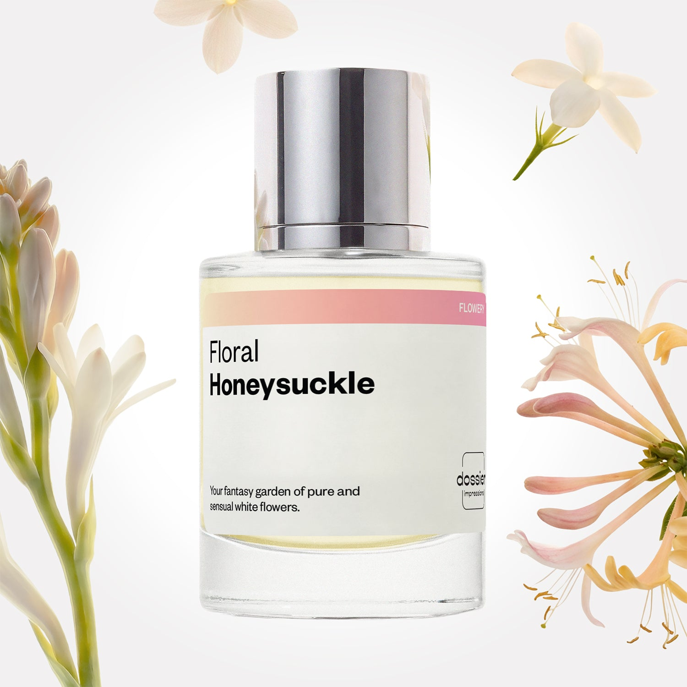

# Floral Honeysuckle

- **Dossier Inspired by Gucci's Bloom**
- **URL:** https://dossier.co/products/floral-honeysuckle
- **SEO title:** Gucci Bloom Dupe Perfume: Floral Honeysuckle - Dossier Perfumes

## Pricing (sizes)

| Size/SKU | Member price | List price | Currency |
|---|---|---|---|
| DI50FLHUS | 35.1 | 39 | USD |
| DOSWA50FLH | 35.1 | 39 | USD |

## Content (scent notes, about, editorial)

Back Home / Perfumes / Dossier Impressions / FLORAL HONEYSUCKLE 

Women 

Bestseller 

Floral Honeysuckle

Eau de Parfum. Size: 50ml / 1.7oz 

members: $35.10

Guest:
$39

Inspired by Gucci's Bloom Inspired by Gucci's Bloom 
Inspired by Gucci's Bloom 

Retail price 138 Crafted in France 
Scent Family: flowery 

Add to Cart 

Scent Notes This perfume is: A pink veil of joyful florals 
Main Notes:

Honeysuckle

Jasmine Sambac

Tuberose

top: The first notes you smell 
Green leaves, Orange, Honeysuckle 
middle: The heart of the perfume 
Jasmine Sambac, Tuberose 
base: The notes that linger all day 
Orris, Sandalwood, Vanilla 
ingredients: Alcohol Denat., Fragrance/Parfum, Water/Aqua/Eau, Tetramethyl Acetyloctahydronaphthalenes, Linalool, Benzyl Salicylate, Hydroxycitronellal, Citronellol, Eugenol, Geraniol, Cananga Odorata Oil/Extract, Geranyl Acetate, Isoeugenyl Acetate, Jasmine Oil/Extract, Benzyl Benzoate, Beta-Caryophyllene, Methyl Salicylate, Benzyl Alcohol, Linalyl Acetate, Rose Ketones, Isoeugenol, Farnesol, Terpineol, Citral, Pinene, Limonene. 

Vegan
Cruelty-free

Clean ingredients

About Floral Honeysuckle (inspired by Gucci's Bloom) blossoms with a dreamy mix of the perfumery star flowers: tuberose and jasmine. With sensuality at its core, natural and tender accents of honeysuckle and green leaves are added into the mix. 

Petally, natural, and feminine, Floral Honeysuckle (our impression of Gucci's Bloom) is a walk in a colorful garden, filled with many flowers and plants, a bouquet of abundance.

Scent Intensity: Significant 

Concentration: 15%

Gender: Feminine 

Shipping
Free shipping with 2+ items. 

Standard Shipping (with 2+ items) Auto-selected with 2+ items 
FREE 

Standard Shipping Auto-selected under 2 items 
$3.95 

Express shipping: 2 business days Select in checkout 
$19.00 

Returns
Free exchanges for all. Free returns with 

Exchanges
Free exchange, 1 time per order for all.

Returns
D+ members get 1 FREE return per order.
Non-members incur a $3.99/bottle return fee, 1 time per order.
Returns must be postmarked within 30 days of the initial order. Learn More 

FAQs Are these fragrances long lasting? They are designed to be very long lasting, just like designer fragrances, in some cases even longer, depending on the composition. 
When does the new packaging come out? We'll begin rolling out our new packaging across the U.S. and international markets soon! If you want to shop IRL - our new packaging first hits stores on January 11, 2026 at Walmart. Please note that if you are shopping online, you may receive a combination of our current and new packaging while we transition our inventory. 
How will I know what scent I like? We get it, shopping for perfumes online is hard! That's why we created a scent quiz, which will find the perfect scent for you Take the quiz (opens in new tab) 
Unsure about something? Ask us! help@dossier.co 

Details We are not associated or affiliated with the brands mentioned here in any way.
Floral Honeysuckle

Gucci’s Heart of Eden

Gucci’s Bloom (the luxury perfume that inspired Dossier’s Floral Honeysuckle) evokes the ambiance of a lush, idyllic garden. And much like the resurgence of the great House itself (under the watchful eye of Alessandro Michele since 2015), Gucci Bloom is both classically elegant and subversively provocative, redefining what makes a floral fragrance, well, floral .

The luxury fragrance that Floral Honeysuckle is inspired by has a lovely opening: a vivid view of leafy greens enclosing stalks of velvety jasmine, hidden but still subtly fragrant. Soon, you discover the fragrance’s true essence — middle notes that encompass a fierce floral heart. Jasmine explicitly introduces itself yet again, this time with greater force and vigor. Heady tuberose notes cut right through with a rich, waxy, and simply delightful scent. Plus, contributions from a flower native to South India known as Rangoon creeper, with bold, sweet overtones. Finally, the fragrance dries down to a powdery note, signaling a refined close to this floral scent.

The notes of the luxury fragrance that Floral Honeysuckle is inspired by may read as overly floral on paper, but they are in no way overpowering. In fact, we love how light and subtle the floral notes here are. The floral bouquet comes through with a wispy, breezy quality. It’s a smooth blend that allows each ingredient to showcase its own unique facets.

And allow us to say, the luxury fragrance that Floral Honeysuckle is inspired by is realistic. Wearing the luxury perfume that Floral Honeysuckle is inspired by smells like you’re wearing actual flowers. And sure, we hear lots of talk about fancy floral touches in this and that, but when it comes to the luxury scent that Floral Honeysuckle is inspired by, it’s the real thing. Everything is fresh, au naturel , with just the right amount of sweetness and green. The absence of synthetic scents, or any hints of human interference at all, makes this a very delectable scent. And one that we certainly won’t mind having.

The luxury fragrance that Floral Honeysuckle is inspired by is the first in a fantastic floral collection of scents. Each fragrance offers something truly distinctive. There’s the original perfume (the inspiration for our dupe, Floral Honeysuckle), which also comes in a three-piece gift set comprising a bottle of Eau de Parfum, rollerball, and body lotion.

Gucci Bloom is all we’re looking for in a bottle of elegant, feminine perfume. For the same amounts of freshness and juicy greens, take a gander at Dossier’s Floral Honeysuckle. Our dupe embodies a similar softness you would expect from something so floral. You’ll find a familiar opening of lush green notes, complemented by notes of white flowers that glow under the warmth of evening musk.

You Might Love 

4.3 

Rated 4.3 out of 5 stars 

Based on 1,914 reviews 

Reviews 1,914 (tab expanded) Questions 4 (tab collapsed) 

Filters 
Write a Review (Opens in a new window) 

1,914 reviews 
Sort Highest Rating Most Helpful Photos & Videos Most Recent Oldest Lowest Rating Least Helpful 

U 

undefinedundefined 
Verified Buyer 

6/29/26 

Rated 5 out of 5 stars 

Beautiful 
I love this perfume, It smells amazing and makes you feel beautiful 

Read More Read more about this review 

Was this helpful? Yes, this review from undefinedundefined was helpful. 0 people voted yes No, this review from undefinedundefined was not helpful. 0 people voted no 

DP 

Dossier Perfumes 
6/29/26 
So happy to hear you’re loving this scent and feeling beautiful every day wearing it. Thanks for sharing!

K 

Kim 

6/27/26 

Rated 5 out of 5 stars 

5 Stars
Beautiful fragrance for the summer!

Read More Read more about this review 

Was this helpful? Yes, this review from Kim was helpful. 0 people voted yes No, this review from Kim was not helpful. 0 people voted no 

TM 

Tammi M. 
Verified Buyer 

6/9/26 

Rated 5 out of 5 stars 

I absolutely love it
It smells so incredible. I had no idea what it was supposed to smell like, I've never tried the original, but I must say. It can't smell any better than this one

Read More Read more about this review 

Was this helpful? Yes, this review from Tammi M. was helpful. 0 people voted yes No, this review from Tammi M. was not helpful. 0 people voted no 

DP 

Dossier Perfumes 
6/9/26 
Tammi, this totally makes our day! So glad Floral Honeysuckle is hitting all the right notes on you. Keep enjoying those spritzes and exploring more of our scents 😊

HB 

Holly B. 
Verified Buyer 

5/30/26 

Rated 5 out of 5 stars 

So good!
I love this perfume, it’s the perfect balance of Jasmine and sweet! 

Read More Read more about this review 

Was this helpful? Yes, this review from Holly B. was helpful. 0 people voted yes No, this review from Holly B. was not helpful. 0 people voted no 

DP 

Dossier Perfumes 
5/30/26 
Holly, so happy you’re enjoying this combo! Thanks for sharing the good vibes.

CG 

Cami G. 
Verified Buyer 

5/26/26 

Rated 5 out of 5 stars 

So delightfully floral!
This perfume is perfectly floral and filled with depth on different notes with modern feel so it’s not like grandmas vintage perfumes it’s an elevated style 

Read More Read more about this review 

Was this helpful? Yes, this review from Cami G. was helpful. 0 people voted yes No, this review from Cami G. was not helpful. 0 people voted no 

DP 

Dossier Perfumes 
5/26/26 
Hey Cami thanks so much for sharing! We’re thrilled it feels fresh and modern, not stuffy. Keep enjoying that elevated vibe and let your spritz adventures continue 🙌

Loading... 

Loading... 

Show More 

Inspired by  Baccarat Rouge 540 
Inspired by  Black Opium 
Inspired by  Love, Don't Be Shy 
Inspired by  Good Girl 
Inspired by  Libre 
Inspired by  Flowerbomb 
Inspired by  Light Blue 
Inspired by  Not a Perfume 
Inspired by  Aventus 
Inspired by  Bleu de Chanel 
Inspired by  Mon Paris 
Inspired by  Coco Mademoiselle 
Inspired by  Tom Ford for Men 
Inspired by  For Her 
Inspired by  J'Adore Dior 
Inspired by  Alien 
Inspired by  Black Opium Perfume 
Inspired by  Lost Cherry Perfume 

GET UP TO 30% OFF 

Find us at these retailers. 

Be the first to know. 
Submit 

Shop the following countries. United States 

Discover.
AI Scent Finder 
Blog (opens in new tab) 
Scent Family 
Layering 
Scent Quiz 

Help.
Contact Us 
Returns 
FAQ 
Testimonials 
Accessibility 

More.
Store Locator 
Boutique 
Refer A Friend 
Index 

Download our app now.

Find us at these retailers. 

Be the first to know. 
Submit 

Shop the following countries. United States 

Discover.
AI Scent Finder 
Blog (opens in new tab) 
Scent Family 
Layering 
Scent Quiz 

Help.
Contact Us 
Returns 
FAQ 
Testimonials 
Accessibility 

More.

## Main Image

