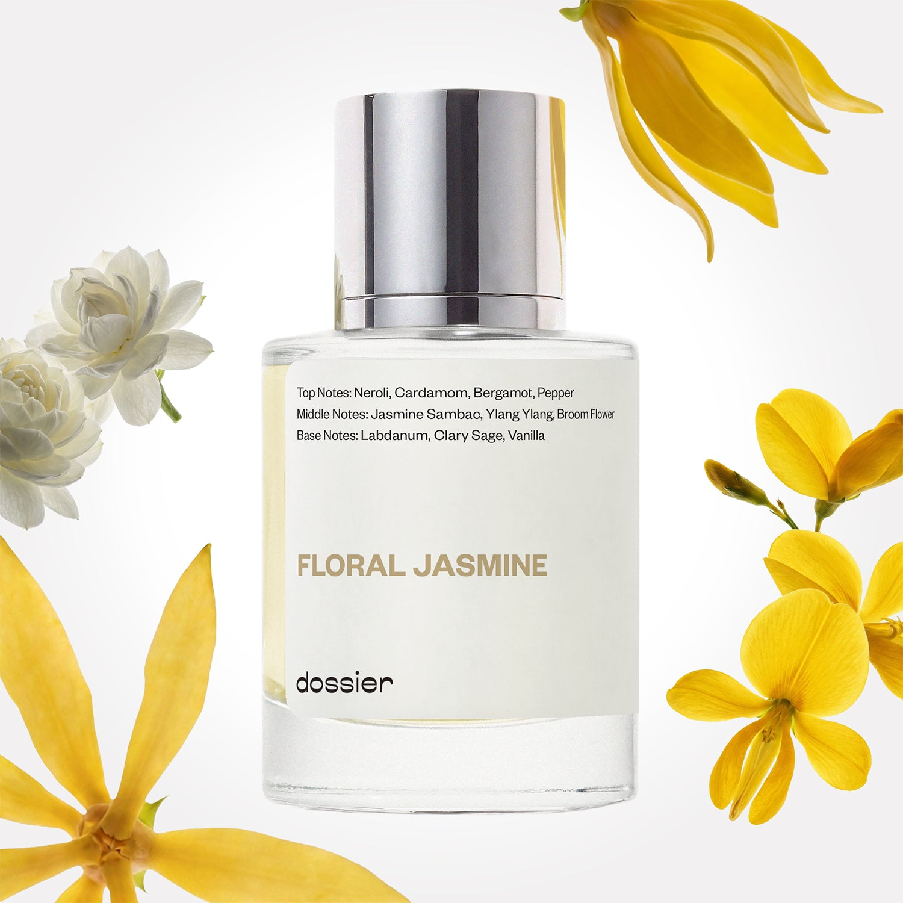

# Floral Jasmine

- **Dossier Inspired by Tom Ford's Jasmin Rouge**
- **URL:** https://dossier.co/products/floral-jasmine
- **SEO title:** Tom Ford's Jasmin Rouge Dupe Perfume: Floral Jasmine - Dossier Perfumes

## Pricing (sizes)

| Size/SKU | Member price | List price | Currency |
|---|---|---|---|
| 32212783530051 | 44.1 | 49 | USD |

## Content (scent notes, about, editorial)

Back Home / Perfumes / Dossier Impressions / FLORAL JASMINE 

Unisex 

Sold out 

Floral Jasmine

Eau de Parfum. Size: 50ml / 1.7oz 

members: $44.10

Guest:
$49

Inspired by Tom Ford's Jasmin Rouge Inspired by Tom Ford's Jasmin Rouge 
Inspired by Tom Ford's Jasmin Rouge 

Retail price 300 Crafted in France 
Scent Family: flowery 

Notify Me 

Scent Notes This perfume is: A dedicated floral heart 
Main Notes:

Jasmine Sambac

Ylang Ylang

Broom Flower

top: The first notes you smell 
Neroli, Cardamom, Bergamot, Pepper 
middle: The heart of the perfume 
Jasmine Sambac, Ylang Ylang, Broom Flower 
base: The notes that linger all day 
Labdanum, Clary Sage, Vanilla 
ingredients: Alcohol Denat., Fragrance/Parfum, Water/Aqua/Eau, Benzyl Salicylate, Linalool, Hexamethylindanopyran, Myroxylon Pereirae Oil/Extract, Tetramethyl Acetyloctahydronaphthalenes, Benzyl Benzoate, Hydroxycitronellal, Linalyl Acetate, Benzyl Cinnamate, Cananga Odorata Oil/Extract, Eugenol, Geraniol, Hexyl Cinnamal, Citrus Aurantium Flower Oil, Limonene, Vanillin, Beta-Caryophyllene, Cinnamyl Alcohol, Jasmine Oil/Extract, Citronellol, Terpineol, Pinene, Isoeugenol, Geranyl Acetate, Benzyl Alcohol, Hexadecanolactone, Isoeugenyl Acetate, Farnesol, Coumarin, Citral, Cinnamal, Cinnamomum Zeylanicum Bark Oil, Benzaldehyde, Anise Alcohol. 

Vegan
Cruelty-free

Clean ingredients

About Floral Jasmine (inspired by Tom Ford's Jasmin Rouge) unveils all the facets of Jamine Sambac, one of the most wonderful species of jasmine, native to tropical Asia. In this creation, the voluptuous aspects of this unique raw material - already a fragrance in and of itself - are highlighted with a spicy touch on the opening, a saturated floral heart, and a sensuous base.

Exuberant, natural, and self-indulgent, Floral Jasmine (our impression of Tom Ford's Jasmin Rouge) is THE scent for jasmine lovers, or for anyone willing to discover the scent of this beautiful flower at its best.

Scent Intensity: Statement 

Concentration: 18%

Gender: Unisex 

Shipping
Free shipping with 2+ items. 

Standard Shipping (with 2+ items) Auto-selected with 2+ items 
FREE 

Standard Shipping Auto-selected under 2 items 
$3.95 

Express shipping: 2 business days Select in checkout 
$19.00 

Returns
Free exchanges for all. Free returns with 

Exchanges
Free exchange, 1 time per order for all.

Returns
D+ members get 1 FREE return per order.
Non-members incur a $3.99/bottle return fee, 1 time per order.
Returns must be postmarked within 30 days of the initial order. Learn More 

FAQs Are these fragrances long lasting? They are designed to be very long lasting, just like designer fragrances, in some cases even longer, depending on the composition. 
When does the new packaging come out? We'll begin rolling out our new packaging across the U.S. and international markets soon! If you want to shop IRL - our new packaging first hits stores on January 11, 2026 at Walmart. Please note that if you are shopping online, you may receive a combination of our current and new packaging while we transition our inventory. 
How will I know what scent I like? We get it, shopping for perfumes online is hard! That's why we created a scent quiz, which will find the perfect scent for you Take the quiz (opens in new tab) 
Unsure about something? Ask us! help@dossier.co 

Details We are not associated or affiliated with the brands mentioned here in any way.
Floral Jasmine

Savor the taste of oriental spice and sensuality

An enchanting explosion of ethereal fantasy and sensuality, the Tom Ford Jasmin Rouge (the fragrance that Dossier’s Floral Jasmine is inspired by) drips its dark and sultry passion onto the chaise lounge. Discovering the multifaceted notes of this fragrance is as rewarding as it is labyrinthine. The heart of the luxury fragrance that Floral Jasmine is inspired by oozes exuberance and hedonic luxury. Although this floral is just 11 years old and is relatively young by comparison with other classic Tom Ford scents, its half-lidded seduction and longing desire does not fall short.

Oriental spices of heat and passion open this fragrance – warm cinnamon, soothing ginger, and cardamom. The Eau de Parfum that Floral Jasmine is inspired by begins to play tentatively and offer reassurance and oriental remedies of love. These top notes open to a powerful scent, reminiscent of hot passion on a cold wintery night. The spicy top tones intertwine with lighter middle notes of jasmine, ylang-ylang, and clary sage, which join delicately in holy matrimony to offer a delicious mix of flowers and sweetness. This irresistibly carnal fragrance then submits to a gorgeous depth of vanilla and amber base notes, paired subtly with an opulently leathery scent to entrance anyone passing by. 

A dreamy love vision of hazel eyes and radiant red lips, Eau de Parfum that Floral Jasmine is inspired by embodies a voluptuous Marilyn Monroe in a bottle. The beauty of this fragrance leaks out into the design of the bottle, as it attractively pleasures the eyes with a black burgundy adorned with strikingly rich gold. An expensively sensual experience, Eau de Parfum that Floral Jasmine is inspired by guarantees utmost pleasure even with a single spritz.

To spec up your décolletage with the sensuality and pleasure of Tom Ford Jasmin Rouge Eau de Parfum, you can buy it from online retailers. It comes in 2 sizes: 50 ml and 100 ml at $270.00 and $365.00 respectively. For a lighter experience of the fragrance, you can get the Eau de Toilette in 2 sizes, 30 ml and 50 ml, costing $95.00 and $136.00 respectively. And if you want a smaller bottle, you can get the travel-size cologne for $65.00 and the fragranced lipstick for $58.00, available in 23 shades ranging from nude to red. Finally, if you want to experience this fragrance as a plume of love, you can get the candle. It sells for $99.00 and provides a 40-hour burn time.

Now, maybe you want a rush of sensuality and burning desire akin to what the Tom Ford Jasmin Rouge provides. If so, be sure to choose Floral Jasmine by Dossier. Our dupe exudes superior passion and mystery. It is designed to trap you in a loop of sensory escapism – one that involves taking a swim in the Crater Lake and a stroll through the flower garden of Keukenhof. Floral Jasmine is a masterpiece blend of carefully selected floral notes and mysteriously dark themes. It is a fragrance that radiates lavishness, opulence, and hints of amorous arrogance. If you fancy yourself the fun-seeking type, Floral Jasmine is the fragrance for you.

Best Layered With Combine 2 of our perfumes to create a third scent with layering, curated by our nose. Learn more 

You Might Love 

4.4 

Rated 4.4 out of 5 stars 

Based on 553 reviews 

Reviews 553 (tab expanded) Questions 1 (tab collapsed) 

Filters 
Write a Review (Opens in a new window) 

553 reviews 
Sort Highest Rating Most Helpful Photos & Videos Most Recent Oldest Lowest Rating Least Helpful 

VL 

Vivi L. 
Verified Reviewer 

5/27/26 

Rated 5 out of 5 stars 

Favorite Scent Ever! COMPLIMENTS GALORE
Hi,
This is my absolute favorite of all the eau de parfums. I have ordered this several times and have been putting so many people on it. My friends, family, and coworkers all know I'm around before they even see me because they know and love this scent! I receive compliments ALL the time. The smell is also SO LONGLASTING. I usually spritz in the morning when I'm getting out of bed or first getting out of the house. I'll go to concerts and people will compliment me on this smell on the floor!!
Please restock soon! I have been eyeballing for restocks for months AND even purchased some bottles from walmart because I saw they had some. I've ordered so many various scents from Dossier but none of them are quite like this one.

Read More Read more about this review 

Was this helpful? Yes, this review from Vivi L. was helpful. 0 people voted yes No, this review from Vivi L. was not helpful. 0 people voted no 

DP 

Dossier Perfumes 
5/28/26 
Vivi, this absolutely made our day! We're thrilled that Floral Jasmine has become your signature scent and that you're spreading the love to everyone around you. Getting compliments at concerts is amazing! Thanks for being such an incredible advocate and for your patience with restocks. We're working hard to get more back in stock soon! 😊

B 

Brooke 
Verified Reviewer 

5/25/26 

Rated 5 out of 5 stars 

please bring this back
i love this perfume so so much! so sad it's been discontinued cause i've been looking EVERYWHERE for a new bottle now that the one i'm using is about to run out. sadly can't find it anywhere anymore. ): hoping there would be stock again because this scent is absolutely amazing 💯 

Read More Read more about this review 

Was this helpful? Yes, this review from Brooke was helpful. 0 people voted yes No, this review from Brooke was not helpful. 0 people voted no 

DP 

Dossier Perfumes 
5/25/26 
Brooke! We’re so bummed this beloved scent is gone and get why you'd miss it. While it’s discontinued, check out our catalog or email help@dossier.co for personalized suggestions.

J 

Jules 
Verified Reviewer 

4/28/26 

Rated 5 out of 5 stars 

Love this one!!! Miss it!!
I ran out, but I hope they bring it back into stock. It’s my absolute favorite!!! #misssingmyfavoritescent

Read More Read more about this review 

Was this helpful? Yes, this review from Jules was helpful. 0 people voted yes No, this review from Jules was not helpful. 0 people voted no 

DP 

Dossier Perfumes 
4/28/26 
Jules, we totally understand the longing. We’re so glad it’s your favorite. Hang tight and check dossier.co for restocks!

R 

Rebecca 

Verified Buyer 

12/30/25 

Rated 5 out of 5 stars 

Spring Garden Jasmine
Now I'm no scent expert, just a person with opinions, but this is very much like a 1 note jasmine fragrance. You MUST LOVE jasmine to appreciate this one. Very close dupe. Reminds me of the jasmine essential oils I used to get from the hippie shops in the 90s. I've always wanted to revisit that smell but never knew how. Very summery, not perfume-y. Straight spring garden jasmine.

Read More Read more about this review 

Was this helpful? Yes, this review from Rebecca was helpful. 0 people voted yes No, this review from Rebecca was not helpful. 0 people voted no 

DP 

Dossier Perfumes 
12/30/25 
Hey Rebecca! We love how those jasmine vibes brought back memories from ’90s hippie shops. It’s pure and summery for true jasmine fans. Thanks for sharing this sunny moment! 😊

AC 

Amelie c. 

Verified Buyer 

12/16/25 

Rated 5 out of 5 stars 

Love it
I like this sent very much

Read More Read more about this review 

Was this helpful? Yes, this review from Amelie c. was helpful. 0 people voted yes No, this review from Amelie c. was not helpful. 0 people voted no 

DP 

Dossier Perfumes 
12/16/25 
Amelie, thanks for sharing! We’re so happy you’re loving it 😊

Loading... 

Loading... 

Show More 

Inspired by  Baccarat Rouge 540 
Inspired by  Black Opium 
Inspired by  Love, Don't Be Shy 
Inspired by  Good Girl 
Inspired by  Libre 
Inspired by  Flowerbomb 
Inspired by  Light Blue 
Inspired by  Not a Perfume 
Inspired by  Aventus 
Inspired by  Bleu de Chanel 
Inspired by  Mon Paris 
Inspired by  Coco Mademoiselle 
Inspired by  Tom Ford for Men 
Inspired by  For Her 
Inspired by  J'Adore Dior 
Inspired by  Alien 
Inspired by  Black Opium Perfume 
Inspired by  Lost Cherry Perfume 

GET UP TO 30% OFF 

Find us at these retailers. 

Be the first to know. 
Submit 

Shop the following countries. United States 

Discover.
AI Scent Finder 
Blog (opens in new tab) 
Scent Family 
Layering 
Scent Quiz 

Help.
Contact Us 
Returns 
FAQ 
Testimonials 
Accessibility 

More.
Store Locator 
Boutique 
Refer A Friend 
Index 

Download our app now.

Find us at these retailers. 

Be the first to know. 
Submit 

Shop the following countries. United States 

Discover.
AI Scent Finder 
Blog (opens in new tab) 
Scent Family 
Layering 
Scent Quiz 

Help.
Contact Us 
Returns 
FAQ 
Testimonials 
Accessibility 

More.

## Main Image

