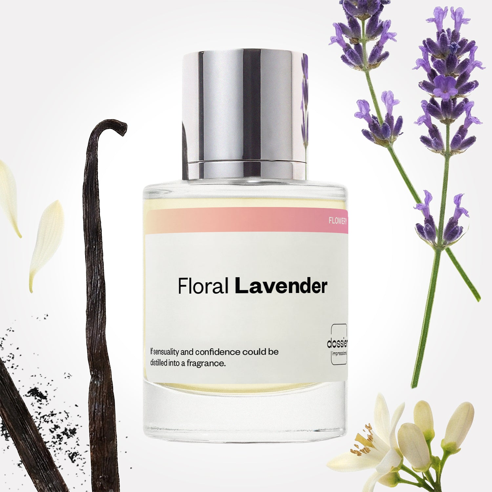

# Floral Lavender

- **Dossier Inspired by YSL's Libre**
- **URL:** https://dossier.co/products/floral-lavender
- **SEO title:** YSL Libre Dupe Perfume: Floral Lavender - Dossier Perfumes

## Pricing (sizes)

| Size/SKU | Member price | List price | Currency |
|---|---|---|---|
| Fragrance+50ml/1.7oz | 26.1 | 29 | USD |
| 100ml | 44.1 | 49 | USD |
| BF+Free | 0 | 0 | USD |
| 50ml+2.0+retail | 26.1 | 29 | USD |
| 2x50ml+2.0+retail | 52.2 | 58 | USD |

## Content (scent notes, about, editorial)

Back Home / Perfumes / Dossier Impressions / FLORAL LAVENDER 

Women 

Bestseller 

Floral Lavender

Eau de Parfum. Size: 100ml / 3.4oz 

members: $44.10

Guest:
$49

Inspired by YSL's Libre Inspired by YSL's Libre 
Inspired by YSL's Libre 

Retail price 165 Size
50ml $29

Best Value
100ml $49

Crafted in France 
Scent Family: flowery 

Add to Cart 

Scent Notes This perfume is: A sunny citrus surprise 
Main Notes:

Jasmine

Lavender

Orange Blossom

Vanilla

top: The first notes you smell 
Mandarin, Neroli, Blackcurrant 
middle: The heart of the perfume 
Jasmine, Lavender, Orange Blossom 
base: The notes that linger all day 
Vanilla, Amber, Musk 
ingredients: Alcohol Denat., Fragrance/Parfum, Water/Aqua/Eau, Tetramethyl Acetyloctahydronaphthalenes, Limonene, Linalyl Acetate, Linalool, Vanillin, Citrus Limon (Lemon) Peel Oil, Benzyl Salicylate, Hydroxycitronellal, Citrus Aurantium Bergamia (Bergamot) Peel Oil, Citrus Aurantium Peel Oil, Pinene, Terpineol, Coumarin, Geraniol, Citronellol, Geranyl Acetate, Isoeugenyl Acetate, Citral, Rose Ketones, Cedrus Atlantica Oil/Extract, Pogostemon Cablin Oil, Terpinolene, Lavandula Oil/Extract, Beta-Caryophyllene, Hexadecanolactone, Alpha-Terpinene, Citrus Aurantium Flower Oil, Benzyl Alcohol, Alpha-Isomethyl Ionone. 

Vegan
Cruelty-free

Clean ingredients

About Floral Lavender (inspired by YSL's Libre) opens on a sunny mandarine, neroli, and orange blossom accord. It then evolves with warm notes of jasmine and vanilla. Paired with lavender--typically a masculine, raw material-- our floriental composition is given a hint of insolence.

Intriguing, joyful, and warm, Floral Lavender (our impression of YSL's Libre) plays with genders, without ever neutralizing codes. The fragrance exhilarates a daring and free sensuality born from the collision of masculine and raw materials paired with a very feminine base.

Scent Intensity: Statement 

Concentration: 15%

Gender: Feminine 

Shipping
Free shipping with 2+ items. 

Standard Shipping (with 2+ items) Auto-selected with 2+ items 
FREE 

Standard Shipping Auto-selected under 2 items 
$3.95 

Express shipping: 2 business days Select in checkout 
$19.00 

Returns
Free exchanges for all. Free returns with 

Exchanges
Free exchange, 1 time per order for all.

Returns
D+ members get 1 FREE return per order.
Non-members incur a $3.99/bottle return fee, 1 time per order.
Returns must be postmarked within 30 days of the initial order. Learn More 

FAQs Are these fragrances long lasting? They are designed to be very long lasting, just like designer fragrances, in some cases even longer, depending on the composition. 
When does the new packaging come out? We'll begin rolling out our new packaging across the U.S. and international markets soon! If you want to shop IRL - our new packaging first hits stores on January 11, 2026 at Walmart. Please note that if you are shopping online, you may receive a combination of our current and new packaging while we transition our inventory. 
How will I know what scent I like? We get it, shopping for perfumes online is hard! That's why we created a scent quiz, which will find the perfect scent for you Take the quiz (opens in new tab) 
Unsure about something? Ask us! help@dossier.co 

Details We are not associated or affiliated with the brands mentioned here in any way.
Floral Lavender

For Those Who Live by Their Own Rules

To bear the Yves Saint Laurent label is to be elegant, androgynous, and original. But above all, it implies a sense of being free, unencumbered by expectations and self-imposed constraints.

It’s in this very spirit that the powerful, gender-bending YSL Libre Eau de Parfum (the fragrance that inspired Dossier’s Floral Lavender) was introduced — a scent for those who lead lives of their own design. And indeed, the luxury perfume that inspired Floral Lavender is the fragrance of freedom. Freedom to express yourself. Freedom to choose. Freedom to live life to the fullest.

The luxury perfume that Floral Lavender is inspired by makes an impressive first impression with a warm, sparkling curtain of citrus. Top notes include mandarin orange, blackcurrant, and lavender, while the heart notes are orange blossom and jasmine. The scent begins herbaceous but transitions into a lovely musk with notes such as Madagascar vanilla, ambergris accord, and cedarwood oil. The overall scent is pleasant, and a touch lighter than most florals.

But perhaps the most interesting aspect of this fragrance lies in its stubborn refusal to conform to gender-specific olfactory conventions. And certainly, it wouldn’t be fair to call the luxury perfume that Floral Lavender is inspired by a purely feminine fragrance. No, there’s more to it than that. There is just something extremely sensual about the marriage of masculine lavender and feminine orange blossom absolute that, in the end, makes for a fragrance that’s really neither for him nor for her . It’s a soft, androgynous scent that straddles the line between two extremes: less intense than a gourmand and more muted than a chypré. Women looking for something less sweet and sharp will love the luxury perfume that Floral Lavender is inspired by, while men with an affinity for fougère notes will find it inexplicably appealing.

This is a powdery, sensual, and floral fragrance that lasts for upwards of eight hours from one spritz. And much like a pair of classic diamond studs, the luxury perfume that Floral Lavender is inspired by is a fragrance that can be worn just about anywhere and at any time. We find it perfect for a night at the club, while also being appropriate for a more conservative daytime activity like work or a meeting.

The luxury fragrance that Floral Lavender is inspired by is available in two concentrations, an Eau de Parfum and a lighter, cleaner Eau de Toilette. The perfume also comes in a pretty three-piece gift set featuring a full-size Eau de Parfum, a travel-size Eau de Parfum, and a nourishing body balm. Also available is an Intense Eau de Parfum, a flanker to the original that adds even more power and sensuality.

YSL Libre is a fresh, luxurious, and innovative perfume for the mind, body, and soul. Definitely one of our favorites. If you’re in the mood for something just as pleasant, with well-composed notes and unique character, consider Dossier’s Floral Lavender. Intriguing, joyful, and warm, our dupe perfume is gender-free and doesn’t compromise on the scent. It’s a replica of the original YSL Libre that pushes the bounds of sensuality, creating a scent that evokes raw confidence, beauty and sophistication.

You Might Love 

4.6 

Rated 4.6 out of 5 stars 

Based on 3,247 reviews 

Reviews 3,247 (tab expanded) Questions 3 (tab collapsed) 

Filters 
Write a Review (Opens in a new window) 

3,247 reviews 
Sort Highest Rating Most Helpful Photos & Videos Most Recent Oldest Lowest Rating Least Helpful 

CV 

Chardanae V. 
Verified Buyer 

7/1/26 

Rated 5 out of 5 stars 

An Addictive, Sophisticated Floral
Just want to say that I sincerely appreciate Dossier for sending me this perfume as a way of making it up to me, since I didn't enjoy my priot purchase. That aside, this is such a sophisticated, beautiful scent. It smells like a poised, **** woman walking through a garden. The way the lavendar and vanilla work in tandem to create such an intoxicating smell that will have you sniffing yourself for hours on end (when I tested it, I couldn't stop smelling myself)...it's so addictive. I mean, the vanilla and lavendar complement each other so well without overpowering one another; you will never get too much of one or the other, since they are perfectly in sync. I feel so prim and proper when I use this (****) and I love it! Its base scent of vanilla also makes it smell somewhat similar to Floral Marshmallow, which I also adore. I'm overjoyed to continue using this scent, and I cannot wait to get my hands on my next purchase: Floral Raspberry. I love a good floral perfume!

Read More Read more about this review 

Was this helpful? Yes, this review from Chardanae V. was helpful. 0 people voted yes No, this review from Chardanae V. was not helpful. 0 people voted no 

DP 

Dossier Perfumes 
7/1/26 
Chardanae, thanks for sharing your journey with our Floral Lavender. We’re thrilled it sparked that garden stroll feeling and lives up to its promise. Happy spritzing 😊

J 

Jama 

6/28/26 

Rated 5 out of 5 stars 

5 Stars
The scent is wonderful! Switched to this from the SYL Libre perfume, and I could not be happier. The packaging and bottle quality also exceeded my expectations. The glass bottle is thick, sturdy, and feels very high-end. I especially love the magnetic cap, it snaps securely into place and gives the perfume a sophisticated, luxurious feel. Nothing about this product feels cheap. My order arrived well-packaged with no issues at all. Overall, I’m extremely pleased with my purchase and would definitely order from this company again!

Read More Read more about this review 

Was this helpful? Yes, this review from Jama was helpful. 0 people voted yes No, this review from Jama was not helpful. 0 people voted no 

E 

Elba 

6/23/26 

Rated 5 out of 5 stars 

5 Stars
Love the smell and the updated packaging 🙌🏻😍

Read More Read more about this review 

Was this helpful? Yes, this review from Elba was helpful. 0 people voted yes No, this review from Elba was not helpful. 0 people voted no 

M 

Meg 
Verified Reviewer 

6/22/26 

Rated 5 out of 5 stars 

Amazing 🥰 
Beautiful lavender scent! Calming and absolutely heavenly. Long lasting too!

Read More Read more about this review 

Was this helpful? Yes, this review from Meg was helpful. 0 people voted yes No, this review from Meg was not helpful. 0 people voted no 

DP 

Dossier Perfumes 
6/22/26 
Meg, we’re thrilled the lavender brings such calm and lasts all day! 😊

MW 

MAW W. 
Verified Buyer 

6/7/26 

Rated 5 out of 5 stars 

My scent
This is the best scent I have found and it is so close to the one it is duping but I like it better tue dry down is perfect on my skin and I couldn’t be happier to smell this amazing. 

Read More Read more about this review 

Was this helpful? Yes, this review from MAW W. was helpful. 0 people voted yes No, this review from MAW W. was not helpful. 0 people voted no 

DP 

Dossier Perfumes 
6/7/26 
MAW! We’re so happy the dry down feels perfect on your skin and that you love it even more. Thanks for sharing glowing praise, and enjoy every spritz! 🙌

Loading... 

Loading... 

Show More 

Inspired by  Baccarat Rouge 540 
Inspired by  Black Opium 
Inspired by  Love, Don't Be Shy 
Inspired by  Good Girl 
Inspired by  Libre 
Inspired by  Flowerbomb 
Inspired by  Light Blue 
Inspired by  Not a Perfume 
Inspired by  Aventus 
Inspired by  Bleu de Chanel 
Inspired by  Mon Paris 
Inspired by  Coco Mademoiselle 
Inspired by  Tom Ford for Men 
Inspired by  For Her 
Inspired by  J'Adore Dior 
Inspired by  Alien 
Inspired by  Black Opium Perfume 
Inspired by  Lost Cherry Perfume 

GET UP TO 30% OFF 

Find us at these retailers. 

Be the first to know. 
Submit 

Shop the following countries. United States 

Discover.
AI Scent Finder 
Blog (opens in new tab) 
Scent Family 
Layering 
Scent Quiz 

Help.
Contact Us 
Returns 
FAQ 
Testimonials 
Accessibility 

More.
Store Locator 
Boutique 
Refer A Friend 
Index 

Download our app now.

Find us at these retailers. 

Be the first to know. 
Submit 

Shop the following countries. United States 

Discover.
AI Scent Finder 
Blog (opens in new tab) 
Scent Family 
Layering 
Scent Quiz 

Help.
Contact Us 
Returns 
FAQ 
Testimonials 
Accessibility 

More.

## Main Image

