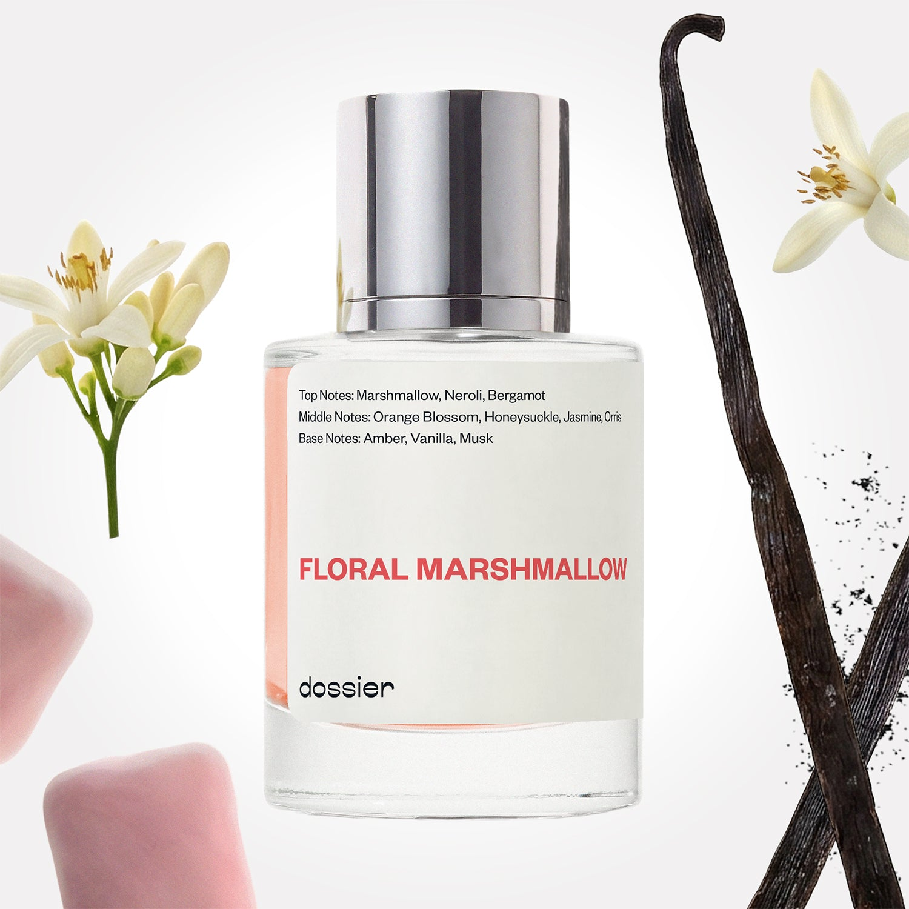

# Floral Marshmallow

- **Dossier Inspired by By Kilian's Love, Don't Be Shy**
- **URL:** https://dossier.co/products/floral-marshmallow
- **SEO title:** Kilian Love, Don't Be Shy Dupe Perfume: Floral Marshmallow - Dossier Perfumes

## Pricing (sizes)

| Size/SKU | Member price | List price | Currency |
|---|---|---|---|
| 50mL | 35.1 | 39 | USD |
| 100ml | 53.1 | 59 | USD |
| 200ml | 106.2 | 118 | USD |
| 2x50ml | 72 | 80 | USD |
| 3x50ml | 108 | 120 | USD |
| travel+duo+(50ml++11ml) | 50.4 | 56 | USD |

## Content (scent notes, about, editorial)

Back Home / Perfumes / Dossier Impressions / FLORAL MARSHMALLOW 

Women 

Bestseller 

Floral Marshmallow

Eau de Parfum. Size: 100ml / 3.4oz 

members: $53.10

Guest:
$59

Inspired by Kilian's Love, Don't Be Shy Inspired by Kilian's Love, Don't Be Shy 
Inspired by Kilian's Love, Don't Be Shy 

Retail price 450 Size
50mL $39

Best Value
100ml $59

Crafted in France 
Scent Family: flowery 

Add to Cart 

Scent Notes This perfume is: Where sweet meets seductive 
Main Notes:

Marshmallow

Neroli

top: The first notes you smell 
Marshmallow, Neroli, Bergamot 
middle: The heart of the perfume 
Orange Blossom, Honeysuckle, Jasmine, Orris 
base: The notes that linger all day 
Amber, Vanilla, Musk 
ingredients: Alcohol Denat., Fragrance/Parfum, Water/Aqua/Eau, Vanillin, Citrus Aurantium Bergamia (Bergamot) Peel Oil, Limonene, Linalool, Linalyl Acetate, Citrus Aurantium Peel Oil, Citronellol, Pinene, Jasmine Oil/Extract, Pelargonium Graveolens Flower Oil, Hexadecanolactone, Benzyl Benzoate, Terpineol, Geranyl Acetate, Geraniol, Citral, Beta-Caryophyllene, Benzaldehyde, Isoeugenol, Eugenol, Camphor, Terpinolene, Farnesol. 

Vegan
Cruelty-free

Clean ingredients

About This unique fragrance is made of an expressive combination of orange blossom and marshmallow, plus fresh notes of honeysuckle and neroli. Base scents of musk, amber, and vanilla add depth and complement the sweet marshmallow opening notes.

Sensual, innocent, yet playful, Floral Marshmallow (inspired by By Kilian's Love, Don't Be Shy) delivers an exquisite blend of vibrant florals and edible notes.

Scent Intensity: Statement 

Concentration: 18%

Gender: Feminine 

Shipping
Free shipping with 2+ items. 

Standard Shipping (with 2+ items) Auto-selected with 2+ items 
FREE 

Standard Shipping Auto-selected under 2 items 
$3.95 

Express shipping: 2 business days Select in checkout 
$19.00 

Returns
Free exchanges for all. Free returns with 

Exchanges
Free exchange, 1 time per order for all.

Returns
D+ members get 1 FREE return per order.
Non-members incur a $3.99/bottle return fee, 1 time per order.
Returns must be postmarked within 30 days of the initial order. Learn More 

FAQs Are these fragrances long lasting? They are designed to be very long lasting, just like designer fragrances, in some cases even longer, depending on the composition. 
When does the new packaging come out? We'll begin rolling out our new packaging across the U.S. and international markets soon! If you want to shop IRL - our new packaging first hits stores on January 11, 2026 at Walmart. Please note that if you are shopping online, you may receive a combination of our current and new packaging while we transition our inventory. 
How will I know what scent I like? We get it, shopping for perfumes online is hard! That's why we created a scent quiz, which will find the perfect scent for you Take the quiz (opens in new tab) 
Unsure about something? Ask us! help@dossier.co 

Details We are not associated or affiliated with the brands mentioned here in any way.
Floral Marshmallow

A delicate mix of vivacious florals and palatable notes

Rediscover yourself with Kilian Hennessy’s Love Don’t Be Shy Eau de Parfum, the floral-fruit juice that inspired Dossier’s Floral Marshmallow fragrance. Launched in 2007, this Kilian perfume prides itself on being exhilarating and unforgettable. It is a fragrance story that mesmerizes you right from the prologue.

Get lost in an ethereal dimension of love as top notes of neroli, bergamot, and coriander hold you spellbound. Give in to your innate desires as middle notes of orange blossom, jasmine, and honeysuckle lend a throbbing touch of sensuality. Satisfy the craving twinge of new love as base notes of sugar, caramel, civet, and labdanum reach into your very soul.

It’s always a superior experience when the luxury fragrance that Floral Marshmallow is inspired by is involved – an intense experience akin to walking barefoot on the white sands of Kauna’oa Bay. Allure meets wealth in this provocative citrus spritz – and the result is a scent that flips the script on what fragrances stand for.

If you want to revel in a cozy concoction, this modern classic is your best choice. It is a gentle, cultured, and stunningly beautiful perfume and a must-have in your fragrance repertoire. It is the olfactory equivalent of the picturesque villages of the Greek island of Santorini – all in one elegant bottle.

Feast on the delicacies of love and arouse your senses with this refined aroma. Stand out from the crowd and command respect with this enigmatic yet acquainted scent. The luxury fragrance that Floral Marshmallow is inspired by is a trendy icon that makes you wander to the island of Thirassia, inhale the nostalgic breeze, and swim in the breathtaking blue seas. Spritz calmly and experience a rush of energy, addiction, and desire. 

The Kilian Love Don’t Be Shy perfumes are on sale on various online retailers where they go for $200 for the travel set 30 ml (4 × 7.5 ml) and $200 for the refill 50 ml.

For a similar captivating and deliciously sensual floral-fruit nectar, get Dossier’s Floral Marshmallow. Our Kilian Love Don’t Be Shy dupe encapsulates the essence of spring and radiates effortless excellence, youthful exuberance, and amorous love. It is an elegant day-to-day perfume that transports you to the peaks of the Maroon Bells – with the lovely Elk mountains and the dazzling aspen trees. Wear this scent if you want the allure of orange blossom, marshmallow, and honeysuckle to wash over you like a wave. Just spritz, take a deep breath, and revel in the exquisite beauty of vivacious florals and palatable notes.

Best Layered With Combine 2 of our perfumes to create a third scent with layering, curated by our nose. Learn more 

You Might Love 

4.3 

Rated 4.3 out of 5 stars 

Based on 6,993 reviews 

Reviews 6,993 (tab expanded) Questions 4 (tab collapsed) 

Filters 
Write a Review (Opens in a new window) 

6,993 reviews 
Sort Highest Rating Most Helpful Photos & Videos Most Recent Oldest Lowest Rating Least Helpful 

NH 

Nelle H. 
Verified Buyer 

7/1/26 

Rated 5 out of 5 stars 

Floral marshmallow 
This is the best scent I have ever smelled! I get so many compliments on this scent and stock up on more any chance I get! It’s become my signature scent and I will continue to purchase more! 

Read More Read more about this review 

Was this helpful? Yes, this review from Nelle H. was helpful. 0 people voted yes No, this review from Nelle H. was not helpful. 0 people voted no 

DP 

Dossier Perfumes 
7/1/26 
Jenelle, we’re thrilled Floral Marshmallow has become your signature and keeps those compliments coming ✨ Thanks for stocking up and we can’t wait to keep surprising your senses!

EE 

Eugenia E. 
Verified Buyer 

6/30/26 

Rated 5 out of 5 stars 

Sweet 
Was a gift for my mom, she in love with the fragrance 

Read More Read more about this review 

Was this helpful? Yes, this review from Eugenia E. was helpful. 0 people voted yes No, this review from Eugenia E. was not helpful. 0 people voted no 

DP 

Dossier Perfumes 
7/1/26 
Eugenia, we’re so happy to hear your mom loves it! Thanks for sharing.

MD 

Monica D. 
Verified Buyer 

6/27/26 

Rated 5 out of 5 stars 

Smells great
Omg this perfume smells great. So many people asked what I was wearing.

Read More Read more about this review 

Was this helpful? Yes, this review from Monica D. was helpful. 0 people voted yes No, this review from Monica D. was not helpful. 0 people voted no 

DP 

Dossier Perfumes 
6/27/26 
Monica! That’s amazing to hear, and we’re thrilled your scent is turning heads. Keep enjoying those compliments!

L 

LaShunda 

6/24/26 

Rated 5 out of 5 stars 

5 Stars
Smells fluffy, light, airy, yet subtle. Last a long time and good for layering.

Read More Read more about this review 

Was this helpful? Yes, this review from LaShunda was helpful. 0 people voted yes No, this review from LaShunda was not helpful. 0 people voted no 

JH 

Jenelle H. 
Verified Buyer 

6/21/26 

Rated 5 out of 5 stars 

Floral marshmallow 
This is my absolute favorite scent and I’m stocking up with any coupon I can find!! This has become my signature scent and I will buy much more! 

Read More Read more about this review 

Was this helpful? Yes, this review from Jenelle H. was helpful. 0 people voted yes No, this review from Jenelle H. was not helpful. 0 people voted no 

DP 

Dossier Perfumes 
6/21/26 
Thanks for making this your signature go-to! We love that you’re stocking up and finding deals. Here’s to many more spritzes that feel like you, every single day! 💛

Loading... 

Loading... 

Show More 

Inspired by  Baccarat Rouge 540 
Inspired by  Black Opium 
Inspired by  Love, Don't Be Shy 
Inspired by  Good Girl 
Inspired by  Libre 
Inspired by  Flowerbomb 
Inspired by  Light Blue 
Inspired by  Not a Perfume 
Inspired by  Aventus 
Inspired by  Bleu de Chanel 
Inspired by  Mon Paris 
Inspired by  Coco Mademoiselle 
Inspired by  Tom Ford for Men 
Inspired by  For Her 
Inspired by  J'Adore Dior 
Inspired by  Alien 
Inspired by  Black Opium Perfume 
Inspired by  Lost Cherry Perfume 

GET UP TO 30% OFF 

Find us at these retailers. 

Be the first to know. 
Submit 

Shop the following countries. United States 

Discover.
AI Scent Finder 
Blog (opens in new tab) 
Scent Family 
Layering 
Scent Quiz 

Help.
Contact Us 
Returns 
FAQ 
Testimonials 
Accessibility 

More.
Store Locator 
Boutique 
Refer A Friend 
Index 

Download our app now.

Find us at these retailers. 

Be the first to know. 
Submit 

Shop the following countries. United States 

Discover.
AI Scent Finder 
Blog (opens in new tab) 
Scent Family 
Layering 
Scent Quiz 

Help.
Contact Us 
Returns 
FAQ 
Testimonials 
Accessibility 

More.

## Main Image

