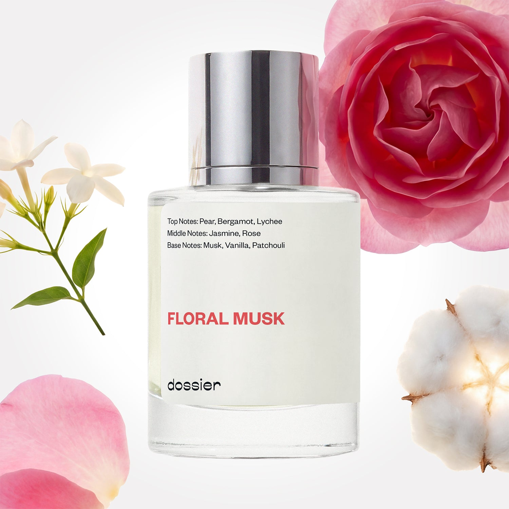

# Floral Musk

- **Dossier Inspired by Lancome's Idole**
- **URL:** https://dossier.co/products/floral-musk
- **SEO title:** Lancome's Idole Dupe Perfume: Floral Musk - Dossier Perfumes

## Pricing (sizes)

| Size/SKU | Member price | List price | Currency |
|---|---|---|---|
| 32017460101187 | 28.8 | 32 | USD |

## Content (scent notes, about, editorial)

Back Home / Perfumes / Dossier Impressions / FLORAL MUSK 

Women 

It's back! 

Floral Musk

Eau de Parfum. Size: 50ml / 1.7oz 

members: $28.80

Guest:
$32

Inspired by Lancome's Idole Inspired by Lancome's Idole 
Inspired by Lancome's Idole 

Retail price 119 Crafted in France 
Scent Family: flowery 

Notify Me 

Scent Notes This perfume is: A petally fairytale fragrance 
Main Notes:

Jasmine

Rose

Musks

Vanilla

Patchouli

top: The first notes you smell 
Pear, Bergamot, Lychee 
middle: The heart of the perfume 
Jasmine, Rose 
base: The notes that linger all day 
Musk, Vanilla, Patchouli 
ingredients: Alcohol, Water, Parfum/Perfume, Amyl Cinnamal, Hexyl Cinnamal, alpha-iso-Methylionone, Benzyl alcohol, Benzyl Benzoate, Benzyl Salicylate, Citral,
Coumarin, Citronellol, Limonene, Eugenol, Farnesol, Geraniol, Hydroxycitronellal, Isoeugenol, Linalool, Methyl 2-octynoate (Methyl heptine carbonate). 

Vegan
Cruelty-free

Clean ingredients

About At its core, Floral Musk (inspired by Lancome's Idole) is a fluffy combination of rose and jasmine, illuminated by a bright and juicy pear and lychee duet. The scent is then amplified thanks to clean musky notes. To end, we add in a subtle dose of vanilla and patchouli, perfectly highlighting the fragrance, while never weighing it down. 

Feminine and smooth, Floral Musk (our impression of Lancome's Idole) is an enchanting dream, lingering on your skin beautifully.

Scent Intensity: Significant 

Concentration: 15%

Gender: Feminine 

Shipping
Free shipping with 2+ items. 

Standard Shipping (with 2+ items) Auto-selected with 2+ items 
FREE 

Standard Shipping Auto-selected under 2 items 
$3.95 

Express shipping: 2 business days Select in checkout 
$19.00 

Returns
Free exchanges for all. Free returns with 

Exchanges
Free exchange, 1 time per order for all.

Returns
D+ members get 1 FREE return per order.
Non-members incur a $3.99/bottle return fee, 1 time per order.
Returns must be postmarked within 30 days of the initial order. Learn More 

FAQs Are these fragrances long lasting? They are designed to be very long lasting, just like designer fragrances, in some cases even longer, depending on the composition. 
When does the new packaging come out? We'll begin rolling out our new packaging across the U.S. and international markets soon! If you want to shop IRL - our new packaging first hits stores on January 11, 2026 at Walmart. Please note that if you are shopping online, you may receive a combination of our current and new packaging while we transition our inventory. 
How will I know what scent I like? We get it, shopping for perfumes online is hard! That's why we created a scent quiz, which will find the perfect scent for you Take the quiz (opens in new tab) 
Unsure about something? Ask us! help@dossier.co 

Details We are not associated or affiliated with the brands mentioned here in any way.
Floral Musk

A Fragrance Made for Women by Women 

An ode to the women’s love of adventure. Women who do not conform. Tomorrow’s leaders and innovators. This is the essence behind Lancôme’s latest fragrance for her, and perhaps the most popular.

Created by women for women, Lancôme’s Idôle perfume (the fragrance that Dossier’s Floral Musk is inspired by) is a modern chypre with floral notes (rose or jasmine) and bergamot, layered over a patchouli and musk base. It’s a perfect illustration of the style executed in a delicate and diffusive manner.

First, in its opening, the luxury perfume that Floral Musk is inspired by is fresh, feminine, and luminous. A subtle bergamot glow illuminates the scent, while hints of pear impart a juicy sweetness and citrus, adding bright tartness in the process. The heart of this fragrance is a lavishly soft aroma composed of sustainably sourced radiant rose and jasmine absolutes. Combining rose absolute, rose essence, and water with jasmine and a jasmine infusion, the luxury scent that Floral Musk is inspired by isa truly extraordinary blend; one that captures a trail of floral facets that is neither too strong nor overpowering. Further adding depth to this scent are the base notes of sultry white musk and sweet vanilla. They add an unexpected warmth throughout, radiating from the bottom of the fragrance all the way to the top.

The tenderand voluptuous scent of the luxury perfume that Floral Musk is inspired by shows off every aspect of a woman’s personality. It accentuates her best features to people around her – wherever and whenever she wears it. Simple and effortless, this is a perfect fragrance for the office, for social gatherings, or for simply wearing around the house.

Then there’s the matter of the fragrance’s bottle. Lancôme’s Idôle truly comes to life in the world’s thinnest perfume bottle – a breathtaking, horizontal design from the architect Chafik Gasmi. Its rose-gold colored structure catches the light like no other, and the flat shape lays flat on the hand for a touch of modern elegance and a hint of vanity. A golden sphere, placed in the center, symbolizes the raw determination of the female spirit. 

Dossier’s Floral Musk is a Lancôme Idôle dupe designed to emulate the scents in the original. We’ve recreated the iconic scentusing a fluffy combination of rose and jasmine, topped with a bright, fruity pair of pear and lychee. Our replica is a floral and musky scent that works splendidly any time of year. It’s a lasting testament to the beauty of the women who dream big: determined, empowered, and outspoken.

You Might Love 

4.5 

Rated 4.5 out of 5 stars 

Based on 845 reviews 

Reviews 845 (tab expanded) Questions 1 (tab collapsed) 

Filters 
Write a Review (Opens in a new window) 

845 reviews 
Sort Highest Rating Most Helpful Photos & Videos Most Recent Oldest Lowest Rating Least Helpful 

NW 

Nicolette w. 
Verified Buyer 

3/25/26 

Rated 5 out of 5 stars 

Love this 
You guys have the best fragrance 

Read More Read more about this review 

Was this helpful? Yes, this review from Nicolette w. was helpful. 0 people voted yes No, this review from Nicolette w. was not helpful. 0 people voted no 

DP 

Dossier Perfumes 
3/25/26 
Nicolette, that means so much! Thanks for sharing the love 💛

G 

Gail 

2/16/26 

Rated 5 out of 5 stars 

5 Stars
A very pretty scent. I love the perfumes from Dossier !!

Read More Read more about this review 

Was this helpful? Yes, this review from Gail was helpful. 0 people voted yes No, this review from Gail was not helpful. 0 people voted no 

VD 

Vikki D. 

Verified Buyer 

1/10/26 

Rated 5 out of 5 stars 

Love it!
Pleasantly surprised smells better than expected!! 
I will definitely get it again!

Read More Read more about this review 

Was this helpful? Yes, this review from Vikki D. was helpful. 0 people voted yes No, this review from Vikki D. was not helpful. 0 people voted no 

DP 

Dossier Perfumes 
1/10/26 
Hey Vikki! We’re so happy it pleasantly surprised you, and we can’t wait to scent you again 🙌

HB 

Heidi B. 

Verified Buyer 

1/7/26 

Rated 5 out of 5 stars 

Floral musk is very nice ❤️️
This is a great dupe for Lancôme idole perfume. It’s a little less floral and not a lot of staying power. However. I think the price makes up for it and it does smell really nice. I will be purchasing again. Also, they had a great after Christmas sale. I got 3 50ml perfumes for under $50 including shipping. I thought that was awesome. Good job Dossier ❤️️

Read More Read more about this review 

Was this helpful? Yes, this review from Heidi B. was helpful. 0 people voted yes No, this review from Heidi B. was not helpful. 0 people voted no 

DP 

Dossier Perfumes 
1/7/26 
Heidi! We love hearing Floral Musk gives you that luxe vibe at an awesome price. Sorry it didn’t stick all day, but layering or a touch-up should boost longevity 😊

C 

Cynthia 

1/6/26 

Rated 5 out of 5 stars 

5 Stars
I recently bought this and I absolutely love it! I love musks and this one impressed me.

Read More Read more about this review 

Was this helpful? Yes, this review from Cynthia was helpful. 0 people voted yes No, this review from Cynthia was not helpful. 0 people voted no 

Loading... 

Loading... 

Show More 

Inspired by  Baccarat Rouge 540 
Inspired by  Black Opium 
Inspired by  Love, Don't Be Shy 
Inspired by  Good Girl 
Inspired by  Libre 
Inspired by  Flowerbomb 
Inspired by  Light Blue 
Inspired by  Not a Perfume 
Inspired by  Aventus 
Inspired by  Bleu de Chanel 
Inspired by  Mon Paris 
Inspired by  Coco Mademoiselle 
Inspired by  Tom Ford for Men 
Inspired by  For Her 
Inspired by  J'Adore Dior 
Inspired by  Alien 
Inspired by  Black Opium Perfume 
Inspired by  Lost Cherry Perfume 

GET UP TO 30% OFF 

Find us at these retailers. 

Be the first to know. 
Submit 

Shop the following countries. United States 

Discover.
AI Scent Finder 
Blog (opens in new tab) 
Scent Family 
Layering 
Scent Quiz 

Help.
Contact Us 
Returns 
FAQ 
Testimonials 
Accessibility 

More.
Store Locator 
Boutique 
Refer A Friend 
Index 

Download our app now.

Find us at these retailers. 

Be the first to know. 
Submit 

Shop the following countries. United States 

Discover.
AI Scent Finder 
Blog (opens in new tab) 
Scent Family 
Layering 
Scent Quiz 

Help.
Contact Us 
Returns 
FAQ 
Testimonials 
Accessibility 

More.

## Main Image

